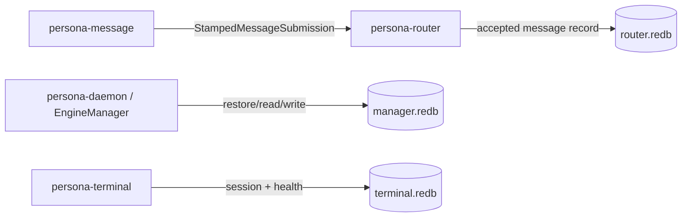

# Operator Handover — Persona Engine Context Maintenance

This report rolls forward the live context from the 2026-05-15
engine implementation session. It is intentionally narrow: what
landed, what remains open, and what the next operator should avoid
forgetting after context compaction.

## What Landed

| Repo | Commit | Substance | Verification |
|---|---:|---|---|
| `persona-router` | `23a856db` | Accepted `signal-persona-message` submissions now persist as router-owned Sema `messages` before delivery retry. | Named router message-persistence check + router default check. |
| `persona-terminal` | `b5bd0098` | Terminal session registration now writes a ready `session_health` row alongside the named session. | `terminal-registration-writes-session-health` + terminal default check. |
| `persona` | `601887f4` | Meta flake pins the router and terminal commits above. | Imported `persona-router` and `persona-terminal` checks. |
| `persona` | `2690c576` | `EngineManager::start_with_store` restores the persisted engine snapshot from `manager.redb` before answering status. | `persona-engine-manager-restores-persisted-snapshot-before-status` + persona default check. |

All Nix verification in this session used:

```sh
nix --option max-jobs 1 --option cores 1 --option builders '' build ...
```

Cargo-facing checks should continue to stay at low parallelism on this
machine until the overheating incident is no longer relevant.

## Current Engine Shape



The important state change is that the manager no longer starts from a
default catalog when a stored record exists. It asks the store actor for
`ReadEngineRecord`, constructs `EngineState` from that snapshot, then
serves status from the restored state.

## Open Work

- `primary-2y5` remains open. The manager restore slice landed, but the
  full parent still names deeper work: lifecycle/status reducer
  materialization, manager-side snapshots, privileged-user ownership
  witnesses, restart/exit observation, and full prototype readiness.
- `primary-devn` remains open. Several tracks have landed, including the
  restore slice, but the parent still carries broad router reducer/policy
  cleanup and prototype-first-stack completion.
- `primary-8n8` remains open. Terminal session-health writes landed, but
  archive/GC/session-health policy and full engine-spawn witness remain.
- `primary-31jt` remains open. Router and meta persistence pieces help it,
  but the broader midway wire-capture/sandbox witness set is not done.
- `primary-9os` is clear but larger: replacing the router's `ActorId`
  channel projection with typed `ChannelEndpoint` + `ChannelMessageKind`
  keys. Do not start this as a "quick cleanup"; it changes the channel
  authority model.
- `primary-3rp0` should be treated as design-coordinated. The `signal`
  repo still has legacy `AuthProof`/frame vocabulary and a pre-existing
  dirty `ARCHITECTURE.md`; do not mechanically delete it without aligning
  the intended replacement.

## Side Notes

- BEADS writes can fail with the embedded dolt exclusive lock. That is
  storage contention, not coordination ownership. Retrying sequentially
  worked.
- `persona` is clean at the end of this pass. The primary workspace is
  dirty with other roles' report and lock changes; those were left
  untouched.
- `cargo fmt --check` in `persona` currently reports older unformatted
  wire-test files outside the touched slice. For this session I used
  `rustfmt --check` on touched files only and relied on Nix checks for
  behavior.

## Next Targets

1. Continue `primary-2y5` with a real reducer/snapshot slice if the
   architecture is still stable: engine event log → lifecycle/status
   snapshot tables → CLI status reads snapshot.
2. Or take `primary-31jt` forward with another small Nix-chained witness
   against already-built router/message behavior.
3. Defer `primary-9os` until ready to change router channel authority
   records and tests together.
4. Before touching `signal`, inspect the dirty local architecture change
   and current designer guidance on `AuthProof`; do not overwrite unknown
   work.

