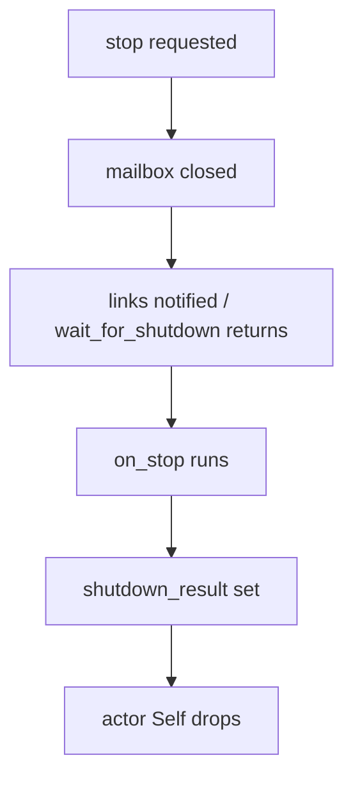
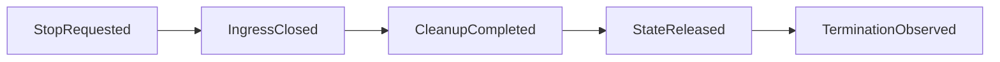
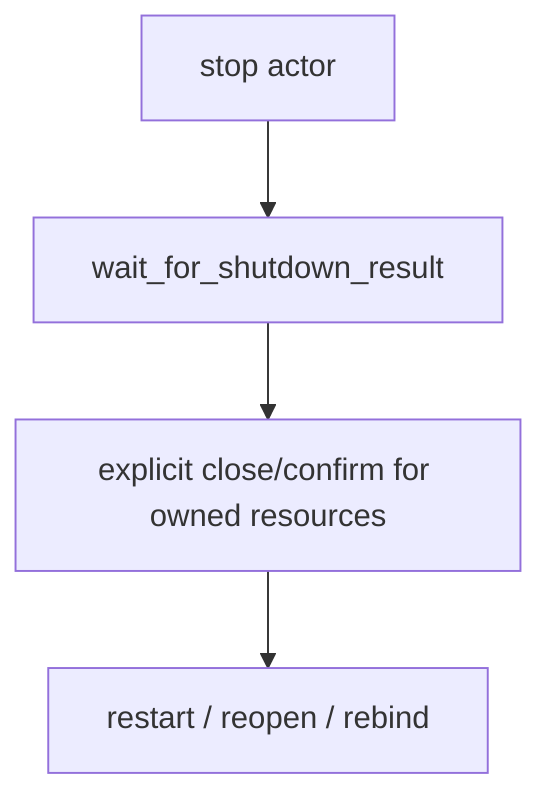

# 124 — Kameo upstream status and shutdown design

Date: 2026-05-16
Role: operator
Scope: check whether Kameo upstream has fixed the shutdown-ordering
issue, compare how other Rust/concurrency systems model termination,
and recommend the most correct fix for Persona and for a potential
Kameo upstream patch.

## 1. Upstream status

Kameo has not released beyond `v0.20.0`.

Current facts checked on 2026-05-16:

| Surface | Result |
|---|---|
| crates.io | latest published `kameo = 0.20.0` |
| GitHub release | latest release `v0.20.0`, published 2026-04-07 |
| GitHub default branch | `main`, latest checked commit `e5d07fd48d5a3624b3d3b54deb37789c10fd2415`, pushed 2026-05-13 |
| Open PRs | one open macro PR, unrelated to shutdown |
| Open issues | no open issue that names `wait_for_shutdown`, `on_stop`, `spawn_in_thread`, or resource-release ordering |

I tested the reproduction repo against current upstream `main` by
replacing the dependency with:

```toml
kameo = { git = "https://github.com/tqwewe/kameo", rev = "e5d07fd48d5a3624b3d3b54deb37789c10fd2415" }
```

The same four witnesses pass. Upstream `main` has not fixed the
behavior.

## 2. Related upstream history

There *was* an older upstream bug:

`https://github.com/tqwewe/kameo/issues/151`

That issue said the old `wait_for_stop` returned before `on_stop`
finished. It was closed by PR `#153`, which removed older mailbox
generics and changed the lifecycle API. Later PR `#166` added
`wait_for_shutdown_result` for `on_stop` errors:

`https://github.com/tqwewe/kameo/pull/166`

The current API therefore has two different wait surfaces:

| Method | Current implementation | Operational meaning |
|---|---|---|
| `wait_for_shutdown()` | awaits `mailbox_sender.closed()` | mailbox closed; `on_stop` may still be running |
| `wait_for_shutdown_result()` | waits for `shutdown_result` after `on_stop` | hook has completed; still not explicitly a post-drop join |

That explains the confusion. The older bug was treated as fixed
because a stronger result-bearing wait method now exists. But the
plain method still carries the shutdown name and docs language, while
its implementation observes mailbox closure.

## 3. Current Kameo mechanics

On `main`, `ActorRef::wait_for_shutdown()` is still:

```rust
pub async fn wait_for_shutdown(&self) {
    self.mailbox_sender.closed().await
}
```

`wait_for_shutdown_result()` adds the stronger wait:

```rust
self.mailbox_sender.closed().await;
match self.shutdown_result.wait().await {
    Ok(reason) => Ok(reason.clone()),
    ...
}
```

The actor lifecycle still notifies links before `on_stop`:

```rust
actor_ref
    .links
    .lock()
    .await
    .notify_links(id, reason.clone(), mailbox_rx);

log_actor_stop_reason(id, name, &reason);
let on_stop_res = actor.on_stop(actor_ref.clone(), reason.clone()).await;
```

That means there are three separate moments:



The reproduction proves the early observation:

- `wait_for_shutdown()` returns before `on_stop` completes;
- a TCP listener owned by `Self` is still bound immediately after
  `wait_for_shutdown()` returns;
- `wait_for_shutdown_result()` waits for `on_stop`;
- plain `.spawn()` and `.spawn_in_thread()` both show the early
  `wait_for_shutdown()` behavior.

`spawn_in_thread` is still the more dangerous surface because the
state release happens on a different OS thread. But the bug's root is
not the thread; the root is naming mailbox closure "shutdown".

## 4. Comparison with other systems

### Tokio

Tokio is the clean Rust baseline. `JoinHandle` says task completion
observed through `await` / `is_finished` happens after the spawned
future's destructor has finished. `TaskTracker::wait()` similarly says
tracked tasks have exited and their future destructors have run.

This is the standard Kameo should match for any method named
`wait_for_shutdown`, `wait_for_terminated`, or `join`.

### Ractor

Ractor exposes `stop_and_wait`, `kill_and_wait`, and
`drain_and_wait`, each named as a stop/kill/drain command plus an
awaited shutdown completion. Its actor trait also has `post_stop`
for cleanup after the actor has stopped.

The design is more explicit than Kameo's current two-wait split:
there is a graceful stop command with wait semantics attached to
shutdown completion.

### Actix

Actix names lifecycle states directly: `Stopping` and `Stopped`.
Its docs say `Stopped` is final and the actor gets dropped at that
point. It also has explicit `stopping` and `stopped` hooks.

Actix is less attractive for our current runtime direction, but the
naming is useful: "stopping" is not "stopped". Kameo's current
mailbox-closed observation is closer to "stopping".

### Akka / actor-family precedent

Akka Typed stops a child after its current message and sends `PostStop`
for resource cleanup. The important precedent is that cleanup is a
lifecycle signal, and any graceful-stop API must specify which signal
has completed before the future resolves.

## 5. The correct model

There are at least four lifecycle events. They must not collapse into
one method name:



| Event | Meaning | Can restart same resource? |
|---|---|---|
| `StopRequested` | stop signal accepted | no |
| `IngressClosed` | mailbox no longer accepts work | no |
| `CleanupCompleted` | `on_stop` finished | only if `on_stop` explicitly released resources |
| `StateReleased` | actor `Self` dropped / thread or task joined | yes, for resources owned by `Self` |
| `TerminationObserved` | supervisors and waiters observe final death | yes |

The current Kameo `wait_for_shutdown()` waits at `IngressClosed`.
Its name suggests `TerminationObserved`. That mismatch is the bug.

## 6. Recommended Kameo fix

The elegant fix is to make terminal observation post-cleanup and
post-drop.

Minimal upstream patch shape:

1. Rename or repurpose the existing early wait:
   - keep a low-level `wait_for_mailbox_closed()` if users need it;
   - make `wait_for_shutdown()` wait on terminal completion, not
     mailbox closure.
2. Reorder `run` shutdown so final notifications happen after cleanup
   and actor state release:

```rust
let on_stop_result = actor.on_stop(actor_reference.clone(), reason.clone()).await;

drop(actor);

let shutdown_result = ShutdownResult::from(on_stop_result, reason.clone());
actor_reference.shutdown_result.set(shutdown_result)?;

actor_reference
    .links
    .lock()
    .await
    .notify_links(id, reason, mailbox_receiver);
```

3. Make link notifications mean "terminated", not "mailbox closed".
   If Kameo wants both events, introduce separate signals:
   `MailboxClosed` and `ActorTerminated`.
4. Add regression tests with a resource field, not only an `on_stop`
   sleep:
   - actor owns a TCP listener or temporary file lock;
   - stop actor;
   - await `wait_for_shutdown()`;
   - immediately rebind/reopen same resource;
   - assert success.

That is better than adding a `pre_notify_links` hook. A
`pre_notify_links` hook still treats notification as the central
problem. The central problem is semantic: a termination observer should
not fire until the actor is terminated.

## 7. Persona rule until upstream changes

Persona should adopt this rule immediately:



Operational rules:

- Never use Kameo `wait_for_shutdown()` as a proof that resources are
  released.
- Never let supervisor restart logic depend only on link notification
  from a state-bearing child.
- Use `wait_for_shutdown_result()` when waiting for `on_stop`.
- If redb, sockets, PTYs, file locks, or child processes matter,
  release them inside `on_stop` with an explicit field take:

```rust
pub struct StoreKernel {
    database: Option<redb::Database>,
}

impl StoreKernel {
    fn close_database(&mut self) {
        let _database = self.database.take();
    }
}

async fn on_stop(&mut self, _reference: WeakActorRef<Self>, _reason: ActorStopReason) -> Result<(), Self::Error> {
    self.close_database();
    Ok(())
}
```

- For actors that must prove release to a parent, add a typed
  close-then-confirm message and make the parent wait for the reply
  before sending the framework stop signal.
- For dedicated-thread actors, do not use restart-on-link semantics
  until Kameo has post-drop terminal notification or Persona wraps the
  actor in a join-aware plane.

## 8. Should we patch Kameo?

Yes, if we continue with Kameo for state-bearing Persona daemons.

The patch is not large, but it is semantically deep because it changes
what `wait_for_shutdown()` and link notifications promise. That makes
it an upstream design discussion, not a private workaround hidden in
Persona.

Suggested upstream issue title:

`ActorRef::wait_for_shutdown and link notifications fire before on_stop/resource release`

Suggested pull request:

- add the resource-owned regression test first;
- change `wait_for_shutdown()` to wait on terminal completion;
- move link notifications after `on_stop` and explicit actor drop;
- add or document a separate mailbox-closed wait if the early event is
  intended public API.

If upstream rejects the semantic change, Persona should maintain a
small fork or wrap Kameo actors behind a Persona supervisor handle that
uses `wait_for_shutdown_result()` plus typed close confirmations. A
workspace-local wrapper should not become a new actor runtime; it
should be a shutdown-correct supervisor facade over Kameo.

## 9. Sources

- Kameo repo: `https://github.com/tqwewe/kameo`
- Kameo release `v0.20.0`: `https://github.com/tqwewe/kameo/releases/tag/v0.20.0`
- Kameo issue 151: `https://github.com/tqwewe/kameo/issues/151`
- Kameo PR 153: `https://github.com/tqwewe/kameo/pull/153`
- Kameo PR 166: `https://github.com/tqwewe/kameo/pull/166`
- Kameo ActorRef docs: `https://docs.rs/kameo/latest/kameo/actor/struct.ActorRef.html`
- Kameo actor_ref source: `https://docs.rs/crate/kameo/latest/source/src/actor/actor_ref.rs`
- Kameo spawn source: `https://docs.rs/crate/kameo/latest/source/src/actor/spawn.rs`
- Tokio graceful shutdown: `https://tokio.rs/tokio/topics/shutdown`
- Tokio JoinHandle docs: `https://docs.rs/tokio/latest/tokio/task/struct.JoinHandle.html`
- Tokio TaskTracker docs: `https://docs.rs/tokio-util/latest/tokio_util/task/struct.TaskTracker.html`
- Ractor stop-and-wait docs: `https://docs.rs/ractor/latest/ractor/actor/derived_actor/struct.DerivedActorRef.html`
- Ractor actor lifecycle docs: `https://docs.rs/ractor/latest/ractor/actor/trait.Actor.html`
- Actix actor lifecycle docs: `https://docs.rs/actix/latest/actix/trait.Actor.html`
- Akka typed lifecycle docs: `https://doc.akka.io/libraries/akka-core/current/typed/actor-lifecycle.html`
