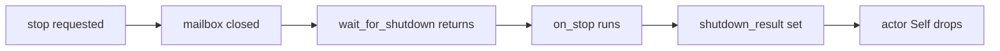
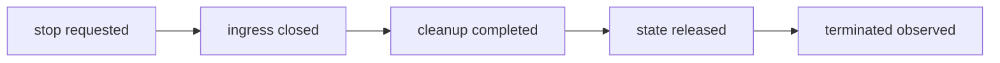
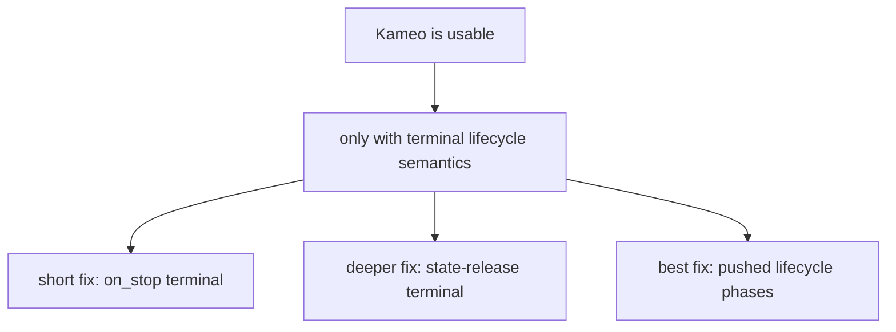

# 125 — Kameo fork: three shutdown approaches

Date: 2026-05-16
Role: operator
Scope: fork Kameo, test three increasingly deep fixes for the
shutdown-ordering bug, and decide what the bug says about Kameo's
architecture for Persona.

## 0. Goal list

| Goal | Status | Evidence |
|---|---:|---|
| Fork upstream Kameo under `LiGoldragon` | done | `https://github.com/LiGoldragon/kameo` |
| Reproduce upstream behavior against current upstream | done | reports/operator/123 and /124; current upstream `main` still has mailbox-based `wait_for_shutdown()` |
| Test a short fix | done | branch `kameo-shutdown-short-fix`, commit `8f44e1a76f8d` |
| Test a deeper lifecycle fix | done | branch `kameo-shutdown-lifecycle-fix`, commit `4ba9c255031d` |
| Test a push-only lifecycle architecture | done | branch `kameo-push-only-lifecycle`, commit `1b918b0138da` |
| Keep builds low-pressure | done | external repro tests used `CARGO_BUILD_JOBS=1 RUST_TEST_THREADS=1`; no full Kameo suite |
| State recommendation | done | §8 |

Branches:

| Branch | PR URL |
|---|---|
| `kameo-shutdown-short-fix` | `https://github.com/LiGoldragon/kameo/pull/new/kameo-shutdown-short-fix` |
| `kameo-shutdown-lifecycle-fix` | `https://github.com/LiGoldragon/kameo/pull/new/kameo-shutdown-lifecycle-fix` |
| `kameo-push-only-lifecycle` | `https://github.com/LiGoldragon/kameo/pull/new/kameo-push-only-lifecycle` |

## 1. What the bug really is

The bug is not "threaded actors are weird". The threaded path makes
the problem sharper, but the root is deeper:

> Kameo currently uses mailbox closure as a shutdown observation.
> Mailbox closure is an ingress event. It is not cleanup completion,
> state release, or termination.

Current upstream shape:



That means a caller can observe "shutdown" while the actor still has
owned resources. The reproduction used a TCP listener owned by actor
state; after `wait_for_shutdown()` returned, rebinding the listener
could still fail.

Kameo's public docs for `wait_for_shutdown()` describe a stronger
semantic than the current code. The current implementation waits on
`mailbox_sender.closed()`. `wait_for_shutdown_result()` waits on the
later `shutdown_result`, which is why it is currently safer for
`on_stop`, but it still does not formally promise post-drop state
release.

## 2. Prior art read

The interesting comparison is not "which actor framework is best".
It is "which lifecycle event does a waiter observe?"

| System | Relevant shape | Consequence |
|---|---|---|
| Tokio `JoinHandle` | a handle to await task termination | termination wait is tied to the future exiting |
| Tokio `TaskTracker` | signal shutdown separately, wait for tracked tasks to finish | separates cancellation request from completion observation |
| Ractor | `stop_and_wait`, `kill_and_wait`, `drain_and_wait`, plus `post_stop` | names command + wait semantics explicitly |
| Actix | `stopping` and `stopped` lifecycle hooks | "stopping" is not "stopped" |
| Proto.Actor | actors receive `Stopping` and `Stopped` lifecycle messages | lifecycle is modeled as pushed events |

The common lesson: a correct actor runtime needs separate names for:



Kameo collapses the first two observer surfaces too easily.

## 3. Approach 1: short fix

Branch:

`kameo-shutdown-short-fix` at `8f44e1a76f8d`

Patch:

```rust
pub async fn wait_for_shutdown(&self) {
    self.shutdown_result.wait().await;
}
```

This changes the plain wait from "mailbox closed" to "shutdown result
set". It matches the current implementation's existing stronger
SetOnce and fixes the most confusing method name with the smallest
surface.

Witness:

External repro path dependency:

```sh
CARGO_BUILD_JOBS=1 RUST_TEST_THREADS=1 cargo test -- --nocapture
```

Result: 4 tests passed.

What it proves:

- `wait_for_shutdown()` waits for `on_stop`;
- `wait_for_shutdown_result()` already waited for `on_stop`;
- ordinary `.spawn()` and `spawn_in_thread()` both stop returning
  early with respect to `on_stop`.

What it does not prove:

- actor `Self` has dropped;
- all state-owned resources are released;
- link notifications are terminal rather than "mailbox closed".

This is the patch I would upstream first only if upstream wants a
small compatibility-minded change.

## 4. Approach 2: deeper lifecycle fix

Branch:

`kameo-shutdown-lifecycle-fix` at `4ba9c255031d`

Patch summary:

- `PreparedActor::run()` returns `Result<ActorStopReason, PanicError>`
  instead of `Result<(A, ActorStopReason), PanicError>`.
- `PreparedActor::spawn()` and `spawn_in_thread()` return join handles
  with the same stop-reason result.
- the actor state is explicitly dropped before shutdown is observable;
- link notifications move after `on_stop`, state drop, and
  `shutdown_result` publication;
- `wait_for_shutdown()` waits on `shutdown_result`.

Representative code:

```rust
let on_stop_result = actor.on_stop(actor_ref.clone(), reason.clone()).await;

match on_stop_result {
    Ok(()) => {
        drop(actor);
        actor_ref
            .shutdown_result
            .set(Ok(reason.clone()))
            .expect("nothing else should set the shutdown result");
        actor_ref
            .links
            .lock()
            .await
            .notify_links(id, reason.clone(), mailbox_rx);
    }
    Err(err) => {
        let err = PanicError::new(Box::new(err), PanicReason::OnStop);
        invoke_actor_error_hook(&err);
        drop(actor);
        actor_ref
            .shutdown_result
            .set(Err(err))
            .expect("nothing else should set the shutdown result");
        actor_ref
            .links
            .lock()
            .await
            .notify_links(id, reason.clone(), mailbox_rx);
    }
}
```

Witness:

External repro path dependency:

```sh
CARGO_BUILD_JOBS=1 RUST_TEST_THREADS=1 cargo test -- --nocapture
```

Result: 4 tests passed in the external repro.

Those tests used a deliberately delayed `Drop`:

```rust
impl Drop for ResourceActor {
    fn drop(&mut self) {
        std::thread::sleep(self.drop_delay);
        if let Some(sender) = self.lifecycle.drop_sender.take() {
            let _ = sender.send(());
        }
    }
}
```

The test then asserts that after `wait_for_shutdown()`:

- `on_stop` has completed;
- `Drop` has completed;
- the TCP listener can be rebound immediately.

This is a better semantic fix than approach 1 because it makes the
observer terminal after state release. It is also API-breaking because
`PreparedActor::run()` no longer returns the actor state.

That break is not incidental. Returning `A` from `run()` and also
claiming post-drop termination are contradictory. If `A` is returned,
Kameo cannot honestly say the actor state was released.

## 5. Approach 3: push-only lifecycle architecture

Branch:

`kameo-push-only-lifecycle` at `1b918b0138da`

This branch treats the bug as an architecture problem: lifecycle
observation should be explicit, monotonic, and pushed. It adds a
small internal lifecycle publisher:

```rust
#[derive(Debug, Clone, Copy, PartialEq, Eq, PartialOrd, Ord)]
pub enum ActorLifecyclePhase {
    Prepared,
    Starting,
    Running,
    Stopping,
    CleanupFinished,
    StateReleased,
    LinksNotified,
    Terminated,
}
```

`ActorRef` and `WeakActorRef` gain:

```rust
pub fn lifecycle_phase(&self) -> ActorLifecyclePhase;

pub async fn wait_for_lifecycle_phase(&self, phase: ActorLifecyclePhase);
```

Internally, the runtime pushes phases with a `tokio::sync::watch`
channel:

```rust
pub(crate) fn mark(&self, phase: ActorLifecyclePhase) {
    if phase > *self.sender.borrow() {
        self.sender.send_replace(phase);
    }
}
```

The shutdown flow becomes:

```mermaid
sequenceDiagram
    participant Runtime
    participant Watchers
    participant Actor
    participant Links

    Runtime->>Watchers: Starting
    Runtime->>Watchers: Running
    Runtime->>Watchers: Stopping
    Runtime->>Actor: on_stop
    Runtime->>Watchers: CleanupFinished
    Runtime->>Runtime: drop actor state
    Runtime->>Watchers: StateReleased
    Runtime->>Links: notify terminal reason
    Runtime->>Watchers: LinksNotified
    Runtime->>Watchers: Terminated
```

Witness:

External repro path dependency:

```sh
CARGO_BUILD_JOBS=1 RUST_TEST_THREADS=1 cargo test -- --nocapture
```

Result: 5 tests passed.

Additional branch-local check:

```sh
CARGO_BUILD_JOBS=1 cargo check --lib
```

Result: passed.

The extra witness waits for `ActorLifecyclePhase::StateReleased` and
then proves:

- `on_stop` already sent its witness;
- delayed `Drop` already sent its witness;
- the listener can be rebound;
- `wait_for_shutdown()` reaches `Terminated`.

This is the cleanest direction conceptually. It stops pretending one
"shutdown" surface means every phase. A supervisor can now wait for
the exact phase it needs:

| Consumer need | Phase |
|---|---|
| actor accepted startup | `Running` |
| cleanup hook completed | `CleanupFinished` |
| resource-owning state is gone | `StateReleased` |
| link/supervisor graph has observed terminal event | `Terminated` |

## 6. What this says about Kameo

Kameo is not fundamentally wrong. Its actor shape is still attractive
for Persona:

- `Self` is the actor, which agrees with our no-ZST actor discipline;
- typed per-message `impl Message<T> for Actor` is clean;
- supervision exists and is small enough to reason about;
- the codebase is small enough for us to patch and understand.

But Kameo's current lifecycle model is under-specified. It has useful
pieces (`shutdown_result`, `on_stop`, links, mailbox closure), but the
public naming lets callers confuse ingress closure with termination.

That is exactly the class of bug Persona cannot tolerate. Persona
components own sockets, terminal sessions, redb files, PTYs, child
processes, subscriptions, and routed messages. A supervisor that
restarts after a non-terminal observation will create races.

So the decision is:



## 7. Branch comparison

| Approach | Correctness | Compatibility | Beauty | Recommendation |
|---|---:|---:|---:|---|
| Short fix | medium | high | medium | acceptable upstream first patch |
| Deeper lifecycle fix | high | low | high | best minimal semantic fix |
| Push-only lifecycle | highest | low | highest | best architecture for Persona-grade actors |

The short fix repairs the misleading `wait_for_shutdown()` method but
leaves link notification and post-drop semantics muddy.

The deeper fix makes "shutdown" mean state release. It is the best
small durable patch if upstream accepts breaking `PreparedActor::run()`
state return semantics.

The push-only branch is the right mental model. It does not ask a
single method name to carry all lifecycle meanings. It gives the
runtime typed phases and lets consumers choose the phase they need.

## 8. Recommendation

For Persona, treat Kameo as usable only after one of these is true:

1. upstream accepts a terminal lifecycle patch equivalent to approach
   2 or approach 3; or
2. we maintain a fork pinned to approach 3 while Persona's actor-heavy
   stack matures; or
3. Persona avoids every shutdown-sensitive path in Kameo and wraps
   state-bearing actors with explicit close-confirm messages.

I recommend using the push-only lifecycle branch as the design target
and the deeper lifecycle branch as the smallest coherent upstream PR.
Approach 1 is useful as evidence and possibly as an upstream stepping
stone, but it is not enough for Persona's supervision story.

The next upstream-facing move should be:

1. open an issue with the TCP-listener resource witness;
2. submit the deeper lifecycle PR first, because it is easier to
   review;
3. follow with the lifecycle-phase PR as the architecture proposal if
   upstream is receptive.

## 9. Commands run

Short-fix external validation:

```sh
CARGO_BUILD_JOBS=1 RUST_TEST_THREADS=1 cargo test -- --nocapture
```

Result: 4 passed.

Lifecycle-fix external validation:

```sh
CARGO_BUILD_JOBS=1 RUST_TEST_THREADS=1 cargo test -- --nocapture
```

Result: 4 passed.

Push-only external validation:

```sh
CARGO_BUILD_JOBS=1 RUST_TEST_THREADS=1 cargo test -- --nocapture
```

Result: 5 passed.

Push-only branch-local lib check:

```sh
CARGO_BUILD_JOBS=1 cargo check --lib
```

Result: passed.

I did not run the full Kameo test suite because it pulls a much larger
development dependency graph. The resource-ordering witnesses are
targeted and sufficient for the three branch theories.

## 10. Sources

- Kameo fork: `https://github.com/LiGoldragon/kameo`
- Upstream Kameo: `https://github.com/tqwewe/kameo`
- Kameo `v0.20.0`: `https://github.com/tqwewe/kameo/releases/tag/v0.20.0`
- Kameo issue 151: `https://github.com/tqwewe/kameo/issues/151`
- Kameo issue 266: `https://github.com/tqwewe/kameo/issues/266`
- Kameo `ActorRef` docs: `https://docs.rs/kameo/latest/kameo/actor/struct.ActorRef.html`
- Tokio `JoinHandle` docs: `https://docs.rs/tokio/latest/tokio/task/struct.JoinHandle.html`
- Tokio `TaskTracker` docs: `https://docs.rs/tokio-util/latest/tokio_util/task/struct.TaskTracker.html`
- Ractor lifecycle docs: `https://docs.rs/ractor/latest/ractor/actor/trait.Actor.html`
- Proto.Actor lifecycle docs: `https://proto.actor/docs/life-cycle/`
