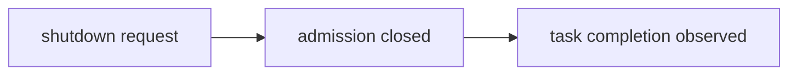
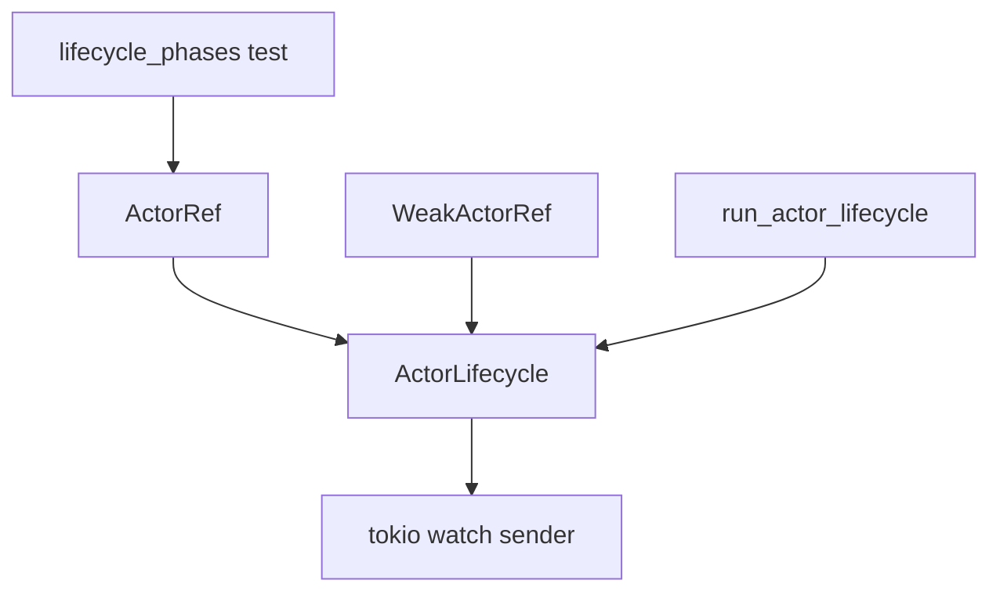
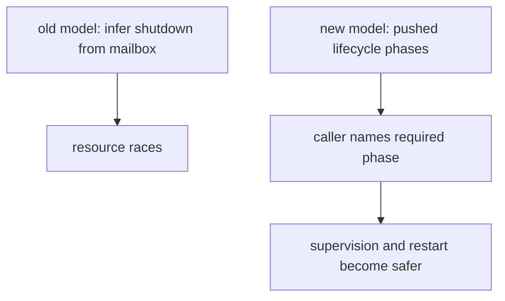

# 126 — Kameo push-only lifecycle branch review

Date: 2026-05-16
Role: operator
Scope: detailed review of `LiGoldragon/kameo`
branch `kameo-push-only-lifecycle`
(`1b918b0138da`), including every design decision, test strength,
risks, and prior-art inspiration.

## 0. Executive read

The branch is small in line count and large in semantic scope:

```text
src/actor/actor_ref.rs    |  57 ++++++++++++--
src/actor/lifecycle.rs    |  60 +++++++++++++++
src/actor/spawn.rs        |  50 ++++++++----
src/actor.rs              |   2 +
tests/lifecycle_phases.rs | 187 ++++++++++++++++++++++++++++++++++++++++++++++++
5 files changed, 339 insertions(+), 17 deletions(-)
```

The core idea is correct: lifecycle observation becomes a pushed,
monotonic actor phase instead of an inference from mailbox closure.
That directly fixes the conceptual bug found in reports/operator/123
and /124:

> mailbox closed is an ingress fact; it is not actor termination.

The branch is not ready as an upstream PR without a design note because
it changes `PreparedActor::run()` / `spawn()` / `spawn_in_thread()` to
stop returning the actor state `A`. That break is honest if
`StateReleased` means the actor was dropped, but it retires an existing
use case: run an actor to completion and inspect final actor state.

My recommendation: keep this branch as the design target. If turning it
into an upstream PR, first choose one of these explicitly:

| Choice | Meaning |
|---|---|
| Terminal semantics win | `PreparedActor::run()` no longer returns `A`; post-drop phases are true. |
| Final-state inspection wins | keep a separate `run_returning_state()` surface and do not expose `StateReleased` through that path. |
| Both surfaces exist | default shutdown waits for termination; a separate eject/join API returns state and has different phase semantics. |

## 1. Inspiration

The branch is inspired by four prior-art patterns.

### Tokio: completion is not request

Tokio's `JoinHandle` is the clean baseline: awaiting the handle waits
for the spawned task's future to finish. Tokio's `TaskTracker` makes
the same split at group scale: close/shutdown admission separately,
then wait until tracked tasks complete.

The design lesson is:



Kameo's current `wait_for_shutdown()` uses the admission point
(`mailbox_sender.closed()`) but carries a completion-shaped name.

### Ractor: stop verbs name the wait

Ractor exposes explicit verbs such as `stop_and_wait`,
`kill_and_wait`, and `drain_and_wait`, plus a `post_stop` lifecycle
hook. The useful shape is not that Ractor is superior; it is that the
caller's wait target is in the method name.

Kameo's branch moves in that direction by making the wait target a
typed value: `ActorLifecyclePhase::StateReleased` or
`ActorLifecyclePhase::Terminated`.

### Proto.Actor and actor-family systems: lifecycle is pushed

Proto.Actor documents lifecycle messages such as `Started`,
`Stopping`, `Stopped`, and `Restarting`. Akka Typed has `PostStop`.
The recurring actor-family idea is that lifecycle is a stream of
events/signals, not a property callers infer from a closed pipe.

This branch copies that spirit without importing their APIs: lifecycle
progress is pushed into a `watch` channel by the runtime.

### Kameo's own issue history

Kameo has already had adjacent issues:

- issue 151: `wait_for_stop` did not wait for `on_stop`;
- issue 266: how to wait for complete shutdown when all refs drop;
- issue 178: ejecting actor state after stop.

That history says the problem is not a one-off bug. Kameo users are
trying to observe different lifecycle moments, and the current surface
does not make the moments explicit enough.

## 2. Branch shape



`ActorLifecycle` is private runtime state. `ActorLifecyclePhase` is
public vocabulary. Strong and weak refs expose observation methods.
The runtime alone marks phases.

## 3. Decision review

### Decision A: add `ActorLifecyclePhase`

Code: `src/actor/lifecycle.rs:3-26`

```rust
pub enum ActorLifecyclePhase {
    Prepared,
    Starting,
    Running,
    Stopping,
    CleanupFinished,
    StateReleased,
    LinksNotified,
    Terminated,
}
```

Why it exists:

The branch refuses to make "shutdown" mean several things. A caller can
name the actual phase it needs. This is the main design win.

Why these variants:

| Phase | Decision |
|---|---|
| `Prepared` | The `ActorRef` exists before the actor task starts. This maps to `PreparedActor::actor_ref()`. |
| `Starting` | `on_start` has begun. This makes startup observable before success/failure. |
| `Running` | `on_start` succeeded and the actor can process mailbox input. |
| `Stopping` | the actor loop has ended or startup failed. This is not cleanup. |
| `CleanupFinished` | `on_stop` finished. This is the old `shutdown_result` boundary. |
| `StateReleased` | actor `Self` has been dropped. Resource-owning state is gone. |
| `LinksNotified` | supervision/link graph has received the terminal reason. |
| `Terminated` | all branch-defined terminal notifications are complete. |

Review:

The phase list is good because it separates every race-prone
boundary. The names are full English and readable. `CleanupFinished`
is better than `Stopped` because it names the exact hook boundary.

Risk:

`StateReleased` is only true if the runtime really drops the actor
state before marking it. This branch does that. If a future change
reintroduces returning `A` from `run()`, the phase becomes a lie.

### Decision B: use `tokio::sync::watch`

Code: `src/actor/lifecycle.rs:28-60`

```rust
pub(crate) struct ActorLifecycle {
    sender: watch::Sender<ActorLifecyclePhase>,
}
```

Why it exists:

`watch` is a good fit for monotonic state:

- late subscribers immediately see the latest phase;
- there is one current phase, not an unbounded event backlog;
- callers wait for "at least this phase";
- no polling is needed.

The wait loop:

```rust
if *receiver.borrow_and_update() >= phase {
    return;
}
if receiver.changed().await.is_err() {
    return;
}
```

Review:

This is the right primitive for phase observation. It is push-based,
cheap, and works for both early and late waiters.

Risk:

`changed().await.is_err()` returns if the sender is gone. Today the
sender is held by `ActorRef`/`WeakActorRef`, so that path should be
rare. If it ever happens before the desired phase, the waiter returns
as if the wait succeeded. A production version should return a typed
`LifecycleWaitError` or check the final borrowed phase after sender
closure.

### Decision C: make phases monotonic

Code: `src/actor/lifecycle.rs:39-43`

```rust
if phase > *self.sender.borrow() {
    self.sender.send_replace(phase);
}
```

Why it exists:

Lifecycle must only move forward. This protects observers from
out-of-order duplicate marks and makes "wait until at least phase"
valid.

Review:

Correct. The `PartialOrd` derived on enum declaration order is clear
enough in a small enum.

Risk:

Enum order is now semantic. A production PR should say this in the
doc comment and add a test that phase order is the intended order.

### Decision D: store lifecycle in `ActorRef` and `WeakActorRef`

Code:

- `ActorRef` field: `src/actor/actor_ref.rs:51-59`
- `WeakActorRef` field: `src/actor/actor_ref.rs:2179-2187`
- clone/downgrade/upgrade propagation: `src/actor/actor_ref.rs:204-225`,
  `src/actor/actor_ref.rs:2204-2213`, `src/actor/actor_ref.rs:2522`

Why it exists:

Both strong and weak references must observe lifecycle. Supervisors and
linked actors often hold weak references; excluding weak refs would
push callers back toward inference through links or mailboxes.

Review:

Correct. A lifecycle observer is not ownership authority, so it belongs
on both strong and weak handles.

Risk:

`is_alive()` still means different things on strong and weak refs:

- `ActorRef::is_alive()` uses `!mailbox_sender.is_closed()`;
- `WeakActorRef::is_alive()` uses `!shutdown_result.initialized()`.

The branch did not fix that naming drift. With explicit lifecycle
phases, `is_alive()` should probably become a derived question over
phase or be documented as "ingress open" vs "not terminal".

### Decision E: expose `lifecycle_phase()` and `wait_for_lifecycle_phase()`

Code:

- strong ref: `src/actor/actor_ref.rs:228-238`
- weak ref: `src/actor/actor_ref.rs:2216-2226`

Why it exists:

It gives callers exact lifecycle observation without overloading
`wait_for_shutdown()`.

Review:

Good public API shape. It is minimal:

```rust
pub fn lifecycle_phase(&self) -> ActorLifecyclePhase;
pub async fn wait_for_lifecycle_phase(&self, phase: ActorLifecyclePhase);
```

Risk:

The methods currently return `()`, not a result. If the lifecycle
publisher disappears before the requested phase, the wait returns
silently. That should become fallible before upstreaming.

### Decision F: make `wait_for_shutdown()` wait for `Terminated`

Code:

- strong ref: `src/actor/actor_ref.rs:656-671`
- weak ref: `src/actor/actor_ref.rs:2341-2349`

Why it exists:

The method name says shutdown. The branch makes it mean terminal
shutdown, not mailbox shutdown.

Review:

Correct. This is the least surprising behavior for users.

Risk:

This is a behavior change. Any current user relying on
`wait_for_shutdown()` as an early mailbox-closed signal needs a
replacement such as `wait_for_lifecycle_phase(Stopping)` or a
deliberately named `wait_for_ingress_closed()`.

### Decision G: make shutdown-result waits wait for `Terminated`

Code:

- strong result wait: `src/actor/actor_ref.rs:737-750`
- strong closure wait: `src/actor/actor_ref.rs:820-827`
- weak closure wait: `src/actor/actor_ref.rs:2369-2376`

Why it exists:

If the branch defines terminal phase as the correct shutdown
observation, all shutdown-named methods should wait for the same
terminal phase.

Review:

Mostly correct. This unifies semantics.

Risk:

`WeakActorRef::wait_for_shutdown_result()` at
`src/actor/actor_ref.rs:2354-2364` still waits directly on
`shutdown_result`, not on `Terminated`. That is probably an accidental
miss. It means weak `wait_for_shutdown_result()` can return before
`LinksNotified` / `Terminated`, even though weak
`wait_for_shutdown_with_result()` waits for `Terminated`.

This should be fixed if the branch continues.

### Decision H: create lifecycle in `PreparedActor::new_with`

Code: `src/actor/spawn.rs:59-76`

Why it exists:

`PreparedActor` exposes an `ActorRef` before spawn. That reference
needs a valid phase immediately. `Prepared` is therefore born with the
mailbox and ref, not with the runtime task.

Review:

Correct. This is the only place that can guarantee pre-spawn
observation works.

### Decision I: make `PreparedActor::run/spawn/spawn_in_thread` stop returning `A`

Code: `src/actor/spawn.rs:123`, `src/actor/spawn.rs:136`,
`src/actor/spawn.rs:154-157`, `src/actor/spawn.rs:173-180`

Why it exists:

The branch wants a real `StateReleased` phase. If `run()` returns
`A`, the actor state has not been released; it has been transferred to
the caller. A post-drop lifecycle phase cannot be true while returning
state.

Review:

This is the most important and most contentious decision.

It is beautiful from the lifecycle perspective. It is also a breaking
change to the `PreparedActor::run()` API and to the documented test
pattern where an actor is run in-process so the final state can be
inspected.

The branch is right to break if terminal correctness wins. But the PR
must explain that this is not incidental cleanup; it is the core
semantic tradeoff.

Alternative:

```rust
pub async fn run(self, args: A::Args) -> Result<ActorStopReason, PanicError>;
pub async fn run_returning_state(self, args: A::Args) -> Result<(A, ActorStopReason), PanicError>;
```

The second method must not mark `StateReleased` until after the caller
drops the returned state, which the runtime cannot observe. Therefore
it should either not expose lifecycle phases or it should define a
different terminal boundary.

### Decision J: push `Starting` before `on_start`

Code: `src/actor/spawn.rs:190-196`

Why it exists:

Observers can see that startup is in progress, not just prepared or
running.

Review:

Correct. This is useful for diagnostics.

Risk:

If `on_start` panics or returns error, the branch goes directly to
`Stopping`, then `LinksNotified`, then `Terminated`. It does not mark
`CleanupFinished` or `StateReleased`, which is right because no actor
state existed.

### Decision K: push `Running` after startup success

Code: `src/actor/spawn.rs:204-207`

Why it exists:

This phase means the actor state exists and the runtime loop can begin.

Review:

Correct.

Risk:

`startup_result` is signaled inside `abortable_actor_loop`, not exactly
at the `Running` mark. A production branch should check whether
`wait_for_startup()` and `wait_for_lifecycle_phase(Running)` are
strictly equivalent. If they are not, document the difference.

### Decision L: push `Stopping` after actor loop exits

Code: `src/actor/spawn.rs:209-220`

Why it exists:

The actor no longer accepts normal work. It is now in shutdown
machinery.

Review:

Correct. It names the old mailbox-closed-style observation more
honestly.

Risk:

The branch does not expose "ingress closed" as its own phase. If users
need exactly mailbox closure, `Stopping` may be too broad. That is
acceptable for Persona, but upstream may ask for finer naming.

### Decision M: shut down children before parent `on_stop`

Code: `src/actor/spawn.rs:222-235`

Why it exists:

This preserves Kameo's existing ordering: parent shutdown first closes
children, then parent cleanup hook runs.

Review:

Reasonable as a minimal branch. It avoids changing child lifecycle
semantics while changing observation points.

Risk:

The phase name `Stopping` covers both child shutdown and parent
cleanup. If a supervisor wants to know "all children are closed",
there is no phase for that. The branch could eventually add
`ChildrenStopped`.

### Decision N: push `CleanupFinished` after `on_stop`

Code: `src/actor/spawn.rs:236-240`

Why it exists:

This gives callers the old "hook has completed" boundary that
`wait_for_shutdown_result()` effectively represented.

Review:

Correct. It gives a cheaper phase for users who do not require state
drop.

Risk:

It marks `CleanupFinished` even when `on_stop` returned an error. The
word "finished" still applies, but callers may want to distinguish
`CleanupSucceeded` from `CleanupFailed`. The final result remains in
`shutdown_result`, so this is acceptable if documented.

### Decision O: drop actor before `StateReleased`

Code:

- success: `src/actor/spawn.rs:245-247`
- on-stop error: `src/actor/spawn.rs:260-265`

Why it exists:

This is the resource-release guarantee. It is why the branch is more
than a `shutdown_result` wait.

Review:

Correct and load-bearing. The regression test uses a delayed `Drop`
and a TCP listener to prove the phase is not decorative.

Risk:

Blocking inside `Drop` is only in the test. Production actors should
not rely on blocking destructors. The real guarantee is that owned
resources have been dropped, not that arbitrary destructor work is a
good pattern.

### Decision P: notify links after state release

Code:

- success: `src/actor/spawn.rs:252-258`
- on-stop error: `src/actor/spawn.rs:270-276`

Why it exists:

Link notifications should mean terminal actor observation, not mailbox
closure. This is the supervision half of the fix.

Review:

Correct for Persona. Supervisors must not restart a resource-owning
child before that child's resources are released.

Risk:

This changes restart timing. If upstream users rely on early link
notification, they will see later restarts. That is probably a fix,
but it is a breaking semantic change.

### Decision Q: mark `Terminated` last

Code:

- success: `src/actor/spawn.rs:257-258`
- on-stop error: `src/actor/spawn.rs:275-276`
- startup error: `src/actor/spawn.rs:317-321`

Why it exists:

`Terminated` is the branch's one "everything relevant is done" phase.

Review:

Correct.

Risk:

Startup failure marks `LinksNotified` before `shutdown_result` is set,
then `Terminated`. It never has an actor state. That seems right, but
the report should call this out because `StateReleased` will never
arrive on startup failure.

## 4. Test review

Test file: `tests/lifecycle_phases.rs`

The test actor owns a `TcpListener`:

```rust
struct ResourceActor {
    listener: TcpListener,
    stop_delay: Duration,
    drop_delay: Duration,
    lifecycle: LifecycleWitness,
}
```

This is a strong witness because the OS enforces exclusivity. While
the actor owns the listener, rebinding fails. After actor state drops,
rebinding succeeds.

The test also delays `Drop`:

```rust
impl Drop for ResourceActor {
    fn drop(&mut self) {
        std::thread::sleep(self.drop_delay);
        ...
    }
}
```

That prevents a false positive where `StateReleased` appears to work
only because the destructor is fast.

Main assertion shape:

```rust
actor_reference
    .wait_for_lifecycle_phase(ActorLifecyclePhase::StateReleased)
    .await;
```

Then:

- `on_stop` witness must already have fired;
- `Drop` witness must already have fired;
- socket rebind must succeed;
- `wait_for_shutdown()` must lead to `Terminated`.

Verification run:

```sh
CARGO_BUILD_JOBS=1 RUST_TEST_THREADS=1 cargo test --test lifecycle_phases -- --nocapture
```

Result:

```text
running 1 test
test lifecycle_phase_waiters_are_push_driven_and_terminal_is_post_release ... ok
```

Additional branch-wide type check:

```sh
CARGO_BUILD_JOBS=1 cargo test --lib --no-run
```

Result:

```text
Finished `test` profile ... Executable unittests src/lib.rs
```

Warning:

```text
field `listener` is never read
```

The warning is benign because the listener is intentionally held for
RAII. A production test should read the address through the field or
add a precise `#[allow(dead_code)]` with a comment to avoid a noisy
test suite.

## 5. Review findings

### High: weak shutdown-result wait is inconsistent

`WeakActorRef::wait_for_shutdown_result()` still waits directly on
`shutdown_result` at `src/actor/actor_ref.rs:2354-2364`. The strong
equivalent waits for `Terminated`; weak `wait_for_shutdown()` and weak
`wait_for_shutdown_with_result()` also wait for `Terminated`.

That inconsistency can leak the old hook-complete boundary through one
method. Fix it before upstreaming.

### High: `run()` final-state inspection is removed

The branch changes `PreparedActor::run()` from returning
`(A, ActorStopReason)` to returning only `ActorStopReason`. That is
the correct move if `StateReleased` is real, but it removes a useful
testing surface.

This must be called out explicitly in an upstream PR. It should not be
presented as a small internal refactor.

### Medium: lifecycle wait should be fallible

`ActorLifecycle::wait_for()` returns if the watch sender closes. It
does not tell the caller whether the requested phase was reached.

For production:

```rust
pub async fn wait_for_lifecycle_phase(
    &self,
    phase: ActorLifecyclePhase,
) -> Result<(), LifecycleWaitError>;
```

### Medium: phase ordering needs a regression test

The enum declaration order is semantic because `PartialOrd` drives
`wait_for(at least phase)`. Add a test that locks the order.

### Medium: docs remain stale around `PreparedActor::run()`

Some docs still imply the older final-state pattern or do not explain
the signature break. Before upstreaming, docs must say:

- `run()` observes terminal actor completion;
- it does not return actor state;
- use another explicit surface if final state inspection is desired.

### Low: test has a benign unused-field warning

The listener field is intentionally held, but Rust sees it as unread.
Clean this before PR polish.

## 6. Good decisions worth keeping

- `watch` is the right primitive for current lifecycle state.
- `ActorLifecyclePhase` is public and readable.
- lifecycle state is shared through both `ActorRef` and `WeakActorRef`.
- `wait_for_shutdown()` now means terminal actor shutdown.
- link notification moved later, which makes supervision safer.
- the test proves resource release through an OS-enforced witness.

## 7. What I would change next

1. Fix `WeakActorRef::wait_for_shutdown_result()` to wait for
   `Terminated`.
2. Make lifecycle waits return a typed result.
3. Add a phase-order regression test.
4. Add a startup-failure lifecycle test.
5. Add a link-notification ordering test.
6. Decide the `run()` state-return story explicitly.
7. Clean the RAII listener warning.

## 8. Recommendation

This branch is the best architectural direction out of the three Kameo
experiments. It answers the real problem:



I would not upstream it as-is. I would first land the smaller
`kameo-shutdown-lifecycle-fix` as a minimal correctness PR, then use
this branch as the design proposal for a full lifecycle-observation
surface.

For Persona, I would prefer pinning to a Kameo fork shaped like this
over relying on current upstream semantics. Persona's components will
own databases, sockets, terminals, and child processes. They need
`StateReleased` / `Terminated`, not mailbox closure.

## 9. Sources

- Kameo fork branch:
  `https://github.com/LiGoldragon/kameo/tree/kameo-push-only-lifecycle`
- Upstream Kameo:
  `https://github.com/tqwewe/kameo`
- Kameo `ActorRef` docs:
  `https://docs.rs/kameo/latest/kameo/actor/struct.ActorRef.html`
- Kameo issue 151:
  `https://github.com/tqwewe/kameo/issues/151`
- Kameo issue 178:
  `https://github.com/tqwewe/kameo/issues/178`
- Kameo issue 266:
  `https://github.com/tqwewe/kameo/issues/266`
- Tokio `JoinHandle` docs:
  `https://docs.rs/tokio/latest/tokio/task/struct.JoinHandle.html`
- Tokio `TaskTracker` docs:
  `https://docs.rs/tokio-util/latest/tokio_util/task/struct.TaskTracker.html`
- Ractor actor docs:
  `https://docs.rs/ractor/latest/ractor/actor/trait.Actor.html`
- Proto.Actor lifecycle docs:
  `https://proto.actor/docs/life-cycle/`
