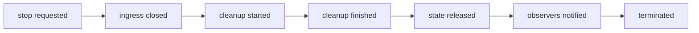
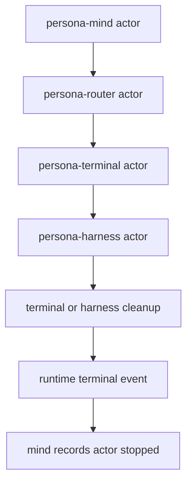

# Actor Framework Lifecycle Correctness Research

Operator report. Created 2026-05-16.

This report answers the current Kameo fork design question:

> If Persona leans on Kameo as its actor runtime, what should Kameo's
> shutdown and lifecycle semantics look like when judged against the
> highest-correctness parts of mature actor systems?

I used `ghq` shallow checkouts for source-level reading:

| Framework | Local checkout |
|---|---|
| Kameo fork | `/home/li/wt/github.com/LiGoldragon/kameo/kameo-push-only-lifecycle` |
| Ractor | `/git/github.com/slawlor/ractor` |
| Actix | `/git/github.com/actix/actix` |
| xtra | `/git/github.com/Restioson/xtra` |
| Bastion | `/git/github.com/bastion-rs/bastion` |
| Akka Typed | `/git/github.com/akka/akka` |
| Erlang/OTP | `/git/github.com/erlang/otp` |
| Proto.Actor Go | `/git/github.com/AsynkronIT/protoactor-go` |
| CAF | `/git/github.com/actor-framework/actor-framework` |
| Orleans | `/git/github.com/dotnet/orleans` |

I also checked official/current docs for Akka, Erlang/OTP, Proto.Actor,
Tokio TaskTracker, CAF, and Orleans.

## Executive Read

The push-only lifecycle branch is pointing in the right direction.
The bug we found in Kameo is not a small typo; it is a boundary error:
Kameo currently lets an observer infer terminal actor state from a
side effect that can happen too early. The correct design is an actor
runtime-owned lifecycle state machine.

The comparison strongly supports these decisions:

| Decision | Verdict | Why |
|---|---:|---|
| `wait_for_shutdown()` must wait for runtime-pushed termination | Keep | Tokio, Erlang, Akka, Proto.Actor, Ractor, CAF all separate stop request from completed termination. |
| Lifecycle phases should be explicit and monotonic | Keep | Actix, Proto.Actor, Akka, Orleans, and Ractor all expose named lifecycle stages or signals. |
| Cleanup completion must precede terminal wait completion | Keep | Erlang `gen_server:stop`, Tokio `TaskTracker`, Actix `stopped`, xtra `stopped`, and Ractor `post_stop` all treat cleanup as part of termination. |
| `WeakActorRef` waits must use the same lifecycle gate | Fix | The current push-only branch still has one weak result wait path which waits on `shutdown_result` directly. |
| Observer waits should be fallible | Fix | A closed lifecycle channel without the target phase is not success; it means the runtime witness disappeared. |
| `PreparedActor::run()` returning no actor state is acceptable but needs a named split | Refine | xtra returns a stop value, Ractor can report boxed state to supervisors, but most major actor systems do not return actor state as the normal run contract. |
| Notification order needs a named policy | Refine | Systems differ slightly, but the invariant we need is clear: external “terminated” observation must happen after cleanup is no longer user-visible as pending. |

## Shape We Should Target



The important part is not the exact names. The important part is that
the runtime pushes each state. No observer should infer `terminated`
from a closed mailbox, a completed one-shot, or a dropped actor
reference.

## Framework Evidence

### Tokio

Tokio is not an actor framework, but its shutdown primitive is the
cleanest Rust baseline for this bug class. `TaskTracker::wait` returns
only after the tracker is closed and all tracked tasks have exited; the
docs explicitly say the future destructors have finished running.

Implication for Kameo:

```rust
pub async fn wait_for_shutdown(&self) -> Result<(), ActorLifecycleWaitError> {
    self.lifecycle.wait_for(ActorLifecyclePhase::Terminated).await
}
```

This should mean “the actor task has completed its terminal path,” not
“a result cell was filled.”

Source:
`TaskTracker` docs say `wait` requires both closed and empty, and that
all tracked tasks have exited with destructors finished.

### Erlang/OTP

Erlang is the correctness gold standard for this question. The
supervisor shutdown contract says a supervisor sends a shutdown exit to
the child and waits for an exit signal. `gen_server:stop` orders the
server to exit and waits for termination; the `terminate/2` callback is
called before exit.

Implication for Kameo:

```mermaid
sequenceDiagram
    participant Caller
    participant Runtime
    participant Actor
    participant Supervisor

    Caller->>Runtime: stop actor
    Runtime->>Actor: stopping signal
    Actor->>Actor: cleanup hook
    Actor-->>Runtime: cleanup finished
    Runtime-->>Supervisor: terminated
    Runtime-->>Caller: wait completed
```

This is the opposite of Kameo's bug. The wait is not satisfied before
the actor has left the termination callback.

### Akka Typed

Akka documents actors as explicitly started and stopped resources.
Stopping a parent recursively stops children. Watching an actor emits a
`Terminated` signal when the watched actor stops permanently, not while
it is merely in the process of stopping.

Akka also supports `watchWith`, which packages domain-specific data in
the termination notification. This is relevant to Kameo because it
argues against stringly or hidden terminal data: a termination witness
can be a typed event.

Implication for Kameo:

```rust
pub enum ActorLifecycleEvent {
    Started,
    Stopping { reason: ActorStopReason },
    CleanupFinished,
    StateReleased,
    LinksNotified,
    Terminated { reason: ActorStopReason },
}
```

A phase is the current monotonic state. An event is the auditable trace.
Persona will eventually want both.

### Proto.Actor

Proto.Actor models lifecycle with system messages: `Started`,
`Restarting`, `Stopping`, and `Stopped`. In the Go source,
`handleStop` sets the state to stopping, invokes the user-visible
`Stopping` message, stops all children, then `finalizeStop` removes the
process from the registry, invokes `Stopped`, notifies watchers and
parent, and stores stopped state.

Implication for Kameo:

Proto.Actor validates named phases and watcher notification. It also
shows that lifecycle messages are first-class system traffic, not an
accidental byproduct of mailbox closure.

The exact Proto.Actor order is not perfect for us: it sends watcher
notifications before storing `stateStopped`. But it still does not make
“wait” mean “a stop request was accepted.” It distinguishes stopping,
stopped, watchers, and process registry state.

### Actix

Actix has explicit actor states: `Started`, `Running`, `Stopping`,
`Stopped`. Its docs say `stopped` is the final state and the actor is
dropped after that callback.

Implication for Kameo:

Kameo's current push-only phase names are in the correct family, but
`CleanupFinished` and `StateReleased` need to be separated only if
Kameo wants to promise that resources owned by actor state are gone.
That promise is useful for Persona because harnesses own sockets,
terminals, subprocesses, and file handles.

### xtra

xtra is the strongest Rust counterexample to “actors never return
state.” Its `Actor` trait has an associated `Stop` type, and `run`
returns `A::Stop` after calling `actor.stopped().await`.

Implication for Kameo:

The push-only branch changing `PreparedActor::run()` to return only
`ActorStopReason` is not the only valid design. There are two coherent
APIs:

```rust
pub async fn run_to_termination(self, arguments: A::Arguments)
    -> Result<ActorStopReason, PanicError>;

pub async fn run_to_stop_value(self, arguments: A::Arguments)
    -> Result<ActorStopOutcome<A::StopValue>, PanicError>;
```

Kameo should not pretend one method can both drop state before
termination and return the actor state after termination. If final-state
inspection remains important, make it an explicit API with a different
terminal phase.

### Ractor

Ractor is the Rust framework most directly inspired by Erlang. It has
`ActorStatus` states: `Unstarted`, `Starting`, `Running`, `Upgrading`,
`Stopping`, and `Stopped`. It also has `pre_start`, `post_start`,
`post_stop`, and supervisor events.

Source-level detail:

- `processing_loop` sets status to `Stopping`, then calls `post_stop`
  unless killed.
- the outer actor task constructs an `ActorTerminated` or
  `ActorFailed` supervision event after `processing_loop` returns;
- it then terminates children, notifies supervisors and monitors,
  clears monitors, unlinks supervisors, and only then sets status to
  `Stopped`.

Ractor is useful because it admits a nuance: the supervision event can
carry `BoxedState`. That means a runtime can expose terminal state
without making “actor still alive” ambiguous. It has to be designed as
part of the terminal event.

Implication for Kameo:

If Kameo wants terminal state, use a typed terminal outcome/event, not
an accidental return value on the same path as resource-release waits.

### CAF

CAF has system messages for `exit_msg`, `down_msg`, and `node_down_msg`.
Its actor cleanup swaps out attachables and incoming monitor edges,
sets an internal terminated flag, then triggers `actor_exited` on all
attachables.

Implication for Kameo:

CAF reinforces the “attach watchers, then deliver terminal callbacks
from the runtime cleanup path” model. Kameo's `LinksNotified` phase
fits that model better than direct result-cell inference.

### Orleans

Orleans is not a classic mailbox actor framework, but its lifecycle
subject is a useful high-correctness source for staged startup and
shutdown. It starts lifecycle stages in ascending order and stops them
in reverse order from the highest started stage. Stop continues through
all stages even after errors.

Implication for Kameo:

If Kameo grows sub-lifecycle participants, actor shutdown should be a
stage machine with reverse cleanup and error accumulation. This is
probably future work, but it argues for a lifecycle module now rather
than hardcoded one-off waits.

## Correctness Decisions For The Kameo Fork

### 1. Keep Push-Only Lifecycle State

The runtime should own this state and push transitions:

```rust
pub enum ActorLifecyclePhase {
    Prepared,
    Starting,
    Running,
    Stopping,
    CleanupFinished,
    StateReleased,
    LinksNotified,
    Terminated,
}
```

This branch's direction is correct because every mature system surveyed
has either explicit lifecycle states, lifecycle messages, monitor
events, task join semantics, or all of the above.

### 2. Rename Or Split Phases Before Upstreaming

`StateReleased` is precise but potentially too strong if any actor-owned
resource can outlive the actor state through an `Arc`, background task,
or leaked handle.

Recommended wording:

| Current | Proposed | Reason |
|---|---|---|
| `CleanupFinished` | keep | user hook completed |
| `StateReleased` | `ActorDropped` or `StateDropped` | names the Rust event, not all resource reality |
| `LinksNotified` | `ObserversNotified` | broader than links/supervisors |
| `Terminated` | keep | terminal wait target |

`StateReleased` can stay if tests explicitly prove only owned state
drop, not global resource cleanup.

### 3. Make Lifecycle Waits Fallible

The current branch silently treats a closed `watch` receiver as success:

```rust
if receiver.changed().await.is_err() {
    return;
}
```

That is too permissive. It can mask a runtime bug where the lifecycle
witness is dropped before `Terminated`.

Recommended shape:

```rust
pub enum ActorLifecycleWaitError {
    LifecycleClosed {
        observed: ActorLifecyclePhase,
        target: ActorLifecyclePhase,
    },
}

impl ActorLifecycle {
    pub(crate) async fn wait_for(
        &self,
        target: ActorLifecyclePhase,
    ) -> Result<(), ActorLifecycleWaitError> {
        let mut receiver = self.sender.subscribe();
        loop {
            let observed = *receiver.borrow_and_update();
            if observed >= target {
                return Ok(());
            }
            if receiver.changed().await.is_err() {
                return Err(ActorLifecycleWaitError::LifecycleClosed {
                    observed,
                    target,
                });
            }
        }
    }
}
```

### 4. Fix Weak Waits

The strong `ActorRef::wait_for_shutdown_result()` path waits for
`Terminated` before reading `shutdown_result`.

The weak path still does this:

```rust
match self.shutdown_result.wait().await {
    Ok(reason) => Ok(reason.clone()),
    Err(err) => ...
}
```

That recreates the bug for weak references. `WeakActorRef` must wait for
`ActorLifecyclePhase::Terminated` first, or call a shared internal
method which does.

### 5. Split State Return From Normal Termination Wait

The push-only branch changed `PreparedActor::run()` from returning the
actor state to returning `ActorStopReason`. That is coherent, but the
API decision is bigger than a branch-local implementation detail.

Two APIs would be clearer:

```rust
pub struct ActorTerminalOutcome<S> {
    pub reason: ActorStopReason,
    pub stop_result: Result<(), PanicError>,
    pub state: Option<S>,
}
```

Then:

```rust
pub async fn run_to_termination(self, arguments: A::Arguments)
    -> Result<ActorStopReason, PanicError>;

pub async fn run_to_terminal_outcome(self, arguments: A::Arguments)
    -> Result<ActorTerminalOutcome<A>, PanicError>;
```

If Kameo does not want state return as a core concept, remove it
deliberately and document the break. Do not leave tests depending on
old state ejection semantics.

### 6. Separate Phase State From Event Trace

`watch::Sender<ActorLifecyclePhase>` is good for “what phase is it in
now?” It is bad for “what exactly happened?”

Persona will need both:

```rust
pub enum ActorLifecycleEvent {
    PhaseReached(ActorLifecyclePhase),
    StopRequested(ActorStopReason),
    StopHookFailed,
    PanicCaptured,
    ObserverNotificationFailed,
}
```

This can be a `broadcast` stream or a pluggable observer hook. The
phase remains monotonic. The event trace is append-like.

### 7. Put Notification Ordering Under Test

The Kameo branch has one important test:
`wait_for_shutdown_observes_on_stop_and_drop`.

Add tests named after the real constraints:

```rust
#[tokio::test]
async fn wait_for_shutdown_reaches_terminated_after_observers_are_notified() {}

#[tokio::test]
async fn weak_wait_for_shutdown_result_waits_for_terminal_lifecycle() {}

#[tokio::test]
async fn lifecycle_wait_fails_if_runtime_drops_before_target_phase() {}

#[tokio::test]
async fn stop_result_is_not_published_before_cleanup_finished() {}
```

These look strange from a typical unit-test point of view, but they are
exactly the tests that prevent actor-runtime self-deception.

## What This Means For Persona

Persona's actors will own sockets, subprocess handles, redb handles,
terminal cells, and harness processes. A false shutdown witness is not a
cosmetic bug; it can make the engine reuse ports, start replacement
actors, or notify supervisors while the old logical plane still owns
resources.



If `mindUpdate` happens before `cleanup`, Persona can make wrong
decisions. The Kameo branch should therefore treat `Terminated` as a
hard runtime witness, not a friendly convenience method.

## Recommended Next Branch Work

1. Patch `WeakActorRef::wait_for_shutdown_result()` to wait for
   `Terminated`.
2. Change lifecycle waits to return `Result`.
3. Rename `StateReleased` to `StateDropped` unless the branch proves the
   stronger resource-release wording.
4. Add phase-order tests for strong and weak references.
5. Add one test that intentionally drops the lifecycle sender before
   `Terminated` and asserts wait failure.
6. Decide whether Kameo wants a state-return API. If yes, make it a
   separate terminal outcome path. If no, document the breaking change.
7. Add a lifecycle event trace after the phase API is correct.

## Bottom Line

The branch should not be abandoned. The design is closer to OTP/Akka
correctness than upstream Kameo, and it fixes the exact semantic class
that hurt Persona.

But it is not upstream-ready until the weak wait path, fallible waits,
phase naming, and state-return decision are cleaned up. The highest
correctness answer is not “wait on the mailbox better.” It is “make the
runtime publish terminal truth, and make every public wait consume that
truth.”

## Sources

Official/current docs:

- Akka actor lifecycle:
  `https://doc.akka.io/libraries/akka-core/current/typed/actor-lifecycle.html`
- Erlang supervisor:
  `https://www.erlang.org/doc/apps/stdlib/supervisor.html`
- Erlang `gen_server`:
  `https://www.erlang.org/docs/26/man/gen_server`
- Proto.Actor lifecycle:
  `https://proto.actor/docs/life-cycle/`
- Tokio `TaskTracker`:
  `https://docs.rs/tokio-util/latest/tokio_util/task/task_tracker/struct.TaskTracker.html`
- CAF message passing:
  `https://actor-framework.readthedocs.io/en/0.18.4/MessagePassing.html`
- Orleans grain lifecycle:
  `https://sergeybykov.github.io/orleans/Documentation/grains/grain_lifecycle.html`

Source checkouts:

- Kameo push-only branch:
  `/home/li/wt/github.com/LiGoldragon/kameo/kameo-push-only-lifecycle`
- Ractor:
  `/git/github.com/slawlor/ractor`
- Actix:
  `/git/github.com/actix/actix`
- xtra:
  `/git/github.com/Restioson/xtra`
- Akka:
  `/git/github.com/akka/akka`
- Erlang/OTP:
  `/git/github.com/erlang/otp`
- Proto.Actor Go:
  `/git/github.com/AsynkronIT/protoactor-go`
- CAF:
  `/git/github.com/actor-framework/actor-framework`
- Orleans:
  `/git/github.com/dotnet/orleans`
