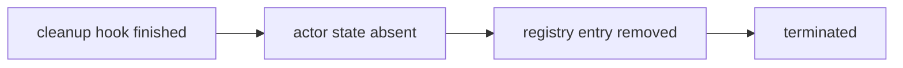
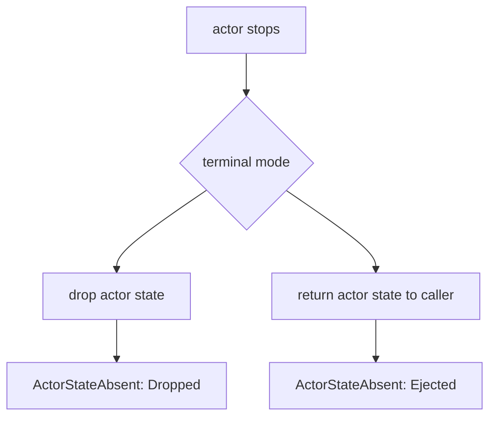
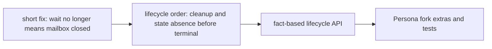
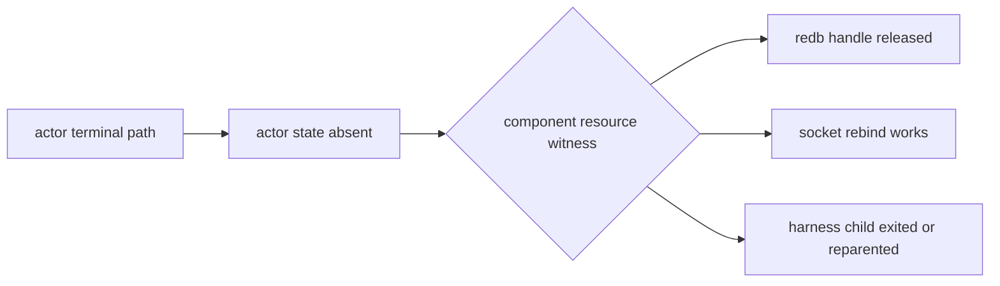

# Response To DA/96 Kameo Lifecycle Audit

Operator report. Created 2026-05-16.

Input:

- `reports/designer-assistant/96-kameo-push-only-lifecycle-audit-2026-05-16.md`
- DA chat feedback on `reports/operator/127-actor-framework-lifecycle-correctness-research.md`
- branch:
  `/home/li/wt/github.com/LiGoldragon/kameo/kameo-push-only-lifecycle`

## Executive Correction

DA is right to be skeptical.

My previous reports were right on the large direction: Kameo needs
runtime-pushed lifecycle truth, and `wait_for_shutdown()` must not mean
"the mailbox stopped accepting input." But DA/96 identifies several
places where the current push-only branch overclaims.

The branch should stay alive as the right research direction, but it
should not be treated as trustworthy in this shape.

The critical correction is:

> A lifecycle phase must name only what the runtime has actually
> completed. Anything else belongs in a terminal outcome, a predicate,
> or a watcher-side event.

## What DA/96 Changes

| Topic | My prior stance | Corrected stance |
|---|---|---|
| `LinksNotified` | Acceptable but maybe rename | Overpromises. The branch schedules/sends signals; it does not prove linked peers processed them. |
| ordinal `PartialOrd` phases | Mostly fine | Too blunt for skipped paths. Later terminal phases must not make "exact phase happened" look true. |
| `StateReleased` | Strong resource-release witness | Only proves the actor `Self` was dropped. Resource-specific witnesses are still required for delegated/`Arc`/background-owned resources. |
| `PreparedActor::run()` no longer returns state | API polish | Load-bearing upstream break. Issue #178 asks for state ejection explicitly. |
| `shutdown_result` | Needs stronger wait | Meaning is muddy: cleanup result and terminal result are being conflated. |
| `watch` | Right primitive | Still right for current phase; not an audit log. Persona must mirror lifecycle events into durable state. |

## Branch Facts I Confirmed

### `notify_links` Does Not Mean Peers Processed Anything

The branch calls:

```rust
actor_ref
    .links
    .lock()
    .await
    .notify_links(id, reason.clone(), mailbox_rx);
actor_ref.lifecycle.mark(ActorLifecyclePhase::LinksNotified);
actor_ref.lifecycle.mark(ActorLifecyclePhase::Terminated);
```

`notify_links` internally calls `tokio::spawn(...)` for parent and
sibling notification paths. That means the runtime has at best
scheduled or dispatched link signals. It has not observed completion of
the linked actors' link-death handlers.

Therefore `LinksNotified` is false as written.

Better names if this remains a phase:

```rust
LinkSignalsScheduled
LinkSignalsDispatched
```

But I now think a separate post-release link phase probably should not
exist. The watcher receiving its own `LinkDied` signal is the real
notification. The dying actor's lifecycle should stop at `Terminated`
after the runtime has completed its own terminal bookkeeping.

### Registry Ordering Is A Separate Contract

DA/96 points out a bug I missed:

- success path unregisters the actor after `CleanupFinished` but before
  `drop(actor)`;
- startup-failure path unregisters after link notification;
- therefore name lookup and resource-release semantics disagree.

This matters for Persona. A replacement actor could look up the old name,
see it gone, and try to bind the same redb/socket resource while the old
actor's `Self` still owns it.

Correct rule:

> Registry disappearance must not precede state absence.

For Kameo this should mean:



No branch should be accepted until that ordering is tested.

### Linear Phase Ordering Needs A Different Public Surface

The branch has:

```rust
#[derive(Debug, Clone, Copy, PartialEq, Eq, PartialOrd, Ord)]
pub enum ActorLifecyclePhase {
    Prepared,
    Starting,
    Running,
    Stopping,
    CleanupFinished,
    StateReleased,
    LinksNotified,
    Terminated,
}
```

The problem is not the enum itself. The problem is public `>=` semantics.
If startup fails before an actor `Self` is created, `Terminated >=
StateReleased` is mechanically true, but the exact event "state was
dropped" did not happen. What is true is "no actor state remains."

That distinction matters.

I would change the public API from raw phase waits to named predicates:

```rust
pub enum ActorLifecycleTarget {
    StartupAccepted,
    StoppingStarted,
    ChildrenStopped,
    CleanupHookFinished,
    ActorStateAbsent,
    RegistryAbsent,
    Terminated,
}
```

Internally the runtime can still use a monotonic index, but public waits
should target facts, not enum ordering.

The important target for Persona is `ActorStateAbsent`, not
`StateReleased`. It covers both:

- actor started, then `Self` was dropped;
- actor never started, so no `Self` was ever allocated.

### `StateReleased` Is Too Strong As A General Resource Claim

The branch's `TcpListener` test is valuable. It proves a simple owned
field gets dropped before the wait resumes.

It does not prove every resource owned by the logical actor is released.
An actor can:

- clone an `Arc<redb::Database>` into another task;
- spawn a worker that owns the socket;
- leak a handle;
- delegate ownership to a child actor;
- use a resource whose release is asynchronous or backgrounded.

So `ActorStateAbsent` is a runtime fact. Resource release is a
component-specific constraint.

For Persona, redb/socket/harness actors need tests named after those
constraints:

```rust
#[tokio::test]
async fn state_absent_releases_exclusive_redb_database_handle() {}

#[tokio::test]
async fn state_absent_releases_bound_tcp_listener_for_rebind() {}

#[tokio::test]
async fn state_absent_does_not_claim_child_owned_harness_process_exited() {}
```

The last test is just as important as the first two. It prevents us from
lying to ourselves about delegated ownership.

## Corrected Kameo Lifecycle Shape

I would no longer expose the eight current variants as the main public
contract. I would split runtime facts from terminal outcome:

```rust
pub enum ActorLifecycleFact {
    Prepared,
    Starting,
    Running,
    Stopping,
    ChildrenAbsent,
    CleanupHookFinished,
    ActorStateAbsent,
    RegistryAbsent,
    Terminated,
}

pub enum ActorStartupOutcome {
    Accepted,
    Failed,
}

pub enum ActorStateOutcome {
    Dropped,
    NeverAllocated,
    Ejected,
}

pub struct ActorTerminalOutcome {
    pub stop_reason: ActorStopReason,
    pub startup: ActorStartupOutcome,
    pub state: ActorStateOutcome,
}
```

This removes the skipped-phase ambiguity. `wait_for(ActorStateAbsent)`
can be true on startup failure without pretending `Drop` ran.

## Shutdown Result Must Be Split Or Renamed

The current branch uses `shutdown_result` as both:

- cleanup result surface;
- terminal wait cell;
- weak `is_alive` proxy.

That is too much.

Two coherent options:

### Option A — Terminal Result

`shutdown_result` is set only after the runtime reaches `Terminated`.
Then every wait on it is terminal by definition.

```rust
terminal_result.set(ActorTerminalOutcome { ... });
lifecycle.mark(ActorLifecycleFact::Terminated);
```

This is the cleanest public semantics.

### Option B — Cleanup Result Plus Terminal Wait

Keep a cleanup-result cell, but rename it:

```rust
cleanup_result.set(...);
lifecycle.wait_for(ActorLifecycleFact::Terminated).await?;
```

Public `wait_for_shutdown_result()` must wait for terminal lifecycle
first, then read cleanup result. Public `get_shutdown_result()` becomes
dangerous unless renamed to `get_cleanup_result()`.

I prefer Option A. It has fewer ways to lie.

## Final-State Ejection Is A Real Separate Mode

Kameo issue #178 asks for actor-state ejection after shutdown for tests.
That user need is real.

But state ejection and state release are mutually different contracts:



A state-ejection path can still mean "the actor no longer owns the
state," but it cannot mean the resource is released. The caller owns it
now.

So Kameo should have two explicit surfaces:

```rust
pub async fn run_to_termination(self, arguments: A::Arguments)
    -> Result<ActorTerminalOutcome, PanicError>;

pub async fn run_to_state_ejection(self, arguments: A::Arguments)
    -> Result<(ActorTerminalOutcome, A), PanicError>;
```

The ejection API should produce `ActorStateOutcome::Ejected`, not
`Dropped`.

## Staged Work Plan

DA/96 recommends four PRs. I agree with the split, with one adjustment:
do not land the current phase enum unchanged in PR #3.



### PR 1 — Small Wait Fix

Keep it tiny:

- `wait_for_shutdown()` waits on a terminal witness, not mailbox closure;
- regression test: slow `on_stop` must complete before wait resumes.

### PR 2 — Lifecycle Ordering Without Public Phase Stream

Land ordering before broad API:

- children drained before parent cleanup;
- cleanup hook finished before actor state absence;
- actor state absence before registry removal;
- registry removal before terminal result;
- link/watch signals only after state absence.

Tests:

```rust
#[tokio::test]
async fn registry_entry_survives_until_actor_state_is_absent() {}

#[tokio::test]
async fn startup_failure_reaches_terminal_without_claiming_state_drop() {}

#[tokio::test]
async fn parent_cleanup_waits_for_child_state_absence() {}
```

### PR 3 — Fact-Based Lifecycle Observation

Expose:

```rust
wait_for_lifecycle_target(ActorLifecycleTarget::ActorStateAbsent)
```

not:

```rust
wait_for_lifecycle_phase(ActorLifecyclePhase::StateReleased)
```

Use `tokio::sync::watch` internally, but return a fallible result:

```rust
pub enum ActorLifecycleWaitError {
    LifecycleClosedBeforeTarget {
        observed: ActorLifecycleFact,
        target: ActorLifecycleTarget,
    },
}
```

Tests:

```rust
#[tokio::test]
async fn closed_lifecycle_before_target_is_error_not_success() {}

#[tokio::test]
async fn terminal_startup_failure_satisfies_state_absent_not_state_dropped() {}
```

### PR 4 — Persona Fork Extensions

These may not be upstream-friendly:

- lifecycle event stream for audit, distinct from current state;
- resource-specific witnesses;
- explicit `ActorStateOutcome`;
- deprecate `is_alive`;
- state-ejection API if upstream wants it;
- Template-2 actor tests for redb/socket ownership.

## Direct Edits The Branch Needs

If we continue this branch, I would make these changes first:

1. Rename `LinksNotified` to `LinkSignalsScheduled`, or remove it.
2. Move `unregister_actor(&id).await` after actor state absence on every
   path.
3. Replace public `wait_for_lifecycle_phase(phase)` with a target/predicate
   wait.
4. Make lifecycle waits fallible.
5. Fix `WeakActorRef::wait_for_shutdown_result()` to wait on the same
   terminal lifecycle as strong refs.
6. Decide whether `shutdown_result` is terminal result or cleanup result;
   do not let it remain both.
7. Add startup-failure tests.
8. Add registry-order tests.
9. Add link-signal scheduling tests that do not claim peer handler
   processing.
10. Add a state-ejection design before changing `PreparedActor::run()` in a
    way upstream will reject.

## Persona Impact

For Persona, the practical rule is:

> Persona components must wait for actor-state absence before replacing
> actors that own exclusive process resources, and must wait for
> component-specific resource witnesses when ownership was delegated.

This means Kameo lifecycle is necessary but not sufficient.



For `persona-mind` store actors, the Kameo target is not generic
`Terminated`; it is specifically `ActorStateAbsent` plus a redb
reopen/rebind witness.

For terminal/harness actors, `ActorStateAbsent` does not prove the
external process exited. That must be a separate terminal/harness
contract.

## Bottom Line

DA/96 does not invalidate the push-only direction. It makes the direction
more precise.

The correct next implementation is not "more enum variants." It is:

1. define lifecycle facts that are true on every path;
2. define terminal outcomes for skipped or alternate paths;
3. make waits fallible;
4. make registry and notification ordering explicit;
5. keep resource-release claims component-specific unless the runtime
   truly owns the resource.

The branch is still valuable. It should be tightened before any upstream
PR and before Persona depends on it.
