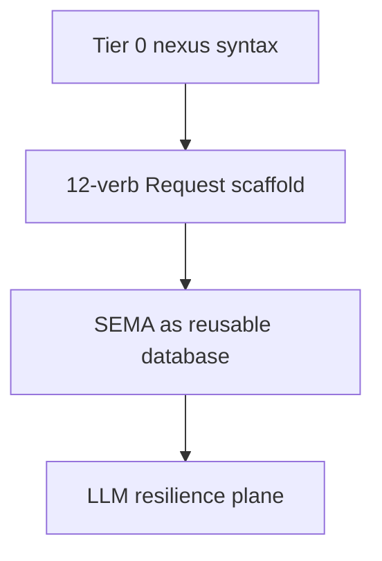
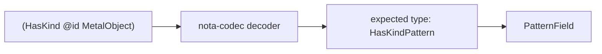
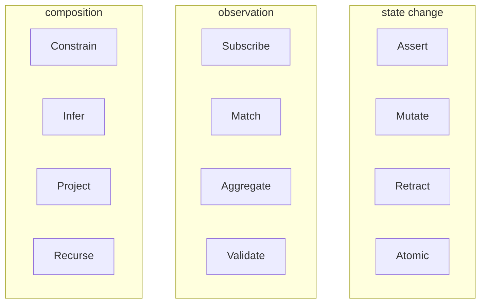
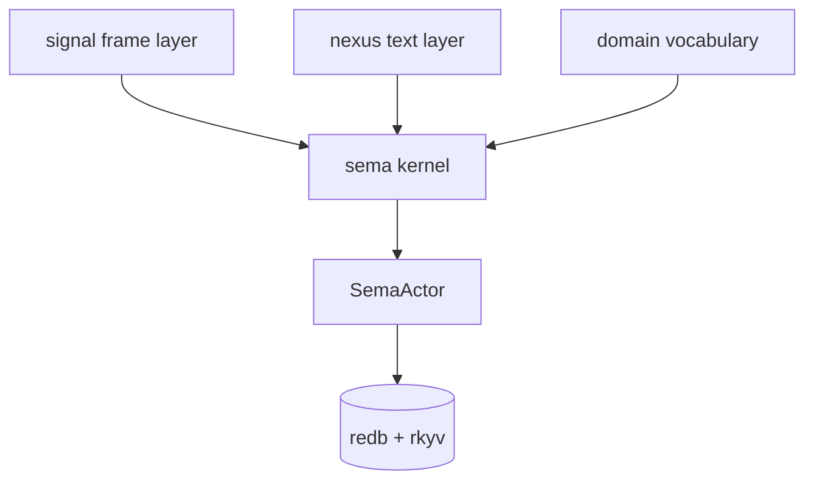
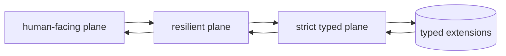
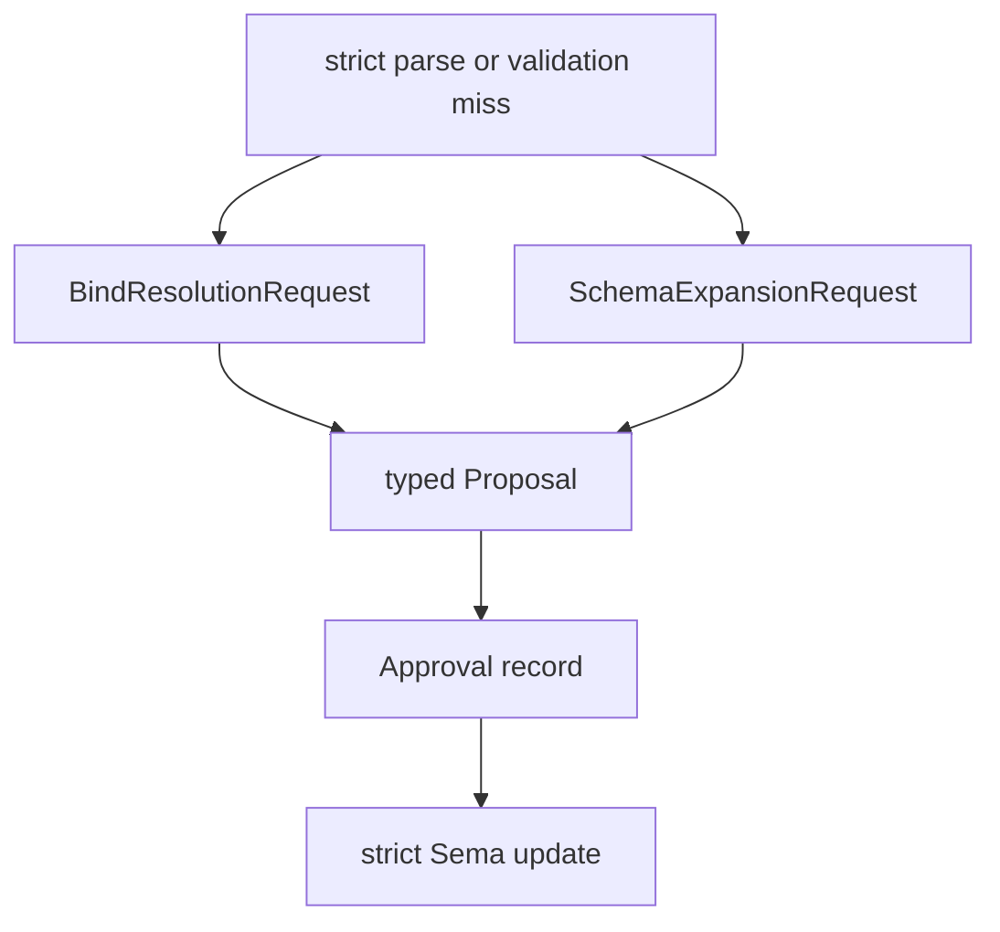
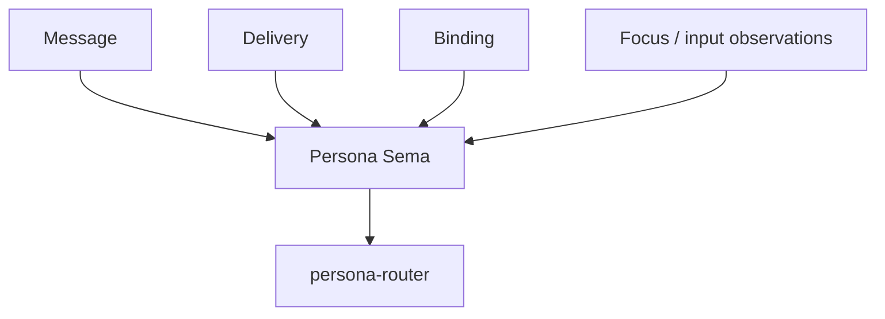
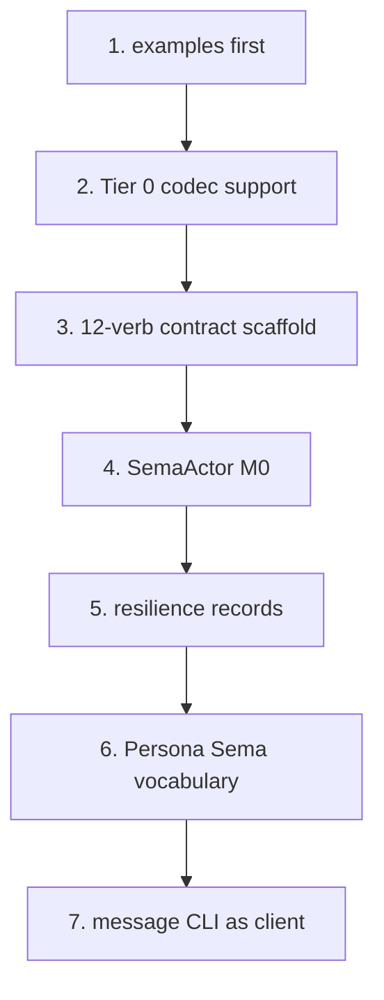

# Twelve Verbs Implementation Consequences

Status: operator feedback report
Author: Codex (operator)

This report translates `reports/designer/26-twelve-verbs-as-zodiac.md` into
near-term implementation consequences. It assumes the user decision from report
26: SEMA is the reusable database substrate, Persona has a Sema instance, and
Nexus/Signal are being reshaped as the universal message surface for Sema-style
databases.

---

## 1 · What Report 26 Settles

Report 26 makes four implementation decisions concrete:

| Decision | Implementation meaning |
|---|---|
| Tier 0 | `(` records and `[` sequences are enough; patterns are schema-driven via `PatternField<T>` |
| 12 verbs | `Request` becomes the stable Sema protocol surface |
| SEMA | Database actor, durable store, subscription engine, and typed query runtime share one noun |
| LLM inside Sema | LLM-mediated recovery is part of the engine, but not part of the strict typed execution plane |

The useful implementation attitude: build the strict plane first, make the
resilient plane explicit, and keep natural language outside the execution path.

---

## 2 · Tier 0 Changes The Parser Work

Tier 0 removes special pattern delimiters. The parser no longer identifies
patterns by syntax; the receiving Rust type does.

The parser consequence is good: fewer tokens, fewer special forms, less
top-level dispatch. The type consequence is sharper: the same text can be a
data record or a pattern record depending on the expected type.

| Text | Expected type | Meaning |
|---|---|---|
| `(HasKind 247 MetalObject)` | `HasKind` | concrete data record |
| `(HasKind @id MetalObject)` | `HasKindPattern` | pattern over `HasKind` |
| `(HasKind _ MetalObject)` | `HasKindPattern` | wildcard subject, fixed kind |

This means `nota-codec` needs the `@` token and wildcard handling to be
available to `PatternField<T>`, not only to a separate Nexus pattern parser.
The right owner is the field decoder, because the field type owns the meaning.

---

## 3 · Request Scaffold Consequence

The 12 verbs should become the ordering of the protocol enum, docs, tests, and
examples. The zodiac mapping can be documentation order; the runtime should see
closed enums, not symbolism.

Implementation grouping should prioritize engine behavior:

| Engine group | Verbs | First implementation |
|---|---|---|
| state change | `Assert`, `Mutate`, `Retract`, `Atomic` | reducer + redb transaction |
| observation | `Match`, `Subscribe`, `Validate`, `Aggregate` | match first; aggregate later |
| composition | `Constrain`, `Project`, `Recurse`, `Infer` | constrain/project before recurse/infer |

The text order can follow the zodiac. The code modules should follow behavior:
`edit`, `read`, `compose`, `reply`, `pattern`, `frame`.

---

## 4 · Sema Crate Shape

Report 26 implies a reusable Sema substrate. The cleanest near-term shape is a
small Sema kernel plus domain vocabularies.

The naming can still settle, but the responsibilities should not blur:

| Component | Owns |
|---|---|
| Sema kernel | request/reply traits, actor protocol shape, slot/revision conventions |
| Signal layer | length-prefixed rkyv frame, handshake, auth |
| Nexus layer | text parser/renderer over Sema request/reply/domain vocabularies |
| Domain vocabulary | record types, pattern types, domain query variants |
| Sema actor | redb store, reducer, subscriptions, proposals |

If a separate `sema` repo appears, `signal` should stop being the only place
where universal database protocol concepts live. If the work stays in `signal`
first, the architecture should still name the Sema kernel boundary explicitly.

---

## 5 · Strict, Resilient, Human Planes

Report 26's LLM-in-database pivot should be implemented as separate actors, not
as a conditional branch inside parsing.

| Plane | Actor role | May use LLM? | Executes database changes? |
|---|---|---|---|
| strict typed | validate and run typed `Request` | no | yes |
| resilient | propose bind resolution, schema expansion, query rewrite | yes | no |
| human-facing | natural language to/from typed requests/replies | yes | no |

The strict plane must never accept a best-effort LLM result as if it were a
typed value. The resilient plane produces typed proposals. A human or agent
approves those proposals. Only then does the strict plane execute.

---

## 6 · New Record Kinds

The LLM-resilience plane needs its own record vocabulary. These records are not
an implementation afterthought; they are the observable governance trail for
schema growth.

First useful records:

| Record | Meaning |
|---|---|
| `BindResolutionRequest` | a query references a known position but an unknown or invalid kind/value |
| `BindResolutionProposal` | proposed replacement using existing lattice terms |
| `SchemaExpansionRequest` | repeated pressure suggests the taxonomy is missing a kind |
| `SchemaExpansionProposal` | typed addition to the lattice or enum vocabulary |
| `Approval` | human/agent approval of a proposal |
| `Rejection` | explicit refusal with typed reason |

These should live in the Sema vocabulary, not in Persona. Persona can have
Persona-specific schema expansion proposals later, but the proposal mechanism is
general Sema machinery.

---

## 7 · Persona Consequence

Persona should no longer build a special message protocol. It should define a
Persona Sema vocabulary.

Immediate Persona vocabulary:

| Persona record | Sema role |
|---|---|
| `Message` | asserted by user/agent |
| `Delivery` | state machine record |
| `Binding` | target to endpoint mapping |
| `FocusObservation` | system input to gate |
| `InputBufferObservation` | harness recognizer input to gate |
| `Deadline` / `DeadlineExpired` | delivery timeout substrate |

The `message` CLI becomes a Nexus/Sema client. It should not own a message
language. It may own ergonomic command wrappers only if they render to Nexus
text or typed Sema requests before crossing the process boundary.

---

## 8 · Implementation Order

Concrete order:

| Step | Repository | Output |
|---|---|---|
| 1 | `nexus` | canonical Tier 0 examples, including the cleaned `HasKind` query |
| 2 | `nota-codec` | `At` token + `PatternField<T>` decoding/encoding under expected type |
| 3 | `signal` or new Sema contract repo | 12-verb scaffold and request/reply round trips |
| 4 | Sema implementation repo | strict M0 actor: assert, match, subscribe, validate |
| 5 | Sema implementation repo | proposal records for bind/type expansion |
| 6 | `signal-persona` | Persona record vocabulary using the Sema scaffold |
| 7 | `persona-message` | client wrapper over Nexus/Sema, no bespoke protocol |

The examples-first loop is not optional. Every type shape should be justified by
a concrete Nexus expression and a round-trip test.

---

## 9 · Risks

| Risk | Guardrail |
|---|---|
| Generic `KindName` becomes stringly dispatch | keep execution enums closed; use generic names only for proposals/introspection |
| LLM path mutates schema too easily | schema expansion goes through typed proposal + approval records |
| Tier 0 loses local readability | examples and renderer must stay canonical and compact |
| 12 verbs land before M0 semantics are correct | stage verbs; scaffold names now, implement behavior by milestone |
| Persona waits forever on universal design | implement Persona vocabulary after M0 Sema strict plane, not after Infer/Recurse |

---

## 10 · Decisions For The User

Most report 26 decisions look accepted. These are the remaining operator-facing
choices:

| Decision | Recommendation |
|---|---|
| Should Tier 0 be implemented now? | Yes. It simplifies parsing and matches the cleaned examples. |
| Should the 12 verbs land as a full enum before all behavior exists? | Yes, as skeleton contract, with unimplemented behavior clearly staged. |
| Should the resilience plane live in Sema, not Persona? | Yes. Bind/type recovery is general database machinery. |
| Should natural language enter the strict plane? | No. Natural language is translated into typed requests before strict execution. |
| Should Persona rename `persona-store` now? | Not yet required. Treat it as the first Persona Sema implementation home until the repo naming pass is deliberate. |

---

## 11 · Bottom Line

Report 26 is implementable if we treat it as a staged systems refactor:

- Tier 0 belongs in the codec/type decoder layer.
- The 12 verbs belong in the Sema contract scaffold.
- The strict Sema actor lands before LLM resilience.
- LLM resilience is typed proposal machinery, not loose query execution.
- Persona becomes a domain vocabulary over a Persona Sema instance.

The next code should be small and mechanical: Tier 0 examples, codec support
for `PatternField<T>`, and a 12-verb contract scaffold with round-trip tests.

