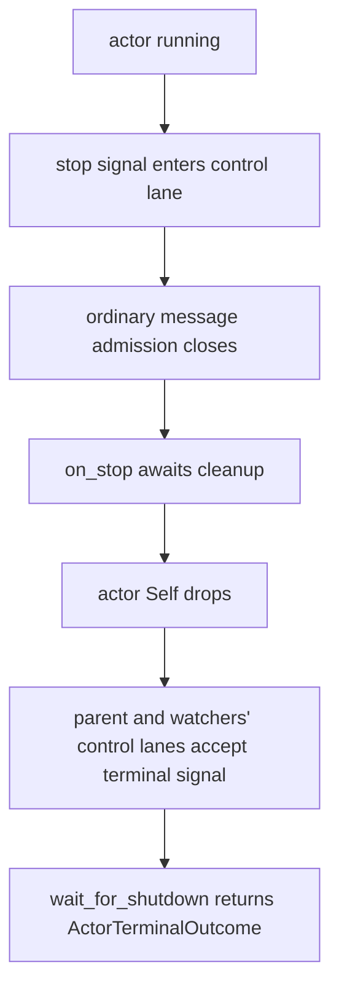
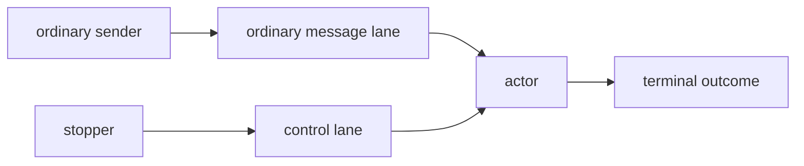
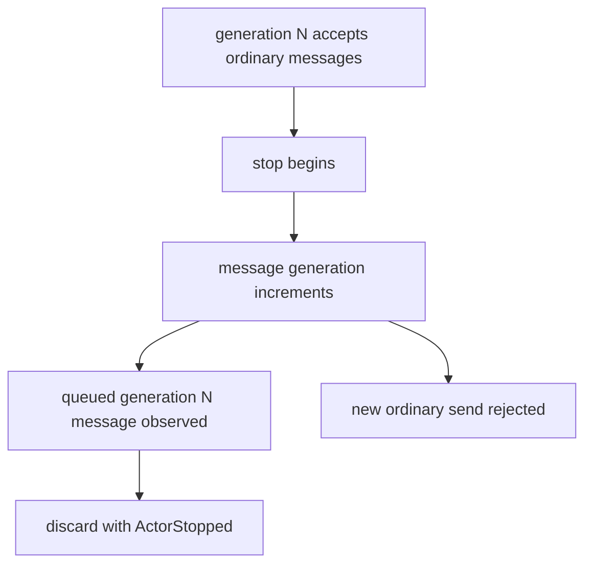
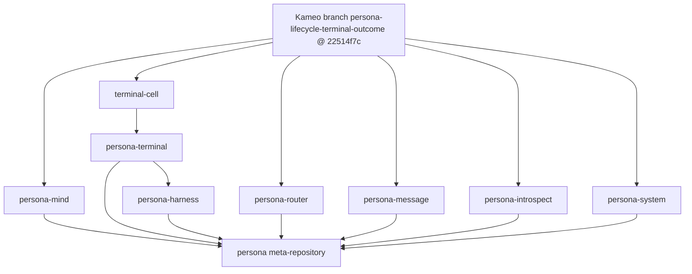
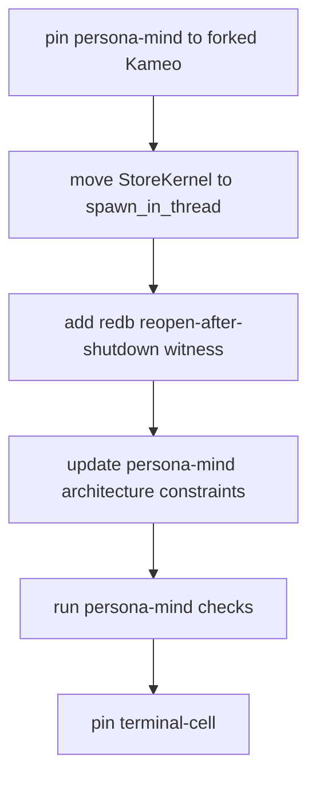

# 132 - Migrating Persona Components To The New Kameo

Date: 2026-05-16  
Role: operator

## 1 - Executive Read

The new Kameo fork is ready enough to become the Persona runtime pin for the
engine components, but not because every risk is gone. It is ready because the
specific blocker that kept state-owning actors on the old shared-worker shape
has been addressed and covered by framework tests.

The current Kameo fork head is:

```text
22514f7c6900da00703a4a0ef096f21a45c95a99
```

This commit is on the `LiGoldragon/kameo` fork and is pushed on both `main` and
`kameo-push-only-lifecycle`. Component manifests should use a named Git
reference; `Cargo.lock` will witness the resolved commit.

The clean stack is:

```text
ddab7733 actor: publish terminal lifecycle outcomes
565ff25e actor: split lifecycle control mailbox
04f6e2ab actor: cover lifecycle control edge cases
22514f7c actor: gate weak shutdown result helpers
```

The component migration should be done in this order:

1. Pin every active Persona runtime component to the forked Kameo named
   reference.
2. Migrate `persona-mind` first, because `StoreKernel` is the concrete
   redb-owning actor that exposed the old shutdown lie.
3. Migrate terminal and harness components next, because they own processes,
   PTYs, transcript streams, and GUI-visible terminal state.
4. Migrate router/message/system/introspect after that, because their lifecycle
   risk is mostly fan-out, backpressure, and child shutdown ordering.
5. Update the `persona` meta-repository last, after component checks prove the
   same forked Kameo graph is used everywhere.

The migration is not a search-and-replace. The new runtime gives better
shutdown truth, but each resource-owning component still needs its own witness
tests proving the resource it owns is gone when `wait_for_shutdown()` resolves.

## 2 - What Changed In Kameo

The old Kameo surface let callers confuse "mailbox no longer useful" with
"actor-owned state is gone." For Persona, that was wrong. Actors own redb
handles, sockets, process handles, terminal sessions, and transcript writers.
Supervisors must not restart a replacement actor while the previous actor still
physically holds the resource.

The fork changes the public shutdown contract to a terminal outcome:

```rust
pub enum ActorStateAbsence {
    Dropped,
    NeverAllocated,
    Ejected,
}

pub enum ActorTerminalReason {
    StartupFailed,
    Stopped,
    SupervisorRestart,
    Killed,
    Panicked,
    LinkDied,
    CleanupFailed,
}

pub struct ActorTerminalOutcome {
    pub state: ActorStateAbsence,
    pub reason: ActorTerminalReason,
}
```

The public rule becomes:

```rust
let outcome = actor_reference.wait_for_shutdown().await;
assert_eq!(outcome.state, ActorStateAbsence::Dropped);
```

That assertion now means the framework observed terminal shutdown and the
actor `Self` was dropped. It does not mean every resource in the process is
released if the actor leaked or cloned it elsewhere. Persona still needs
component-level witnesses for every exclusive resource.

### Lifecycle Shape



The load-bearing correction is the ordering: resource release happens before
termination is observable by supervisors and callers.

### Message Lane Shape



The control lane is physically separate from the ordinary message lane. A
bounded or saturated user mailbox cannot prevent stop/control messages from
reaching the actor.

The last consistency fix in the fork gates `WeakActorRef`'s nonblocking
shutdown-result helpers behind terminal lifecycle publication, matching
`ActorRef`. That keeps compatibility helpers from revealing an `on_stop` result
while actor state is still dropping.

### Stale Message Shape



The consequence for Persona is important: if a component requires all queued
domain work to finish, it must implement a domain-level quiesce/drain protocol
before calling `stop_gracefully()`. Kameo shutdown is not a hidden drain.

## 3 - Pinning Rule

Every active Persona runtime repository that depends on Kameo should use the
same GitHub HTTPS dependency, addressed through a named Git reference.

Feature lists remain component-specific. For example, `persona-terminal`
currently uses `["tracing"]`, and `persona-message` currently uses
`["macros"]`. Do not add features unless the component needs them.

Do not use:

- local path dependencies;
- `git+file`;
- anonymous or local-only branch names;
- Nix hashes in `flake.nix` for this pin.

The stable implementation-ready named reference is
`persona-lifecycle-terminal-outcome`:

```toml
kameo = {
    git = "https://github.com/LiGoldragon/kameo",
    branch = "persona-lifecycle-terminal-outcome",
    default-features = false,
    features = ["macros", "tracing"],
}
```

The lockfile should witness the resolved Git commit. The flake should keep
using the workspace's normal Cargo/Nix flow.

## 4 - Current Component Surface

The current active runtime components still point at crates.io Kameo 0.20:

| Repository | Current Kameo dependency | Migration priority |
|---|---:|---:|
| `persona-mind` | `version = "0.20"` with `macros`, `tracing` | 1 |
| `terminal-cell` | `version = "0.20"` with `macros` | 2 |
| `persona-terminal` | `version = "0.20"` with `tracing` | 2 |
| `persona-harness` | `version = "0.20"` with `macros`, `tracing` | 3 |
| `persona-router` | `version = "0.20"` with `macros`, `tracing` | 4 |
| `persona-message` | `version = "0.20"` with `macros` | 5 |
| `persona-introspect` | `version = "0.20"` with `macros` | 5 |
| `persona-system` | `version = "0.20"` with `macros`, `tracing` | 5 |
| `persona` | `version = "0.20"` without features | final |

`signal-core`, `signal-persona-*`, `sema`, `sema-engine`, `nexus`, and `nota`
are not Kameo runtime components. They should not grow Kameo dependencies as
part of this migration.

## 5 - Migration Graph



The graph is deliberately not symmetric. `terminal-cell` should move before
`persona-terminal`, because `persona-terminal` consumes terminal-cell behavior.
`persona-mind` should move before the sandbox engine, because the engine needs
mind's durable state before it becomes a real prototype.

## 6 - Component-Specific Migration Plan

### 6.1 - `persona-mind`

This is the first real migration target.

Current `persona-mind/ARCHITECTURE.md` still says
`supervise(...).spawn_in_thread()` on Kameo 0.20 keeps the redb file locked
across daemon restart. That was true for upstream Kameo 0.20. It is now stale
against the fork.

Current `persona-mind/src/actors/store/mod.rs` also carries the same deferral
comment around `StoreKernel`. That comment should be replaced by a real
migration:

```rust
let kernel = StoreKernel::supervise(
    &actor_reference,
    kernel::Arguments {
        store: arguments.store.clone(),
        subscription: arguments.subscription.clone(),
    },
)
.spawn_in_thread()
.await;
```

That code is only acceptable with a test proving the redb handle is physically
released before supervisor replacement or daemon restart.

Required constraints:

- `StoreKernel` is the only actor that opens `mind.redb`.
- `StoreKernel` runs on a dedicated OS thread.
- `StoreKernel` shutdown releases `mind.redb` before supervisor replacement.
- `StoreKernel` restart cannot observe the previous generation's open redb
  handle.
- `MindRoot` does not report shutdown complete until the store tree reports
  terminal outcomes.

First tests:

```text
store_kernel_shutdown_releases_mind_database_before_restart
store_kernel_supervised_thread_restart_reopens_same_database
mind_root_shutdown_waits_for_store_kernel_terminal_outcome
queued_store_write_after_stop_reports_actor_stopped
```

### 6.2 - `terminal-cell`

`terminal-cell` is the low-level terminal session substrate. It is a runtime
component because it owns PTYs, subprocess handles, scrollback capture, and
viewer attachment state.

Required constraints:

- A terminal session actor owns exactly one terminal session resource set.
- Stop/control messages cannot be blocked by transcript or viewer traffic.
- `wait_for_shutdown()` proves the PTY/process session owner dropped its state.
- Viewer attachment cannot keep a dead terminal session actor alive.

First tests:

```text
terminal_session_shutdown_releases_pty_owner
viewer_backpressure_does_not_block_terminal_session_stop
queued_terminal_input_after_stop_reports_actor_stopped
```

### 6.3 - `persona-terminal`

`persona-terminal` should pin the fork only after `terminal-cell` pins it.
The component should consume terminal-cell's terminal-outcome behavior rather
than paper over it with its own shutdown guess.

Required constraints:

- Terminal workers stop through Kameo control signals, not ordinary message
  queue drain assumptions.
- Worker replacement waits for terminal-cell session owner shutdown.
- Injection workers do not accept new input after stop begins.
- Prompt-state observation stops independently of ordinary terminal output
  volume.

First tests:

```text
terminal_worker_restart_waits_for_session_owner_drop
terminal_input_after_stop_is_rejected_or_reported_stopped
prompt_observer_shutdown_is_not_blocked_by_output_backpressure
```

### 6.4 - `persona-harness`

`persona-harness` owns harness lifecycle coordination above terminal sessions.
It should not claim that a harness is gone until the terminal/process subtree is
gone.

Required constraints:

- Harness stop waits for terminal worker terminal outcomes.
- Subscription handlers stop through the control lane.
- A stopped harness does not accept new delivery work.
- Harness restart does not reuse stale terminal/session state.

First tests:

```text
harness_shutdown_waits_for_terminal_worker_outcome
harness_subscription_handler_stop_survives_full_user_mailbox
harness_delivery_after_stop_reports_actor_stopped
```

### 6.5 - `persona-router`

`persona-router` is mostly about fan-out, child ordering, and domain-level
delivery state. It should migrate after the state-owning components because the
router's correctness depends on downstream outcomes being truthful.

Required constraints:

- Router child actors stop through Kameo control signals.
- Delivery actors do not accept new deliveries after stop begins.
- Router shutdown waits for registry, channel, delivery, observation, and mind
  adjudication child outcomes.
- If the router wants to finish pending domain deliveries before stop, it uses a
  router-level quiesce protocol rather than assuming Kameo drains the queue.

First tests:

```text
router_shutdown_waits_for_all_child_terminal_outcomes
router_delivery_after_stop_reports_actor_stopped
router_control_stop_survives_saturated_delivery_mailbox
```

### 6.6 - `persona-message`

The current direction after designer report 142 is **no `MessageProxy`
component** and **no `persona-message-proxy-daemon`**. That is only a naming
and component-boundary correction. It does not remove the message daemon.

`persona-message` is the supervised first-stack message-ingress component. It
owns the `message` CLI and the long-lived `persona-message-daemon` binary. The
daemon binds `message.sock`, stamps `MessageSubmission` with typed
origin/provenance, forwards `StampedMessageSubmission` to `persona-router`, and
returns one reply frame to the CLI.

Required constraints:

- `persona-message` is pinned to the same Kameo fork reference as the rest of
  the runtime.
- `MessageDaemonRoot` migrates to the terminal-outcome contract.
- Listener and connection actors, when split out, also migrate to the
  terminal-outcome contract.
- Daemon shutdown releases `message.sock`.
- Ingress after daemon stop is rejected or reports actor stopped.
- The `message` CLI remains a client of `message.sock`; it is not the daemon.
- "No proxy" remains only a naming correction, not a daemon-removal claim.

First tests:

```text
message_daemon_shutdown_releases_message_socket
message_ingress_after_daemon_stop_reports_actor_stopped
message_daemon_root_shutdown_returns_terminal_outcome
message_cli_remains_socket_client_not_daemon
```

### 6.7 - `persona-introspect`

`persona-introspect` fans into other components and has many child actors. It
should become a strong lifecycle witness for multi-child shutdown.

Required constraints:

- Introspect root stops every child actor and observes every terminal outcome.
- Introspect does not open peer databases directly.
- Introspect shutdown is not blocked by a slow peer query actor.

First tests:

```text
introspect_root_shutdown_observes_every_child_outcome
introspect_slow_peer_query_does_not_block_root_stop
introspect_does_not_open_peer_database_files
```

### 6.8 - `persona-system`

`persona-system` is lower risk for this migration. Its main actor surfaces are
focus/event observation. It still needs the fork so the engine has one Kameo
graph.

Required constraints:

- System event actors stop through control signals.
- Focus observation cannot block shutdown.
- The component remains push-first; no polling loop is introduced to work
  around actor shutdown.

First tests:

```text
system_focus_observer_shutdown_survives_event_source_delay
system_component_has_no_polling_shutdown_loop
```

### 6.9 - `persona`

The meta-repository migrates last.

Required constraints:

- The sandbox engine resolves one Kameo commit across every runtime component.
- The sandbox starts components that have already pinned the fork.
- The sandbox stop path observes component daemon outcomes, not only process
  exits.

First tests:

```text
sandbox_uses_single_kameo_commit
sandbox_two_component_engine_starts_and_stops_cleanly
sandbox_component_restart_waits_for_old_terminal_outcome
```

## 7 - Standard Component Patch Shape

For each component:

1. Change `Cargo.toml` to the GitHub HTTPS Kameo pin.
2. Update `Cargo.lock`.
3. Replace shutdown sites that ignore the outcome with named local checks where
   the actor owns resources.
4. Add or update architecture constraints.
5. Add Nix-named checks for those constraints.
6. Run the component's flake checks with low parallelism.
7. Commit with `jj` before moving to the next component.

Representative helper shape:

```rust
use kameo::actor::{ActorStateAbsence, ActorTerminalReason, ActorTerminalOutcome};

pub struct ActorShutdownExpectation {
    expected_reason: ActorTerminalReason,
}

impl ActorShutdownExpectation {
    pub fn stopped() -> Self {
        Self {
            expected_reason: ActorTerminalReason::Stopped,
        }
    }

    pub fn assert_resource_owner_dropped(
        &self,
        outcome: ActorTerminalOutcome,
    ) -> crate::Result<()> {
        if outcome.state != ActorStateAbsence::Dropped {
            return Err(crate::Error::ActorShutdown(format!(
                "actor state was not dropped: {outcome:?}"
            )));
        }
        if outcome.reason != self.expected_reason {
            return Err(crate::Error::ActorShutdown(format!(
                "actor stopped for unexpected reason: {outcome:?}"
            )));
        }
        Ok(())
    }
}
```

Do not put this exact helper in a shared crate unless multiple components prove
the same shape. It is shown here to make the migration intent concrete: callers
should name what they need from the terminal outcome instead of discarding it.

## 8 - Weird Tests We Need

The tests should look odd from normal Rust practice because they are enforcing
architecture, not just function output.

### 8.1 - Source-Shape Tests

These tests prevent backsliding:

```text
component_uses_workspace_kameo_fork_reference
component_does_not_depend_on_crates_io_kameo
component_does_not_call_get_shutdown_result_for_resource_truth
component_does_not_use_actor_liveness_as_shutdown_proof
```

`process_is_alive` helpers for OS processes are not a violation. The violation
is using actor liveness as a replacement for terminal outcome truth.

### 8.2 - Resource-Release Tests

These are the high-value tests:

```text
redb_owner_can_reopen_after_wait_for_shutdown
pty_owner_releases_session_after_wait_for_shutdown
process_owner_reaps_children_before_wait_for_shutdown_returns
```

The test must touch the real resource. A mock flag alone is not enough.

### 8.3 - Control-Plane Tests

Every stateful actor should have at least one backpressure test:

```text
stop_signal_reaches_actor_when_user_mailbox_is_full
queued_ask_discarded_by_stop_reports_actor_stopped
new_send_after_stop_begins_is_rejected
```

These tests prove the component is using the new physical control-lane
behavior rather than relying on cooperative ordinary messages.

### 8.4 - Supervisor Tests

Every supervised resource owner needs a restart witness:

```text
supervisor_restarts_child_only_after_old_state_dropped
supervised_thread_child_releases_resource_before_replacement_start
```

`persona-mind::StoreKernel` is the first production-shaped target for this
test class.

## 9 - Known Shortcomings And Risks

The fork does not solve every actor lifecycle problem.

| Risk | Consequence | Migration stance |
|---|---|---|
| `ActorStateAbsence::Ejected` exists but there is no mature state-ejection path for Persona | Do not design components around state ejection yet | Treat `Dropped` and `NeverAllocated` as the only live outcomes for component migration |
| Stopping discards queued ordinary messages | Domain work can be dropped unless the component drains explicitly | Components that require durable completion must implement quiesce/drain before stop |
| `blocking_recv()` now wakes on control signals, but still creates a small current-thread runtime internally | It is a compatibility surface, not the preferred engine shape | Persona actors should use async handlers unless there is a reason not to |
| `wait_for_shutdown_result()` remains for compatibility | It reports hook result, not state absence | New resource-owner checks should use `wait_for_shutdown()` |
| The fork is not upstream Kameo | Upstream drift is possible | Use one named fork reference, verify the lockfile's resolved commit, and keep component tests as the real acceptance contract |

## 10 - Architecture Files To Update

High-signal edits after pinning:

- `persona-mind/ARCHITECTURE.md`: replace the Kameo 0.20
  `spawn_in_thread` deferral with the forked-Kameo terminal-outcome contract.
- `persona-mind/src/actors/store/mod.rs`: delete the stale deferral comment
  when `StoreKernel` moves to `spawn_in_thread()`.
- `terminal-cell/ARCHITECTURE.md`: add terminal-session resource-release
  constraints.
- `persona-terminal/ARCHITECTURE.md`: add worker/session shutdown constraints.
- `persona-harness/ARCHITECTURE.md`: add harness/terminal subtree shutdown
  constraints.
- `persona-router/ARCHITECTURE.md`: add child-outcome and quiesce-before-stop
  constraints.
- `persona/ARCHITECTURE.md`: record that the sandbox engine requires one
  resolved Kameo commit across runtime components.

Do not update `skills/kameo.md` again from theory alone. Update it after
`persona-mind::StoreKernel` lands as the first worked example.

## 11 - Immediate Implementation Slice

The first concrete slice should be:



This sequence attacks the original bug directly. If `StoreKernel` cannot pass
the redb reopen witness, the component migration should pause and the Kameo
fork should be fixed again before the rest of the engine moves.

## 12 - Bottom Line

The new Kameo fork changes the actor runtime from "mailbox closure is probably
enough" to "terminal actor state absence is observable." That is the right
foundation for Persona. The migration should be narrow, test-heavy, and led by
`persona-mind::StoreKernel`, because it is the component that turns lifecycle
truth into a real redb file being safe to reopen.

Once `persona-mind`, `terminal-cell`, and `persona-terminal` pass their
resource-release witnesses, the remaining runtime components can move quickly.
Until then, the fork is promising infrastructure, not a completed Persona
engine migration.
