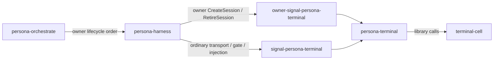
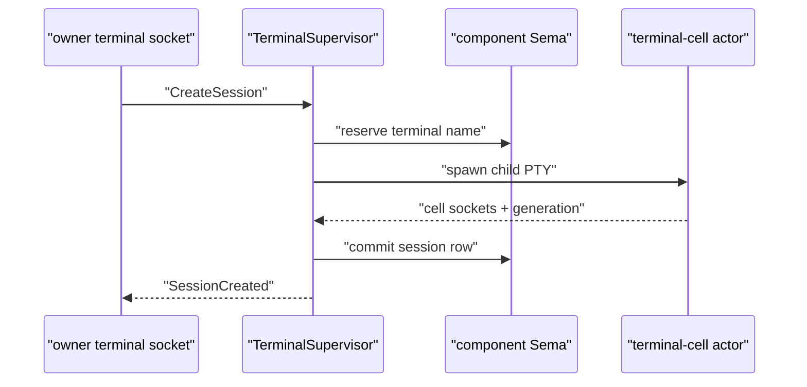

# Owner Terminal Signal Surface

Operator implementation report, 2026-05-17.

## 1 · What changed

I split terminal session lifecycle mutation out of the ordinary terminal
contract.

The new boundary is:



The ordinary terminal contract now owns reads and transport control:

- `TerminalConnection`
- input, resize, capture, detach
- prompt-pattern registration
- input-gate acquisition/release
- write injection
- worker-lifecycle streams
- session registry reads: `ListSessions`, `ResolveSession`

The owner terminal contract owns mutation:

- `CreateSession`
- `RetireSession`
- `SessionCreated`
- `SessionRetired`
- typed owner-only unimplemented replies

## 2 · Repositories touched

| Repository | Commit | Result |
|---|---:|---|
| `owner-signal-persona-terminal` | `9753806f` | New public repo and contract. |
| `signal-persona-terminal` | `f9d4c75d` | Removed session lifecycle mutation from ordinary terminal traffic. |
| `persona-terminal` | `0d0e0d3d` | Added a Kameo owner request path that reaches the owner surface. |
| `persona` | `bb626ee4` | Wired both terminal contracts into the apex flake and architecture. |
| `primary` | pending in this report commit | Added the new owner contract to `protocols/active-repositories.md`. |

## 3 · Runtime shape landed

`persona-terminal` now has a local actor message for owner terminal
requests:

```rust
pub struct TerminalSupervisorOwnerRequest {
    request: OwnerTerminalRequest,
}

impl Message<TerminalSupervisorOwnerRequest> for TerminalSupervisor {
    type Reply = TerminalSupervisorOwnerReply;

    async fn handle(
        &mut self,
        message: TerminalSupervisorOwnerRequest,
        _context: &mut Context<Self, Self::Reply>,
    ) -> Self::Reply {
        self.served_owner_request_count =
            self.served_owner_request_count.saturating_add(1);
        self.last_owner_operation = Some(message.request.operation_kind());
        TerminalSupervisorOwnerReply::new(
            self.event_for_owner_request(message.request),
        )
    }
}
```

The reply wrapper is deliberate. `owner-signal-persona-terminal` remains a
runtime-free contract crate; it does not learn Kameo just because
`persona-terminal` uses Kameo internally.

The current behavior is honest skeleton behavior:

```rust
OwnerTerminalRequestUnimplemented {
    terminal,
    operation: request.operation_kind(),
    reason: OwnerTerminalUnimplementedReason::NotBuiltYet,
}
```

That is not final `CreateSession` / `RetireSession` execution. It proves the
request reaches the correct owner-only runtime surface without reintroducing
ordinary terminal variants.

## 4 · Tests run

`owner-signal-persona-terminal`:

```sh
cargo test --locked -j 2 --test round_trip -- --nocapture
nix --option max-jobs 0 --option cores 2 flake check -L
```

`signal-persona-terminal`:

```sh
cargo test --locked -j 2 --test round_trip -- --nocapture
cargo test --locked -j 2 --test canonical_examples -- --nocapture
nix --option max-jobs 0 --option cores 2 flake check -L
```

`persona-terminal`:

```sh
cargo test --locked -j 2 --test terminal_supervisor -- --nocapture
nix --option max-jobs 0 --option cores 2 flake check -L
```

`persona`:

```sh
nix --option max-jobs 0 --option cores 2 build \
  .#checks.x86_64-linux.signal-persona-terminal \
  .#checks.x86_64-linux.owner-signal-persona-terminal \
  .#checks.x86_64-linux.persona-terminal -L
```

All checks above passed.

## 5 · What is still missing

The owner terminal socket is not implemented yet. The code path is an actor
message witness, not a Unix socket listener.

Real `CreateSession` / `RetireSession` still needs:



There is no owner-socket permission enforcement in this slice. That matches
the current prototype decision: production will need owner/non-owner socket
separation, but the prototype does not need filesystem permission enforcement
yet.

## 6 · Next high-signal work

1. Add the owner terminal socket listener in `persona-terminal`.
2. Implement `CreateSession` by moving the current session-registration
   behavior behind the owner request path.
3. Implement `RetireSession` with typed shutdown ordering and terminal-cell
   cleanup.
4. Add a Persona sandbox witness where orchestrate/harness sends an owner
   `CreateSession`, then ordinary terminal traffic uses the created session.

