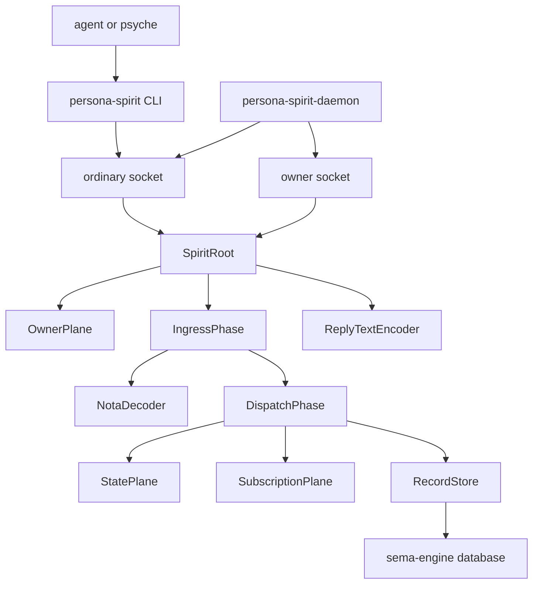

# 136 — persona-spirit current system and remaining gaps

*Operator update after the owner-socket daemon slice.*

Code landing: `/git/github.com/LiGoldragon/persona-spirit` `ecaf880a`.

## 0 · Short Read

`persona-spirit` is now a working raw intent component with:

- typed NOTA request input;
- sema-engine backed record storage;
- Kameo actor planes for text, dispatch, record storage, working state,
  subscriptions, owner lifecycle, and reply projection;
- a daemon with separate ordinary and owner Signal sockets;
- constraint tests for the actor paths and socket boundaries.

It is still not the full Spirit apex. The classifier, bootstrap-policy import,
subscription event push, and owner-Mutate forwarding to mind are still absent.

## 1 · Current Runtime Shape



The one-shot CLI uses the same actor tree, but starts and stops it per
invocation. When `PERSONA_SPIRIT_SOCKET` is set, the CLI decodes one NOTA
`SpiritRequest`, sends a length-prefixed Signal frame to the ordinary socket,
and receives a typed Signal reply.

## 2 · Representative Code Shape

The root actor owns references to the long-lived logic planes:

```rust
pub struct SpiritRoot {
    owner: ActorRef<owner::OwnerPlane>,
    ingress: ActorRef<ingress::IngressPhase>,
    dispatch: ActorRef<dispatch::DispatchPhase>,
    encoder: ActorRef<reply::ReplyTextEncoder>,
}
```

The daemon boundary now separates ordinary and owner traffic by type and socket:

```rust
pub struct DaemonConfiguration {
    pub ordinary_socket_path: SocketPath,
    pub owner_socket_path: SocketPath,
    pub store_path: StorePath,
    pub socket_mode: SocketMode,
}
```

The owner socket never goes through ordinary dispatch. It decodes
`owner_signal_persona_spirit::Frame` and calls `SubmitOwnerRequest`, which
routes to `OwnerPlane`.

## 3 · Constraints Now Covered

The highest-signal constraints are enforced by named tests:

```text
persona_spirit_entry_assertion_runs_through_actor_planes
persona_spirit_state_observation_uses_state_plane
persona_spirit_record_subscription_uses_read_plane_then_subscription_plane
persona_spirit_subscription_retractions_use_subscription_plane
persona_spirit_owner_lifecycle_orders_use_owner_plane
persona_spirit_daemon_serves_signal_frames_through_actor_root
persona_spirit_daemon_serves_owner_signal_frames_through_owner_plane
persona_spirit_ordinary_socket_rejects_owner_signal_frames
persona_spirit_owner_socket_rejects_ordinary_signal_frames
persona_spirit_daemon_rejects_verb_payload_mismatch_before_actor_execution
persona_spirit_client_can_send_nota_request_to_running_daemon
```

These tests are intentionally architectural. They do not only check output; they
also prove the route used to produce that output.

## 4 · What Is Good

The component now has a real triad shape:

- ordinary contract: `signal-persona-spirit`;
- owner contract: `owner-signal-persona-spirit`;
- runtime component: `persona-spirit`.

The internal naming is much cleaner than the earlier intent-prefix attempt:
`Entry`, `Quote`, `Topic`, `Summary`, `StatePlane`, `SubscriptionPlane`,
`OwnerPlane`, `RecordStore`. The repository context already says this is
Spirit intent work, so the types do not carry ancestor names.

The daemon now has hard boundary witnesses. If an owner frame is sent to the
ordinary socket, or an ordinary frame is sent to the owner socket, the server
rejects it before any actor plane can process it.

## 5 · What Is Still Weak

`SubscriptionPlane` opens and retracts subscriptions, but it does not yet push
events. It is a lifecycle/token plane, not a live event stream.

`OwnerPlane` handles start, drain/stop, register identity, and retire identity,
but `ReloadBootstrapPolicyOrder` returns an honest `RequestUnimplemented`.

`RecordStore` still handles only the current entry and query surface. It does
not yet store a refined intent-manifestation graph with multiple verbatim
quotes per restated intent.

There is no Spirit-to-mind forwarding. Spirit does not yet turn accepted intent
into owner-Mutate calls toward `persona-mind`.

## 6 · Next Clear Work

The next slices that do not need new product intent are:

1. Implement `bootstrap-policy.nota` import through `OwnerPlane`.
2. Add subscription event delivery and tests that prove events cross the
   daemon socket as Signal stream frames.
3. Add a refined stored entry model with multiple verbatim references.
4. Add Spirit-to-mind owner-Mutate forwarding once the target contract is ready.

The classifier, contradiction guardian, and richer psyche model still need
design intent before implementation.

## 7 · Verification

Passing locally:

```text
persona-spirit: CARGO_BUILD_JOBS=2 cargo test --locked
persona-spirit: CARGO_BUILD_JOBS=2 cargo clippy --all-targets --locked -- -D warnings
```

Passing through Nix remote builder:

```text
persona-spirit: nix flake check -L --max-jobs 0
```
