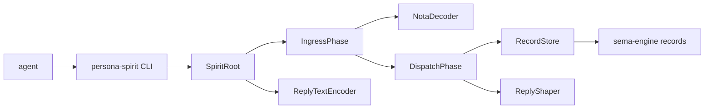
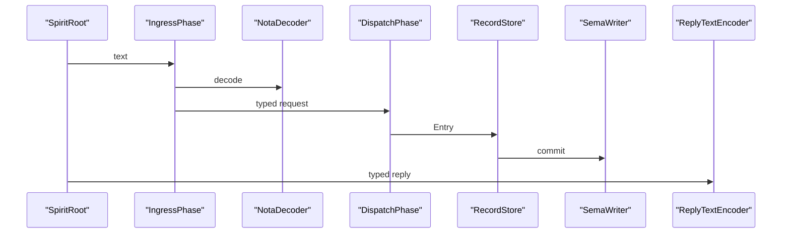

# 136 — persona-spirit current system and remaining gaps

*Operator update after the Kameo actor-path slice.*

## 0 · Short Read

`persona-spirit` is now a usable raw intent component with typed
entry logging, summary/provenance querying, sema-engine persistence,
and a Kameo actor tree on the CLI request path.

It is still not a long-lived daemon socket component. The daemon
binary exists but fails honestly until the socket/config/runtime
surface lands.

Current path:



Example write:

```sh
persona-spirit '(Entry (naming Correction "drop ancestor prefixes" "naming context" Maximum "2026-05-19T15:46:23Z" "names do not carry their full ancestry"))'
```

Reply:

```nota
(RecordAccepted ((1 naming Correction "drop ancestor prefixes" Maximum)))
```

Example query:

```sh
persona-spirit '(RecordObservation ((None SummaryOnly)))'
```

Reply:

```nota
(RecordsObserved ([(1 naming Correction "drop ancestor prefixes" Maximum)]))
```

## 1 · What Changed

Path: `/git/github.com/LiGoldragon/persona-spirit`

The runtime now starts a Kameo tree for each CLI call:

```text
SpiritRoot
  IngressPhase
    NotaDecoder
    DispatchPhase
      RecordStore
      ReplyShaper
  ReplyTextEncoder
```

The important implementation change is that `SpiritClient` no longer
opens `SpiritStore` and dispatches directly. It calls
`SpiritActorRuntime::submit_text_blocking`, so the production CLI path
crosses the same actor planes the future daemon keeps alive.

Representative code shape:

```rust
pub struct SpiritRoot {
    ingress: ActorRef<ingress::IngressPhase>,
    encoder: ActorRef<reply::ReplyTextEncoder>,
}

pub struct RecordStore {
    store: SpiritStore,
}
```

The actor names are not decorative. `RecordStore` owns the
sema-engine store; `NotaDecoder` owns strict-end decoding policy;
`ReplyShaper` owns unimplemented-operation policy; `ReplyTextEncoder`
owns text projection policy.

## 2 · Constraint Tests

New actor-path witnesses:

```text
persona_spirit_entry_assertion_runs_through_actor_planes
persona_spirit_record_observation_uses_read_plane_without_write_plane
persona_spirit_unimplemented_statement_uses_reply_shaper_not_store
persona_spirit_shutdown_releases_store_for_restart
persona_spirit_invalid_text_keeps_typed_decode_error
persona_spirit_command_line_path_uses_actor_runtime
persona_spirit_uses_kameo_as_only_actor_runtime
persona_spirit_actor_types_are_data_bearing
```

Existing boundary/storage witnesses still pass:

```text
persona_spirit_client_asserts_entry_and_mints_record_identifier
persona_spirit_client_persists_entries_for_later_summary_observation
persona_spirit_client_filters_record_observation_by_topic
persona_spirit_client_returns_provenance_only_when_requested
persona_spirit_client_repeated_entries_remain_distinct_records
```

The strongest new tests are trace-based. They prove the actor path,
not only the visible output:



## 3 · Remaining Gaps

Clear next work:

```text
persona-spirit-daemon socket listener
one-argument daemon configuration record
ordinary and owner socket split
owner-signal lifecycle handling
bootstrap-policy.nota first-start import
subscriptions
filesystem projection from database back to intent/*.nota
```

Deferred by intent:

```text
intent classifier
spirit guardian / contradiction adjudication
spirit-to-mind owner calls
```

Those deferred items need the later multi-agent/auditing arc or the
spirit-to-mind contract work. Today's spirit remains dumb storage
driven by typed agent input.

## 4 · Verification

Passing locally:

```text
persona-spirit: cargo test --locked
persona-spirit: cargo clippy --all-targets --locked -- -D warnings
```

Passing through Nix with remote builder:

```text
persona-spirit: nix flake check -L --max-jobs 0
```
