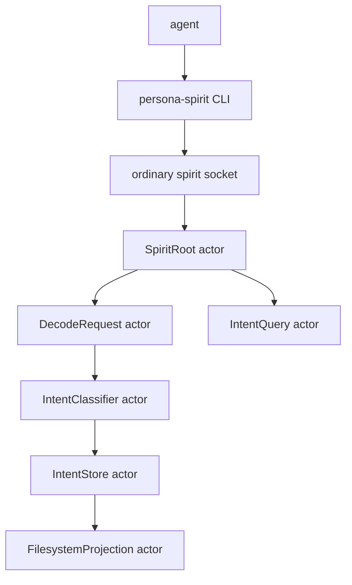

# 136 — persona-spirit current system and intent gaps

*Operator view after the first raw `persona-spirit` slices landed:
what exists, what the near system wants to become, and where clearer
psyche intent would change the next implementation.*

## 0 · Short Read

`persona-spirit` now has a usable type-checking front door, not a
working database-backed intent system.

Current path:

```text
agent
  |
  | one NOTA SpiritRequest argument
  v
persona-spirit CLI
  |
  | decode as signal-persona-spirit::SpiritRequest
  v
typed operation kind
  |
  | no daemon/storage yet
  v
(SpiritRequestUnimplemented <Operation> NotBuiltYet)
```

This is already useful as a grammar/type witness. An agent can now
ask the compiler-owned contract whether its `Entry` shape is
valid NOTA:

```sh
persona-spirit '(Entry workspace Decision "summary only" "current implementation context" Maximum [(Verbatim "2026-05-19T13:08:11Z" "first statement") (Verbatim "2026-05-19T13:12:00Z" "restated statement")])'
```

The current reply is honest:

```nota
(SpiritRequestUnimplemented Entry NotBuiltYet)
```

The important gap is not spirit-to-mind ownership. The current gap is
the storage/query meaning of a typed entry.

## 1 · What Exists Now

### `signal-persona-spirit`

Path: `/git/github.com/LiGoldragon/signal-persona-spirit`

It owns the ordinary peer-callable contract:

```rust
pub struct Verbatim {
    pub timestamp: IntentTimestamp,
    pub quote: IntentQuote,
}

pub struct Entry {
    pub topic: IntentTopic,
    pub kind: IntentKind,
    pub summary: IntentSummary,
    pub context: IntentContext,
    pub certainty: IntentCertainty,
    pub verbatim: Vec<Verbatim>,
}
```

The new request variant is an `Assert`:

```rust
signal_channel! {
    channel Spirit {
        request SpiritRequest {
            Assert PsycheStatement(PsycheStatement),
            Assert Entry(Entry),
            Match PsycheStateObservation(PsycheStateObservation),
            Match IntentRecordObservation(IntentRecordObservation),
            Match ClarificationQuestionPending(ClarificationQuestionPending),
            Subscribe SubscribePsycheState(PsycheStateSubscription) opens PsycheStateStream,
            Retract PsycheStateSubscriptionRetraction(PsycheStateSubscriptionToken),
            Subscribe SubscribeIntentRecords(IntentRecordSubscription) opens IntentRecordStream,
            Retract IntentRecordSubscriptionRetraction(IntentRecordSubscriptionToken),
        }
        /* replies, events, streams */
    }
}
```

Tests prove:

- rkyv frame round trips;
- NOTA text round trips;
- `Entry` is `Assert`;
- stream relations are still generated;
- canonical examples include an `Entry` with two
  `Verbatim` records.

### `persona-spirit`

Path: `/git/github.com/LiGoldragon/persona-spirit`

The CLI now decodes one `SpiritRequest` and emits one typed NOTA
`SpiritReply`. It does not pretend the daemon exists:

```rust
pub fn reply_text(&self) -> Result<String> {
    let request = self.decode_request()?;
    SpiritReplyText::new(SpiritReply::SpiritRequestUnimplemented(
        SpiritRequestUnimplemented {
            operation: request.operation_kind(),
            reason: SpiritUnimplementedReason::NotBuiltYet,
        },
    ))
    .encode()
}
```

Tests prove:

- exactly one CLI argument;
- flag-style argument rejection;
- valid `PsycheStatement` type-checks;
- valid `Entry` with two verbatim references type-checks;
- unknown record shapes fail before any runtime behavior.

## 2 · How I See The System

Spirit is the first component that turns the workspace's current
manual intent discipline into a typed surface. In raw form, it
should do three things before it talks to mind:

```text
1. Accept typed NOTA intent input from agents.
2. Store/query typed intent locally.
3. Project enough filesystem compatibility for agents while the
   old intent/*.nota files retire.
```

The near-term runtime wants this shape:



The storage side wants to be explicit:

```text
Entry
  topic
  kind
  summary
  context
  certainty
  verbatim[]
    timestamp
    quote

Derived/query indexes
  topic -> entry ids
  kind -> entry ids
  latest-verbatim-time -> entry ids
  maybe summary-similarity -> candidate restatements
```

The query side should stay summary-first:

```text
IntentRecordObservation
  mode SummaryOnly
    -> Vec<IntentRecordSummary>

IntentRecordObservation
  mode WithProvenance
    -> Vec<IntentRecordProvenance>
       where provenance includes context + verbatim[]
```

## 3 · What I Do Not See Clearly

### Gap 1 — What is an `Entry`?

There are two plausible meanings:

```text
Meaning A: aggregate record
  Entry is the whole current intent object.
  Restating intent means submitting the same object again with one
  more Verbatim in its vector.

Meaning B: append event
  Entry is one assertion event.
  Spirit decides whether it creates a new canonical intent or appends
  this quote to an existing one.
```

Current code uses the aggregate shape because the latest clear psyche
intent said the verbatim object is a vector of timestamped structs.
But a daemon has to know whether to replace/merge a stored record or
append a new assertion event. That is the strongest missing
implementation intent.

### Gap 2 — How does spirit identify a restatement?

Possible restatement keys:

```text
explicit identifier      agent supplies/chooses the old record id
topic + kind             broad and likely too weak
topic + summary          usable, but fuzzy and agent-synthesized
classifier similarity    spirit decides using LLM context
manual clarification      spirit asks psyche or review agent
```

The current contract has `IntentRecordIdentifier`, but
`Entry` does not carry one. That was intentional caution: agent-
minted identifiers are often wrong, and spirit may need to mint them.
Before durable storage lands, this must be settled enough to avoid
baking identity into the wrong field.

### Gap 3 — Who synthesizes summary and context?

The current CLI accepts an already typed `Entry`, meaning the
agent wrote:

```text
kind + summary + context + certainty + verbatim[]
```

That is useful immediately because agents can type-check their
intent logging. But the longer design says spirit receives
`PsycheStatement` and classifies natural language through an LLM.

So the system has two input lanes:

```text
PsycheStatement
  raw psyche utterance
  spirit classifier creates typed intent

Entry
  agent supplies already typed intent
  spirit validates and stores
```

The unclear part is authority: is an agent-supplied `Entry`
authoritative enough to store directly, or should spirit always treat
it as a proposal needing classifier/review?

### Gap 4 — What is the first durable query surface?

Summary-first is settled. The first query dimensions are not.
Likely enough for the first daemon:

```text
topic: Option<IntentTopic>
mode: SummaryOnly | WithProvenance
```

Missing but likely soon:

```text
kind filter
certainty filter
latest-first ordering
limit
identifier lookup
open clarification questions related to one entry
```

If these are added too early, the contract gets noisy. If added too
late, agents will fall back to grep.

### Gap 5 — How much filesystem projection belongs in the first raw component?

The raw-component principle says components can be used directly
before full integration. For spirit, direct usefulness probably
means either:

```text
daemon-backed only
  agents use persona-spirit CLI for writes and queries
  old intent/*.nota remains separate until migration

daemon plus projection
  spirit writes/updates intent/*.nota as compatibility output
  agents can still inspect the old files
```

Projection may be operationally useful, but it risks reviving the old
filesystem schema as a second source of truth.

## 4 · My Current Implementation Bias

If I continue without more psyche intent, the conservative next
shape is:

```text
Do:
  - implement a daemon-local store for Entry;
  - let spirit mint IntentRecordIdentifier;
  - store every submitted Entry as its own event first;
  - expose summary-first queries by topic;
  - do not merge restatements automatically yet.

Do not:
  - implement spirit-to-mind owner calls;
  - project to intent/*.nota as canonical behavior;
  - ask agents to mint durable record identifiers;
  - perform LLM classification before the classifier prompt/context is
    designed.
```

That would make the system useful while preserving room for the
restatement semantics to become beautiful instead of rushed.

## 5 · Greatest Intent Clarification Needs

These are the questions where psyche intent would materially change
the next implementation, not implementation-order bureaucracy.

1. **Is `Entry` an aggregate record or an assertion event?**
   Should a restatement arrive as a full record with the whole
   `verbatim` vector, or as a new assertion that spirit attaches to
   an existing intent?

2. **Who owns intent identity?**
   Should agents ever provide an `IntentRecordIdentifier`, or should
   spirit always mint identity after deciding whether the entry is new
   or a restatement?

3. **How authoritative is an agent-supplied typed `Entry`?**
   Does spirit store it directly because the agent is the current LLM
   mediation layer, or does spirit treat it as a proposal and run its
   own classifier/review actor before committing?

4. **Should first raw spirit write back to `intent/*.nota` or only
   answer through its CLI?**
   Projection is convenient during migration, but the clean shape is
   one source of truth: spirit's own database.

5. **What is the first query experience agents should rely on?**
   Topic + summary-first may be enough. Identifier lookup and
   provenance mode probably follow. Kind/certainty filters and fuzzy
   search may wait until the store has real usage.

