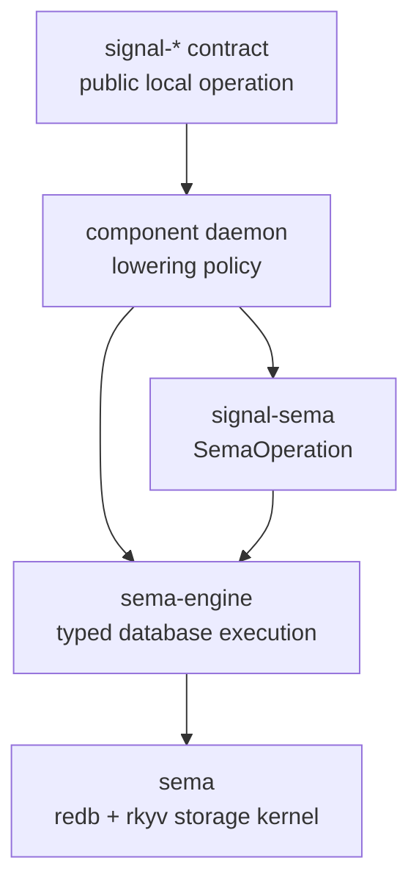

# 137 - signal-sema and sema-engine migration slice

## Context

`reports/designer/238-signal-architecture-redirection-contract-local-verbs.md`
redirects Signal away from universal public verbs. Public component
contracts now own contract-local operation roots such as `Submit`,
`Query`, `Observe`, `Configure`, and `Register`. The old six words
move below that boundary into Sema execution vocabulary.

This slice implements the first engine-side cut of that split.



## Landed

`/git/github.com/LiGoldragon/signal-sema`

- New public repo and remote.
- Defines `SemaOperation`: `Assert`, `Mutate`, `Retract`, `Match`,
  `Subscribe`, `Validate`.
- Defines `OperationClass`: `Write`, `Read`, `Stream`, `Validation`.
- Provides methods on the enum for record-head projection and class
  inspection.
- Includes NOTA example and tests for operation heads, operation classes,
  and unknown-head typed errors.

Commit pushed: `7eac20e1`.

`/git/github.com/LiGoldragon/sema-engine`

- Depends on `signal-sema` by Git HTTPS.
- Uses `SemaOperation` in mutation receipts, query receipts, validation
  receipts, subscription delta kinds, and commit-log operations.
- Updates architecture and local skills so the engine no longer claims
  to execute public Signal verbs.
- Keeps a clearly labeled transitional `signal-core` seam test while
  `signal-core` still exposes `SignalVerb`.
- Adds dependency-boundary checks proving the engine depends on `sema`,
  `signal-core`, and `signal-sema` by Git URL, has no runtime/text
  dependencies, ships no daemon binary, and sees the closed six-operation
  Sema set.

Commit pushed: `27777c21`.

`/home/li/primary/protocols/active-repositories.md`

- Adds `signal-sema` to the active core stack.
- Reframes `sema-engine` as execution over `sema` and `signal-sema`.
- Updates the Wire truth pin so public component contracts use
  contract-local operation roots, while the six database words belong to
  `signal-sema` / `sema-engine`.

## Verification

`signal-sema`

```text
CARGO_BUILD_JOBS=2 cargo test --locked
CARGO_BUILD_JOBS=2 cargo clippy --all-targets --locked -- -D warnings
nix flake check -L --max-jobs 0
```

`sema-engine`

```text
CARGO_BUILD_JOBS=2 cargo test --locked
CARGO_BUILD_JOBS=2 cargo clippy --all-targets --locked -- -D warnings
nix flake check -L --max-jobs 0
```

All checks passed. The Nix checks used the remote builder.

## Remaining gaps

- `signal-core` still has `SignalVerb` and the old public verb-checking
  shape. That is now explicitly transitional.
- Existing contract crates still need the larger migration from public
  `Assert` / `Match` / `Mutate` roots to contract-local roots.
- `sema-engine` still imports `signal_core::NonEmpty`. That is a small
  utility seam today, not a claim that the engine is driven by public
  Signal verbs.
- The lowering layer is still daemon-owned. This slice does not define a
  generic static mapping from contract operations to Sema operations.

## Next implementation pressure

The next high-signal cut is `signal-core`: remove the public
`SignalVerb` spine from the request shape and make the channel macro
emit contract-local operation roots. After that, migrate one narrow
contract plus one daemon as a witness before sweeping every contract.
