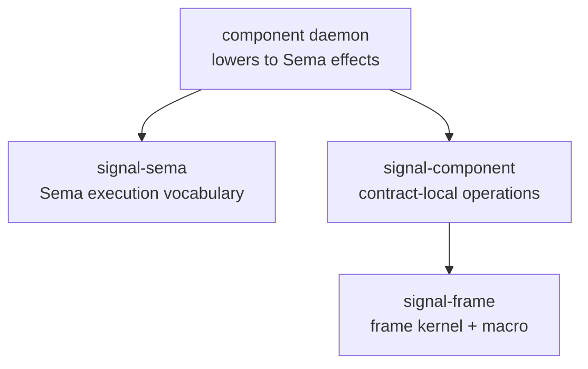

# 138 — Signal-frame macro migration work

Role: operator  
Date: 2026-05-19  
Repos touched: `signal-frame`

## Summary

This slice moved `signal-frame` from "frame layer mostly migrated but
macro unusable" to "macro compiles real contract-local operation
channels and has positive plus compile-fail witnesses."

The load-bearing result:

```rust
signal_channel! {
    channel Message {
        operation Submit(Submission),
        operation Query(InboxQuery),
    }
    reply MessageReply {
        Accepted(Receipt),
        Inbox(Inbox),
    }
}
```

The old shape is now rejected:

```rust
signal_channel! {
    channel Message {
        Assert Submit(Submission),
    }
    reply MessageReply {
        Accepted(Receipt),
    }
}
```

`Assert`, `Mutate`, `Retract`, `Match`, `Subscribe`, and
`Validate` are no longer macro grammar at the public contract
layer. Those words belong to `signal-sema` and the Sema execution
layer.

## What changed

### Macro model

`signal-frame-macros` no longer stores a `verb_keyword` on
request variants and no longer carries a `SIGNAL_VERBS` constant.
The request-side model is now only:

```rust
pub(crate) struct RequestVariantSpec {
    pub(crate) variant_name: Ident,
    pub(crate) payload_type: Type,
    pub(crate) opens: Option<Ident>,
}
```

The variant name is the contract-local operation root.

### Macro parser

The parser now reads the public contract-local operation shape:

```rust
channel Message {
    operation Submit(Submission),
    operation Query(InboxQuery),
}
reply MessageReply {
    Accepted(Receipt),
    Inbox(Inbox),
}
```

The macro derives the generated request enum name from the channel
name (`MessageOperation`) instead of accepting an explicit
`request Request { ... }` block. This matches the new surface where
the channel body is the operation vocabulary.

### Macro validation

Removed checks:

- "request variant's first word must be a SignalVerb"
- "`opens` is only valid on Subscribe"
- "stream close variant must be tagged Retract"

Kept checks:

- duplicate request/reply/event variant names
- duplicate projected NOTA record heads
- stream block requires event block
- event block requires stream block
- every stream is opened by a request operation
- every `opens` reference resolves to a stream
- every `belongs` reference resolves to a stream
- stream `opened` / `event` / `close` references resolve
- stream event cross-reference is symmetric
- stream close operation payload type matches the stream token type

### Macro emitter

The emitter no longer generates:

```rust
fn signal_verb(&self) -> SignalVerb
```

It now emits only the marker impl:

```rust
impl ::signal_frame::RequestPayload for MessageOperation {}
```

Generated NOTA codec shape remains payload-head based:

```nota
(Submit (Submission hello))
[(Submit (Submission first)) (Query (InboxQuery operator))]
```

There is no outer `(Assert ...)` or `(Match ...)` wrapper.

## Witnesses added

Positive macro witnesses:

| Test | What it proves |
|---|---|
| `macro_emits_contract_local_operation_enum_without_signal_verb` | generated request enum works and encodes without SignalVerb |
| `macro_request_text_round_trips_through_contract_local_heads` | multi-operation NOTA request round-trips through payload record heads |
| `macro_frame_alias_round_trips_with_generated_payloads` | generated frame aliases work with rkyv length-prefixed exchange frames |
| `macro_stream_witnesses_are_contract_local_not_subscribe_retract_bound` | stream opening/closing is contract-local, not bound to `Subscribe` / `Retract` |
| `macro_streaming_frame_alias_round_trips` | generated streaming frame aliases work |
| `macro_generated_reply_works_with_positioned_subreply` | generated replies fit `Reply` / `SubReply` positional reply plumbing |

Compile-fail witnesses:

| Fixture | What it rejects |
|---|---|
| `old_verb_tagged_shape.rs` | old `Assert Submit(...)` grammar |
| `orphan_stream.rs` | stream with no request operation opening it |
| `reverse_belongs_mismatch.rs` | stream names an event whose `belongs` points elsewhere |
| `close_payload_mismatch.rs` | close operation payload type does not match stream token |
| `duplicate_record_head.rs` | two payload paths that project to the same NOTA record head |

## Verification

All local and Nix checks passed:

```sh
CARGO_BUILD_JOBS=2 cargo test --locked
CARGO_BUILD_JOBS=2 cargo clippy --all-targets --locked -- -D warnings
nix flake check -L --max-jobs 0
```

The Nix check ran on the remote builder and passed the release test
suite, including `trybuild`.

## Important side fix

`cargo clippy --all-targets -- -D warnings` failed on two hygiene
issues:

- lint priority in `Cargo.toml` / `macros/Cargo.toml`
- `NonEmpty` had `len()` without `is_empty()`

Both were fixed in this slice. `NonEmpty::is_empty()` returns
`false`, because the type's whole invariant is that the empty case is
unrepresentable.

## What remains

The macro foundation is ready for pilot contract migration, but the
workspace is not migrated yet.

Remaining high-signal work:

1. Migrate the pilot contract to `signal-frame`.
2. Migrate component contracts from `signal-core` to `signal-frame`.
3. Keep `signal-sema` only at Sema execution boundaries.
4. Revisit two remaining design smells already noted by design audit:
   `Operation<Payload>` is currently a transparent wrapper, and
   `Request::check()` currently always succeeds. They were not
   removed in this slice because the immediate blocker was the macro
   generating broken code; they still deserve a follow-up decision.

## Current architecture picture



`signal-frame` now has the macro shape needed for the `contract`
node in that diagram. The next proof is a real component contract
using it.
