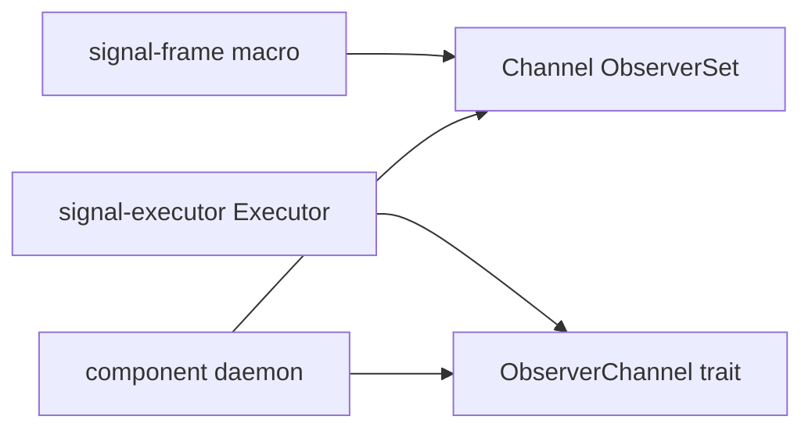
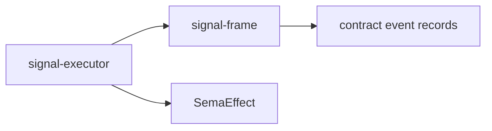
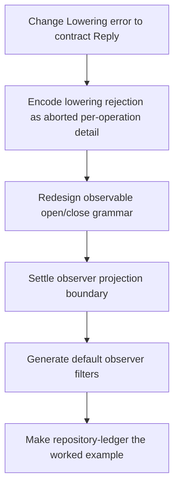

# Signal Frame / Executor Hole Analysis After Designer 244 And 245

Operator analysis of:

- `reports/designer/244-hole-finding-after-243-implementations.md`
- `reports/designer/245-design-alternatives-for-244-holes.md`

This report answers the design holes with current code evidence and a
recommended implementation path.

## Summary

Designer/244 found real holes. Designer/245 improves two of the fixes
substantially, but one proposed simplification is not mechanically
complete yet.

| Hole | Operator read |
|---|---|
| Typed rejection reasons do not cross the wire | Confirmed. 245's `lower() -> Result<Vec<SemaOperation>, Self::Reply>` is the cleaner direction, but it should be encoded as a per-operation failed reply, not as kernel `Reply::Rejected`. |
| Observable verb collision | Confirmed. 245's contract-authored open/close verbs are better than renaming the injected verb to `Probe`. |
| Macro to executor publish bridge | Confirmed. 245's "move `ObserverChannel` to signal-frame and auto-emit impl" is directionally attractive, but incomplete because event construction and `SemaEffect` ownership cross crate boundaries. |
| Filter-match impl is trusted | Confirmed but medium severity. Closed default filters are the right next macro shape. |
| No end-to-end worked example | Confirmed. `signal-repository-ledger` should become the worked example, but its runtime crate must first catch up to the latest contract shape. |

## Tests Run

I ran targeted witnesses rather than editing production code:

```sh
CARGO_BUILD_JOBS=2 cargo test --locked rejection
# in /git/github.com/LiGoldragon/signal-executor
```

This confirms lowering and engine rejection currently produce kernel
`Reply::Rejected { reason: Internal }` while carrying typed detail only in
`ExecutorOutcome`.

```sh
CARGO_BUILD_JOBS=2 cargo test --locked observer
# in /git/github.com/LiGoldragon/signal-executor
```

This confirms executor observer publication is still through the
`ObserverChannel<Operation>` trait.

```sh
CARGO_BUILD_JOBS=2 cargo test --locked observable
CARGO_BUILD_JOBS=2 cargo test --locked channel_macro_rejects_invalid_contract_local_shapes
# in /git/github.com/LiGoldragon/signal-frame
```

This confirms the macro injects `Observe` / `Unobserve`, routes filters
through macro-generated `publish_*` closures, and intentionally rejects a
contract-authored `Observe` when `observable { ... }` is present.

```sh
CARGO_BUILD_JOBS=2 cargo test --locked query_result_reply_round_trips_through_nota
# in /git/github.com/LiGoldragon/signal-repository-ledger
```

This confirms the pilot's reply side is now lifted behind
`QueryResult(QueryResult)`.

## Current Machinery



The split is the core hole. `signal-frame` emits a concrete channel
observer set and per-event publish closures. `signal-executor` wants an
`ObserverChannel<Operation>` trait object with operation/effect publish
methods. A daemon currently has to reconcile them.

## Hole 1 - Typed Rejection Replies

Current code in `signal-executor` is exactly the 244 problem:

```rust
return ExecutorOutcome::LoweringRejected {
    reply: Reply::Rejected {
        reason: RequestRejectionReason::Internal,
    },
    reason,
};
```

The typed rejection reason exists only on the daemon-side
`ExecutorOutcome`. It is not visible to the caller.

245's direction is better than the 244 incremental two-extra-method
shape:

```rust
fn lower(&self, operation: &Self::Operation)
    -> Result<Vec<SemaOperation>, Self::Reply>;
```

The important correction: the executor cannot "just pass the reply
through" as top-level `Reply::Rejected`, because current
`signal-frame::Reply::Rejected` has no payload slot. That is good:
kernel rejection should stay kernel-shaped.

The clean mechanical shape is:

```rust
Err(contract_reply) => Reply::Accepted {
    outcome: AcceptedOutcome::Aborted {
        failed_at: operation_index,
        reason: OperationFailureReason::DomainRejection,
    },
    per_operation: replies_with_failed_detail(contract_reply),
}
```

For a multi-operation request, the executor can construct:

- `Invalidated` for earlier operations, because no atomic commit happened.
- `Failed { reason: DomainRejection, detail: Some(contract_reply) }` at
  the rejected operation.
- `Skipped` for later operations.

That gives the caller the contract's typed `StateRejected(...)`,
`SubmitRejected(...)`, or equivalent, while preserving kernel rejection for
frame-level failures.

Recommendation: implement 245's `Self::Reply` error return, but encode it
as `AcceptedOutcome::Aborted` with `SubReply::Failed.detail`.

## Hole 2 - Observable Verb Collision

Current macro code reserves `Observe` and `Unobserve` globally for every
observable contract. The trybuild fixture confirms the collision:

```text
error: operation `Observe` collides with the `observable` block's auto-injected operation
```

245 is right that renaming the injected operation to `Probe` only moves the
collision. It does not remove the structural problem.

Recommended grammar:

```rust
observable {
    open Watch(Filter);
    close Unwatch;
    filter Filter;
    event OperationReceived;
    event SemaEffectEmitted;
}
```

The macro still owns the token type. The contract author should not write
the close payload type; `close Unwatch;` is enough for the macro to emit:

```rust
operation Watch(Filter) opens ObserverStream
operation Unwatch(ChannelObserverSubscriptionToken)
```

This keeps the contract-local verb rule intact. A contract that needs
`Observe(Selection)` as its own read verb can use `Watch(Filter)` for the
observer stream.

## Hole 3 - Publish Bridge

245 proposes moving `ObserverChannel<Operation>` into `signal-frame` and
having the macro emit the impl. This is attractive, but not complete as
written.

Why: the macro-generated publish methods publish concrete event records:

```rust
publish_operation_received(&OperationReceived, deliver)
publish_sema_effect_emitted(&SemaEffectEmitted, deliver)
```

The executor publishes source facts:

```rust
publish_operation_received(&Operation)
publish_sema_effect_emitted(&SemaEffect)
```

Something must still construct `OperationReceived` from `Operation` and
`SemaEffectEmitted` from `SemaEffect`.

That "something" cannot be purely in `signal-frame` unless one of these
also changes:

1. `signal-frame` owns standardized observer event record types.
2. `signal-frame` defines a generic observer trait over both operation and
   effect types, with event projection supplied elsewhere.
3. `signal-executor`'s `SemaEffect` moves to a lower crate visible from
   `signal-frame`.
4. The macro emits an adapter only after the contract declares a projection
   shape.

The crate-boundary issue matters:



`signal-frame` should not depend on `signal-executor`, so a
`signal-frame::ObserverChannel` trait cannot mention
`signal_executor::SemaEffect` directly.

Recommendation: do not implement 245 hole 3 literally yet. First decide
the observer event projection boundary. My preferred shape is:

- `signal-frame` owns observer subscription/fanout primitives.
- `signal-executor` owns execution facts (`Operation`, `SemaEffect`) and
  the publication ordering.
- A small bridge trait owns projection from execution facts to channel
  event records.
- The macro can generate most of the bridge once the contract declares
  `operation_event <EventType>;` and `effect_event <EventType>;`, but the
  daemon may still need to provide the value constructors.

This is the only 245 alternative I would not hand straight to
implementation without another small design pass.

## Hole 4 - Filter Defaults

The current generated trait is trusted:

```rust
pub trait LedgerObserverFilterMatch {
    fn matches_operation_received(&self, event: &OperationReceived) -> bool;
    fn matches_sema_effect_emitted(&self, event: &SemaEffectEmitted) -> bool;
}
```

That is workable for a prototype, but it makes a leaky filter easy to write.

245's closed-enum default direction is right. I would make it the default
path and require custom filters to be explicit:

```rust
observable {
    open Watch(ObserverFilter);
    close Unwatch;
    filter default;
    event OperationReceived;
    event SemaEffectEmitted;
}
```

The macro emits the standard filter enum and the filter-match impl. A
contract only writes a custom filter when the default menu cannot express
the desired selection.

## Hole 5 - Worked Example

Use `signal-repository-ledger` / `repository-ledger` as the worked example,
not a toy counter daemon.

Current state:

- `signal-repository-ledger` is already the signal-frame pilot.
- Its request and reply surfaces now have the clean lifted shape:
  `Query(Query)` and `QueryResult(QueryResult)`.
- `repository-ledger` is not yet caught up. Its architecture and lock still
  show older `Match` / `*Query` language and an older
  `signal-repository-ledger` pin.

Recommendation:

1. Finish the signal-frame/executor hole fixes in the libraries.
2. Update `signal-repository-ledger` with the final observable grammar.
3. Move `repository-ledger` to the latest contract.
4. Implement the daemon `Lowering`.
5. Add one live test that:
   - opens an observer stream,
   - submits an operation,
   - sees `OperationReceived`,
   - commits through the executor,
   - sees `SemaEffectEmitted`,
   - receives the typed operation reply.

That becomes the Phase-3 component refactor example.

## Bigger Rethinks

### Universal Observability

Keep observability opt-in for now. The bar to opt in should be low for
Persona components, but forcing every tiny contract to carry observer
bookkeeping before the first worked daemon exists is premature.

### Executor In Macro

Do not push the executor into the macro. The macro is already complex, and
executor behavior is runtime orchestration, not type vocabulary emission.
Keep `signal-executor` as a library.

### Drop Kernel Reply

Do not drop kernel `Reply`. Kernel-level failures need a cross-contract
shape. Instead, narrow `Reply::Rejected` to true frame/kernel rejection and
carry domain rejections as typed contract replies inside per-operation
failure detail.

### Contract-Extensible Sema Verbs

Do not make Sema operations contract-extensible yet. No current component
has proven the six-root execution layer is too tight. Wait for a real
forced case.

## Recommended Work Order



I would implement holes 1 and 2 first. Hole 3 should receive one more
design pass because the cleanest version touches crate ownership, not just
macro emission. Hole 4 can land with the observable grammar update. Hole 5
waits until holes 1 through 4 settle enough that the pilot is not built on
transitional API.

