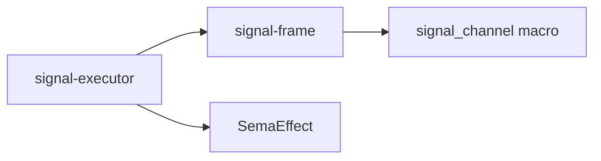
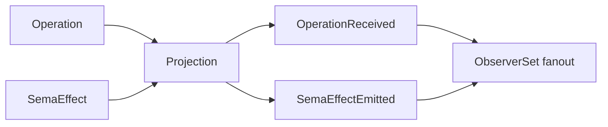
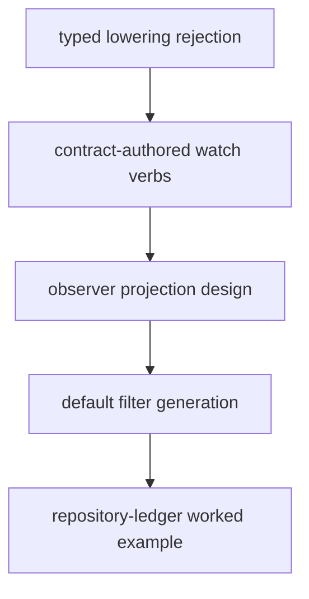

# Signal Frame / Executor Corrections From /140 Versus /245

This report explains the three places where `reports/operator/140-signal-frame-executor-hole-analysis.md`
sharpens `reports/designer/245-design-alternatives-for-244-holes.md`.

It is an operator-side implementation reading: the examples below name the
Rust surfaces that have to compile, the reply shapes that have to cross the
wire, and the test witnesses that should prove the next implementation pass.

The short version:

- Contract-domain rejection is a **per-operation failed reply**, not a
  kernel rejection.
- Observable open/close verbs are **named by the contract**, but the token
  payload remains **owned by the macro**.
- The observer bridge needs a **projection boundary** because
  `signal-frame` cannot know `signal-executor`'s execution facts.

## 1. Typed Rejection Replies

### The wrong shape from /245

Report /245 proposed:

```rust
fn lower(&self, operation: &Self::Operation)
    -> Result<Vec<SemaOperation>, Self::Reply>;
```

That part is right. The wrong part was the phrase "the executor just passes
the reply through" as if the contract reply could become:

```rust
Reply::Rejected { ... contract_reply ... }
```

That cannot compile against the current kernel shape, and it should not be
made to compile.

Current `signal-frame` has:

```rust
pub enum Reply<ReplyPayload> {
    Accepted {
        outcome: AcceptedOutcome,
        per_operation: NonEmpty<SubReply<ReplyPayload>>,
    },
    Rejected {
        reason: RequestRejectionReason,
    },
}
```

`Reply::Rejected` has no payload slot. That is intentional. It is the frame /
kernel rejection surface: malformed request shape, receiver-internal failure
before the operation layer, version skew, decode failure category, and so on.

A domain rejection like `StateRejected(PolicyDenied)` is not a kernel
rejection. It belongs to the channel's typed reply vocabulary.

### The corrected shape

Keep /245's cleaner `Lowering` shape:

```rust
pub trait Lowering {
    type Operation: RequestPayload;
    type Reply;

    fn lower(&self, operation: &Self::Operation)
        -> Result<Vec<SemaOperation>, Self::Reply>;

    fn reply_from_effects(
        &self,
        operation: &Self::Operation,
        effects: &[SemaEffect],
    ) -> Self::Reply;
}
```

On `Err(contract_reply)`, the executor returns a kernel `Reply::Accepted`
whose accepted outcome is aborted:

```rust
Reply::Accepted {
    outcome: AcceptedOutcome::Aborted {
        failed_at,
        reason: OperationFailureReason::DomainRejection,
    },
    per_operation,
}
```

The typed domain rejection rides here:

```rust
SubReply::Failed {
    reason: OperationFailureReason::DomainRejection,
    detail: Some(contract_reply),
}
```

So the caller sees a normal frame-layer reply that says:

- the frame was accepted and understood;
- operation execution aborted at a specific operation index;
- the domain-specific reason is in the failed operation's typed reply detail.

### Single-operation example

Contract reply vocabulary:

```rust
pub enum SpiritReply {
    Stated(Stated),
    StateRejected(StateRejection),
}

pub enum StateRejection {
    PsycheMissing,
    StatementMalformed,
    PolicyDenied,
}
```

Lowering:

```rust
impl Lowering for SpiritLowering {
    type Operation = SpiritOperation;
    type Reply = SpiritReply;

    fn lower(&self, operation: &SpiritOperation)
        -> Result<Vec<SemaOperation>, SpiritReply>
    {
        match operation {
            SpiritOperation::State(statement) if !self.policy.accepts(statement) => {
                Err(SpiritReply::StateRejected(StateRejection::PolicyDenied))
            }
            SpiritOperation::State(statement) => {
                Ok(vec![self.entry_assertion(statement)])
            }
        }
    }
}
```

Reply produced by the executor:

```rust
Reply::Accepted {
    outcome: AcceptedOutcome::Aborted {
        failed_at: 0,
        reason: OperationFailureReason::DomainRejection,
    },
    per_operation: NonEmpty::single(SubReply::Failed {
        reason: OperationFailureReason::DomainRejection,
        detail: Some(SpiritReply::StateRejected(StateRejection::PolicyDenied)),
    }),
}
```

That is the contract-local reply language crossing the wire. No typed meaning
is lost behind `RequestRejectionReason::Internal`.

### Multi-operation example

Input:

```rust
[
    SpiritOperation::Record(record),
    SpiritOperation::State(bad_statement),
    SpiritOperation::Query(query),
]
```

If `Record` lowers successfully but `State` returns
`Err(SpiritReply::StateRejected(...))`, the engine is never called. No durable
state was committed.

The reply should be:

```rust
Reply::Accepted {
    outcome: AcceptedOutcome::Aborted {
        failed_at: 1,
        reason: OperationFailureReason::DomainRejection,
    },
    per_operation: [
        SubReply::Invalidated,
        SubReply::Failed {
            reason: OperationFailureReason::DomainRejection,
            detail: Some(SpiritReply::StateRejected(StateRejection::PolicyDenied)),
        },
        SubReply::Skipped,
    ],
}
```

The earlier operation is `Invalidated`: it had been admitted into the request's
lowering sequence, but the whole request did not commit. The failed operation
carries typed detail. Later operations are `Skipped`.

One small follow-up: `signal-frame`'s `SubReply::Invalidated` docs currently
lean toward "operation ran but its result is no longer authoritative." For
this use, it also covers "operation was planned/lowered but invalidated before
commit." That doc should be widened or a more precise variant should be
introduced if that wording feels too elastic.

### Engine rejection stays kernel-shaped

If `SemaEngine::execute_atomic` returns an infrastructure error, the executor
does not have a contract-domain reply. That path can remain:

```rust
Reply::Rejected {
    reason: RequestRejectionReason::Internal,
}
```

The typed engine error stays daemon-side in `ExecutorOutcome::EngineRejected`.
The caller learns "receiver failed internally"; the daemon logs the typed
engine failure.

## 2. Observable Open / Close Grammar

### The current collision

The current macro injects:

```rust
operation Observe(Filter)
operation Unobserve(ObserverSubscriptionToken)
```

That collides with a contract that legitimately wants:

```rust
operation Observe(Selection)
```

The trybuild witness currently proves the collision:

```text
error: operation `Observe` collides with the `observable` block's auto-injected operation
```

Renaming the macro's injected verb to `Probe` only moves the problem. Some
future contract will want `Probe`, `Tap`, or whichever universal word the macro
chooses. A contract-local verb system should not reserve a common verb at the
macro level.

### The corrected grammar

The contract author names the observer open and close verbs:

```rust
observable {
    open Watch(ObserverFilter);
    close Unwatch;
    filter ObserverFilter;
    event OperationReceived;
    event SemaEffectEmitted;
}
```

The macro owns the token payload. The author writes `close Unwatch;`, not
`close Unwatch(ObserverSubscriptionToken);`.

The macro emits:

```rust
operation Watch(ObserverFilter) opens ObserverStream
operation Unwatch(LedgerObserverSubscriptionToken)
```

The generated close operation payload is correct by construction because the
macro generated the token type.

### Spirit example

Spirit may need its own domain read verb:

```rust
signal_channel! {
    channel Spirit {
        operation State(Statement),
        operation Observe(Selection),
    }
    reply Reply {
        Stated(Stated),
        QueryResult(QueryResult),
    }
    observable {
        open Watch(ObserverFilter);
        close Unwatch;
        filter ObserverFilter;
        event OperationReceived;
        event SemaEffectEmitted;
    }
}
```

This reads cleanly:

- `Observe(Selection)` means "do a domain observation/read."
- `Watch(ObserverFilter)` means "open a live observer stream."
- `Unwatch(token)` means "close that observer stream."

No macro-reserved operation name blocks the contract's own verb vocabulary.

### Why the macro should own the token

The observer token is not a domain record. It is a stream-control capability
created by the generated observer machinery.

If the author writes the token payload type manually:

```rust
operation_close Unwatch(ObserverToken)
```

then the author can choose the wrong token type, duplicate the token record,
or create a token shape that the generated observer set does not understand.

The better surface is:

```rust
close Unwatch;
```

That says exactly what the author owns: the verb. The macro owns the payload.

## 3. Observer Bridge Crate Boundary

### Why /245's move is incomplete

Report /245 proposed:

> Move `ObserverChannel<Operation>` from `signal-executor` to
> `signal-frame`. The macro emits the impl automatically.

The direction is understandable: the macro already emits
`LedgerObserverSet`, so it feels like it should also emit the executor-facing
trait impl.

The problem is dependency direction.



`signal-executor` depends on `signal-frame`. `signal-frame` cannot depend on
`signal-executor` without creating a cycle. But the executor-side publication
fact includes `SemaEffect`, which lives in `signal-executor` today:

```rust
fn publish_sema_effect_emitted(&self, effect: &SemaEffect);
```

So a trait in `signal-frame` cannot honestly mention that effect type.

### Two different surfaces are being conflated

The macro-generated observer set publishes **channel event records**:

```rust
publish_operation_received(&OperationReceived, deliver)
publish_sema_effect_emitted(&SemaEffectEmitted, deliver)
```

The executor publishes **execution facts**:

```rust
operation_received(&Operation)
sema_effect_emitted(&SemaEffect)
```

Those are not the same thing. A projection step is missing.



### Correct ownership split

The cleaner split is:

| Crate | Owns |
|---|---|
| `signal-frame` | Frame reply/request shapes, stream token/fanout primitives, macro-generated observer set. |
| `signal-executor` | Execution ordering, `Lowering`, `SemaEngine`, `SemaEffect`, executor publication moments. |
| Contract crate | Channel event records: `OperationReceived`, `SemaEffectEmitted`, filter shape. |
| Daemon or bridge | Projection from executor facts into channel event records. |

The bridge is the missing layer.

### Possible bridge trait

The bridge can be small:

```rust
pub trait ObservationProjection {
    type Operation;
    type OperationEvent;
    type EffectEvent;

    fn operation_event(&self, operation: &Self::Operation) -> Self::OperationEvent;
    fn effect_event(&self, effect: &SemaEffect) -> Self::EffectEvent;
}
```

Then an executor-facing observer can be built from:

- a generated `LedgerObserverSet`,
- a projection impl,
- a delivery function that writes event frames to subscribers.

Sketch:

```rust
pub struct FrameObserverBridge<Projection, ObserverSet, Deliver> {
    projection: Projection,
    observer_set: ObserverSet,
    deliver: Deliver,
}

impl<Projection, Deliver> ObserverChannel<LedgerOperation>
    for FrameObserverBridge<Projection, LedgerObserverSet, Deliver>
where
    Projection: ObservationProjection<
        Operation = LedgerOperation,
        OperationEvent = OperationReceived,
        EffectEvent = SemaEffectEmitted,
    >,
    Deliver: ObserverDelivery,
{
    fn publish_operation_received(&self, operation: &LedgerOperation) {
        let event = self.projection.operation_event(operation);
        self.observer_set.publish_operation_received(&event, |token, event| {
            self.deliver.deliver(token, LedgerEvent::OperationReceived(event.clone()));
        });
    }

    fn publish_sema_effect_emitted(&self, effect: &SemaEffect) {
        let event = self.projection.effect_event(effect);
        self.observer_set.publish_sema_effect_emitted(&event, |token, event| {
            self.deliver.deliver(token, LedgerEvent::SemaEffectEmitted(event.clone()));
        });
    }
}
```

This sketch names the missing objects. The exact borrow/clone shape can be
made nicer in implementation, but the separation is the point:

- executor calls publish moments;
- projection creates channel events;
- frame observer set filters and fans out;
- delivery writes frames.

### Macro support

The macro can help if the observable block names the event roles:

```rust
observable {
    open Watch(ObserverFilter);
    close Unwatch;
    filter ObserverFilter;
    operation_event OperationReceived;
    effect_event SemaEffectEmitted;
}
```

Then the macro knows:

- which event belongs to operation publication;
- which event belongs to effect publication;
- which stream both events belong to;
- which observer set method names to emit.

The macro still should not invent the values. It can generate the bridge
shape, while the daemon supplies projection methods or constructors:

```rust
impl OperationReceived {
    pub fn from_operation(operation: &LedgerOperation) -> Self { ... }
}

impl SemaEffectEmitted {
    pub fn from_effect(effect: &SemaEffect) -> Self { ... }
}
```

## Implementation Consequences

### Package 1 - rejection semantics

Change `signal-executor`:

- `Lowering` drops `RejectionReason`.
- `lower()` returns `Result<Vec<SemaOperation>, Self::Reply>`.
- Lowering rejection returns `Reply::Accepted { outcome: Aborted, ... }`.
- Tests assert the typed contract rejection appears in
  `SubReply::Failed.detail`.

Test names:

```text
lowering_rejection_returns_typed_failed_subreply
multi_operation_lowering_rejection_invalidates_skips_and_fails
kernel_rejection_does_not_carry_contract_reply
```

### Package 2 - observable grammar

Change `signal-frame` macro:

- `observable` requires `open <Verb>(<FilterType>);`.
- `observable` requires `close <Verb>;`.
- macro emits close payload token automatically.
- collision checks use the author-chosen open/close names.

Test names:

```text
observable_open_and_close_verbs_are_contract_authored
observable_close_payload_is_macro_owned_token
observable_allows_domain_observe_operation_when_watch_is_open_verb
```

### Package 3 - projection bridge

Do one more design pass before code. The unresolved design choice is where
the bridge type lives:

- in `signal-executor`, parameterized by frame-side generated types;
- in a tiny bridge crate that depends on `signal-frame` and
  `signal-executor`;
- emitted partly by the macro with a daemon-supplied projection impl.

My current preference is a tiny bridge crate only if two real daemons need the
same adapter pattern. Until then, keep the bridge shape in the first worked
daemon and extract only after repetition appears.

Test names:

```text
executor_operation_fact_projects_to_observer_event
executor_effect_fact_projects_to_observer_event
observer_bridge_delivers_only_matching_subscriptions
```

## Final Recommendation

Implement the fixes in this order:



The first two are ready. The third needs a small design pass because the
simple /245 move would put `signal-frame` in the wrong dependency position.
The fourth should land with the observable grammar update. The fifth should
wait until the libraries stop moving under the pilot.
