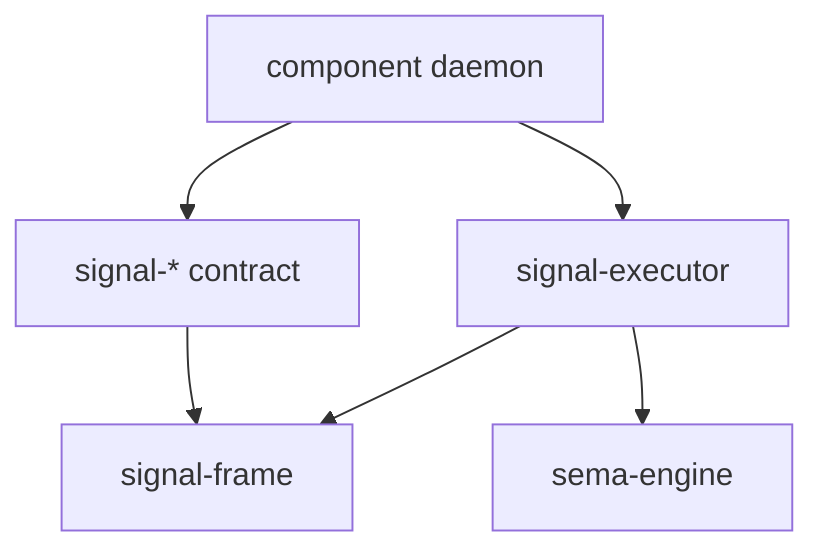
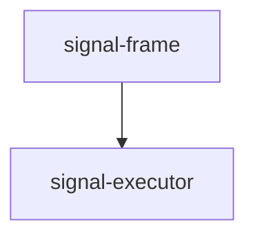

# Signal Frame / Executor Bundled Fix Logic Probe

This report updates the operator read from
`reports/operator/141-signal-frame-executor-correction-examples.md` after
reading `reports/designer/246-v2-bundled-fix-deep-design-with-examples.md`.

The psyche's rule for this pass is explicit: ignore implementation cost.
The better long-term logic wins.

The conclusion:

- `/246-v2` is more elegant than `/141` in its general direction.
- `/246-v2` contains a contradiction: its TL;DR says kernel `Reply::Rejected`
  narrows to true frame-level failures, but the executor sketch still returns
  kernel rejection for engine failure.
- The most elegant final shape is sharper than `/246-v2` as written: separate
  operation aborts from batch aborts, use typed command plans instead of
  `Vec<SemaOperation>` plus owner sidecars, and keep observation projection as
  an extension trait rather than widening every `Lowering`.

I tested the refined shape in a standalone Rust model:
`/tmp/signal-frame-executor-246-probe/model.rs`.

All probe tests passed:

```text
domain_rejection_uses_operation_abort_without_kernel_rejection ... ok
engine_rejection_uses_batch_abort_without_fake_failed_index ... ok
execution_plan_replaces_owner_sidecar ... ok
observed_lowering_projects_without_frame_executor_dependency_cycle ... ok
```

## 1. What `/246-v2` Gets Right

### 1.1 Kernel rejection narrows to kernel failure, in principle

The old `/141` report said:

```rust
Reply::Rejected {
    reason: RequestRejectionReason::Internal,
}
```

for a `SemaEngine::execute_atomic` infrastructure failure.

That was too coarse. It hid too much behind the kernel rejection surface.

The cleaner rule:

| Failure point | Reply layer | Why |
|---|---|---|
| Decode, version, malformed frame | `Reply::Rejected` | The receiver cannot honestly operate on the frame. |
| Contract lowering rejection | `Reply::Accepted` + operation abort | The frame and operation were understood; domain logic rejected one operation. |
| Engine atomic failure after lowering | `Reply::Accepted` + batch abort | The frame was understood, but the atomic batch could not commit. |

This leaves `Reply::Rejected` as the frame/kernel failure surface. Everything
after request acceptance remains on the accepted-execution surface.

### 1.2 Contract rejection belongs in the failed sub-reply

This part stays exactly right:

```rust
SubReply::Failed {
    reason: OperationFailureReason::DomainRejection,
    detail: Some(contract_reply),
}
```

The typed contract reply should not be squeezed into a kernel error. It belongs
to the failed operation.

### 1.3 Observable open and close verbs belong to the contract

This is also settled:

```rust
observable {
    open Watch(ObserverFilter);
    close Unwatch;
    filter default;
    operation_event OperationReceived;
    effect_event SemaEffectEmitted;
}
```

The contract author owns `Watch` and `Unwatch`. The macro owns the token payload
for the close operation. That is the clean split:

- domain owns words;
- generated stream machinery owns capabilities.

### 1.4 Projection is a separate concern

`/246-v2` now correctly rejects folding observer projection into the base lowering
path. Execution and observation touch the same operation type, but they are not
the same concern.

Execution:

```rust
trait Lowering {
    type Operation;
    type Reply;
    type Command;

    fn lower(&self, operation: &Self::Operation)
        -> Result<OperationPlan<Self::Command>, Self::Reply>;

    fn reply_from_effects(
        &self,
        operation: &Self::Operation,
        effects: &[SemaEffect],
    ) -> Self::Reply;
}
```

Observation:

```rust
trait ObservationProjection {
    type Operation;
    type OperationEvent;
    type EffectEvent;

    fn operation_event(&self, operation: &Self::Operation)
        -> Self::OperationEvent;

    fn effect_event(&self, effect: &SemaEffect)
        -> Self::EffectEvent;
}
```

That is cleaner than making every `Lowering` carry observation associated
types.

## 2. Sharpening `/246-v2`: Operation Abort Versus Batch Abort

`/246-v2` is internally split. Its TL;DR says kernel `Reply::Rejected` narrows
to true frame-level failure, but its executor sketch still says engine rejection
returns:

```rust
Reply::Rejected {
    reason: RequestRejectionReason::Internal,
}
```

The TL;DR is the better long-term logic. The sketch should be corrected.

An engine failure is still not the same kind of abort as a contract operation
failure.

The problem is the indexed shape:

```rust
AcceptedOutcome::Aborted {
    failed_at: 0,
    reason: OperationFailureReason::EngineRejection,
}
```

For an engine failure after all operations lowered successfully, `failed_at: 0`
is a fake witness. Nothing about operation 0 failed at the contract layer. The
batch failed as a batch.

The more correct shape:

```rust
pub enum AcceptedOutcome {
    Committed,
    OperationAborted {
        failed_at: usize,
        reason: OperationFailureReason,
    },
    BatchAborted {
        reason: BatchFailureReason,
    },
}
```

Then the failure reasons can stay honest:

```rust
pub enum OperationFailureReason {
    DomainRejection,
}

pub enum BatchFailureReason {
    EngineRejected,
}
```

This avoids stringly or index-faked typing. Operation failure and batch failure
are different variants because they are different facts.

### 2.1 Domain rejection example

Input:

```rust
[
    Operation::Good("first"),
    Operation::Bad("policy-denied"),
    Operation::Query("later"),
]
```

Reply:

```rust
Reply::Accepted {
    outcome: AcceptedOutcome::OperationAborted {
        failed_at: 1,
        reason: OperationFailureReason::DomainRejection,
    },
    per_operation: vec![
        SubReply::Invalidated,
        SubReply::Failed {
            reason: OperationFailureReason::DomainRejection,
            detail: Some(ContractReply::Rejected("policy-denied")),
        },
        SubReply::Skipped,
    ],
}
```

This is an operation abort. The failed operation index is real.

### 2.2 Engine rejection example

Input:

```rust
[
    Operation::Good("first"),
    Operation::Query("second"),
]
```

All operations lower. Then the engine rejects the atomic commit.

Reply:

```rust
Reply::Accepted {
    outcome: AcceptedOutcome::BatchAborted {
        reason: BatchFailureReason::EngineRejected,
    },
    per_operation: vec![
        SubReply::Invalidated,
        SubReply::Invalidated,
    ],
}
```

No `failed_at`. No operation is blamed for an engine failure.

If `Invalidated` feels too broad here, add a future sub-reply variant such as
`Uncommitted`. But do not use a fake failed index.

## 3. Sharpening `/246-v2`: Observation As An Extension Trait

`/246-v2` is already improved from the earlier version because projection is
separate from `Lowering`. The final API should preserve that separation even
when the macro generates compile-time witnesses.

The cleanest Rust shape is:

```rust
trait Lowering {
    type Operation;
    type Reply;
    type Command;

    fn lower(&self, operation: &Self::Operation)
        -> Result<OperationPlan<Self::Command>, Self::Reply>;

    fn reply_from_effects(
        &self,
        operation: &Self::Operation,
        effects: &[SemaEffect],
    ) -> Self::Reply;
}

trait ObservedLowering: Lowering {
    type OperationEvent;
    type EffectEvent;

    fn project_operation(&self, operation: &Self::Operation)
        -> Self::OperationEvent;

    fn project_sema_effect(&self, effect: &SemaEffect)
        -> Self::EffectEvent;
}
```

Why this is better than placing projection on base `Lowering`:

- non-observable daemons do not carry unused associated types;
- tests can require observation only when a contract declares `observable`;
- the compiler still checks the relationship when the macro emits a
  channel-specific extension witness.

Macro-generated witness shape:

```rust
pub trait LedgerObservedLowering:
    ObservedLowering<
        Operation = LedgerOperation,
        Reply = Reply,
        OperationEvent = OperationReceived,
        EffectEvent = SemaEffectEmitted,
    >
{}

impl<T> LedgerObservedLowering for T
where
    T: ObservedLowering<
        Operation = LedgerOperation,
        Reply = Reply,
        OperationEvent = OperationReceived,
        EffectEvent = SemaEffectEmitted,
    >
{}
```

The executor can then compose projection with a frame-side fanout primitive
without reversing dependencies:

```rust
trait ObserverFanout<OperationEvent, EffectEvent> {
    fn publish_operation(&mut self, event: OperationEvent);
    fn publish_effect(&mut self, event: EffectEvent);
}
```

`signal-frame` can own this kind of generic fanout surface because it does not
mention `SemaEffect`. `signal-executor` owns `SemaEffect`, calls projection,
then hands already-projected event records to the fanout.

## 4. A Completely Different Approach?

The psyche asked whether we should consider a totally different approach:
different repositories, different engine, and so on.

Ignoring implementation cost, I see three credible alternatives.

### 4.1 Collapse everything into one runtime crate

One option is to merge `signal-frame`, `signal-executor`, observer fanout, and
macro-generated channel runtime into a single `signal-runtime` crate.

This is superficially elegant because every dependency problem disappears.
The runtime sees frames, executor facts, Sema effects, observers, and channel
records in one place.

I reject this as the long-term logic. It solves crate-boundary friction by
destroying the boundaries. The result would be easier to wire and harder to
reason about. Contracts, frames, execution, and observation are different
logical planes. Persona is trying to make those planes explicit, not hide them
inside a large convenience crate.

### 4.2 Put the executor inside `sema-engine`

Another option is to make `sema-engine` receive contract operations directly
and own lowering, batch execution, replies, and observation.

I reject this too. `sema-engine` should know how to apply durable state
commands and report effects. It should not know every contract's operation
vocabulary or reply language. That would make Sema the owner of domain
semantics, which is the opposite of contract-local language.

### 4.3 Replace `Vec<SemaOperation>` with typed execution plans

This is the better different approach.

`/246-v2` says:

```rust
fn lower(&self, operation: &Self::Operation)
    -> Result<Vec<SemaOperation>, Self::Reply>;
```

It then needs:

```rust
let mut sema_op_owners: Vec<usize> = Vec::new();
```

to remember which request operation produced each lowered Sema operation.

That sidecar owner vector is a smell. Ownership belongs in the execution plan,
not in a parallel positional vector.

The cleaner engine boundary:

```rust
pub trait Lowering {
    type Operation;
    type Reply;
    type Command;

    fn lower(
        &self,
        operation: &Self::Operation,
    ) -> Result<OperationPlan<Self::Command>, Self::Reply>;

    fn reply_from_effects(
        &self,
        operation: &Self::Operation,
        effects: &[SemaEffect],
    ) -> Self::Reply;
}

pub struct OperationPlan<Command> {
    pub commands: NonEmpty<Command>,
}

pub struct BatchPlan<Command> {
    pub operations: NonEmpty<OperationPlan<Command>>,
}
```

If an operation can legitimately lower to zero commands, make that explicit
with a variant:

```rust
pub enum OperationPlan<Command> {
    Commands(NonEmpty<Command>),
    Noop,
}
```

Do not hide that semantic fact behind an empty `Vec`.

The command type is contract or daemon local:

```rust
pub enum SpiritCommand {
    AssertEntry(EntryRecord),
    MatchEntries(EntryReadPlan),
    RetractEntry(EntryKey),
}
```

`SemaOperation` remains the operation-class projection for observation:

```rust
impl SpiritCommand {
    pub fn operation_class(&self) -> SemaOperation {
        match self {
            Self::AssertEntry(_) => SemaOperation::Assert,
            Self::MatchEntries(_) => SemaOperation::Match,
            Self::RetractEntry(_) => SemaOperation::Retract,
        }
    }
}
```

This is a different engine boundary, not a different whole engine. It preserves
the repository split while replacing the weakest internal abstraction.

### 4.4 Recommended repository split

Do not create a giant replacement runtime. Do sharpen the existing split:

| Repository | Long-term responsibility |
|---|---|
| `signal-frame` | Wire frame types, accepted/rejected reply envelope, observer token/fanout primitives, channel macro. |
| `signal-executor` | Batch planning, lowering orchestration, operation and batch abort semantics, execution-to-reply correlation, observation projection bridge. |
| `sema-engine` | Durable state command execution, operation log, effects, snapshot semantics. No contract reply language. |
| `signal-*` contract repos | Contract operation, reply, event, filter, and stream vocabulary. |
| Component daemon repos | Implement lowering, projection, delivery, and policy. |

The only new repository I would consider later is `signal-observe` if observer
fanout grows large enough to deserve its own crate. Do not create it before
there are two real observer integrations repeating the same code.

## 5. Dependency Direction

The durable dependency graph should be:



What must not happen:



`signal-frame` cannot know executor facts. It can own frame and fanout
primitives. `signal-executor` owns execution facts and calls projection.

## 6. Code Probe

Probe location:

```text
/tmp/signal-frame-executor-246-probe/model.rs
```

Command:

```sh
rustc --edition=2024 --test /tmp/signal-frame-executor-246-probe/model.rs \
  -o /tmp/signal-frame-executor-246-probe/model-test
/tmp/signal-frame-executor-246-probe/model-test
```

Results:

```text
running 4 tests
test domain_rejection_uses_operation_abort_without_kernel_rejection ... ok
test engine_rejection_uses_batch_abort_without_fake_failed_index ... ok
test execution_plan_replaces_owner_sidecar ... ok
test observed_lowering_projects_without_frame_executor_dependency_cycle ... ok

test result: ok. 4 passed; 0 failed
```

The probe demonstrated four things:

1. Domain rejection can carry a typed contract reply without using kernel
   rejection.
2. Engine rejection can be represented as a batch abort without inventing a
   failed operation index.
3. An execution plan can carry operation ownership structurally, replacing the
   positional `sema_op_owners` sidecar.
4. Observation projection can compile as an extension trait without making
   `signal-frame` depend on `signal-executor`.

## 7. Recommendation

Adopt `/246-v2` as the better long-term direction over `/141`, with these
refinements:

1. Replace the single `Aborted { failed_at, reason }` outcome with separate
   `OperationAborted { failed_at, reason }` and `BatchAborted { reason }`
   outcomes.
2. Replace `Vec<SemaOperation>` plus `sema_op_owners` with typed
   `OperationPlan<Command>` and `BatchPlan<Command>`.
3. Keep observation projection as an optional extension trait
   (`ObservedLowering` or `ObservationProjection`) rather than expanding the
   base `Lowering` trait.

Implementation order:

1. `signal-frame`: introduce the split accepted outcome and tighten
   `Reply::Rejected` docs to kernel failures only.
2. `signal-executor`: introduce typed command plans; encode lowering failure
   as `OperationAborted`, engine failure as `BatchAborted`.
3. `signal-frame` macro: land author-named observable open/close verbs and
   macro-owned close-token payload.
4. `signal-frame` macro plus `signal-executor`: land default observer filters
   and projection/fanout bridge witnesses.
5. `signal-repository-ledger` plus `repository-ledger`: become the worked
   example only after the library surfaces stop moving.

One more naming correction for `/246-v2`: `Lowering::EngineError` is not
needed unless lowering itself owns engine execution. The engine error belongs
to the engine or executor path and should feed `BatchFailureReason`, not the
contract lowering trait.
