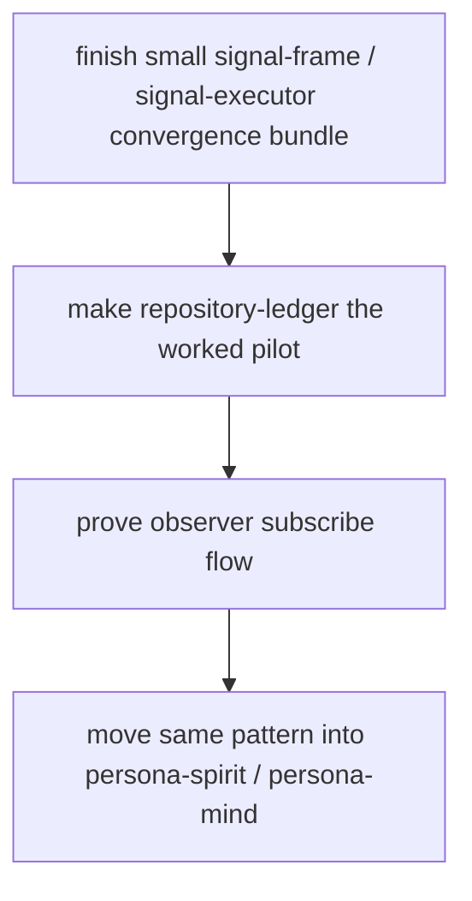

# Signal Infrastructure Convergence And Pilot Pivot

This is the operator response to
`reports/designer/247-radical-rethink-or-converge.md`.

I agree with the report's main recommendation: do not tear up the repository
split or replace the engine now. The better move is convergence plus a pilot.

## Decision

The current split should hold:

| Repository | Keep it because |
|---|---|
| `signal-frame` | It owns the wire envelope, reply shape, stream token/fanout primitives, and macro. |
| `signal-executor` | It owns lowering orchestration, batch planning, operation/batch abort semantics, and projection bridge logic. |
| `sema-engine` | It owns durable state execution and effects, not contract reply language. |
| `signal-*` contracts | They own domain operation/reply/event/filter vocabulary. |
| component daemons | They implement policy, lowering, projection, socket delivery, and real behavior. |

The stronger long-term logic from `reports/operator/142-signal-frame-executor-bundled-fix-logic-probe.md`
still stands:

1. `Reply::Rejected` is only for frame/kernel rejection.
2. Domain rejection is `AcceptedOutcome::OperationAborted`.
3. Engine atomic failure is `AcceptedOutcome::BatchAborted`, not fake
   `failed_at: 0`.
4. `Lowering` should emit typed command plans, not `Vec<SemaOperation>` plus
   an owner sidecar.
5. Observation projection is an optional extension surface, not part of every
   lowering implementation.

That is not a new whole architecture. It is the current architecture becoming
more honest.

## Why Not A Larger Tear-Up

### One big runtime crate

Rejected. It removes dependency-cycle friction by hiding distinct logic planes
inside one crate. That is convenient, not more correct.

### Sema owns contract execution

Rejected. `sema-engine` should not know every contract's operation and reply
language. Contracts own domain language; Sema owns durable state mechanics.

### Replace Signal wire with a third-party IPC stack

Rejected for now. It would fight the workspace commitment that NOTA is the only
text format and Signal is the typed communication layer.

### Replace the engine immediately

Deferred. A real database backend can still sit behind a better `SemaEngine`
trait later. The immediate problem is not the storage backend; it is proving
the component flow end-to-end.

## The Pivot

The risk is no longer that the architecture is obviously wrong. The risk is
that we keep refining infrastructure without a daemon demonstrating cognitive
value.

The next operator work should be:

The pilot should prove:

- a real daemon receives a contract operation;
- lowering produces a typed command plan;
- executor returns typed per-operation replies;
- engine failure and domain failure are distinguishable;
- observer subscription sees operation and effect events;
- no crate boundary is inverted to make the flow work.

## Operator Recommendation

Treat `reports/designer/247-radical-rethink-or-converge.md` as the strategic
answer and `reports/operator/142-signal-frame-executor-bundled-fix-logic-probe.md`
as the mechanical correction set.

The immediate implementation target should be the smallest convergence bundle:

1. split `AcceptedOutcome`;
2. introduce typed command plans;
3. keep observation projection separate;
4. then stop and drive the repository-ledger pilot end-to-end.

If the pilot exposes a deeper contradiction, reopen the radical architecture
question with that concrete evidence.
