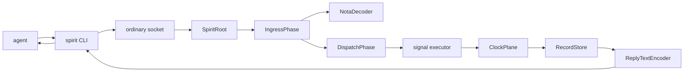
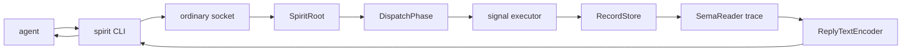

# persona-spirit daemon-stamped time and CLI readiness

## Short answer

`spirit` is now usable as a daemon-backed typed intent capture and query CLI for
the core `Record` and `Observe` paths, provided a `persona-spirit-daemon` is
running and `PERSONA_SPIRIT_SOCKET` points at its ordinary socket.

It is not yet a complete replacement for every manual `intent/*.nota` workflow:
raw statement classification is still a conservative placeholder,
`Tap` / `Untap` live fanout is intentionally unimplemented, and the generated
Signal CLI layer that dispatches between ordinary and owner sockets does not
exist yet.

The most important correction in this slice: clients no longer submit capture
time. The daemon stamps submitted entries after they enter the actor tree and
before storage.

## What changed

`signal-persona-spirit` commit `0236583e` removes capture time from submitted
`Entry` records. `Entry` now carries only the user-supplied intent content:

```nota
(Entry topic kind summary context certainty quote)
```

`RecordProvenance` still carries date and time, because provenance is
daemon-produced output:

```nota
(RecordProvenance summary context date time quote)
```

`persona-spirit` commit `c1519cbf` adds `ClockPlane` to the daemon actor tree.
`DispatchPhase` sends every `Record` entry, including provisional entries
created from `State`, through `ClockPlane` before `RecordStore`.

## Request schema

Typed capture:

```nota
(Record (workspace Decision "CLI is thin" "Component CLI invariant" Maximum "The CLI is only a client."))
```

Raw statement capture, still provisional:

```nota
(State ("The CLI is only a thin daemon client."))
```

Summary query:

```nota
(Observe (Records (None SummaryOnly)))
```

Provenance query:

```nota
(Observe (Records (None WithProvenance)))
```

Forbidden old shapes:

```nota
(Record (workspace Decision "summary" "context" Maximum 1779000000 "quote"))
(Record (workspace Decision "summary" "context" Maximum (2026 5 20) (14 30 0) "quote"))
```

Those are rejected because the request record has no capture-time slot.

## Reply schema

Capture acknowledgement:

```nota
(RecordAccepted ((1 workspace Decision "CLI is thin" Maximum)))
```

Summary query reply:

```nota
(RecordsObserved ([(1 workspace Decision "CLI is thin" Maximum)]))
```

Provenance query reply. The date and time are daemon-owned output:

```nota
(RecordProvenancesObserved ([((1 workspace Decision "CLI is thin" Maximum) "Component CLI invariant" 2026-05-20 22:10:04 "The CLI is only a client.")]))
```

## Capture flow



The trace tests now require `ClockPlane` and `EntryStamped` on the record path.
This proves the normal runtime path, not only an isolated unit helper.

## Query flow



Summary queries do not expose provenance. Provenance queries expose the
daemon-stamped date and time.

## CLI boundary

The current `spirit` binary is deliberately thin:

- one argument only;
- raw NOTA if the argument starts with `(`;
- otherwise a path to a NOTA request file;
- decodes that text to `signal-persona-spirit::SpiritRequest`;
- sends a length-prefixed Signal frame to `PERSONA_SPIRIT_SOCKET`;
- renders the daemon's typed reply as NOTA;
- never opens `SpiritActorRuntime`;
- never opens the store;
- never mints record identifiers or capture time.

The future generated Signal CLI layer should take both working and owner
contracts and emit the request-head to socket-dispatch table. That layer is not
implemented here. For this slice, `spirit` speaks only the ordinary working
socket.

## Tests

Passed locally:

```text
signal-persona-spirit: cargo test --locked
persona-spirit: CARGO_BUILD_JOBS=2 cargo test --locked
```

Passed through Nix remote-builder path:

```text
signal-persona-spirit: nix flake check -L --max-jobs 0
persona-spirit: nix flake check -L --max-jobs 0
```

Important witnesses:

- `record_request_with_client_timestamp_shape_is_rejected`
- `record_request_with_parenthesized_client_date_time_shape_is_rejected`
- `persona_spirit_ordinary_request_path_uses_signal_executor_and_sema_observer`
- `persona_spirit_entry_assertion_runs_through_actor_planes`
- `persona_spirit_client_returns_provenance_only_when_requested`
- `persona_spirit_command_line_path_does_not_use_actor_runtime_directly`
- `persona_spirit_client_can_send_nota_request_to_running_daemon`

## Remaining gaps

`State` classification is still placeholder logic. It turns raw text into an
`unclassified Clarification` with `Minimum` certainty. This is useful for a
safe first capture path but not yet a real intent classifier.

`Tap` and `Untap` are still typed, valid, no-change operations. They prove the
shape through `signal-executor` and `signal-sema`, but they do not yet fan out
live observer events.

The generated Signal CLI macro does not exist yet. Until it does, `spirit` uses
the ordinary socket only. Owner-socket CLI dispatch remains a cross-component
infrastructure task, not a Spirit-specific implementation.

Existing `intent/*.nota` import stays out of Spirit. A temporary one-time tool
can be designed separately if needed.

## Operator judgement

Spirit is ready for agents to begin storing new typed intent records through a
running daemon and querying them back through the CLI. It is not yet ready to
replace the entire manual intent workflow without operational glue: we still
need a standard daemon launch/socket convention and a decision on whether raw
`State` capture is acceptable before the classifier becomes smarter.
