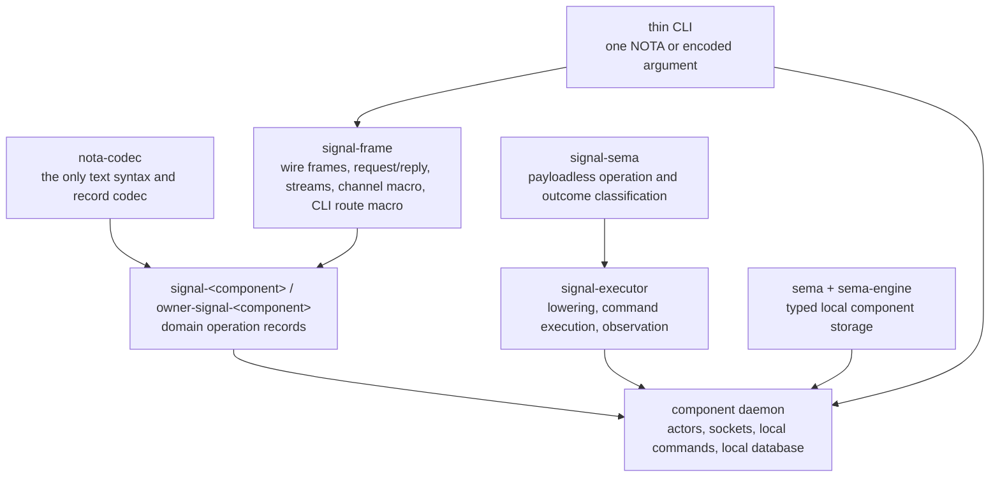
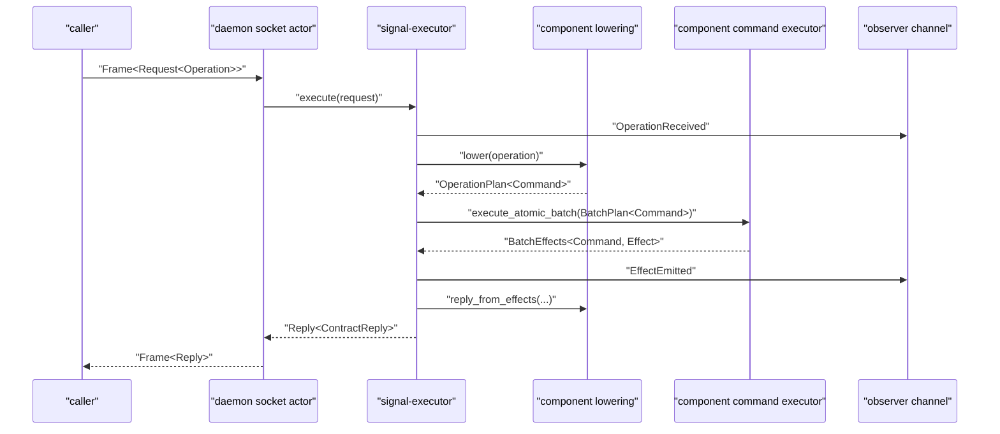
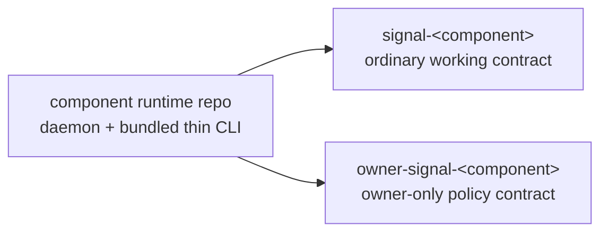
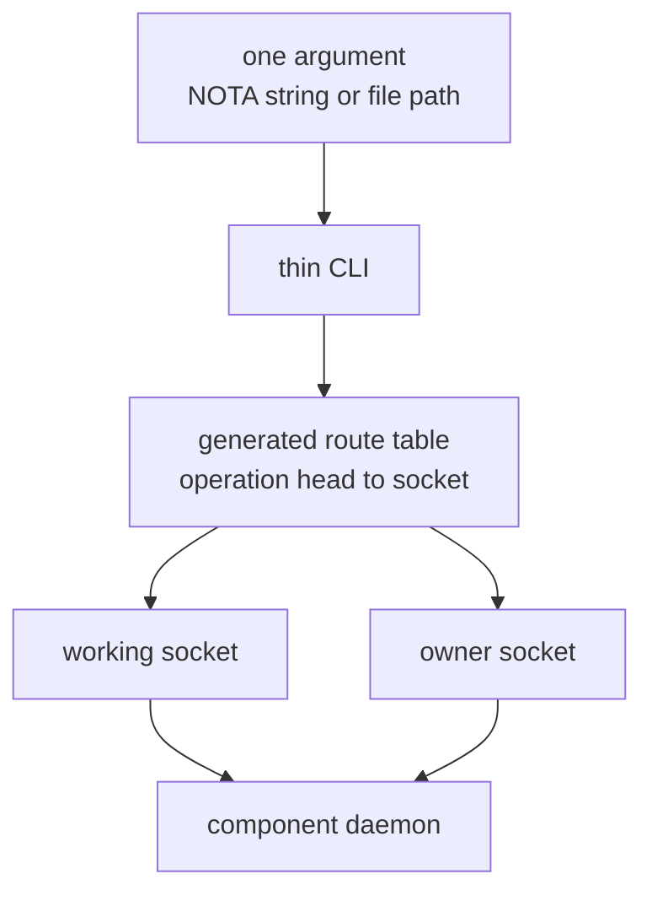

# 150 — triad signal/sema migration current state

This report consolidates the operator lane's recent signal / sema /
executor / spirit migration reports into one current handoff. It
supersedes and removes `reports/operator/137` through
`reports/operator/149`.

The report is written for agents migrating triad components that have
not yet caught up to the current design.

Current authority sources used here:

- `intent/component-shape.nota`
- `intent/signal.nota`
- `intent/persona.nota`
- `intent/workspace.nota`
- `ESSENCE.md`
- `skills/component-triad.md`
- `skills/naming.md`
- `reports/designer/246-v4-bundled-fix-deep-design-with-examples.md`
- `reports/designer/248-three-layer-changes-for-operators.md`
- `reports/designer/257-signal-contracts-names-and-shape-audit.md`
- `reports/designer/258-persona-signal-triad-audit-2026-05-21.md`
- `reports/designer-assistant/129-mind-orchestrate-payload-and-cli-dispatch-option-a-2026-05-20.md`

## 1 · Current foundation

The workspace has moved away from the old `signal-core` /
universal-verb public-contract model.

The current component substrate is:



### `nota-codec`

`nota-codec` owns the text projection and typed record derive surface.
NOTA is the only text argument language. Nexus is a NOTA user, not a
second text format.

Contract crates should derive or implement NOTA encoding for their
records. Daemon logic should not hand-parse strings.

### `signal-frame`

`signal-frame` owns the transport-neutral signal frame mechanics:

- rkyv frame encoding and decoding
- exchange identifiers
- request / reply shape
- accepted batch outcome and per-operation reply alignment
- subscription event frames
- `signal_channel!`
- `signal_cli!`

It is domain-free and Sema-verb-free. Public contract operations are
contract-local verbs such as `Record`, `Query`, `Watch`, `Unwatch`,
`Launch`, or `Retire`.

Current macro target:

- operation declarations use `operation <Verb>(<Payload>)`;
- the macro emits clean unprefixed names for the single-channel crate
  case: `Operation`, `Reply`, `Frame`, `FrameBody`,
  `RequestBuilder`, `OperationKind`, `ReplyKind`, and `EventKind`;
- crates with multiple channels put each channel in a module instead
  of asking the macro for ancestry prefixes;
- runtime crates that expose ordinary and owner client surfaces use
  side modules such as `ordinary::Client`, `ordinary::SignalClient`,
  and `owner::SignalClient` rather than crate-local ancestry prefixes
  such as `SpiritClient` or `OwnerSpiritClient`;
- the macro emits structurally obvious `From<Payload> for Reply`
  impls;
- persona contracts declare an `observable` block so the macro injects
  the standard observer surface.

### `signal-sema`

`signal-sema` owns universal classification, not execution.

Current three-layer rule:

```text
contract Operation  ->  component Command  ->  Sema classification
external vocabulary     executable payload      payloadless observation label
```

`SemaOperation` is payloadless:

```rust
pub enum SemaOperation {
    Assert,
    Mutate,
    Retract,
    Match,
    Subscribe,
    Validate,
}
```

`SemaOutcome` is also payloadless. `SemaObservation` is the pair:

```rust
pub struct SemaObservation {
    pub operation: SemaOperation,
    pub outcome: SemaOutcome,
}
```

Daemon-local commands implement `ToSemaOperation`. Daemon-local
effects implement `ToSemaOutcome`.

### `signal-executor`

`signal-executor` is the shared execution harness for a daemon's
request path. It does not execute Sema operations. It composes:

- `Lowering`: public contract `Operation` to local executable
  `Command`;
- `OperationPlan<Command>`: commands produced by one source
  operation;
- `BatchPlan<Command>`: all source-operation plans in one request;
- `CommandExecutor`: component-local atomic commit boundary;
- `ObserverChannel`: publication of operation and effect facts.

The canonical execution shape is:



Engine failures are accepted batch-abort replies. `Reply::Rejected`
stays a frame/kernel rejection shape and does not carry typed contract
reply payloads.

### `sema` and `sema-engine`

`sema` is the storage kernel. `sema-engine` is the higher-level
library for typed component storage. Each daemon owns its own local
database through its actor tree. There is no shared `persona-sema`
daemon or workspace-global Sema database.

A component's `CommandExecutor` may be backed by `sema-engine`, but
`signal-executor` deliberately does not depend on `sema-engine`.

## 2 · The triad target

Every component has this repository triad:



The CLI is not a triad leg. It is the daemon's first client.

The CLI invariant:

- the binary name is the daemon name without the daemon suffix;
- the CLI takes exactly one argument;
- the argument is a NOTA string, a path to a NOTA file, or a path to a
  signal-encoded file;
- there are no flags;
- the CLI does not implement domain logic;
- the CLI transforms request argument to signal frame, sends it to
  the daemon, receives a frame reply, and prints NOTA;
- the CLI uses generated compile-time operation-head routing to pick
  the working or owner socket.



## 3 · Better signal tree shape

The signal tree is the whole contract schema: operation roots,
payloads, replies, events, filters, streams, and nesting.

### Public operations are contract-local verbs

Wrong old shape:

```rust
signal_channel! {
    channel Mind {
        request MindRequest {
            Assert SubmitThought(SubmitThought),
            Match QueryThoughts(QueryThoughts),
            Subscribe SubscribeThoughts(SubscribeThoughts) opens MindEventStream,
        }
    }
}
```

Correct current shape:

```rust
signal_channel! {
    channel Mind {
        operation Submit(Submission),
        operation Query(Query),
        operation Watch(Subscription) opens DomainStream,
        operation Unwatch(SubscriptionToken),
    }
    reply Reply {
        Submitted(Receipt),
        QueryResult(QueryResult),
        SubscriptionOpened(SubscriptionOpened),
        SubscriptionRetracted(SubscriptionRetracted),
        RequestUnimplemented(RequestUnimplemented),
    }
}
```

`Assert`, `Match`, and `Subscribe` are Sema classifications. They do
not appear as public operation prefixes.

### Repeated suffixes lift into typed sums

Wrong flat reply family:

```rust
reply Reply {
    RecentRepositoriesListing(RecentRepositoriesListing),
    ChangedFileListing(ChangedFileListing),
    CommitListing(CommitListing),
    CatalogListing(CatalogListing),
}
```

Better shape:

```rust
reply Reply {
    QueryResult(QueryResult),
}

pub enum QueryResult {
    RecentRepositories(RecentRepositoriesListing),
    ChangedFiles(ChangedFileListing),
    Commits(CommitListing),
    Catalog(CatalogListing),
}
```

Same rule applies to operation families such as `SubmitThought`,
`SubmitRelation`, `SubmitNote`, and `SubmitLink`: use
`operation Submit(Submission)` with a `Submission` sum.

### Names do not carry their full ancestry

Inside `signal-persona-router`, write `ObservationIdentifier`, not
`RouterObservationIdentifier`. Inside `signal-persona-terminal`,
write `Name`, not `TerminalName`, unless `Terminal` is truly the
domain noun being modeled.

The crate, module, and enclosing type provide context. Names should
not repeat the entire path of their ancestry.

When two local surfaces need the same short nouns, use modules instead
of prefixes:

```rust
pub mod ordinary {
    pub use crate::runtime::{Client, RequestText, ReplyText};
}

pub mod owner {
    pub use crate::runtime::{OwnerRequestText as RequestText};
}
```

The caller writes `ordinary::Client` or `owner::RequestText`. The
type names themselves stay short inside their scope.

### Empty marker records become unit variants

With mixed enum support, no-payload alternatives belong as unit enum
variants:

```rust
pub enum Observation {
    State,
    Records(RecordQuery),
    Questions,
}
```

Do not create empty record structs just to have something to put in a
variant.

### `RequestUnimplemented` carries the reason only

Per-operation replies are positionally aligned with the request.
Therefore this is redundant:

```rust
pub struct RequestUnimplemented {
    pub operation: OperationKind,
    pub reason: UnimplementedReason,
}
```

The target is:

```rust
pub struct RequestUnimplemented {
    pub reason: UnimplementedReason,
}
```

If the caller needs to know which operation failed, it already has the
request position and operation payload.

### Persona components are observable

Persona contracts need an observable block:

```rust
observable {
    filter default;
    operation_event OperationReceived;
    effect_event EffectEmitted;
}
```

The event names should not say `SemaEffectEmitted`. `SemaEffect` was
retired. The emitted event is a component effect projected to
`SemaObservation`.

## 4 · Current status by substrate

| Repository | Status | Notes |
|---|---|---|
| `signal-frame` | Current foundation | Owns frame mechanics, request/reply, streams, `signal_channel!`, `signal_cli!`, clean macro output, and generated operation/reply kinds. |
| `signal-sema` | Current foundation | Owns payloadless `SemaOperation`, `SemaOutcome`, `SemaObservation`, pattern primitives, and projection traits. |
| `signal-executor` | Current foundation | Uses component-local commands and effects; no `SemaEffect`; no Sema execution payloads. |
| `nota-codec` | Current text/codecs | Supports mixed enums; contracts should use derives instead of hand-written codec where possible. |
| `sema` / `sema-engine` | Local storage foundation | Component-owned storage; not a shared Persona daemon. |

## 5 · Current status by migrated example

### `signal-persona-spirit` + `owner-signal-persona-spirit` + `persona-spirit`

Spirit is the current best template.

It has:

- contract-local verbs;
- mixed enum forms for `Observation` and `Subscription`;
- daemon-stamped record provenance date/time on output, not client
  supplied timestamp on input;
- `signal-executor` in the ordinary request path;
- `ToSemaOperation` on local commands;
- `ToSemaOutcome` on local effects;
- `EffectEmitted` carrying `SemaObservation`;
- owner signal split from ordinary signal;
- the thin CLI path using generated socket dispatch;
- public ordinary/owner runtime surfaces exposed through modules
  rather than `Spirit*` ancestry prefixes;
- degenerate atomicity made explicit: multi-operation batches and
  multi-command operation plans are rejected before any command runs;
- `StampedEntry` composed as `{ entry, date, time }`, not a duplicate
  of `Entry`'s fields.

Spirit should be used as the first reference when migrating other
Persona components, with one caution: keep checking the code against
the current macro output because `signal-frame` has been improving
while Spirit was being used as the pilot.

Observer fanout remains trace-only in Spirit for now. That deferral is
intentional until persona-introspect lands; do not treat it as a
signal-executor bypass.

### `signal-repository-ledger`

Ledger is a useful pilot but not fully current. It already has
contract-local `Receive`, `Observe`, and `Query`, and it has lifted
`QueryResult`. Current code still shows older smells:

- alias boilerplate at the bottom of the contract;
- `RequestUnimplemented` carrying operation/query fields;
- no observable block;
- runtime not yet the canonical triad daemon pilot.

Ledger remains a good simpler daemon pilot after the macro cleanup
and executor path are refreshed.

### `signal-persona`

The engine-manager contract is partially migrated. It uses
contract-local verbs in the engine channel, but it still has these
load-bearing gaps:

- `supervision::` and `Supervision*` names should become
  `engine_management::` and `EngineManagement*`;
- the persona daemon does not use `signal-executor`;
- observable block is missing from the engine channel;
- the two-channel crate should use modules for disambiguation once
  the clean macro output is the baseline.

This triad is important because it starts engines. It should follow
Spirit's executor migration, not invent a separate direct-dispatch
shape.

## 6 · Unmigrated triad components

### `persona-mind`

Mind is the worst-shaped remaining Persona contract.

Current design direction:

- split the broad flat operation tree into a few roots:
  `Submit`, `Query`, `Watch`, `Unwatch`, `ChangeStatus` or
  `Transition`, `Adjudicate`, and channel-management verbs;
- lift repeated `Submit*`, `Query*`, and `*Receipt` families into
  typed sums;
- remove `Mind` ancestry prefixes inside the contract;
- add observable surface;
- migrate daemon request handling through `signal-executor`;
- keep graph / memory execution as component-local commands backed
  by its local Sema storage.

Mind should not reintroduce Sema as a public execution language.

### `persona-router`

Router should route messages and grants through contract-local
operations, not old Sema verbs. Its public tree should separate:

- message routing / delivery;
- channel grants and revocations;
- observation / trace queries.

Owner-only policy orders belong in `owner-signal-persona-router`.
Ordinary callers should not even have owner-only variants in their
contract.

Remove ancestry-prefixed names such as `RouterObservationIdentifier`
inside the router contract.

### `persona-message`

Current design intent says there is no `MessageProxy` component, but
there is a real `persona-message` daemon. It is the thin local entry
daemon for message CLI submission:

- CLI speaks NOTA/frames only;
- daemon stamps local origin/provenance;
- daemon forwards typed submissions to router;
- no legacy line protocol;
- no direct harness injection logic in the CLI.

Migrate ordinary and owner signal contracts to the current signal
tree before expanding runtime behavior.

### `persona-terminal`

Terminal has the most operational surface: sessions, input, prompt
guards, transcript capture, and worker lifecycle. It needs a careful
split:

- ordinary contract for safe public terminal actions and queries;
- owner signal for session creation/retirement and policy;
- event streams for worker lifecycle and transcript/prompt state;
- observable surface for introspection;
- runtime actors for each logical plane.

Avoid old broad operation families and repeated `Terminal*` prefixes.

### `persona-harness`

Harness sits between router/mind and terminal/model processes. It
needs the same current shape:

- working signal for deliverable harness actions;
- owner signal for lifecycle/policy when needed;
- observable surface;
- local commands that classify to Sema for cross-component
  introspection;
- no direct string injection path that bypasses router/terminal
  guards.

### `persona-system`

System integration is operating-system-specific. The contract should
not preserve speculative single-variant enums for possible future
window-manager backends. Use today's concrete shape; introduce an
enum when a second real backend appears.

System should expose facts as working-signal observations and keep
privileged policy on the owner socket.

### `persona-introspect`

Introspect should use the standard observable surface exposed by each
Persona component. It should not require bespoke per-component
observability verbs. Tap/Untap are infrastructure, not component
domain operations.

It may own a local database, but it should primarily inspect peers
through their contracts and daemon sockets.

### `persona-orchestrate`

Orchestrate is a real component, not a role folded into mind. It
owns coordination machinery. It should use the same triad structure
and signal-executor path.

Current architecture should avoid resurrecting lock-file semantics
as its target model. Lock files are transitional workspace
choreography, not the end-state orchestration engine.

### `criome`

`signal-criome` should likely split by relation / authority surface,
not because of name collisions. The rationale is dependency and
authority separation:

- identity;
- attestation / authorization;
- peer signing.

Those may be separate contract crates while still being served by
one daemon socket if the authority model allows it.

## 7 · Migration playbook for one triad

For a component that is still stale, use this order.

1. Refresh intent and architecture.

Read the component's `INTENT.md`, `ARCHITECTURE.md`, repo
`AGENTS.md`, `skills.md`, and the relevant workspace intent logs.
Do not preserve stale report wording if code and intent have moved
past it.

2. Migrate the working signal contract.

Replace old `request { Assert ... }` / `Match ...` / `Subscribe ...`
shape with:

```rust
signal_channel! {
    channel Component {
        operation Verb(Payload),
        operation Query(Query),
        operation Watch(Subscription) opens DomainStream,
        operation Unwatch(SubscriptionToken),
    }
    reply Reply { ... }
    event Event { ... }
    stream DomainStream { ... }
    observable {
        filter default;
        operation_event OperationReceived;
        effect_event EffectEmitted;
    }
}
```

Lift repeated suffixes into sums. Drop ancestry prefixes. Drop empty
markers. Drop redundant operation fields from unimplemented replies.

3. Migrate the owner signal contract.

Owner signal carries policy and privileged lifecycle operations. It
does not duplicate the ordinary working surface. Do not put
owner-only operations in the working signal just to avoid creating
the owner crate.

4. Migrate the daemon request path.

Define daemon-local types:

```rust
pub enum Command {
    RecordEntry(Entry),
    ReadRecords(ReadPlan),
}

pub enum Effect {
    EntryRecorded(RecordSummary),
    RecordsRead(Vec<RecordSummary>),
}
```

Implement:

```rust
impl ToSemaOperation for Command { ... }
impl ToSemaOutcome for Effect { ... }
impl Lowering for ComponentLowering { ... }
impl CommandExecutor for ComponentCommandExecutor { ... }
```

The daemon's socket actor should call `Executor::execute(request)`.
It should not bypass the executor with a direct match over
operations.

5. Migrate the CLI.

Use the generated signal CLI route table. The component CLI is a
thin transport projection, not a domain helper:

- one argument only;
- no flags;
- no import tools;
- no timestamp generation unless the contract explicitly says the
  caller supplies a time, which spirit intent does not;
- working/owner socket selection comes from operation-head routing.
- runtime exports use modules for parallel surfaces:
  `ordinary::Client`, `ordinary::RequestText`, `owner::RequestText`;
  avoid ancestry prefixes like `SpiritClient` in the component crate.

6. Add constraint tests.

At minimum:

- contract NOTA round trips for each operation family;
- rkyv frame round trips;
- macro-emitted clean-name compile witness;
- no old `signal-core` dependency;
- no old `Assert Submit(...)` public operation shape;
- no hand-written `OperationKind` where macro should emit it;
- CLI route table sends working and owner operations to different
  sockets;
- daemon request path calls `signal-executor`;
- `Command` projects to `SemaOperation`;
- `Effect` projects to `SemaOutcome`;
- executor emits operation event before effect event;
- `RequestUnimplemented` does not carry redundant operation fields.
- multi-operation batches are rejected before commit until the
  component has a real transaction boundary;
- multi-command operation plans are rejected before any command runs
  unless the component executor has a real transaction boundary;
- runtime public exports use modules instead of ancestry prefixes for
  ordinary/owner surfaces;
- daemon-stamped wrapper records compose the submitted record plus the
  daemon-owned stamp fields, rather than duplicating all submitted
  fields.

## 8 · Current open questions

The following still need explicit care while migrating components.

Runtime timestamps:

Spirit intent records use daemon-stamped date and time on output, not
client-supplied timestamps. Runtime protocol timestamps outside
spirit may still be a single machine field, but nanosecond precision
is usually suspicious. Prefer seconds unless a real component proves
it needs finer precision.

Engine-management observability:

Persona components are observable. The ordinary engine-manager
channel should be observable. The internal engine-management channel
may or may not need Tap/Untap; adding it blindly could duplicate
internal traffic. Treat this as a component-specific architecture
decision.

Criome contract split:

Split by relation and authority surface if consumers need only one
subset. Do not split merely to avoid local names; separate contract
crates already provide local name namespaces.

Ledger versus spirit as pilot:

Spirit has already proven the newer path at the Persona layer.
Ledger remains useful as the simpler external pilot once its contract
is refreshed to the clean macro output.

## 9 · Reports retired by this consolidation

This report carries forward the current load-bearing content from
these operator reports, which should no longer be used as migration
guides:

- `reports/operator/137-signal-sema-and-sema-engine-migration.md`
- `reports/operator/138-signal-frame-macro-migration-work.md`
- `reports/operator/139-signal-frame-retest-and-ledger-pilot-followup.md`
- `reports/operator/140-signal-frame-executor-hole-analysis.md`
- `reports/operator/141-signal-frame-executor-correction-examples.md`
- `reports/operator/142-signal-frame-executor-bundled-fix-logic-probe.md`
- `reports/operator/143-signal-infrastructure-convergence-and-pilot-pivot.md`
- `reports/operator/144-signal-sema-executor-refresh-2026-05-20.md`
- `reports/operator/145-signal-sema-spirit-current-handoff-2026-05-20.md`
- `reports/operator/146-persona-spirit-daemon-stamped-time-and-cli-readiness.md`
- `reports/operator/147-spirit-generated-cli-routing-work.md`
- `reports/operator/148-spirit-response-to-signal-contract-shape-audit.md`
- `reports/operator/149-signal-channel-macro-clean-output-slice.md`

The designer and designer-assistant reports remain active references
where they are newer or more specific. This operator report is the
implementation-lane synthesis, not a replacement for architecture
authority.
