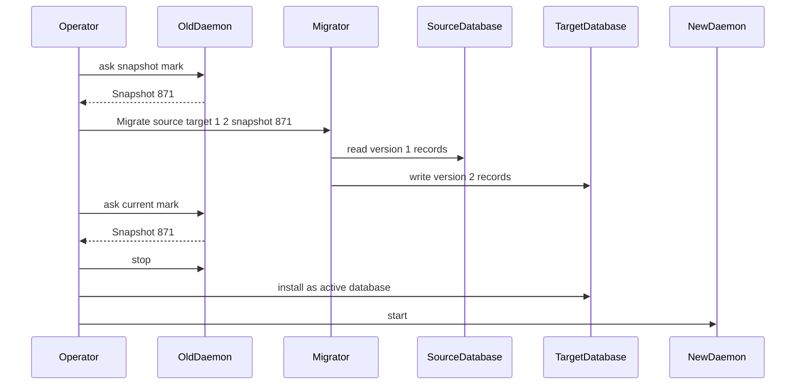
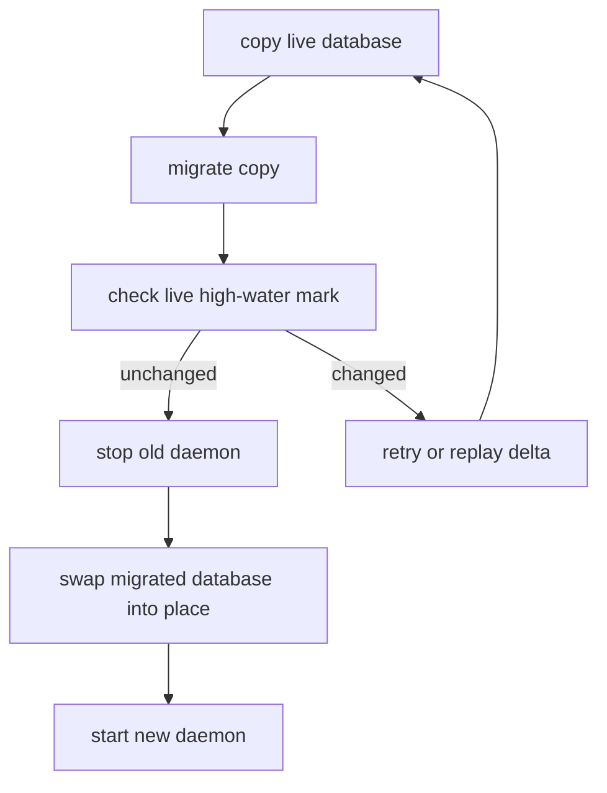

# 151 — Spirit deployed version and schema migration read

## Current deployed version

The running user service is:

```text
persona-spirit-daemon.service
ExecStart=/nix/store/83lsr0zvighjvxpz9ka11zym4dy996x3-persona-spirit-daemon-start
daemon=/nix/store/w4bc190shb229kw1k8aash8dyzvb40x3-persona-spirit-daemon/bin/persona-spirit-daemon
store=/home/li/.local/state/persona-spirit/persona-spirit.redb
```

The wrapped derivation is `persona-spirit-0.1.0`, with source at
`/nix/store/62q910zqjagr8xwhqw6d6fc641lwf7lk-source`. That source
matches the capability shape of `persona-spirit` commit
`694452add7734d0b00954a0d7d4d46bb5d776065`: kind-filtered record
queries are present, topic-catalog observation is absent.

The deployed runtime's `Cargo.lock` pins:

```text
signal-persona-spirit        b89731f2ae66d56695cb3625986b9747af52a808
owner-signal-persona-spirit  00d15451774d75e1e9c5bb6b9435ffce601895b0
```

I tagged and pushed all three deployed commits as `v0.1.0`:

```text
persona-spirit               v0.1.0 -> 694452add7734d0b00954a0d7d4d46bb5d776065
signal-persona-spirit        v0.1.0 -> b89731f2ae66d56695cb3625986b9747af52a808
owner-signal-persona-spirit  v0.1.0 -> 00d15451774d75e1e9c5bb6b9435ffce601895b0
```

I used raw `git tag` for this one operation because jj does not
create Git tags. The normal commit/bookmark workflow remains jj.

## Did the schema change since deployment?

There are two surfaces:

| Surface | Since deployed `v0.1.0` | Consequence |
|---|---|---|
| Stored redb schema | No material change found | The current daemon can read the deployed database layout. |
| Working signal contract | Yes: `Observation::Topics`, `TopicCount`, `TopicsObserved` were added | Old deployed daemon cannot answer `Observe Topics`; new clients/daemon must agree on the new contract. |
| Owner signal contract | No change | No owner migration in this slice. |

The database-relevant type path is unchanged:

```rust
const SPIRIT_SCHEMA_VERSION: SchemaVersion = SchemaVersion::new(1);

struct StoredRecord {
    identifier: RecordIdentifier,
    entry: StampedEntry,
}

pub struct StampedEntry {
    entry: Entry,
    date: Date,
    time: Time,
}

pub struct Entry {
    topic: Topic,
    kind: Kind,
    summary: Summary,
    context: Context,
    certainty: Certainty,
    quote: Quote,
}
```

Current `main` only added derived reads over existing records:

```rust
fn topic_counts(&self) -> Result<Vec<TopicCount>> {
    let mut counts = BTreeMap::<String, u64>::new();
    for record in self.all_records()? {
        *counts
            .entry(record.entry.entry.topic.as_str().to_owned())
            .or_insert(0) += 1;
    }
    ...
}
```

So the current update from deployed `v0.1.0` to current `main` is
not a storage-schema migration. It is a runtime + wire-contract
upgrade.

## Reading designer/261

`reports/designer/261-schema-version-surface-research.md` recommends
the layered shape:

- a coarse component/contract version for human talkability;
- per-record-type machinery for actual read-path migration;
- stored records carry a version tag;
- current code reads old versions through explicit migration
  dispatch.

That direction is right, but Spirit exposes one missing split:
the stored shape is not only `signal-persona-spirit::Entry`.
The daemon stores a runtime wrapper:

```rust
StoredRecord {
    identifier: RecordIdentifier,
    entry: StampedEntry {
        entry: Entry,
        date: Date,
        time: Time,
    },
}
```

That means historical signal types alone are not enough. The
runtime crate must own historical storage wrappers too. A future
schema plan needs both:

| Type family | Natural owner |
|---|---|
| Public working signal types such as `Entry`, `RecordQuery`, `RecordAccepted` | `signal-persona-spirit` |
| Owner-only signal types | `owner-signal-persona-spirit` |
| Private stored wrappers such as `StoredRecord`, `StampedEntry`, table keys, table names | `persona-spirit` |

## Does copy-migrate-verify-switch make sense?

Yes, with one correction: the verification needs a precise
high-water mark. "Compare the live database to the copy" is correct
as an intuition, but the system needs a typed value that proves
whether writes happened after the migration snapshot.

For today's append-only Spirit records, `max(RecordIdentifier)` is
a weak but useful high-water mark:

```text
live before copy:  max record identifier = 32
copy + migrate:    migrate all records up through 32
live before switch:
    if max record identifier == 32, switch is safe
    if max record identifier > 32, records were added; retry or replay delta
```

That only works because current Spirit records are append-only and
identifiers are monotonic. It is not general enough for mutation,
retraction, rewritten records, subscriptions, or policy state.

The general version needs a component commit sequence:

```text
old daemon
  └─ current commit sequence = 871

migrator
  ├─ copies source database at sequence 871
  ├─ migrates copy
  └─ asks old daemon for current sequence

cutover gate
  ├─ sequence still 871  -> stop old daemon, atomically install copy, start new daemon
  └─ sequence changed    -> retry, replay delta, or enter a short write-free cutover window
```

Spirit does not have that sequence yet. `sema-engine` already has
the right conceptual pressure point: every committed effect should
advance an operation/commit sequence that migrations can use as a
snapshot identity.

## Where migration code should live

The clean split is:

```text
persona-spirit/
  src/schema/
    current.rs        current stored wrappers and table declarations
    version_1.rs      frozen deployed v0.1.0 stored wrappers
  src/migration/
    mod.rs            MigrationPlan, MigrationReport, migration errors
    version_1_to_2.rs pure transform code
  src/bin/spirit-migrate.rs
    one-shot maintenance binary that takes one NOTA request

signal-persona-spirit/
  src/schema/
    current.rs        current public signal types
    version_1.rs      frozen public signal types only if a signal type's rkyv layout changed
```

The daemon should not grow a pile of one-off migration command-line
modes. The transform code should be a library module, and an
external one-shot binary can run eager full-copy migrations using
that same library. The daemon still owns normal service and can
also use the same library for Approach C read-time upgrades.

So the answer is not "daemon only" or "separate binary only":

| Concern | Owner |
|---|---|
| Pure migration functions | component library modules |
| Eager full-copy migration | one-shot component maintenance binary |
| Runtime version check and read-time lifting | daemon, using the same library |
| Historical public signal record definitions | signal contract crate |
| Historical private storage wrappers | runtime crate |

This keeps the daemon from becoming a migration museum while also
avoiding duplicated migration logic.

## What a simple full migration would look like

Assume a future current schema `version 2` changes the stored
record by adding a field to `StampedEntry`.

### NOTA request

The one-shot binary follows the component binary rule: one NOTA
argument.

```nota
(Migrate
    "/home/li/.local/state/persona-spirit/persona-spirit.redb"
    "/home/li/.local/state/persona-spirit/persona-spirit.v2.redb"
    1
    2)
```

### Internal flow



### Retry path



Current Spirit cannot do the strong version of this yet because it
lacks a durable commit sequence. It can only approximate it with
record identifiers.

## Immediate implementation conclusion

No migration is required to move the deployed `v0.1.0` Spirit
database to current `main`.

The next code that should land before the first real storage-schema
bump:

1. Add explicit schema identity constants to the Spirit storage
   layer, not only the signal contract.
2. Add a persistent component commit sequence or migration snapshot
   marker through `sema-engine`.
3. Add a tiny migration module in `persona-spirit` even if
   `version_1_to_1` is an identity witness, so the code has a
   tested home before the first real migration.
4. Keep the current `v0.1.0` tags as the deployed baseline.

## Open intent questions

### Version numbers

The deployed binary already says Cargo package `0.1.0`, so I used
Git tag `v0.1.0`. The psyche's earlier wording was "0.1" and
"0.1.1 / 0.2" for compatibility changes. We need one explicit rule:

```text
Does a wire-contract breaking change without a storage-schema change
bump the Spirit release from v0.1.0 to v0.1.1, or is the version
number only about database storage schema?
```

My recommendation: one release number should describe the deployed
component as a whole, but the database schema version should be a
separate stored value. That lets `v0.1.1` mean "same database schema,
new daemon/wire behavior" without confusing it with storage schema.

### Cutover strictness

For real migrations, should the first production implementation
accept a short write-free cutover window?

```text
stop old daemon -> migrate in place/copy -> start new daemon
```

That is much simpler than live copy/retry and is probably acceptable
until Spirit has many concurrent users. The live-copy model is the
right future, but it needs commit-sequence machinery first.
