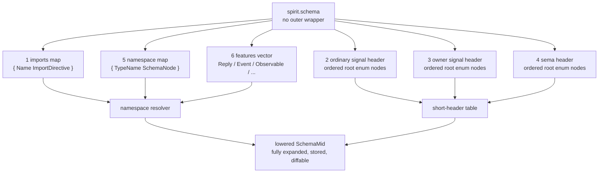
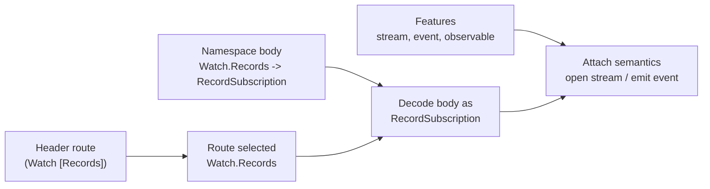

# 174-v3 - Schema import and header design critique, 2026-05-24

## Context

This v3 report responds to the psyche's request for an operator-side improved
design and critique of the current schema-language direction, after
`reports/designer/326-v11-spirit-complete-schema-vision.md`.

The latest psyche corrections captured in Spirit:

- 481 - schema import section is a key map whose values are import variants.
- 482 - import variants cannot mix arities; NOTA has no omitted optional
  fields.
- 483 - imports should use explicit variants such as `Import` and `ImportAll`,
  not an opaque `Path` variant.
- 484 - bracket enum-declaration context contains variants; named struct or
  newtype shapes still need named declarations.
- 485 - generic/container type expressions use parentheses, not vector
  brackets: `(Option Topic)`, `(Vec RecordSummary)`.

Designer `/326-v9` correctly fixed v8's invalid same-tag/different-arity import
shape. Designer `/326-v10` correctly fixes v9's `[Option X]` / `[Vec X]`
container-type syntax. Designer `/326-v11` absorbs this report's main
architectural recommendation: header vectors are route-only, namespace nodes
define body payloads, and features carry semantics beyond body typing.

This v3 is therefore narrower than v2. It preserves the operator-ready examples,
marks the Form 2 route/body question closed, and critiques the remaining
precision issues that matter before code generation.

## One-Screen Shape

The authored `.schema` file is not a normal NOTA record with an outer
`(Schema ...)` wrapper. The file path and parser position already say it is a
schema. The file is a fixed-position schema struct:

```nota
{ imports }
[ ordinary-signal-header ]
[ owner-signal-header ]
[ sema-header ]
{ namespace }
[ features ]
```

Visually:



## Improved Import Model

### Rule

The import field is a map. Each map value is an `ImportDirective` enum variant
with fixed arity.

```nota
{
  Magnitude (ImportAll ../signal-sema/magnitude.schema)
  SemaSet (Import ../signal-sema/operation.schema [SemaOperation SemaOutcome SemaObservation])
}
```

The base schema declares:

```nota
ImportDirective [
  (Import Path (Vec EnumIdentifier))
  (ImportAll Path)
]
```

The authored import value still uses brackets for the selected names because
that position contains a vector value:

```nota
(Import ../signal-sema/operation.schema [SemaOperation SemaOutcome])
```

The type declaration uses `(Vec EnumIdentifier)` because that position names the
type of the field.

### What the Map Key Means

The map key is a local import binding label. It is not automatically a namespace
prefix unless the schema language later adds prefixed import syntax.

```nota
{
  SemaSet (Import ../signal-sema/operation.schema [SemaOperation SemaOutcome])
}
```

This means:

```text
load ../signal-sema/operation.schema
take SemaOperation and SemaOutcome
insert those names into this schema's local type namespace
remember that they came through import binding SemaSet
```

It does not mean callers write `SemaSet.SemaOperation` in the current MVP.

### Collision Rule

Imports must be resolved before local namespace lowering. If two imported names
or an import and a local declaration produce the same local identifier, that is a
schema error unless an explicit rename/alias mechanism exists.

Bad:

```nota
{
  SemaA (Import ../signal-sema/operation.schema [SemaOperation])
  SemaB (Import ../other/sema.schema [SemaOperation])
}

[]
[]
[]

{
  Entry (SemaOperation)
}

[]
```

Error:

```text
duplicate imported identifier: SemaOperation
from SemaA and SemaB
```

Good for MVP:

```nota
{
  SemaA (Import ../signal-sema/operation.schema [SemaOperation])
}
```

Future explicit rename, if needed:

```nota
{
  SemaA (ImportAs ../signal-sema/operation.schema [(SemaOperation OperationClass)])
}
```

Do not implement `ImportAs` until a real collision needs it. The important rule
now is that collisions are loud.

## Import Critique

Designer `/326-v11` keeps the load-bearing import-arity fix, container-type
syntax, import collision rule, and route/body/feature split. The remaining
rough edges are now precision issues, not major design blockers:

| Concern | Current `/326-v11` | Operator critique | Proposed rule |
|---|---|---|---|
| Absolute position wording | `/326-v11` says route headers are Positions 1-3, namespace Position 4, features Position 5 | This omits the imports map from the position count and can confuse implementers. | Use absolute file positions: 1 imports, 2 ordinary header, 3 owner header, 4 sema header, 5 namespace, 6 features. Use "header leg" when counting only ordinary/owner/sema. |
| Import map key | `Magnitude`, `SemaSet` | Now settled by `/326-v11`: provenance label only, not namespace prefix. | Implement this exactly and reject duplicate imported/local names. |
| Collision behavior | Now explicit in `/326-v11` | Good. Needs tests. | Add import-import and import-local collision fixtures. |
| `ImportAll` use | Valid | Convenient but can flood namespace in larger schemas. | Prefer `Import` for multi-type schemas; use `ImportAll` for base/core or single-type schema files. |
| Future index imports | Mentioned | Good direction, but not MVP. | Add a third variant only when the schema registry exists. |
| `ImportDirective` names | `Import`, `ImportAll` | Slightly repetitive inside Rust enum context, but clear in authored NOTA. | Keep the authored heads; Rust internals may still name variants `Some`/`All` only if the NOTA codec supports head override later. |
| Unit endpoint body | `/326-v11` route body type is explicit for Form 1/Form 2 payloads | Pure control endpoints still need a deterministic body marker. | Lower unit endpoints to an explicit unit body type, not to absent body metadata. |

## Header Model

The header fields are ordered vectors because enum discriminants and short-header
slots are ordered.

```nota
[
  (State Statement)
  (Record Entry)
  (Observe Observation)
  (Watch Subscription)
  (Unwatch SubscriptionToken)
]
```

This is the Form 1 case: each root endpoint has one payload type.

Form 2 appears when one root has several endpoint selectors:

```nota
[
  (State Statement)
  (Record Entry)
  (Observe Observation)
  (Watch [State Records Questions])
  (Unwatch SubscriptionToken)
]
```

The bracket under `Watch` is a nested header namespace. It is not a vector of
runtime values; it is enum declaration shorthand in header position.

## Header Examples

### Example A - Simple Spirit Today

```nota
[
  (State Statement)
  (Record Entry)
  (Observe Observation)
  (Watch Subscription)
  (Unwatch SubscriptionToken)
]
```

Lowered idea:

| Root slot | Root | Endpoint slot | Body type |
|---:|---|---:|---|
| 0 | State | none | Statement |
| 1 | Record | none | Entry |
| 2 | Observe | none | Observation |
| 3 | Watch | none | Subscription |
| 4 | Unwatch | none | SubscriptionToken |

Dispatch:

```text
short header says root=Record
decoder jumps directly to Entry body codec
actor route is ordinary.signal.Record
```

### Example B - Watch With Sub-Endpoints

```nota
[
  (Watch [State Records Questions])
]
```

Namespace:

```nota
{
  StateSubscription (ObservationMode)
  RecordSubscription ((Option Topic) (Option Kind) ObservationMode)
  QuestionSubscription (ObservationMode)

  Watch [
    (State StateSubscription)
    (Records RecordSubscription)
    (Questions QuestionSubscription)
  ]
}
```

Lowered idea:

| Root slot | Root | Endpoint slot | Endpoint | Body type |
|---:|---|---:|---|---|
| 3 | Watch | 0 | State | StateSubscription |
| 3 | Watch | 1 | Records | RecordSubscription |
| 3 | Watch | 2 | Questions | QuestionSubscription |

Dispatch:

```text
short header says root=Watch, endpoint=Records
decoder jumps directly to RecordSubscription body codec
actor route is ordinary.signal.Watch.Records
```

### Example C - Unit Endpoint

Some endpoints may be pure control selectors with no body:

```nota
[
  (Ping [Status Version])
]
```

Namespace:

```nota
{
  Ping [Status Version]
}
```

Lowered idea:

| Root | Endpoint | Body type |
|---|---|---|
| Ping | Status | unit |
| Ping | Version | unit |

This is useful for cheap triage commands. The unit body still has a schema:
the empty struct/unit shape.

## Header Critique After `/326-v11`

The biggest v2 open issue was where header structure ends and body schema
starts. `/326-v11` resolves it correctly.

The boundary to implement:

1. Header syntax chooses a route.
2. Namespace syntax defines the body shape.
3. Lowering connects the route to the body shape.

Nested Form 2 header entries are endpoint selectors. They do not recursively
carry arbitrary header payload syntax inside the header field itself.

Good:

```nota
[
  (Watch [State Records Questions])
]

{
  Watch [
    (State StateSubscription)
    (Records RecordSubscription)
    (Questions QuestionSubscription)
  ]
}
```

Avoid:

```nota
[
  (Watch [(State StateSubscription) (Records RecordSubscription)])
]
```

The avoided form duplicates body information in the header field. It makes the
header field both route table and body declaration, which will become ugly when
imports, collision checks, and generated Rust names are added.

## Better Separation: Route, Body, Feature

Use three layers:

| Layer | Authored location | Purpose | Example |
|---|---|---|---|
| Route | header vector | fast dispatch and actor routing | `(Watch [State Records])` |
| Body | namespace map | type definitions and nested payloads | `Watch [(State StateSubscription) ...]` |
| Feature | feature vector | semantics beyond body typing | `(Observable ...)`, `(Event ...)` |

Visual:



## Full Worked Spirit Sketch

This is the shape I would use for Spirit if Watch gets several endpoints. It
keeps the import corrections from `/326-v11` and keeps header/body separation.

```nota
{
  Magnitude (ImportAll ../signal-sema/magnitude.schema)
  SemaSet (Import ../signal-sema/operation.schema [SemaOperation SemaOutcome SemaObservation])
}

[
  (State Statement)
  (Record Entry)
  (Observe Observation)
  (Watch [State Records Questions])
  (Unwatch [State Records Questions])
]

[]

[]

{
  Kind [Decision Principle Correction Clarification Constraint]
  ObservationMode [SummaryOnly WithProvenance]

  Topic (String)
  Summary (String)
  Context (String)
  Quote (String)
  StatementText (String)
  RecordIdentifier (u64)
  QuestionIdentifier (String)

  Entry (Topic Kind Summary Context Magnitude Quote)
  Statement (StatementText)

  RecordQuery ((Option Topic) (Option Kind) ObservationMode)
  StateSubscription (ObservationMode)
  RecordSubscription ((Option Topic) (Option Kind) ObservationMode)
  QuestionSubscription (ObservationMode)

  Watch [
    (State StateSubscription)
    (Records RecordSubscription)
    (Questions QuestionSubscription)
  ]

  Unwatch [
    (State StateSubscriptionToken)
    (Records RecordSubscriptionToken)
    (Questions QuestionSubscriptionToken)
  ]

  Observation [State (Records RecordQuery) Topics Questions]
  SubscriptionToken [(State StateSubscriptionToken) (Records RecordSubscriptionToken) (Questions QuestionSubscriptionToken)]

  RecordAccepted (RecordIdentifier)
  RecordsObserved ((Vec RecordSummary))
  RequestUnimplemented (UnimplementedReason)

  OperationReceived (OperationKind)
  EffectEmitted (SemaObservation)
}

[
  (Reply
    RecordAccepted
    RecordsObserved
    RequestUnimplemented)

  (Observable
    (filter default)
    (operation_event OperationReceived)
    (effect_event EffectEmitted))
]
```

Note the intentional duplication of the words `Watch` and `Unwatch`: one copy
is the route root in the header; the other is the body enum in the namespace.
They are connected by lowering. They are not the same object in the text parser.

## Lowered Mid Representation

The authored schema should lower into a fully explicit machine object. This is
what the schema daemon stores, diffs, and uses to drive migrations.

```nota
(SchemaMid
  spirit
  [
    (ImportBinding Magnitude ../signal-sema/magnitude.schema All)
    (ImportBinding SemaSet ../signal-sema/operation.schema [SemaOperation SemaOutcome SemaObservation])
  ]
  [
    (Route ordinary 0 State None Statement)
    (Route ordinary 1 Record None Entry)
    (Route ordinary 2 Observe None Observation)
    (Route ordinary 3 Watch (Some 0 State) StateSubscription)
    (Route ordinary 3 Watch (Some 1 Records) RecordSubscription)
    (Route ordinary 3 Watch (Some 2 Questions) QuestionSubscription)
    (Route ordinary 4 Unwatch (Some 0 State) StateSubscriptionToken)
    (Route ordinary 4 Unwatch (Some 1 Records) RecordSubscriptionToken)
    (Route ordinary 4 Unwatch (Some 2 Questions) QuestionSubscriptionToken)
  ]
  [
    (Type spirit::Entry (Struct [Topic Kind Summary Context Magnitude Quote]))
    (Type spirit::Kind (Enum [Decision Principle Correction Clarification Constraint]))
    (Type signal-sema::Magnitude (Imported ../signal-sema/magnitude.schema Magnitude))
  ])
```

The mid form is deliberately not as pretty as the authored schema. It is the
auditable compiler output.

## Runtime Header Dispatch

The 64-bit header should not try to encode the full body shape. It should encode
enough to triage quickly:

```text
schema short hash -> confirms table family
leg               -> ordinary / owner / sema
root slot         -> State / Record / Observe / Watch / ...
endpoint slot     -> optional nested endpoint under root
reserved bits     -> future flags / version pressure
```

Illustrative dispatch:

```mermaid
sequenceDiagram
    participant Socket
    participant Ingress
    participant HeaderTable
    participant Decoder
    participant Actor

    Socket->>Ingress: bytes
    Ingress->>Ingress: read 64-bit short header
    Ingress->>HeaderTable: lookup schema + leg + root + endpoint
    HeaderTable-->>Ingress: body type = RecordSubscription
    Ingress->>Decoder: decode remaining bytes as RecordSubscription
    Decoder-->>Ingress: typed payload
    Ingress->>Actor: route Watch.Records(payload)
```

Important consequence: a receiver can drop, keep, log, or route based on the
short header before decoding the whole body. That is the performance and
introspection value of the header work.

## Implementation Order I Would Use

1. Parse `/326-v11` import directives exactly: `ImportAll(Path)` and
   `Import(Path, Vec<EnumIdentifier>)`, with the schema type declaration
   written as `(Import Path (Vec EnumIdentifier))`.
2. Add import collision diagnostics.
3. Add Form 2 header parsing for `(Root [Endpoint...])`.
4. Lower Form 1 and Form 2 into one `SchemaMid` route table.
5. Keep endpoint body resolution out of the header parser: resolve it through
   namespace lookup during lowering.
6. Emit the 64-bit short header table from `SchemaMid`, not from the raw
   authored schema.
7. Add round-trip tests for authored schema -> `SchemaMid` -> generated
   dispatch table.

## Operator Recommendation

Implement against `/326-v11`'s import, container-type, collision, and
route/body/feature corrections. The next code pass should preserve two rules:

1. Import map keys are provenance labels; imported names enter the local
   namespace directly; collisions are errors.
2. Header vectors are route declarations only; namespace nodes define body
   shapes; lowering connects them into `SchemaMid`.

That gives the macro library a clean architecture: the parser reads concise
schema sugar, the lowerer expands it into a fully explicit intermediate object,
and code generation uses only the lowered object.

## Remaining Precision Before Code

No immediate psyche clarification blocks implementation. The major question
from v2 is closed:

- Form 2 nested entries are route selectors only.
- Payload/body types resolve from namespace declarations during lowering.
- The generated short-header table is emitted from `SchemaMid`, not raw schema
  text.

Three implementation-level precision notes remain:

1. Use absolute file-position names in code and docs so imports are not
   accidentally skipped in numbering.
2. Treat unit endpoints as explicit unit body routes in `SchemaMid`.
3. Keep the feature grammar deliberately small in the MVP: `Reply`, `Event`,
   `Observable`, and only storage metadata if an implementation needs it.
