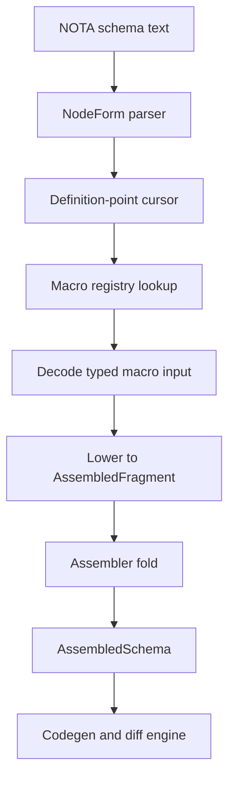

# 175.4 — Reusable components for AssembledSchema lowering

## Answer

The clean reusable shape is a small schema builtin engine whose extension point is a typed `NodeDefinition` lowerer.

The parser should not hard-code every schema-language form directly into one giant match. It should parse NOTA into a simple node form, identify which `NodeDefinitionPoint` it is currently reading, then dispatch to a registered macro variant for that point. The macro variant is data-carrying: its payload is the input struct for that lowerer.

## Core Types

Conceptually:

```rust
pub enum NodeDefinitionPoint {
    ImportMapValue,
    HeaderRoot,
    HeaderEndpoint,
    NamespaceValue,
    FieldType,
    FeatureItem,
    UpgradeRule,
}

pub trait SchemaMacro {
    type Input;
    type Output;

    fn variant_name(&self) -> &'static str;
    fn allowed_points(&self) -> &'static [NodeDefinitionPoint];
    fn decode_input(&self, node: NodeForm, context: &NodeContext) -> Result<Self::Input, SchemaError>;
    fn lower(&self, input: Self::Input, context: &mut LoweringContext) -> Result<Self::Output, SchemaError>;
}
```

The real implementation will probably erase the associated types behind an object-safe registry:

```rust
pub trait ErasedSchemaMacro {
    fn variant_name(&self) -> &'static str;
    fn allowed_points(&self) -> &'static [NodeDefinitionPoint];
    fn lower_erased(&self, node: NodeForm, context: &mut LoweringContext) -> Result<AssembledFragment, SchemaError>;
}
```

## Builtin Macro Variants

Each builtin has a specific input struct:

```rust
pub enum BuiltinSchemaMacro {
    ImportSelected(ImportSelectedInput),
    ImportAll(ImportAllInput),
    HeaderRoot(HeaderRootInput),
    EnumDefinition(EnumDefinitionInput),
    StructDefinition(StructDefinitionInput),
    NewtypeDefinition(NewtypeDefinitionInput),
    FieldType(FieldTypeInput),
    Feature(FeatureInput),
    UpgradeRule(UpgradeRuleInput),
}
```

This is the important part: the variant is not just a tag. It is a data-carrying variant whose data is the input object used by that macro lowerer.

## Input Struct Examples

Header root:

```rust
pub struct HeaderRootInput {
    pub root: EnumIdentifier,
    pub endpoints: Vec<EndpointIdentifier>,
}
```

Enum definition:

```rust
pub struct EnumDefinitionInput {
    pub name: TypeIdentifier,
    pub variants: Vec<VariantDefinitionInput>,
}
```

Struct definition:

```rust
pub struct StructDefinitionInput {
    pub name: TypeIdentifier,
    pub fields: Vec<FieldDefinitionInput>,
}
```

Import selected:

```rust
pub struct ImportSelectedInput {
    pub source: SchemaSource,
    pub names: Vec<TypeIdentifier>,
}
```

## How A Node Lowers

Given schema text:

```text
[
  (State [Statement])
  (Observe [Records Topics])
]
```

The parser is inside a header section. That means every parenthesized node is read at `NodeDefinitionPoint::HeaderRoot`.

`(State [Statement])` decodes as:

```rust
HeaderRootInput {
    root: EnumIdentifier("State"),
    endpoints: vec![EndpointIdentifier("Statement")],
}
```

The `HeaderRoot` macro lowers it into an assembled route fragment:

```rust
AssembledFragment::Route(RouteFragment {
    root: "State",
    endpoints: ["Statement"],
})
```

Given namespace text:

```text
{
  Kind [Decision Principle Correction Clarification Constraint]
  Entry (Topic Kind Summary Context Magnitude Quote)
}
```

The parser is inside `NodeDefinitionPoint::NamespaceValue`.

`Kind [...]` dispatches to `EnumDefinition`.

`Entry (...)` dispatches to `StructDefinition`.

Both produce type fragments. The assembler later folds those fragments into one `AssembledSchema`.

## Assembly Pipeline

The reusable pipeline is:



The definition-point cursor is what makes the same surface notation safe. A square bracket in a header endpoint list is not the same kind of object as a square bracket in a namespace enum definition. The current `NodeDefinitionPoint` tells the registry which macro variants are legal.

## Reuse Boundary

A reusable schema macro component should be:

- pure over its typed input plus lowering context;
- registered by definition point and variant name;
- responsible for one assembled fragment family;
- forbidden from mutating global state;
- allowed to request namespace resolution through the context;
- allowed to emit deferred references for the assembler to resolve later.

Imports are the exception. Import lowering needs a loader boundary because it reads another schema. Keep that effect isolated in an import macro and make the rest of the builtins pure.

## Why This Fits The Psyche Direction

The psyche's latest clarification says the builtin variants live at `nodeDefinition` points and each macro type has a struct defining the input object when used. This design takes that literally:

- `NodeDefinitionPoint` identifies where the schema engine is.
- The macro registry decides which variants are valid there.
- Each variant decodes to a typed input struct.
- The lowerer emits an `AssembledFragment`.
- The assembler owns collision checks, full namespace expansion, and final `AssembledSchema`.

That gives reusable components without making the parser know every future schema-language macro.

