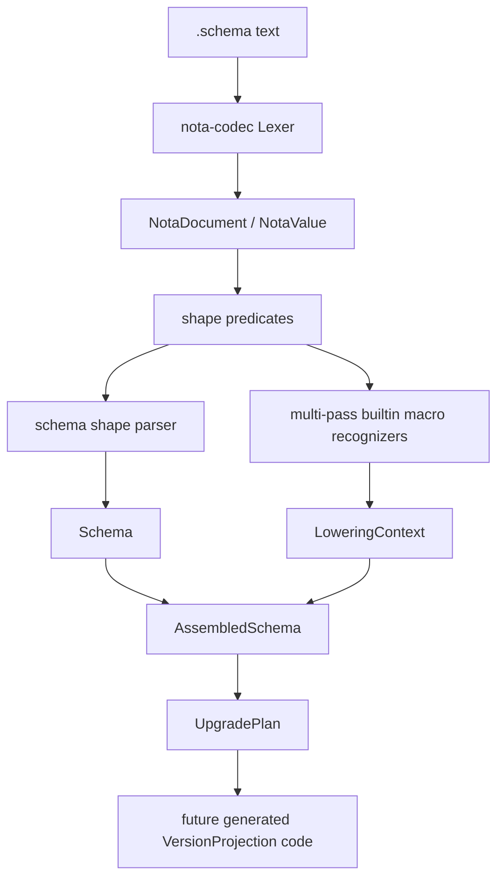
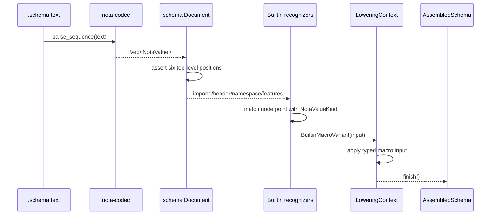
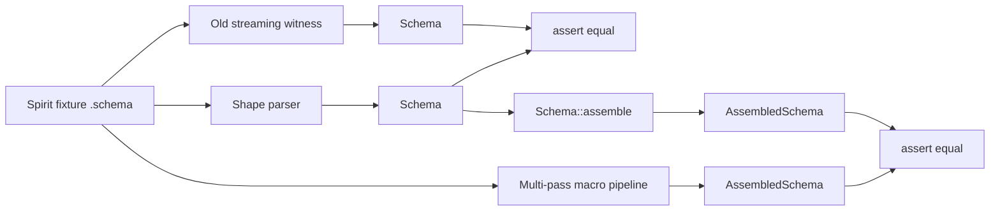

# Overview

## What Landed

Two implementation branches are pushed:

- `nota-codec`: `feature/notavalue-shape-logic-and-sequence-parser` at `d00fbf53`
- `schema`: `feature/fully-schema-and-nota-mvp` at `7100fd4a`

The schema crate now uses the generic NOTA value tree in the canonical parser path, and also has a separate MVP multi-pass macro pipeline that lowers Spirit-shaped `.schema` content through builtin shape-dispatch into `AssembledSchema`.

## Architecture Reading

The schema engine should run as two explicit tree/enum conversations:
generic NOTA tree shape first, schema-owned node semantics second.
`nota-codec` is deliberately ignorant of schema; it only reports
facts about the tree. `schema` decides what those facts mean at each
node-definition point.



`nota-codec` owns generic NOTA structure and shape interrogation. `schema` owns schema-specific recognition and lowering. Signal macro crates should later consume `AssembledSchema` and `UpgradePlan` to emit wire types, headers, dispatch, and migration projections.

## Schema Engine Running

The runtime path for a `.schema` file now looks like this:



That middle step is the important one. The engine should not be a
loose scan of strings. It should look like a relationship between
closed sets:

```rust
match (node_definition_point, value.kind()) {
    (NodeDefinitionPoint::Imports, NotaValueKind::Map) => lower_imports(value),
    (NodeDefinitionPoint::OrdinaryHeader, NotaValueKind::Sequence) => {
        lower_header(value, Leg::Ordinary)
    }
    (NodeDefinitionPoint::Namespace, NotaValueKind::Map) => lower_namespace(value),
    (NodeDefinitionPoint::Features, NotaValueKind::Sequence) => lower_features(value),
    (point, kind) => Err(point.unexpected_kind(kind)),
}
```

The MVP does not yet expose that exact public enum; it implements the
same relationship privately through `Document::from_six_values`,
`MacroPipeline`, and recognizer structs. The next cleanup is to name
the relationship directly so tests can assert on it.

The current code already has the working skeleton:

```rust
fn run(&mut self) -> Result<AssembledSchema> {
    self.lower_imports()?;
    self.lower_header(&self.document.ordinary_header.clone(), Leg::Ordinary)?;
    self.lower_header(&self.document.owner_header.clone(), Leg::Owner)?;
    self.lower_header(&self.document.sema_header.clone(), Leg::Sema)?;
    self.lower_namespace_local_types()?;
    self.lower_imported_types()?;
    self.lower_features()?;
    Ok(std::mem::take(&mut self.context).finish())
}
```

The shape grammar being exercised by the Spirit fixture is:

```nota
{ Imports }
[(State [Statement]) (Record [Entry]) (Observe [Observation])]
[]
[]
{
  Statement (String)
  Entry (topic Topic kind Kind summary Summary context Context certainty Magnitude quote Quote)
  Kind [Decision Principle Correction Clarification Constraint]
}
[(Reply Reply) (Upgrade ...)]
```

That is not yet the full final authored schema language, but it is
enough to prove the engine can read six positional top-level objects,
dispatch by node position, lower builtin macro variants, and assemble
the same semantic schema as the canonical parser.

## Test View



This is the real witness added here: the new path is not just
syntactically plausible; it is constrained against the old parser and
against the existing `AssembledSchema` lowering output.

## Recommendation

Merge order should be:

1. Land `nota-codec` branch.
2. Repoint `schema` from the feature branch dependency back to `nota-codec` main after merge.
3. Land `schema` branch.
4. Start the `UpgradeMacro` emission slice against this substrate.

The schema branch intentionally depends on the pushed `nota-codec` feature branch until that first merge happens.
