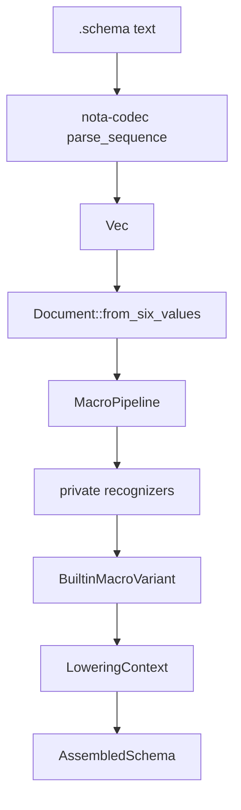
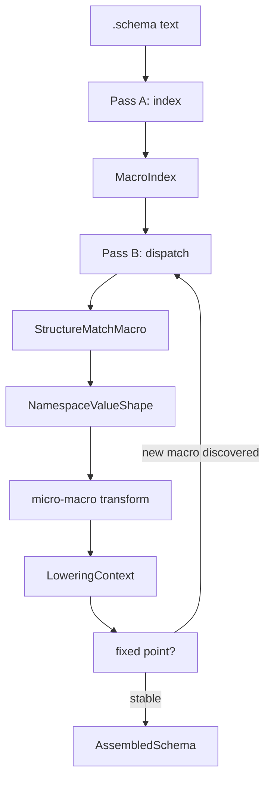
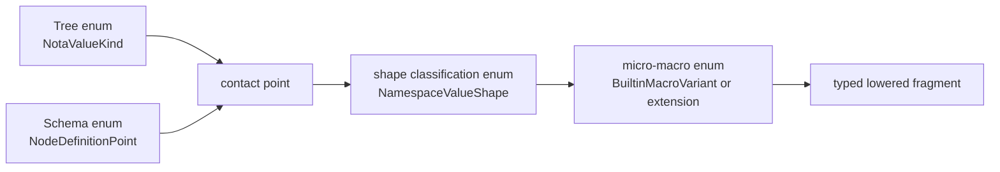

# Macro System Delta From /189

## Frame

`reports/second-designer/189-macro-system-broader-understanding-2026-05-25.md`
does not overturn the implementation in this slice. It names the next
layer above it: the current `schema` branch proves that `NotaValue`
shape-dispatch can assemble Spirit's schema; `/189` says that this
dispatch should become an explicit macro system with an indexing pass,
named structure-match phase, micro-macros, and lazy-loaded extension
macros.

The schema worktree is currently claimed by `second-operator`, so this
file records the implementation delta instead of editing the code.

## How I Now See The Engine Running

There are three increasingly explicit forms of the same engine.

The current implementation:



The `/189` target:



The final reusable pattern:



This is the concrete meaning of psyche record `602`: engine work
should be framed as one closed tree/enum surface meeting another
closed tree/enum surface. That meeting point is a named relation, not
an incidental `if` chain.

## What /189 Adds

`/189` adds five concepts that were implicit or only partly present in
the branch:

1. **Two-phase dispatch.** First classify structure, then transform.
   Today this is private and inline in `shape_parser.rs` and
   `multi_pass.rs`.
2. **Micro-macros.** `EnumShortSyntaxMacro`,
   `StructShortSyntaxMacro`, `NewtypeShortSyntaxMacro`,
   `TypeExpressionMacro`, and `UpgradeAnnotationMacro` should be
   separate small units, not large recognizer blocks.
3. **Attachment points.** A struct macro does not parse field types by
   hand; it calls a type-expression macro at each field type position.
4. **Index before dispatch.** Names and imports should be collected
   before transformation so forward references are normal.
5. **Core versus extension macros.** Core schema macros are always
   present; user macros load by explicit reference from imported macro
   libraries.

## Next Implementation Shape

The smallest code slice that carries `/189` without overbuilding is:

```rust
pub enum NodeDefinitionPoint {
    Imports,
    OrdinaryHeader,
    OwnerHeader,
    SemaHeader,
    NamespaceDeclaration,
    Feature,
    TypeExpression,
    UpgradeAnnotation,
}

pub enum NamespaceValueShape {
    EnumShortSyntax,
    StructShortSyntax,
    NewtypeShortSyntax,
    AliasReference,
}

pub fn classify_namespace_value(value: &NotaValue) -> Result<NamespaceValueShape> {
    match value.kind() {
        NotaValueKind::Sequence => classify_sequence_namespace_value(value),
        NotaValueKind::Record if value.is_single_ident_record() => {
            Ok(NamespaceValueShape::NewtypeShortSyntax)
        }
        NotaValueKind::Record => classify_record_namespace_value(value),
        NotaValueKind::Identifier if value.is_pascal_case_identifier() => {
            Ok(NamespaceValueShape::AliasReference)
        }
        kind => Err(Error::unexpected_node_shape(
            NodeDefinitionPoint::NamespaceDeclaration,
            kind,
        )),
    }
}
```

That makes the enum contact point testable immediately. It does not
yet require user macro registration, macro-library versioning, or
fixed-point iteration.

## Test Constraints To Add Next

The next schema tests should constrain the relation directly:

```rust
#[test]
fn namespace_shape_classification_is_explicit() {
    assert_eq!(
        classify_namespace_value(&parse_str("[Decision Principle]").unwrap()).unwrap(),
        NamespaceValueShape::EnumShortSyntax
    );
    assert_eq!(
        classify_namespace_value(&parse_str("(String)").unwrap()).unwrap(),
        NamespaceValueShape::NewtypeShortSyntax
    );
    assert_eq!(
        classify_namespace_value(&parse_str("Topic").unwrap()).unwrap(),
        NamespaceValueShape::AliasReference
    );
}
```

And an error test should include both sides of the relationship:

```rust
#[test]
fn wrong_shape_reports_node_point_and_value_kind() {
    let error = classify_at(NodeDefinitionPoint::NamespaceDeclaration, &parse_str("123").unwrap())
        .unwrap_err();
    assert!(error.to_string().contains("NamespaceDeclaration"));
    assert!(error.to_string().contains("Integer"));
}
```

This is stronger than "parser rejects bad input." It proves the engine
knows which schema point was expecting which NOTA tree shape.

## Where I Disagree Or Tighten

`/189` says `[(State StateSubscription) ...]` can be enum short-syntax
for data-carrying enum variants. I would avoid that exact shape for
now because it reintroduces ambiguity with vectors of records. The
clearer uniform data-carrying enum member remains parenthesized inside
the enum vector:

```nota
Watch [(State StateSubscription) (Records RecordSubscription)]
```

That is fine because the outer namespace value is a sequence, and each
inner record is a variant node. The structure-match macro should name
that as `EnumShortSyntax`, then the enum transformation macro decides
unit versus data-carrying member for each inner value.

## Current Block

The schema implementation worktree is currently locked by
`second-operator` for "port schema NotaValue macro pipeline to main".
Operator should not edit it concurrently. Once that lock clears, the
next code slice is the explicit `NodeDefinitionPoint` /
`NamespaceValueShape` API and tests above.
