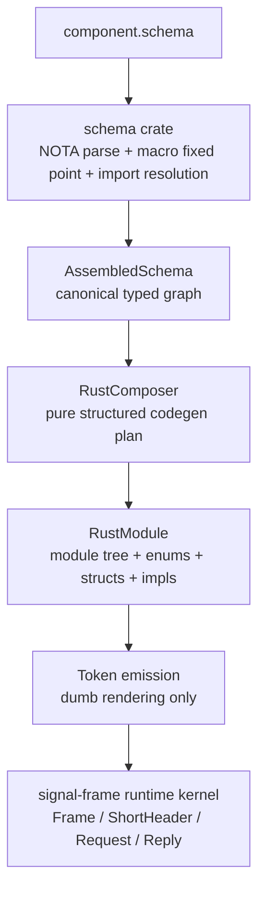

# 184 — schema macro old-emitter audit

## Frame

Psyche intent captured before audit:

- Spirit record 637: schema-derived Rust emission must not rewire into the old signal macro implementation.
- Spirit record 638: audit current schema macro generation for old-macro reuse and, if present, review the proper top-down replacement.

Scope inspected:

- `/git/github.com/LiGoldragon/signal-frame/macros/src/lib.rs`
- `/git/github.com/LiGoldragon/signal-frame/macros/src/schema_reader.rs`
- `/git/github.com/LiGoldragon/signal-frame/macros/src/model.rs`
- `/git/github.com/LiGoldragon/signal-frame/macros/src/emit.rs`
- current design reports `/338`, `/339`, `nota-designer/8`, `/334`, and bead `primary-ezqx.1`.

## Verdict

The current implementation still rewires schema input back into the old macro
backend.

It is not the oldest verb-tagged `SignalVerb` system, but it is still the
old `signal_channel!` compiler architecture:

```text
signal_channel!([schema])
  -> schema_reader::read_default_schema()
  -> SchemaConverter::into_channel_spec()
  -> validate::validate(&ChannelSpec)
  -> emit::emit(&ChannelSpec)
```

That violates the new intent. The schema system is now supposed to be the
Rust code composer: structured schema data should drive Rust emission directly,
not be squeezed into `ChannelSpec`, a model designed for the old handwritten
`signal_channel! { ... }` grammar.

## Evidence

`signal-frame/macros/src/lib.rs` still has a dual-mode entrypoint. If the input
starts with `[`, it calls the schema reader; otherwise it parses the old Rust
macro body. Both paths end at the same `validate` and `emit` calls:

- `lib.rs:56-70`: `[schema] -> read_default_schema() -> validate(&spec) -> emit(&spec)`.
- `lib.rs:62`: non-schema input still parses `syn::parse::<ChannelSpec>(input)`.

`schema_reader.rs` states the problem directly:

- `schema_reader.rs:1-5`: "Schema crate adapter for `signal_channel!([schema])`" and "translates ... into the existing `signal_channel!` emission model."
- `schema_reader.rs:23-33`: reads `LoadedSchema`, then calls `SchemaConverter::into_channel_spec`.
- `schema_reader.rs:70-88`: builds `ChannelSpec` from request/reply/event/streams/observable/schema fragments.

The adapter loses schema structure:

- `schema_reader.rs:91-121`: request routes are flattened into `RequestBlockSpec`; multiple endpoints under one root are rejected as unsupported.
- `schema_reader.rs:271-287`: local/imported schema types are copied into a private `SchemaSpec` map.
- `schema_reader.rs:425-517`: `DeclarationBody` is converted into private `SchemaDefinition` / `SchemaVariant` / `SchemaType` mirrors.

`model.rs` is still the old macro model:

- `model.rs:1-3`: one `ChannelSpec` per `signal_channel!` invocation.
- `model.rs:10-18`: `ChannelSpec` carries request/reply/event/stream/observable/schema sidecars.

`emit.rs` emits from `ChannelSpec`, not `AssembledSchema`:

- `emit.rs:19-46`: all emitted Rust chunks derive from `ChannelSpec`.
- `emit_log_variant_impl` consults the sidecar `SchemaSpec`, not the actual `AssembledSchema` route/type graph.

## Why This Is Wrong Now

Earlier reports tolerated `TryFrom<&AssembledSchema> for ChannelSpec` as a bridge. That was a useful stepping stone when the schema crate was immature. It is now the wrong architecture for the current intent.

`AssembledSchema` has become the canonical machine object. It carries routes, legs, root slots, endpoint slots, local/imported types, features, upgrade annotations, and now module/qualified-name metadata. Forcing that object through `ChannelSpec` discards the exact structure the schema engine exists to preserve.

The damage shows up mechanically:

- multi-endpoint roots are structurally natural in `AssembledSchema` but rejected by the adapter;
- unit endpoints are natural route bodies but rejected by the adapter;
- imported type qualification is collapsed into bare names;
- module-per-schema emission cannot land cleanly because `ChannelSpec` is one flat invocation;
- upgrade projection and storage descriptors have nowhere honest to live in `ChannelSpec`;
- schema syntax changes pressure `schema_reader.rs` even though parsing/lowering should be entirely owned by the `schema` crate.

The runtime kernel is not the problem. `signal-frame::Frame`, `ShortHeader`,
`Request`, `Reply`, `NonEmpty`, `Caller`, and subscription envelopes are real
kernel types and should remain reused. The old macro compiler model is the
problem.

## Correct Replacement Shape

The proper structure is:



The proc macro should be a thin shell:

```rust
#[proc_macro]
pub fn signal_schema(input: TokenStream) -> TokenStream {
    let request = SchemaMacroRequest::parse(input)?;
    let loaded = schema::LoadedSchema::read_path(request.path())?;
    let plan = schema_rust::RustComposer::new(loaded).compose()?;
    schema_rust::render(plan).into()
}
```

No `ChannelSpec` in this path. No `syn::parse::<ChannelSpec>`. No schema-side
translation into old request/reply/event block structs.

## Structured Composer Model

Introduce a code-generation library, preferably not itself a proc-macro crate,
so it can be unit-tested without macro harness friction:

```text
schema-rust/
  src/lib.rs
  src/composer.rs        RustComposer
  src/module.rs          RustModule, RustItem, RustVisibility
  src/name.rs            RustPath, RustIdentifier, imported/local qualification
  src/types.rs           enum/struct/newtype composition from AssembledType
  src/operation.rs       operation roots + endpoint sub-enums from routes
  src/reply.rs           reply enum from Feature::Reply
  src/event.rs           event enum + stream membership
  src/short_header.rs    ShortHeader projection/dispatch from Route table
  src/codec.rs           NOTA/rkyv/box-form emission from schema layout
  src/observable.rs      Tap/Untap + ObserverSet from Feature::Observable
  src/upgrade.rs         VersionProjection from previous/current UpgradePlan
  src/storage.rs         table/storage descriptors when schema carries storage
  src/render.rs          final quote rendering
```

The core input is:

```rust
pub struct RustComposerInput {
    pub current: LoadedSchema,
    pub previous: Option<LoadedSchema>,
    pub crate_name: CrateName,
    pub contract_kind: ContractKind,
}
```

The core output is:

```rust
pub struct RustModule {
    pub name: ModuleName,
    pub items: Vec<RustItem>,
}

pub enum RustItem {
    Enum(RustEnum),
    Struct(RustStruct),
    Newtype(RustNewtype),
    Impl(RustImpl),
    Trait(RustTrait),
    TypeAlias(RustTypeAlias),
    Const(RustConst),
    Module(RustModule),
}
```

The renderer is intentionally boring. It turns already-decided `RustItem`
values into tokens. All decisions happen before rendering.

## Top-Down Emission Order

The composer should emit in schema order, not old macro grammar order:

1. Schema module wrapper from `LoadedSchema::module()`.
2. Imports and qualified paths from `AssembledSchema::qualified_name_for`.
3. Local type declarations from `AssembledType::Local`.
4. Operation tree from `AssembledSchema::routes`.
5. Reply tree from `Feature::Reply`.
6. Event/stream tree from `Feature::Event` and `Feature::Observable`.
7. Frame aliases and request/reply builders bound to `signal-frame` kernel types.
8. `ShortHeader` projection and `kind_from_short_header` from route slots.
9. Dispatch traits from routes, including multi-endpoint roots.
10. NOTA/rkyv/box-form codecs from schema layout.
11. Version projection from `current.plan_upgrade_from(previous)`.
12. Storage descriptors when schema has storage/table metadata.

That order follows the data dependencies. Nothing needs to know the old
handwritten macro grammar.

## Constraints To Add

Add tests that lock out the current regression path:

1. A macro-path test or source grep check fails if the schema entrypoint calls
   `SchemaConverter::into_channel_spec`, `ChannelSpec`, or `emit::emit(&spec)`.
2. A positive schema test with one root and multiple endpoints emits nested
   operation structure instead of rejecting "one endpoint per operation root".
3. A positive schema test with a unit endpoint emits a unit payload route.
4. A generated-code snapshot proves module-per-schema output:
   `spirit::Operation`, `spirit::Entry`, imported `magnitude::Magnitude`.
5. A ShortHeader test proves route slots come from `AssembledSchema.routes`,
   not from request variant enumeration after flattening.
6. A projection test proves `UpgradePlan` emits the `From` / `VersionProjection`
   chain without hand-written migration glue.
7. A negative test proves the old handwritten `signal_channel! { ... }` grammar
   is no longer accepted on the schema macro path.

## Migration Plan

1. Keep `signal-frame` kernel types. Do not rewrite the runtime kernel.
2. Create the pure `schema-rust` composer library.
3. Move schema-derived emission out of `signal-frame/macros/src/emit.rs`.
4. Add a new macro entrypoint name for schema generation, or make
   `signal_channel!([schema])` immediately call only `schema-rust`.
5. Fence the old `signal_channel! { ... }` path as `legacy_signal_channel!`
   if existing crates still need a transition window.
6. Port `signal-persona-spirit` first and require the constraints above.
7. Port `owner-signal-persona-spirit` next; it is still hand-written.
8. Port `signal-version-handover` and `signal-orchestrate` to force
   multi-endpoint/unit route support.
9. Delete `ChannelSpec` once no hand-written contract macro uses it.

## Bead Impact

`primary-ezqx.1` should no longer be interpreted as "extend
`signal-frame`'s existing `ChannelSpec` emitter until it supports more cases."
I added a bead comment with that correction so the implementation queue does
not keep pointing operators at the old backend.

The updated target is:

```text
schema::LoadedSchema
  -> AssembledSchema
  -> schema-rust::RustComposer
  -> RustModule tree
  -> quote rendering
  -> signal-frame kernel bindings
```

Extending `schema_reader.rs` to support more cases is now explicitly the wrong
direction.

## Operator Recommendation

Stop adding features to `signal-frame/macros/src/schema_reader.rs` and
`emit.rs` for schema-derived generation. Treat them as legacy bridge code.

The next implementation slice should start the pure composer library with one
end-to-end witness:

- input: current `signal-persona-spirit/spirit.schema`;
- output: module-per-schema Rust for the ordinary Spirit contract;
- constraints: multi-endpoint/unit support included even if Spirit only uses
  a smaller subset;
- Nix check: generated code compiles and the old `ChannelSpec` backend is not
  touched by the schema path.
