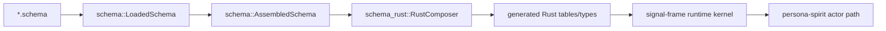

# 192 - Full-schema Spirit branch implementation

## Frame

This slice implements the strongest current schema-first interpretation from
designer reports `/338`, `/341`, operator report `/184`, and the later psyche
correction that **even `signal-frame` should be schema-described**.

The branch does not try to polish the old `signal_channel!` emitter. It builds
the new path around `emit_schema!`:



The current branch proves schema-derived structure can be used directly by the
Spirit runtime, not only parsed in isolation.

## Branch Set

All branches use bookmark `operator-full-schema-spirit-2026-05-26`.

| Repo | Commit | Summary |
|---|---:|---|
| `schema` | `a35b3e1e` | Adds effect-side feature macros, field-name lowering fixes, universal `Unknown`, and richer schema feature surfaces. |
| `signal-frame` | `4d3264ff` | Makes `emit_schema!` consume assembled schema through `schema_rust`, adds `schema/frame-kernel.schema`, and proves short-header dispatch from schema. |
| `signal-sema` | `a17476f0` | Aligns dependencies with schema-driven `signal-frame`; updates NOTA string tests to bracket strings. |
| `signal-executor` | `2ed1ad63` | Aligns dependencies with schema-driven `signal-frame` and `signal-sema`. |
| `signal-version-handover` | `08d2cb64` | Aligns dependencies with schema-driven `signal-frame`. |
| `owner-signal-version-handover` | `653d7099` | Aligns dependencies with schema-driven `signal-frame` and `signal-sema`. |
| `signal-engine-management` | `193dd7a5` | Aligns dependencies with schema-driven `signal-frame`. |
| `signal-persona-spirit` | `2da9dfd1` | Adds the ordinary Spirit schema with working, owner-adjacent, and sema-turn schema surfaces. |
| `owner-signal-persona-spirit` | `446da4f3` | Adds the owner Spirit schema and owner dispatch proof. |
| `persona-spirit` | `fbbc8f72` | Adds `spirit-runtime.schema` and wires the actor path to schema-derived turn/effect/reply tables. |

## What Landed

### `schema`

The schema crate now carries more of the macro language needed by Spirit:

- `Feature::EffectTable`
- `Feature::FanOutTargets`
- `Feature::StorageDescriptor`
- universal `Unknown` injection for response enums
- snake-case Rust field derivation from schema type names

This is still an MVP schema engine, but it now has enough feature-surface to
describe the turn path:

```schema
[
  (EffectTable [
    [AssertEntry EntryAsserted RecordAccepted]
    [ReadRecordDescriptions RecordsObserved RecordsObserved]
  ])
  (FanOutTargets [
    [EntryAsserted [RecordSubscribers]]
    [RecordsObserved [ObserverSubscribers]]
  ])
]
```

### `signal-frame`

`signal-frame` now has a schema of its own:

```text
schema/frame-kernel.schema
```

The generated code path goes through `schema::LoadedSchema` and
`schema_rust::RustComposer`. The old `signal_channel!` channel-spec path is not
used for this new proof.

The important implementation detail is that the frame kernel is no longer
treated as an implicit exception. Frame-level ideas such as route headers and
kernel dispatch are describable as schema data.

### Spirit Signal Repos

`signal-persona-spirit` now has:

```text
spirit.schema
```

It describes the ordinary Spirit surface, the sema turn surface, and the
runtime table hints needed by the pilot:

```schema
[
  (State (Statement))
  (Record (Entry))
  (Observe (Observation))
  (Watch (Subscription))
  (Unwatch (SubscriptionToken))
]

[
  (Project (AssertEntry ReadRecordDescriptions ReadRecordProvenances))
  (Emit (EntryAsserted RecordsObserved RecordProvenancesObserved))
  (Respond (RecordAccepted RecordsObserved RecordProvenancesObserved))
]
```

`owner-signal-persona-spirit` now has:

```text
owner-spirit.schema
```

The owner schema currently groups owner commands under an `Owner` root because
the current schema namespace cannot yet express a route root and a same-named
payload type in the same context without collision.

## Runtime Proof

`persona-spirit` now has:

```text
schema/spirit-runtime.schema
tests/full_schema_runtime.rs
```

The runtime schema is emitted into the crate:

```rust
pub const SPIRIT_RUNTIME_SCHEMA_TEXT: &str = include_str!("../schema/spirit-runtime.schema");

signal_frame::emit_schema!("schema/spirit-runtime.schema");
```

`include_str!` is deliberate. The current proc-macro file read alone did not
give a strong Cargo rebuild witness for schema edits. The include makes schema
changes visible to Cargo until the schema compiler owns proper dependency
tracking.

The actor path now asks the schema-derived table what effect and fanout are
declared for the command/effect pair:

```rust
debug_assert_eq!(
    effect.command().schema_declared_effect(),
    Some(effect.effect().schema_effect())
);
debug_assert!(effect.effect().schema_declared_fan_out().is_some());
```

The tests prove live operations match the schema table:

- record turn: `AssertEntry -> EntryAsserted -> RecordAccepted`
- description query turn: `ReadRecordDescriptions -> RecordsObserved`
- provenance query turn: `ReadRecordProvenances -> RecordProvenancesObserved`
- storage surface: `Records -> RecordsTable`

The provenance split is important. A single old action name, `ReadRecords`,
was too vague because the payload mode can produce distinct effects. The schema
turn language wants distinct action names when the effect/reply differs.

## Constraint Tests

Passed in relevant repos:

- `schema`: `cargo test`
- `schema`: `nix flake check --option max-jobs 0 --print-build-logs`
- `signal-frame`: `cargo test`
- `signal-frame`: `nix flake check --option max-jobs 0 --print-build-logs`
- `signal-persona-spirit`: `cargo test`
- `signal-persona-spirit`: `nix flake check --option max-jobs 0 --print-build-logs`
- `owner-signal-persona-spirit`: `cargo test`
- `owner-signal-persona-spirit`: `nix flake check --option max-jobs 0 --print-build-logs`
- `persona-spirit`: `cargo test`
- `persona-spirit`: `nix flake check --option max-jobs 0 --print-build-logs`

Support branches also passed `cargo test`:

- `signal-sema`
- `signal-executor`
- `signal-version-handover`
- `owner-signal-version-handover`
- `signal-engine-management`

The persona-spirit Nix check ran the full package/check surface, including:

- daemon tests
- boundary tests
- migration tests
- sema projection tests
- `full_schema_runtime`
- clippy
- docs
- split package checks

## Discoveries

### Schema edits need explicit rebuild tracking

The new proc macro reads schema files, but Cargo does not automatically know
that the crate should rebuild when the schema file changes. The temporary
answer is an `include_str!` witness in the runtime crate. The proper answer is
for the schema compiler path to own dependency tracking, probably through a
build-script-generated include or a proc-macro strategy with explicit file
tracking if stable support exists.

### Action names must match semantic effect boundaries

The old Spirit command `ReadRecords` hid at least two schema actions:

- `ReadRecordDescriptions`
- `ReadRecordProvenances`

This is a useful constraint. If a command mode changes the effect/reply
meaningfully, the schema action should split so the effect table remains
deterministic and auditable.

### Owner schema currently needs a namespace workaround

The current schema namespace model cannot cleanly define both:

- a root operation `Start`
- a payload type `Start`

inside the same owner schema context. I avoided the collision by grouping owner
orders under one `Owner` root. This is usable for the proof, but the schema
language still needs a cleaner answer for route-root names versus payload names.

### Dependency unification is necessary for schema branches

Once `signal-frame` changed, downstream crates had to move together. Otherwise
the workspace saw duplicate `Request`, `Reply`, `ExchangeIdentifier`, and
`signal_sema::Magnitude` types through mixed branch/main dependency graphs.

This branch therefore includes support branches in `signal-sema`,
`signal-executor`, version handover, and engine management. That is the real
shape of this migration: the frame kernel is a dependency root.

## What This Does Not Yet Do

This is a strong MVP proof, not the final deletion of legacy contract
generation.

Remaining gaps:

- The public contract crates still keep their legacy hand-written or
  `signal_channel!` production types alongside the new schema proof.
- `persona-spirit` uses schema-derived runtime tables, but does not yet replace
  every external contract type with generated schema output.
- The schema compiler does not yet emit adapters or own the full source of
  truth for every request/reply/rkyv type in the Spirit triad.
- The schema language still needs a first-class collision rule for route-root
  names versus payload type names.
- The schema compiler needs a durable rebuild mechanism for schema file edits.

## Recommendation

The branch is ready for designer review as the first real full-schema
implementation proof.

The next implementation decision is whether to:

1. replace the Spirit public contract types with generated schema types now, or
2. add explicit generated-to-legacy adapters for one more migration step.

My lean is option 1 for Spirit itself. The branch already proved that partial
schema integration creates dependency-pressure anyway. Keeping adapters would
reduce immediate churn, but it would also preserve two sources of truth in the
exact pilot that is supposed to kill the old emitter path.

