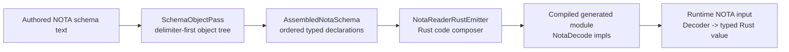

# 195 — Schema-driven NOTA reader prototype

Operator implementation report for the 2026-05-26 request: "show me
your vision" and implement a prototype stack for a schema-driven NOTA
parser that emits Rust code to read NOTA, with tests.

Implementation branch:
`/home/li/wt/github.com/LiGoldragon/schema/operator-schema-driven-nota-parser-prototype-2026-05-26`

Base: `operator-full-schema-spirit-2026-05-26` at `2498e5b3`, because
that branch contains the delimiter-first `SchemaObjectPass` foundation.

## Vision

The stack should be a direct pipeline. No old signal macro text body is
allowed in the path.



The prototype deliberately keeps the first slice small:

- one namespace map;
- schema values interpreted by delimiter **only inside the namespace
  macro position used by this prototype**:
  - `[FieldType ...]` is lowered by that macro into a struct or
    one-field newtype;
  - `(Variant ...)` is lowered by that macro into an enum declaration;
  - a bare identifier is lowered by that macro into an alias;
- Rust reader code is emitted from the assembled declarations;
- generated code reads NOTA using `nota_codec::Decoder` and
  `NotaDecode`.

This is not yet the full self-hosting schema daemon. It proves the
load-bearing shape: delimiter objects first, schema interpretation
second, Rust emission last.

## Post-report correction

Psyche corrected one phrase after the first version of this report.
The rule is not "`[]` means struct everywhere" or "`()` means enum
everywhere." A delimiter shape gets that meaning only where a schema
macro is expected and the active macro lowerer assigns that meaning.

In this prototype, the namespace map value position is the macro
position. The namespace macro receives the object and lowers it:

```text
{ Entry [Topics Kind Description Magnitude] }
        ^^^^^^^^^^^^^^^^^^^^^^^^^^^^^^^^^^
        namespace-value macro input

NamespaceValueLowerer sees square brackets at this position
  -> emits an assembled struct definition
```

The same square-bracket object somewhere else might be a vector value,
a string source, or input to a different macro. The delimiter-first
pass only preserves shape. Schema macros interpret shape.

The fully lowered destination is the assembled schema file type:
`AssembledSchema` / `Asschema` in the current naming discussion. That
destination is pure NOTA-representable assembled data: resolved enum
definitions, resolved struct definitions, typed endings, no remaining
macros. Macros re-emit schema structure toward that assembled form;
the implementation may keep the intermediate in memory as typed Rust
values or binary data, but semantically the macro is re-emitting
schema.

The header should likewise be derived from assembled type structure
rather than authored as a special separate declaration. The root shape
should usually begin with an enum that distinguishes input/output
spaces and supports explicit numeric variant ranges for short-header
dispatch.

## Subagent survey

An async read-only subagent surveyed `nota-codec`, `schema`,
`signal-frame`, and the recent reports. Its useful conclusions:

- reuse `nota_codec::parse_sequence`, `NotaValue`, and
  `nota_codec::Decoder`; do not write a new NOTA parser;
- build on the `SchemaObjectPass` worktree rather than schema `main`,
  which still lacked that branch at survey time;
- avoid `signal_channel!`, `legacy_signal_channel!`, and old
  signal-frame channel machinery;
- keep the immediate slice in the schema crate before trying to wire
  the proc-macro path;
- do not build on the retracted authored `Feature::EffectTable`,
  `FanOutTargets`, or `StorageDescriptor` surface.

The subagent suggested emitting `nota_codec` derive attributes first.
I chose the stricter prototype: emit explicit `NotaDecode` impls and
compare the emitted code against a compiled fixture. That proves the
reader behavior directly rather than proving only that a derive marker
was present.

## What landed

### `src/nota_reader.rs`

New public prototype types:

- `AssembledNotaSchema`
- `AssembledNotaType`
- `NotaReaderRustEmitter`

`AssembledNotaSchema::from_namespace_text` runs:

```text
schema text
  -> SchemaObjectPass::parse_text
  -> last curly namespace map
  -> ordered AssembledNotaType declarations
```

The important part is order. The existing production
`AssembledSchema` stores types in a `BTreeMap`, which is fine for many
lookups but loses authored order. This prototype preserves namespace
map order in `Vec<AssembledNotaType>`, because schema is meant to be
an ordered representation of data and load order.

`NotaReaderRustEmitter::emit_module` emits a complete Rust module:

- newtype structs with `NotaDecode`;
- positional structs with field names derived from type names;
- enums with unit and single-payload data-carrying variants;
- explicit NOTA error behavior for unit variants in record form and
  data-carrying variants in bare form.

The emitted code depends on `nota_codec`, not `signal_channel!`,
`legacy_signal_channel!`, or the old authored `Feature` path.

### `tests/schema_driven_nota_reader.rs`

New test suite with five constraints:

1. A delimiter-first namespace schema lowers into an ordered assembled
   tree.
2. Generated Rust exactly matches a compiled fixture.
3. The compiled generated reader decodes a positional struct record.
4. The compiled generated reader decodes both unit and data-carrying
   enum variants.
5. The compiled generated reader rejects labeled-field NOTA shape.

The key test trick is this:

```text
generated string == tests/fixtures/generated_nota_reader/expected.rs
and expected.rs is included as Rust code in the integration test
```

So the emitter output is not only string-compared; it is compared
against code that Rust actually compiled and that the test then uses
to decode real NOTA input.

## Example

Authored schema:

```nota
{
  Topic [String]
  Topics [(Vec Topic)]
  Description [String]
  Entry [Topics Kind Description Magnitude]
  Kind (Decision Principle Correction Clarification Constraint)
  Magnitude (Minimum VeryLow Low Medium High VeryHigh Maximum)
  Observation (Topics (Records Entry))
}
```

Generated reader accepts:

```nota
([schema nota] Decision [schema driven reader] High)
```

as an `Entry` with:

- `topics: Topics(Vec<Topic>)`
- `kind: Kind::Decision`
- `description: Description`
- `magnitude: Magnitude::High`

It also accepts:

```nota
(Records ([schema] Constraint [reader works] Maximum))
```

as `Observation::Records(Entry { ... })`.

It rejects this labeled-field shape:

```nota
(Entry (topics [schema]) (kind Decision))
```

with `nota_codec::Error::LabeledFieldShape`, preserving the rule that
NOTA records are positional.

## Verification

Commands run in the schema worktree:

```sh
cargo fmt
cargo test --test schema_driven_nota_reader -- --nocapture
cargo test
nix flake check --option max-jobs 0 --print-build-logs
```

Results:

- focused prototype test: 5 passed;
- full cargo test suite: passed;
- Nix flake check: passed after one clippy fix.

The first Nix run caught `clippy::needless_question_mark`; that was
fixed and the full Nix check was rerun successfully.

## What this discovered

The existing `AssembledSchema` type is not yet the final form for this
design. It stores types in a `BTreeMap<Name, AssembledType>`, so it
does not preserve authored namespace order. For schema as ordered
storage truth, the final assembled form needs an order-preserving
surface.

The prototype uses a separate `AssembledNotaSchema` to avoid distorting
the older contract-shaped `AssembledSchema` while proving the shape.
The next step should either:

- migrate `AssembledSchema` to preserve type order while keeping lookup
  indexes internally; or
- make a new canonical assembled tree that preserves order and let the
  old `AssembledSchema` retire as the six-position compatibility form.

Also still visible: the schema crate still contains the old
`EffectTable`, `FanOutTargets`, and `StorageDescriptor` code and tests.
This prototype does not use them and explicitly tests that emitted
reader code does not mention `Feature`, but the old surface still needs
removal in a separate cleanup.

## Next implementation slice

The next operator slice should turn this prototype into the normal
path:

1. Rename/shape `AssembledNotaSchema` into the canonical
   order-preserving assembled schema tree.
2. Remove authored `Feature` acceptance from schema parsing.
3. Move `NotaReaderRustEmitter` style emission into the real
   `emit_schema!` composer path.
4. Generate one Spirit v0.3 reader surface from a `.schema` file and
   compare it against the current hand-written contract behavior.
5. Add a Nix check that fails if generated reader emission uses
   `signal_channel!`, `legacy_signal_channel!`, or authored `Feature`
   sections.

That sequence keeps the system honest: schema text becomes a NOTA
object tree, the object tree becomes an ordered assembled schema, and
only that assembled schema emits Rust.
