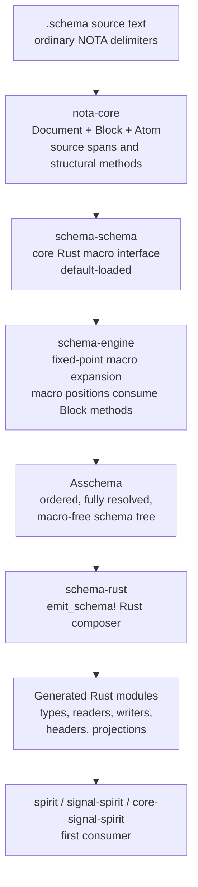

# 199 — NotaCore / schema stack implementation target

Operator audit and implementation target design after reviewing the recent
schema, NOTA, Spirit, and NotaCore prototypes on 2026-05-26.

## Scope

This report answers the current operator question:

- audit recent prototypes, including my operator branches and the newer
  NotaCore direction;
- identify what each branch proves, what to keep, and what to avoid;
- pick one implementation target that future operators can actually build;
- name the repositories and branch sources an agent should inspect;
- carry the new "major break can use a separate next/v2 repo" workflow into
  the implementation plan.

Relevant newly captured intent:

- Spirit record `809`: for major architectural breaks, a separate `next` or
  `v2` prototype repository is acceptable and often good practice.
- Spirit record `810`: audit the recent schema and NotaCore prototypes,
  weigh newer prototypes as more recent intent, and distill one
  implementation-target design.

I treated work instructions as work instructions, not intent. The durable
intent extracted was the repository workflow principle and this audit/design
target.

## Sources read

Reports and branch reports:

- `reports/designer/349-context-maintenance-sweep-2026-05-25/1-poc-schema-stack-explainer.md`
- `reports/designer/350-schema-feature-drift-retraction-2026-05-26.md`
- `reports/designer/353-schema-derived-nota-design-2026-05-26.md`
- `reports/designer-assistant/354-schema-derived-nota-prototype-2026-05-26.md`
- `reports/designer/355-critique-of-operator-195-schema-driven-nota-reader-2026-05-26.md`
- `reports/designer-assistant/356-new-repos-and-block-parser-prototype-2026-05-26.md`
- `reports/designer/357-nota-as-library-schema-as-root-struct-2026-05-26.md`
- `reports/operator/193-schema-object-pass-and-spirit-v0-3-skill-correction-2026-05-26.md`
- `reports/operator/194-nota-schema-restack-operator-reading-2026-05-26.md`
- `reports/operator/195-schema-driven-nota-reader-prototype-2026-05-26.md`
- `reports/operator/196-schema-object-block-pass-prototype-2026-05-26.md`
- `reports/operator/197-nota-core-design-refresh-and-gap-audit-2026-05-26.md`
- `reports/operator/198-nota-structural-library-prototype-2026-05-26/`
- `reports/second-operator/190-schema-mainline-macro-index-port-2026-05-25.md`

Worktrees and repos inspected:

- `/home/li/wt/github.com/LiGoldragon/schema/operator-schema-driven-nota-parser-prototype-2026-05-26`
- `/home/li/wt/github.com/LiGoldragon/schema/designer-schema-derived-nota-2026-05-26`
- `/home/li/wt/github.com/LiGoldragon/schema/designer-schema-schema-prototype-2026-05-26`
- `/home/li/wt/github.com/LiGoldragon/schema/fully-schema-and-nota-mvp`
- `/home/li/wt/github.com/LiGoldragon/nota-codec/fully-schema-and-nota-mvp`
- `/git/github.com/LiGoldragon/spirit`
- `/git/github.com/LiGoldragon/signal-spirit`
- `/git/github.com/LiGoldragon/core-signal-spirit`
- `/git/github.com/LiGoldragon/nota`
- `/git/github.com/LiGoldragon/nota-codec`
- `/git/github.com/LiGoldragon/schema`
- `/git/github.com/LiGoldragon/signal-frame`

I did not rerun all prototype test suites during this audit. The report is a
design target built from already reported and inspected implementation
evidence. The newest operator schema branch was already verified in the
preceding pass with cargo and explicit Nix checks.

## Branch inventory

| Source | Branch / commit | Keep | Avoid |
|---|---|---|---|
| Old full-stack schema POC | `designer-schema-full-stack-spirit-2026-05-25` across `schema`, `signal-frame`, `persona-spirit`, `signal-persona-spirit` | One declaration can emit actor-ish Rust surfaces; tests can prove generated code and daemon behavior; universal Unknown injection as hidden macro remains useful. | Authored `EffectTable`, `FanOutTargets`, `StorageDescriptor` Features are retracted; dual wiring through old `signal_channel!` is transitional evidence, not target design. |
| Retraction sweep | `/350` | Schema user surface is data types only; namespace map is the heart of authored schema; runtime dispatch/effects are Rust/composer/runtime, not authored schema content. | Do not keep any canonical `.schema` examples with Features sections. |
| Designer all-the-way-back prototype | `schema/designer-schema-derived-nota-2026-05-26` @ `0e04c22` and sibling branches | `nota.schema`, bootstrap kernel, in-process library, macro classifier, coordinate demo, core fallthrough, constraint tests. | Mandatory five-block layout, comment-heavy schema examples, and heuristic bracket-string/vector split are prototype compromises. |
| Designer schema-schema prototype | `schema/designer-schema-schema-prototype-2026-05-26` | Public `Macro` trait, `MacroContext`, `SchemaSchema`, tests for records 799-807, and position-aware built-in macros are valuable. | `parse_schema_file` still reuses the five-block `ThreePartSchema` reader and `lower_via_macros` hard-codes five positions. This conflicts with the newer root-struct direction. |
| Operator reader prototype | `schema/operator-schema-driven-nota-parser-prototype-2026-05-26` @ `f9b5fdd` then `9dcc0244` | Ordered assembled declarations; Rust reader emitter; compiled fixture tests; runtime decode against real NOTA; block matcher before lowering. | It is downstream of `nota_codec`, so it does not prove NOTA itself schema-derived. `SchemaObjectPass` and block pass remain parallel trees. |
| Operator block pass / structural layer | reports `/196`, `/198`, branch @ `9dcc0244` | Source spans; delimiter-bounded blocks; `QualifiedSymbol`; `qualifies_as_*`; `SchemaMacroPattern`; Nix tests that caught clippy. | Structural APIs still live in `schema`; final home should be NotaCore. Avoid keeping separate block and value trees. |
| Second-operator mainline macro-index port | `schema` main commits `da7b6d0`, `b754a0e` | Macro indexing before lowering, shape parser path, `MacroIndexReport`, first micro-macro selector. | Still built around old six positional values and feature candidates. Treat as a production foothold, not target syntax. |
| New Spirit repos | `spirit` @ `1d1ba72`, `signal-spirit` @ `8a87870`, `core-signal-spirit` @ `bcd2d61` | Correct naming direction for Spirit proof and core/ordinary split. Good target consumers for the new schema stack. | They are scaffolds only. Do not assume their current schema files are final. |
| `nota-next` branch | `nota` @ `45a7543` | Existing repo branch marker for future stable Nota changes. | Empty branch is not yet an implementation target by itself. |

## The target in one sentence

Build a clean **NotaCore/schema-stack integration repo** that turns raw NOTA
text into structural blocks, runs schema macros over those blocks to produce
order-preserving `Asschema`, emits Rust from `Asschema` through `emit_schema!`,
and proves the stack by generating the Spirit ordinary and core signal
contracts in the new `spirit` / `signal-spirit` / `core-signal-spirit` repos,
without using the old `signal_channel!` or authored schema Features.

## Repository target

### Create one integration repo first

Recommended new repo:

```text
nota-core-next
```

Purpose: a clean integration sandbox for the architectural break. It should
not start as another small branch on the old `schema` repo because the old
repo currently carries stale six-position guidance, legacy parser surfaces,
and retracted Feature tests. It also should not immediately replace `nota` or
`nota-codec`, because production still depends on those names.

`nota-core-next` can start as a fork-like seed from the strongest files in the
existing prototypes, but it should be authored as a new crate/workspace with a
clear deletion path:

```text
nota-core-next/
  crates/nota-core/          raw NOTA block parser and structural API
  crates/asschema/           canonical assembled schema data model
  crates/schema-engine/      schema-schema, macro registry, expansion engine
  crates/schema-rust/        Rust composer and emit_schema! proc macro
  crates/schema-test-spirit/ fixtures proving Spirit contract generation
  schemas/nota.schema        foundational NOTA schema, commentless
  schemas/schema.schema      schema-schema declaration once bootstrap permits
  tests/                     Nix and Rust integration witnesses
```

This is a prototype integration repo, not final naming. Once stable, split or
rename into the permanent repos:

- `nota` / `nota-codec` absorb `crates/nota-core`;
- `schema` absorbs `crates/asschema` and `crates/schema-engine`;
- `signal-frame` or a separate final composer repo absorbs `schema-rust`;
- `spirit`, `signal-spirit`, and `core-signal-spirit` consume the generated
  contracts.

This honors both record `781` (`nota-next` branch exists for Nota changes) and
record `809` (major breaks may use a new next/v2 repo). The new repo is the
clean integration lane; `nota-next` remains the eventual branch where stable
NotaCore patches can land once the stack stops thrashing.

### Use the new Spirit triad as the first consumer

The first generated component proof should use:

```text
/git/github.com/LiGoldragon/spirit
/git/github.com/LiGoldragon/signal-spirit
/git/github.com/LiGoldragon/core-signal-spirit
```

Those repos already exist with the right naming direction:

- `spirit`: daemon/runtime component;
- `signal-spirit`: ordinary public socket contract;
- `core-signal-spirit`: privileged/core socket contract.

The proof should not target legacy `persona-spirit`,
`signal-persona-spirit`, or `owner-signal-persona-spirit` first. Those remain
production and migration reference points. The new repos are where the clean
schema-derived Spirit should be made coherent before backporting or replacing
anything.

## Target architecture



Key invariant: every layer consumes the layer below through typed data, not
through old text macros. `emit_schema!` consumes `Asschema`; it does not call
or wrap `signal_channel!`.

## Layer 1: NotaCore

NotaCore is the thin structure library, not the semantic schema interpreter.

It owns:

- delimiter balance;
- source spans: byte offset, line, column;
- exact source re-emission by span;
- root object count and child access;
- block shape predicates;
- atom classification candidates;
- bracket strings and block strings as raw structural forms;
- no namespace resolution;
- no final type legality;
- no schema lowering.

Core data model:

```rust
pub struct Document {
    pub source: SourceText,
    pub roots: Vec<Block>,
}

pub struct Block {
    pub delimiter: Delimiter,
    pub span: SourceSpan,
    pub objects: Vec<Object>,
}

pub enum Object {
    Block(Block),
    Atom(Atom),
}

pub struct Atom {
    pub text: String,
    pub span: SourceSpan,
    pub candidate: AtomCandidate,
}

pub enum AtomCandidate {
    QualifiedSymbol(SymbolClass),
    StringText,
    Integer,
    Float,
    Bytes,
}
```

Methods are part of the design, not convenience helpers:

```rust
impl Block {
    pub fn is_square_bracket(&self) -> bool;
    pub fn is_parenthesis(&self) -> bool;
    pub fn is_brace(&self) -> bool;
    pub fn holds_root_objects(&self) -> usize;
    pub fn root_object_at(&self, index: usize) -> Option<&Object>;
    pub fn reemit<'a>(&self, source: &'a str) -> &'a str;
}

impl Atom {
    pub fn qualifies_as_symbol(&self) -> bool;
    pub fn qualifies_as_pascal_case_symbol(&self) -> bool;
    pub fn qualifies_as_camel_case_symbol(&self) -> bool;
    pub fn qualifies_as_kebab_case_symbol(&self) -> bool;
    pub fn demote_to_string(&self) -> String;
}
```

Naming rule:

- `is_*` is for factual delimiter/source facts.
- `qualifies_as_*` is for candidate classification.
- final semantic claims such as "is a type name" are forbidden in NotaCore.

From prototypes to port:

- port `Block`, `SourceSpan`, range re-emission, and constraint tests from
  `schema/designer-schema-derived-nota-2026-05-26/prototype/src/blocks.rs`;
- port the refined method names and classification distinction from
  `schema/designer-schema-schema-prototype-2026-05-26/prototype/src/block_query.rs`;
- port `QualifiedSymbol`, `SymbolClass`, and `SchemaMacroPattern` ideas from
  `schema/operator-schema-driven-nota-parser-prototype-2026-05-26/src/object_block.rs`
  and `src/macro_pattern.rs`;
- do not port the full kernel heuristic that decides ordinary `[...]` string
  versus vector by punctuation. NotaCore should preserve enough structure that
  schema context can decide.

## Layer 2: schema-schema and macro engine

The schema-schema is the core Rust macro interface. It is the bootstrapped
floor that says how `.schema` files are interpreted before authored macros
exist.

Target trait:

```rust
pub trait SchemaMacro: Send + Sync {
    type Input;
    type Output;

    fn name(&self) -> MacroName;
    fn matches(&self, object: &Object, position: MacroPosition) -> bool;
    fn parse_input(&self, object: &Object, context: &MacroContext)
        -> Result<Self::Input, MacroError>;
    fn lower(&self, input: Self::Input, context: &mut MacroContext)
        -> Result<Self::Output, MacroError>;
}
```

`Input` is load-bearing: macro variants are data-carrying. Each macro has an
input struct that names the structural data the macro consumes. That is the
practical Rust version of "the macro's input type is its name in the macro."

The macro engine runs passes until no macro nodes remain:

```text
Document
  -> root Schema macro
  -> imports/exports macro
  -> input/output macro
  -> namespace macro
  -> enum / struct / newtype / import / alias macros
  -> Asschema
```

The engine should carry:

- an ordered macro registry;
- a `MacroPosition` value so the same delimiter shape can mean different
  things in different positions;
- a namespace table with define-before-use diagnostics where the selected
  schema root ordering requires it;
- imported schema exports;
- fixed-point iteration with a clear recursion limit and trace;
- an expansion report for tests and debugging.

Keep from prototypes:

- `Macro` / `MacroContext` / `SchemaSchema` from the designer schema-schema
  branch;
- `MacroIndex` and reports from second-operator `/190`;
- `SchemaMacroPattern` from operator `/198`.

Avoid:

- hard-coding the five-block layout as the permanent root shape;
- using content-only heuristics to distinguish imports from namespace when
  position already gives the role;
- returning lossy strings such as `"parenthesis 2 elements"` from lowerers
  except in temporary debug output.

## Layer 3: Asschema

`Asschema` is the canonical macro-free endpoint. It is not an implementation
detail and not the old `BTreeMap`-backed `AssembledSchema`.

Properties:

- order-preserving;
- pure NOTA-representable;
- fully qualified names available for debugging;
- no authored macro syntax remains;
- all imports resolved or recorded as typed external references;
- lookup maps are derived indexes, never canonical storage;
- headers are derived from the type tree, not separately authored;
- serializable as `.asschema` for debugging and for schema daemon cache.

Sketch:

```rust
pub struct Asschema {
    pub identity: SchemaIdentity,
    pub imports: Vec<ResolvedImport>,
    pub exports: Vec<ExportedName>,
    pub roots: Vec<RootSurface>,
    pub namespace: Vec<TypeDeclaration>,
}

pub enum RootSurface {
    Input(EnumDeclaration),
    Output(EnumDeclaration),
    State(TypeReference),
    Storage(Vec<TableDeclaration>),
}

pub enum TypeDeclaration {
    Struct(StructDeclaration),
    Enum(EnumDeclaration),
    Newtype(NewtypeDeclaration),
    Alias(AliasDeclaration),
    Primitive(PrimitiveDeclaration),
}

pub struct StructDeclaration {
    pub name: QualifiedName,
    pub fields: Vec<TypeReference>,
}

pub struct EnumDeclaration {
    pub name: QualifiedName,
    pub variants: Vec<VariantDeclaration>,
}
```

The old production `AssembledSchema` can be an adapter after this exists. It
should not be the new center because it loses authored order.

## Layer 4: header derivation

Headers are derived from `Asschema`, not authored as a separate "header"
section. The first useful rule:

```text
Input root enum    -> input header namespace
Output root enum   -> output header namespace
Core root enum     -> core socket header namespace
Ordinary root enum -> ordinary socket header namespace
```

The 64-bit short header should be emitted from the ordered enum tree:

- high-level namespace slot distinguishes input/output/core/ordinary where
  the transport needs it;
- root variant number comes from enum order or explicit stable numbering in
  `Asschema`;
- nested variant numbers are derived from the data-carrying path;
- the first implementation enforces the current "at most seven
  data-carrying root variants" limit as a compile-time/composer error;
- unit variants beyond the data-carrying root set can occupy the wider
  variant namespace as no-payload endpoints.

Test target: generated dispatch must be able to triage a message path from
the short header before reading the full body, then prove the full decode
lands on the same variant path.

## Layer 5: Rust composer

The Rust composer owns `emit_schema!`.

Hard rule: `emit_schema!` is a new structured composer over `Asschema`.
It must not call, wrap, or emulate the old text-body `signal_channel!`.

Generated output should include:

- Rust structs, enums, and newtypes;
- NOTA reader/writer impls generated from `Asschema`;
- rkyv/archive impls where applicable;
- short-header constants and dispatch tables;
- signal request/reply envelopes;
- sema projection traits where the schema declares a sema turn;
- version projection traits for main/next upgrade and downgrade;
- compile-time schema hash;
- tests fixtures or debug snapshots of emitted modules.

Keep the compiled-fixture methodology from operator `/195`:

```text
emit Rust string
  -> compare to checked-in fixture
  -> compile fixture in test crate
  -> run real decode/encode behavior through fixture
```

Every composer feature should have this three-way test shape.

## Layer 6: schema diff and upgrade generation

Upgrade code should derive from diffing `Asschema` MAIN versus NEXT.

Change classes:

- zero-cost: append unit enum variant within current discriminant width;
- append-only: append struct field with explicit default or optional wrapper;
- projection: newtype wrap/unwrap, enum wrap, vector wrap, type rename with
  annotation;
- destructive: dropped field or dropped variant, requiring explicit discard
  annotation and migration report;
- incompatible: reorder without explicit stable numbering, variant reuse,
  field type mutation without projection.

Generated traits:

```rust
pub trait UpgradeFrom<Previous> {
    type Error;
    fn upgrade_from(previous: Previous) -> Result<Self, Self::Error>
    where
        Self: Sized;
}

pub trait DowngradeTo<Previous> {
    type Error;
    fn downgrade_to(&self) -> Result<Previous, Self::Error>;
}
```

The NEXT version owns both:

- upgrade old database/message records into NEXT;
- downgrade/mirror NEXT-safe messages into MAIN during handover when the
  running transition still needs both versions to agree.

The schema diff engine should emit a machine-readable upgrade plan plus the
Rust trait impls. If the diff cannot infer a safe projection, the schema file
must carry an explicit upgrade annotation or the build fails.

## Authored schema example

Illustrative shape for `signal-spirit.schema`. This is not a final syntax
lock; it shows the current target rules:

- file context implies the root `Schema` struct;
- no `(Schema ...)` wrapper;
- structs are square-bracket field vectors;
- enums and variants are parenthesized;
- namespace is a curly map;
- strings use bracket strings;
- no comments inside canonical `.schema`.

```nota
{
  Magnitude (ImportAll [../signal-sema/magnitude.schema] [Magnitude])
}

[
  [
    (State (Statement Declaration))
    (Record (Entry))
    (Observe (Records Topics))
    (Watch (Subscription))
    (Unwatch (SubscriptionToken))
  ]
  [
    (Accepted (RecordAccepted))
    (Observed (RecordsObserved TopicsObserved))
    (Rejected (Problem))
  ]
]

{
  Topic [String]
  Topics [(Vec Topic)]
  Description [String]
  Entry [Topics Kind Description Magnitude]
  Kind (Decision Principle Correction Clarification Constraint)
  Statement [Description]
  Declaration [Description]
  Records [RecordQuery]
  RecordQuery [(Option Topic) (Option Kind) Projection]
  Projection (DescriptionOnly WithProvenance)
  RecordAccepted [u64]
  RecordsObserved [(Vec StoredEntry)]
  TopicsObserved [(Vec TopicCount)]
  TopicCount [Topic u64]
  StoredEntry [u64 Topics Kind Description Magnitude Date Time]
  Date [String]
  Time [String]
  Subscription [Topics]
  SubscriptionToken [u64]
  Problem [String]
}
```

The second root field is an input/output struct containing two vectors. The
macro position gives those two vectors their roles; the vectors themselves do
not name their fields. If the root-field ordering decision changes, the same
content moves, but the lowerers and tests should expose the change clearly.

## Implementation plan

### Phase 0: create the clean integration repo

Create `LiGoldragon/nota-core-next` with:

- `AGENTS.md`, `README.md`, `ARCHITECTURE.md`, `INTENT.md`;
- Nix flake with build, fmt, clippy, docs, tests;
- workspace crates listed above;
- copied prototype fixtures under `tests/prototype-sources/` with provenance
  comments in test code, not in `.schema` files.

Do not move production callers yet.

### Phase 1: raw NotaCore

Implement `Document`, `Block`, `Object`, `Atom`, `SourceSpan`, and
classification. Port and tighten tests:

- records 770-776: block spans, range re-emission, recursive predicates;
- records 799-803: `qualifies_as`, default-up classification, no schema
  resolution in NOTA;
- bracket string hard cases:
  `[hello world]`, `[we're ready]`, `[User]`, `[host localhost port 8080]`,
  `[|text with [brackets]|]`.

Decision for this phase: ordinary `[...]` remains a square-bracket block at
the raw layer unless it is unambiguously block-string syntax `[|...|]`.
Schema context decides string versus vector where ambiguity remains.

### Phase 2: schema-schema macros

Implement the core macro interface and built-ins:

- root schema macro;
- imports/exports macro;
- input/output macro;
- namespace map macro;
- enum declaration macro;
- struct declaration macro;
- newtype declaration macro;
- import source macro;
- alias macro only if a fixture needs it.

Port useful pieces from the designer schema-schema branch, but remove the
five-block permanent assumption. Macro position should drive role, not a
fixed physical block count.

### Phase 3: Asschema

Define `Asschema` as a crate with stable serialization and debug rendering.
Add `.asschema` golden fixtures:

- `nota.asschema`;
- `schema.asschema` once bootstrap allows;
- `signal-spirit.asschema`;
- `core-signal-spirit.asschema`.

Tests:

- authored order preserved;
- derived lookup indexes do not affect serialization;
- duplicate local names fail;
- imported name conflicts fail unless explicitly renamed;
- no macro nodes survive assembly.

### Phase 4: composer

Implement `emit_schema!` over `Asschema`.

First generated fixture:

- one small coordinate schema;
- one `signal-spirit` subset schema;
- one `core-signal-spirit` subset schema.

Tests:

- generated Rust string matches fixture;
- fixture compiles;
- generated readers decode real NOTA;
- generated writers produce bracket-string-safe NOTA;
- generated short headers match variant paths.

Explicit constraint test:

```text
no generated module references signal_channel
no composer path calls legacy_signal_channel
no authored Feature input accepted
```

### Phase 5: Spirit proof

Use the new repos:

- `signal-spirit`: ordinary operations and replies generated from
  `schema/signal-spirit.schema`;
- `core-signal-spirit`: core upgrade/control operations generated from
  `schema/core-signal-spirit.schema`;
- `spirit`: daemon proof consuming the generated contracts.

The proof does not need to replace production Spirit immediately. It needs to
match Spirit v0.3 capability:

- record description-only multi-topic intent;
- daemon-stamped time;
- terse acknowledgement;
- observe by topic and kind;
- topic counts;
- generated NOTA readers and writers;
- generated short-header dispatch;
- generated schema hash;
- upgrade/downgrade projection for one controlled schema change.

### Phase 6: migration back into final repos

After the proof is green:

1. Move stable `nota-core` pieces into `nota` / `nota-codec` or rename the
   new repo if psyche chooses.
2. Move stable schema engine pieces into `schema`.
3. Move stable composer pieces into the final composer repo or
   `signal-frame`.
4. Replace legacy Spirit triad with new `spirit` triad.
5. Delete or fence old `signal_channel!` and old authored Feature tests.

## Required Nix and constraint tests

Every phase needs Nix witnesses, not just cargo.

Minimum check set:

- `nix flake check --option max-jobs 0 --print-build-logs`;
- `cargo fmt --check`;
- `cargo clippy --workspace --all-targets -- -D warnings`;
- `cargo test --workspace`;
- generated fixture compile tests;
- grep-style constraints exposed through derivations, not ad hoc shell:
  - no `signal_channel!` in generated code;
  - no authored `EffectTable`, `FanOutTargets`, `StorageDescriptor`;
  - no `"` string delimiter accepted in canonical NOTA;
  - no comments in canonical `.schema` fixtures if that remains a rule;
  - no `BTreeMap` as canonical `Asschema` declaration order.

Nix tests should actually use the generated code paths. A test that only
checks a string without compiling and running the generated module is not
enough.

## Prototype parts to delete or fence

These are not target design:

- authored schema `Feature` sections;
- `EffectTable`, `FanOutTargets`, `StorageDescriptor` as authored schema;
- old six-position schema as current truth;
- mandatory five-block schema root as permanent truth;
- comment-heavy canonical `.schema` files;
- bracket-string/vector punctuation heuristics as final semantics;
- `BTreeMap` as canonical declaration order;
- any `emit_schema!` implementation that calls old `signal_channel!`;
- any generated contract that reintroduces `persona-` ancestry in the new
  Spirit repos;
- claiming "schema-derived NOTA" while still depending on hand-written
  `nota_codec` for all real parsing.

Compatibility adapters may exist temporarily, but must be named as
compatibility and tested as such.

## Repository workflow skill recommendation

This report should be turned into a small workflow skill by the designer lane,
probably one of:

```text
skills/prototype-repositories.md
skills/major-break-prototype.md
```

Skill rule:

- for small iterative changes, use normal branches/worktrees;
- for a major architectural break where old names and old guidance keep
  pulling agents backward, create a descriptive `next` or `v2` prototype repo;
- seed it from existing code only as source material;
- write `INTENT.md` and `ARCHITECTURE.md` up front so agents do not inherit
  stale old-repo doctrine;
- keep a transition plan back to final repo names;
- never let prototype names become permanent accidentally.

The operator lane should not make this workspace-skill edit directly unless
asked, but the implementation target should assume the rule.

## Open questions

1. **Root field ordering**: record `806` is still open. I recommend
   imports/exports first for the first implementation because existing
   schemas and the current tests already lean that way, but this must remain
   a carried uncertainty marker until psyche decides.

2. **New repo name**: I recommend `nota-core-next`. If psyche prefers a more
   explicit prototype name, use `schema-derived-nota-core-next`. The important
   part is a new clean integration lane, not the exact string.

3. **Final composer home**: keep composer in `nota-core-next/crates/schema-rust`
   during the prototype. Later decide whether final home is `schema-rust` as a
   standalone repo or inside `signal-frame`. Since even `signal-frame` should
   eventually be schema-derived, a standalone composer may be cleaner.

4. **String/vector boundary**: I recommend pushing ordinary `[...]`
   interpretation upward into schema context and making `[|...|]` the only
   opaque raw string form. If the final NOTA design requires `[text]` to be
   raw-string at NotaCore level, the macro examples must change accordingly.

5. **Schema daemon timing**: keep schema daemon out of the first
   implementation target. The in-process library/cache proves the compile-time
   path first. Promote to daemon after `Asschema` stabilizes.

## Operator recommendation

Start with `nota-core-next` as a clean integration repo, not another patch on
old `schema` main. Seed it with the strongest ideas from the prototypes, but
do not merge any prototype branch wholesale.

The first success criterion is narrow and strict:

```text
commentless signal-spirit.schema
  -> NotaCore Document
  -> schema macros
  -> Asschema
  -> emit_schema!
  -> compiled generated Rust
  -> decode/encode real Spirit v0.3-style NOTA
  -> derive and test a short header
```

Only after that path is real should operators wire upgrade projection,
database migration, and daemon runtime around it.
