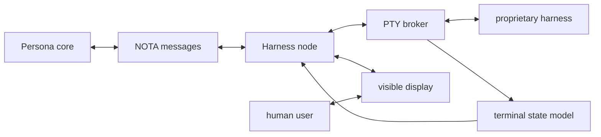
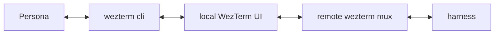
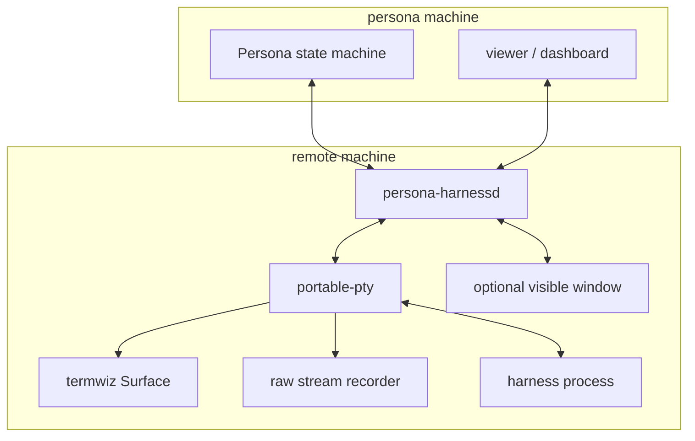
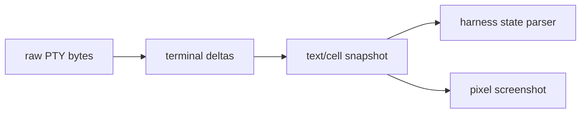

# Terminal Harness Control Research

Date: 2026-05-06

## Remote-First Read

Persona needs to control proprietary terminal harnesses that do not expose the
API we want. The first version of this report focused on avoiding tmux visual
damage while reading and writing a local TUI. The remote-agent constraint
changes the center of gravity:

- harnesses may run on another machine;
- Persona may run somewhere else again;
- a human may still need a normal visible terminal;
- a remote agent may need to observe, type, resize, attach, detach, and audit;
- the same mechanism should work locally, over SSH, over a private network, or
  through a browser display.

So the durable abstraction should not be "which terminal emulator are we using?"
It should be a harness node that owns or attaches to a PTY and exposes a small
control protocol.



The harness node can live on the same laptop as Persona, on a remote workstation,
inside a devbox, or inside a small container. Persona sees one contract.

## Core Contract

Persona should define a harness adapter around these operations:

```text
spawn(config) -> HarnessId
attach(target) -> HarnessId
write_text(id, text, mode)
write_keys(id, keys)
resize(id, rows, cols, pixels)
snapshot_text(id, region) -> ScreenText
snapshot_cells(id, region) -> ScreenCells
snapshot_pixels(id) -> Image
raw_since(id, cursor) -> ByteFrames
status(id) -> HarnessStatus
observe(id) -> HarnessObservation
detach_viewer(id, viewer)
terminate(id, policy)
```

The remote version adds node identity and transport, but the operation remains
the same:

```text
persona://node/<node-id>/harness/<harness-id>
```

## Main Architectures

### A. Terminal-emulator bridge

This is the fastest practical bridge if we are allowed to choose the visible
terminal.

```text
Persona
  -> terminal control API
  -> visible terminal pane
  -> harness process
```

Good for:

- immediate `/compact` and usage-command injection;
- text capture without OCR;
- keeping a normal native terminal window;
- experimenting before we own the PTY.

Weak for:

- vendor coupling;
- socket/auth hardening;
- exact behavior differences between emulators;
- remote machines that cannot run the chosen emulator.

### B. Remote terminal multiplexer bridge

WezTerm is more interesting than a local capture tool because it already has
remote domains. Its docs describe SSH domains, Unix domains, and TLS domains.
The SSH domain path can start a remote wezterm multiplexer daemon over SSH, and
TLS domains can reconnect to resume a remote terminal session. WezTerm also has
`get-text` and `send-text` for pane capture and input.



This is a strong prototype path for remote agents because it combines:

- visible local native UI;
- remote process persistence;
- pane targeting;
- text capture;
- text injection;
- SSH/TLS transport options.

The main risk is that Persona would be learning WezTerm's control model instead
of its own. That is acceptable as an adapter, not as the core.

### C. Persona-owned harness node

This is the durable design.



The node owns the process and emits observations. The display is an attachment,
not the owner. This makes multiple viewers and remote agents natural.

### D. Browser terminal gateway

`ttyd`, Wetty, GoTTY, and Guacamole show another useful shape:

```text
remote PTY or SSH session
  -> websocket or gateway protocol
  -> browser terminal
```

`ttyd` is especially relevant because it shares a terminal over the web, can
bind to an interface or Unix socket, supports basic auth, SSL, client
certificates, read-only by default, and writable mode when enabled. Guacamole is
heavier but useful as a reference: for SSH it combines an SSH client and terminal
emulator server-side, then draws the screen remotely in the browser.

This is good for browser access, remote observation, emergency access, and
prototype dashboards. It is less ideal as the only core because Persona still
needs semantic state, authorization, audit, and harness identity.

## Tool Read

| Tool | Remote value | Persona role |
|---|---:|---|
| WezTerm | High | Best near-term remote terminal bridge. Use domains plus `get-text`/`send-text`. |
| Kitty | High locally, medium remotely | Excellent socket-controlled visible terminal. Use over Unix socket, SSH tunnel, or private network when we choose Kitty. |
| Ghostty + Wayland tools | Low to medium | Current local duct tape: screenshots and keyboard injection without tmux. |
| `portable-pty` | High | Rust PTY owner for the durable harness node. |
| `termwiz` | High | Rust terminal state model; `Surface` and deltas fit remote screen sync. |
| `node-pty` + xterm.js | High | Fast desktop/web prototype path; strong if we accept JS/Electron or isolate it behind a protocol. |
| `ttyd` | Medium | Ready-made browser terminal gateway; good reference and possible adapter. |
| Apache Guacamole | Medium | Reference for browser remote access, recording, SSH/RDP/VNC gateway design. |
| Teleport | Medium | Reference for session recording, audit, RBAC, node/proxy recording tradeoffs. |
| Mosh | Medium | Reference for resilient remote terminal UX and local echo under bad networks. Not a capture API. |
| abduco/dtach | Low | Detach/reattach wrapper only. Useful under a node, not enough alone. |
| tmux | Medium technically, low visually | Good control surface, but not our preferred visual substrate. |

## Remote Transport Options

Persona should keep transport independent of terminal semantics.

```text
Harness protocol payload:
  NOTA command/event objects

Transport candidates:
  local Unix socket
  SSH stdio tunnel
  Tailscale/WireGuard private TCP
  mTLS TCP
  WebSocket over HTTPS
  QUIC later if we need mobile-grade session behavior
```

Recommended order:

1. Local Unix socket for same-machine harnesses.
2. SSH stdio tunnel for remote machines already reachable by SSH.
3. Tailscale or WireGuard network for stable multi-machine labs.
4. HTTPS/WebSocket for browser clients and dashboards.

Do not expose a raw terminal-write API on the open internet. Terminal write is
remote code execution by design. Authorization has to be part of the harness
node, not only the outer transport.

## Visual Preservation

The visual problem is not "tmux bad"; it is "do not force the human-visible
harness through an extra terminal policy layer unless we want that layer."

```text
Bad default:
  harness -> tmux screen model -> terminal -> user

Better:
  harness -> PTY broker -> native display client
                  |
                  +-> Persona screen model
```

If the visible terminal is WezTerm or Kitty, use that terminal's control plane.
If the visible terminal is Ghostty or another emulator without a stable control
API, use OS-level screenshot/input as a fallback and treat it as brittle.

## Input Model

Slash commands must be terminal input, not model messages.

```text
write_text("/compact", mode = TypedKeys)
write_key(Enter)
```

Persona should support three input modes:

| Mode | Use |
|---|---|
| `TypedKeys` | Best for slash commands, menus, and commands where pasted text behaves differently. |
| `BracketedPaste` | Best for larger text blocks when the harness supports paste safely. |
| `RawBytes` | Escape hatch for control sequences, function keys, mouse, or exact replay. |

Every input should be represented as an event:

```text
HarnessInputEvent
  node_id
  harness_id
  actor_id
  mode
  payload_ref
  authorization_ref
  observed_after_cursor
```

## Observation Model

A remote harness should emit layered observations, from cheapest to richest:

```text
RawByteFrame
  -> TerminalDelta
  -> ScreenSnapshot
  -> SemanticHarnessState
  -> PixelSnapshot
```



Pixel screenshots are still useful, but not primary. They are for image-capable
terminals, visual audits, OCR fallback, and "what did the human actually see?"
checks.

## Usage Stats

The remote constraint makes usage stats an adapter problem:

1. Parse local provider logs/config on the node if available.
2. Ask the harness TUI with slash commands and parse the screen snapshot.
3. Use terminal-emulator capture APIs if the harness is in WezTerm/Kitty.
4. Use pixel screenshot plus OCR only if no buffer/state exists.
5. Use browser scraping as a separate provider adapter.

The usage record should be normalized:

```text
HarnessUsageSnapshot
  provider
  account_hint
  node_id
  harness_id
  period
  quota_used
  quota_limit
  reset_at
  source: Log | TuiText | TuiPixels | Browser | Manual
```

## Prototype Path

### Phase 0: Current local duct tape

Use what is installed here now:

```text
Ghostty visible harness
grim/slurp screenshots
wtype typed slash commands
```

This validates command injection and visual capture without tmux.

### Phase 1: Install and test one controlled terminal

Test WezTerm first for remote, Kitty second for local socket control.

Acceptance criteria:

```text
spawn harness
list target pane/window
capture visible text
inject /compact + Enter
capture usage screen
resize without corrupting UI
reattach after terminal/window restart
```

### Phase 2: Build `persona-harnessd`

Build the node as a small Rust service:

```text
portable-pty
  -> termwiz Surface
  -> raw event log
  -> NOTA command/event protocol
  -> local Unix socket + SSH stdio transport
```

The first version does not need a custom GUI. It can run harnesses headless,
attach a simple terminal client, and emit snapshots for Persona.

### Phase 3: Remote viewers and authorization

Add multiple viewers and explicit capabilities:

```text
observe
write
resize
spawn
terminate
read_logs
export_recording
```

Each harness node should enforce this locally so a compromised Persona client
does not automatically mean uncontrolled terminal writes everywhere.

### Phase 4: UI clients

Add whichever viewer is convenient:

- native terminal attachment;
- xterm.js web viewer;
- Tauri/Electron dashboard;
- WezTerm/Kitty bridge adapters;
- remote browser view through WebSocket.

## Design Questions

- Should WezTerm become the first official adapter because its remote domains
  give us a lot quickly?
- Do we want the harness node to be a separate repository from Persona, or a
  crate inside Persona until the protocol settles?
- Should the first remote transport be SSH stdio, Tailscale TCP, or both?
- How strict should write authorization be at the beginning: per-node token,
  per-harness capability, or signed command envelope?
- Do we need multi-viewer support immediately, or only one human display plus
  one Persona observer?
- What is the minimum semantic parser for a coding harness: idle/busy, needs
  input, current prompt, last assistant message, usage/quota, compaction state?

## Recommendation

Use emulator APIs immediately, but design them as adapters.

```text
Short term:
  WezTerm remote-domain prototype
  Kitty socket-control prototype
  Ghostty + Wayland fallback

Durable:
  persona-harnessd
  portable-pty + termwiz
  NOTA command/event protocol
  local socket + SSH/Tailscale transports
```

WezTerm is the most compelling immediate remote experiment because it already
has SSH/TLS multiplexing domains plus pane text capture and input. Kitty is an
excellent controlled-terminal adapter when we choose the local visible terminal.
Neither should be the only architecture. Persona's real unit should be the
remote-capable harness node.

## Sources

- WezTerm multiplexing: https://wezterm.org/multiplexing.html
- WezTerm SSH: https://wezterm.org/ssh.html
- WezTerm `get-text`: https://wezterm.org/cli/cli/get-text.html
- WezTerm `send-text`: https://wezterm.org/cli/cli/send-text.html
- Kitty remote control: https://sw.kovidgoyal.net/kitty/remote-control/
- `portable-pty`: https://docs.rs/portable-pty/latest/portable_pty/
- `termwiz`: https://docs.rs/termwiz/latest/termwiz/
- `node-pty`: https://github.com/microsoft/node-pty
- xterm.js: https://github.com/xtermjs/xterm.js/
- `ttyd`: https://github.com/tsl0922/ttyd
- Apache Guacamole manual: https://guacamole.apache.org/doc/gug/configuring-guacamole.html
- Teleport session recording: https://goteleport.com/docs/reference/architecture/session-recording/
- Mosh: https://mosh.org/
- Tailscale SSH: https://tailscale.com/docs/features/tailscale-ssh
- abduco man page: https://www.mankier.com/1/abduco
- wtype man page: https://www.mankier.com/1/wtype
- grim man page: https://www.mankier.com/1/grim
