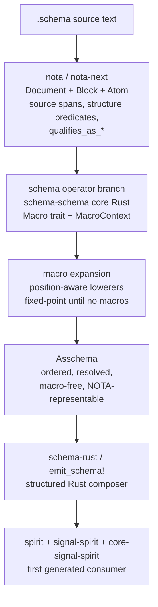

# 200 — Latest NotaCore / schema vision after designer 358 and 359

Operator refresh after reading the latest designer work:

- `reports/designer/359-implementation-target-design-from-prototype-audit-2026-05-26.md`
- `reports/designer-assistant/358-nota-library-schema-schema-prototype-2026-05-26.md`
- `skills/major-break-via-new-repo.md`

## Staleness verdict

My latest prior vision report was:

- `reports/operator/199-nota-core-schema-stack-implementation-target-2026-05-26.md`

That report is now **partly stale**.

The useful parts still stand:

- NOTA is a structural block library, not semantic schema resolution.
- Schema macros consume NOTA block methods and lower to a macro-free
  assembled schema.
- `Asschema` is the order-preserving, fully resolved endpoint.
- `emit_schema!` must consume the structured assembled tree and must not wrap
  the old `signal_channel!`.
- The new Spirit triad (`spirit`, `signal-spirit`, `core-signal-spirit`) is
  the right first clean consumer once the contract-generation path is real.

The stale part is the repository target. Report 199 recommended starting a
new clean `nota-core-next` integration repo immediately. Designer 359 and the
new skill make the sharper call: **new repos are the major-break escape hatch,
not the first implementation move here**. For this work, use:

- `nota` repo, `nota-next` branch, for the raw NOTA structural library;
- `schema` repo, `operator-schema-driven-nota-parser-prototype-2026-05-26`
  branch, for schema macros, `Asschema`, and reader/composer preparation;
- `signal-frame` later, after the `Asschema` shape stabilizes;
- new `spirit` triad repos later, after generated contracts are real.

So this report supersedes operator 199's **new-repo-first** recommendation,
while preserving its layered architecture.

## Current best vision



The implementation target is no longer "create `nota-core-next` and build
everything inside it." The target is a staged integration through the existing
repos that already have the right branch and prototype material.

## What designer 359 changes

Designer 359 is a better operator plan than my report 199 on repository
assignment. Its key decisions to adopt:

1. Start with **guidance and test cleanup**, because stale repo-local
   `INTENT.md`, old six-position schema guidance, stale quoted-string docs,
   and positive tests for retracted Features are the highest source of agent
   drift.
2. Move the block/structural API to **`nota-next`** once it is stable enough,
   per intent record 781.
3. Keep the schema engine work in the **existing `schema` repo**, on the
   operator prototype branch, instead of creating a parallel schema repo now.
4. Use the new `spirit` repos as **contract-focused future consumers**, not
   as the first implementation workspace for the core language work.
5. Defer the schema daemon until the in-process `Library` and `Asschema`
   surface are stable.

This is the right correction. My report 199 applied the new-repo methodology
too aggressively. The new skill says the trigger is significant: use a new
repo when the existing repo's invariants no longer fit and agents cannot
develop without cross-contamination. Here, the workspace already has a
purpose-built `nota-next` branch and a schema operator branch that holds the
strongest production-adjacent tests. Use them first.

## What designer-assistant 358 adds

Report 358 makes the newest prototype evidence concrete:

- `block_query.rs` adds the refined NOTA API on top of `Block`:
  factual `is_square_bracket` / `is_parenthesis` / `is_brace`, and
  structural `qualifies_as_*`.
- `schema_schema.rs` implements `Macro`, `MacroContext`, and `SchemaSchema`.
- `schema_schema_demo.rs` demonstrates block parsing, default schema-schema
  load, macro dispatch, and assembled schema output.
- `schema_schema_constraints.rs` pins records 799-807 with named tests.
- The branch is `schema/designer-schema-schema-prototype-2026-05-26`
  at reported HEAD `cc0c340`; 51 prototype tests and Nix check are green.

Keep these pieces:

- public macro interface;
- `MacroContext` carrying namespace, parent, and schema-schema reference;
- named constraint tests for 799-807;
- additive `Block` method surface;
- position-aware recognition that imports and namespace can share a brace
  shape but differ by root-struct field position.

Do not copy these pieces blindly:

- `parse_schema_file` still reuses the older `ThreePartSchema::read` path.
- `lower_via_macros` hard-codes a five-position root layout.
- `InputOutputStructMacro::lower` returns input operations even for output
  positions.
- Namespace lowerers return lossy debug strings such as
  `(square-bracket 2 elements)` instead of resolved typed declarations.

These are prototype compromises. The operator implementation should correct
them while preserving the tests' intent.

## Updated implementation target

### Slice 1 — guidance and rejection tests

Adopt designer 359's first slice.

Patch the required guidance surfaces before more implementation:

- `repos/schema/INTENT.md`
- `schema/ARCHITECTURE.md`
- `skills/nota-design.md`
- `repos/nota-codec/INTENT.md`

Flip authored Feature tests:

- `EffectTable`
- `FanOutTargets`
- `StorageDescriptor`

Those should become rejection tests or compatibility-only tests, never
positive current-shape tests.

Success criterion: the code and the guidance stop teaching the old
six-position/features shape.

### Slice 2 — order-preserving Asschema

Move from lookup-map-first `AssembledSchema` to an order-preserving canonical
surface:

```rust
pub struct Asschema {
    pub imports: Vec<ResolvedImport>,
    pub roots: Vec<RootSurface>,
    pub namespace: Vec<TypeDeclaration>,
}
```

Derived lookup indexes are allowed, but canonical storage must be ordered
vectors. This carries operator 195's discovered BTreeMap-order bug and the
intent that schema represents data as stored.

### Slice 3 — one structural tree, not block/value parallel trees

Merge `SchemaBlockPass` and `SchemaObjectPass` so each object has:

- source span;
- delimiter shape;
- qualified-symbol candidate;
- typed value access;
- recursive child access.

Macro lowerers should not line up two unrelated trees by index.

### Slice 4 — move the raw structural API to `nota-next`

Port the structural API from schema prototypes into `nota-next`:

- `Document`
- `Block`
- `Object`
- `Atom`
- `SourceSpan`
- `qualifies_as_*`
- exact re-emission by span

Keep raw NOTA structural. No namespace resolution. No final PascalCase type
legality. No schema semantics.

### Slice 5 — schema-schema macro interface in `schema`

Use report 358's macro interface but correct the prototype compromises.

Target shape:

```rust
pub trait SchemaMacro: Send + Sync {
    fn name(&self) -> MacroName;
    fn matches(&self, object: &Object, position: MacroPosition) -> bool;
    fn lower(
        &self,
        object: &Object,
        position: MacroPosition,
        context: &mut MacroContext,
    ) -> Result<MacroOutput, MacroError>;
}
```

The important change from 358: pass `MacroPosition` into `lower`, not just
`matches_shape`. The output side needs to know whether the same square-bracket
operation vector is input, output, input extras, or some later schema-field
role.

### Slice 6 — root-struct reader

Replace the five-block reader assumption with the root-struct model:

- `.schema` context implies the root `Schema` struct;
- no explicit `(Schema ...)` wrapper;
- fields are positional;
- imports/exports and input/output are fields of the root struct;
- optional fields are represented by the root schema type, not by permanently
  mandatory empty placeholder blocks.

Carry record 806 as uncertainty: imports-first remains the default, but the
code should isolate that decision in one place.

### Slice 7 — composer and Spirit proof

Once `Asschema` is stable:

- `emit_schema!` consumes `Asschema`;
- it does not use the old `signal_channel!`;
- generated Rust is fixture-compared, compiled, and used against real NOTA;
- short-header dispatch derives from the enum tree;
- first consumer is a `signal-spirit` / `core-signal-spirit` subset.

This is when the new Spirit repos become active implementation targets.

## Repo decision

Updated decision:

- **Do not create `nota-core-next` yet.**
- Use `nota-next` and the existing `schema` operator branch.
- Keep `skills/major-break-via-new-repo.md` as the rule for when a new repo
  becomes justified.

The trigger would fire later if:

- stale `schema` repo invariants keep reappearing after Slice 1;
- old tests cannot be converted without destroying the working substrate;
- agents continue wiring against old six-position/features surfaces despite
  corrected guidance;
- the schema branch becomes a tangled compatibility fork rather than an
  implementation branch.

Until then, the existing branches are the faster and less noisy path.

## Current latest vision report

This report is now the latest operator vision report:

- `reports/operator/200-latest-notacore-schema-vision-after-designer-359-2026-05-26.md`

It supersedes report 199 only on:

- repository target;
- sequence priority;
- integration of report 358's concrete schema-schema prototype.

It does not supersede report 199's layered model or its warnings about
`emit_schema!`, `Asschema`, old `signal_channel!`, and authored Features.

## Open questions

1. Does psyche want to lock record 806 now: imports/exports first, or
   input/output first?
2. Should ordinary `[text]` be raw string at NotaCore level, or should
   ordinary square brackets stay structural and only `[|...|]` be opaque raw
   string?
3. Should the macro trait use typed associated `Input`/`Output` with type
   erasure, or a single `MacroOutput` enum first?
4. When the schema daemon lands, is its triad `schema` / `signal-schema` /
   `core-signal-schema`, or should the naming be different?
