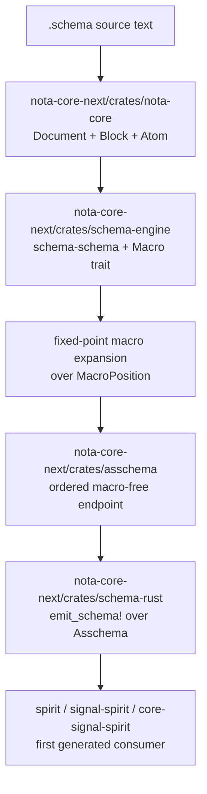

# 201 — Operator delta after designer 361

Operator refresh after reading:

- `reports/designer/361-latest-vision-schema-derived-nota-stack-2026-05-26.md`
- `reports/designer/360-critique-of-operator-199-nota-core-implementation-target-2026-05-26.md`

## Staleness verdict

My latest prior operator vision was:

- `reports/operator/200-latest-notacore-schema-vision-after-designer-359-2026-05-26.md`

That report is now **stale on the repository strategy**.

Report 200 corrected operator 199 by saying: do not create
`nota-core-next` yet; use `nota-next` plus the existing `schema` operator
branch first.

Designer 361 supersedes that correction. It synthesizes designer 360's
critique of operator 199 and restores `nota-core-next` as the operational
backbone:

- create `nota-core-next` as the clean integration sandbox;
- build the six-layer stack there first;
- redistribute stable crates back into final repos after proof;
- use the new Spirit triad as the first generated consumer.

So the latest operator stance is:

```text
operator/199 was mostly right structurally;
operator/200 was useful but over-corrected repository strategy;
designer/361 is now the current target;
this report adopts designer/361 for operator execution.
```

## Current target



The integration repo is a staging surface, not a permanent final naming
decision. Stable pieces redistribute later:

- `crates/nota-core` -> `nota` / `nota-codec`
- `crates/asschema` + `crates/schema-engine` -> `schema`
- `crates/schema-rust` -> `signal-frame` or a standalone composer repo
- generated contracts -> `spirit`, `signal-spirit`, `core-signal-spirit`

## What changed from operator 200

### Repository strategy

Operator 200 said use existing repos first. Latest target says:

```text
Phase 0 creates nota-core-next.
```

Reason: designer 360 argues the integration repo is the cleanest way to keep
the new stack coherent while old `schema`, `nota`, `nota-codec`, and
`signal-frame` still carry production and transitional constraints. The
new-repo method is not merely fallback now; it is the selected integration
lane for this architectural break.

### Recursion floor

Designer 361 makes the recursion-floor cut explicit:

- Today: hand-authored `nota-core` parses delimiters, spans, and structural
  classifications.
- `nota.schema` remains a declarative description and future emission target.
- Pure "all-the-way-back" is carried as aspirational unless psyche overrides.

Operator adoption: implement the broader hand-authored `nota-core` cut first.
Do not block Phase 0 or Phase 1 on generating the NOTA codec from
`nota.schema`.

### Blockers

Designer 361 names the two main psyche-blocking questions:

1. Root field ordering: imports/exports first vs input/output first.
2. Recursion floor: affirm broader hand-authored `nota-core` cut, or require
   narrower codec-from-`nota.schema` direction.

Operator stance: Phase 0 and much of Phase 1 can start before those lock.
Phase 2 macro-position semantics should wait on root field ordering.

## Operator implementation sequence

### Phase 0 — create `nota-core-next`

Create `LiGoldragon/nota-core-next` with:

```text
crates/nota-core/
crates/asschema/
crates/schema-engine/
crates/schema-rust/
crates/schema-test-spirit/
schemas/nota.schema
schemas/schema.schema
tests/
```

Scaffold with the standard workspace files:

- `README.md`
- `ARCHITECTURE.md`
- `INTENT.md`
- `AGENTS.md`
- `CLAUDE.md`
- `.gitignore`
- `flake.nix`
- `rust-toolchain.toml`
- `Cargo.toml`

Phase 0 should also add Nix checks from the start. No cargo-only prototype.

### Phase 1 — raw `nota-core`

Port from:

- `/358` `prototype/src/block_query.rs`
- `/356` `prototype/src/blocks.rs`
- `/354` `prototype/src/kernel.rs`
- operator `/198` `SchemaMacroPattern`, `QualifiedSymbol`, `SymbolClass`
  concepts

Implement:

- `Document`
- `Block`
- `Object`
- `Atom`
- `SourceSpan`
- source re-emission
- `is_*` factual delimiter methods
- `qualifies_as_*` candidate methods
- default-to-higher classification

Constraint tests:

- records 770-776
- records 799-803
- bracket hard cases
- no semantic namespace resolution in `nota-core`

### Phase 2 — schema-schema and macro engine

Port and correct `/358` `schema_schema.rs`.

Keep:

- `Macro` trait / `MacroContext`
- default-loaded `SchemaSchema`
- named constraint tests

Correct:

- thread `MacroPosition` into lowering, not only matching;
- do not hard-code five root positions as permanent architecture;
- avoid lossy debug string lowerings;
- split or role-tag input/output lowering so output operations are not
  returned as input operations.

Phase 2 should wait for the root field-ordering decision or isolate the choice
behind one enum/configuration point.

### Phase 3 — `Asschema`

Implement the ordered, macro-free endpoint:

- canonical `Vec` storage;
- derived lookup indexes only;
- `.asschema` debug/golden fixtures;
- zero macro nodes after expansion;
- name conflict tests;
- import conflict tests.

### Phase 4 — `emit_schema!`

Implement composer over `Asschema`, with the old macro prohibited:

- no `signal_channel!` calls;
- no old text-body macro path;
- generated NOTA reader/writer;
- generated short-header constants;
- fixture compare + compile + runtime decode tests.

### Phase 5 — Spirit proof

Generate a subset, then full parity, for:

- `signal-spirit`
- `core-signal-spirit`
- eventually `spirit`

Target parity with current Spirit v0.3:

- description-only multi-topic record;
- daemon-stamped time;
- terse `RecordAccepted`;
- observe by topic/kind;
- topic counts;
- short-header dispatch;
- one controlled upgrade/downgrade schema diff.

## Delete-or-fence list

The new integration repo must reject these from the start:

- authored `Feature` section;
- authored `EffectTable`, `FanOutTargets`, `StorageDescriptor`;
- positive tests for old Feature parsing;
- old `signal_channel!` as implementation dependency;
- `BTreeMap` as canonical assembled order;
- double-quote strings in canonical NOTA;
- semantic type resolution in raw NOTA;
- comments inside canonical `.schema` fixtures, unless explicitly scoped as
  teaching fixtures outside the canonical schema directory.

## Latest operator vision

This report is now the current operator delta:

- `reports/operator/201-operator-delta-after-designer-361-schema-derived-nota-stack-2026-05-26.md`

It supersedes operator 200 on repository strategy and sequencing.

It keeps operator 199's six-layer architecture, with designer 361's explicit
recursion-floor framing and first-blocker list.

## Still-relevant questions

1. Root field ordering: imports/exports first, or input/output first?
2. Recursion floor: is broader hand-authored `nota-core` acceptable as the
   current implementation cut?
3. Name: is `Asschema` acceptable, or should code keep
   `AssembledSchema`?
4. Should `schema-rust` ultimately live in `signal-frame`, or become its own
   final repo after proving in `nota-core-next`?
