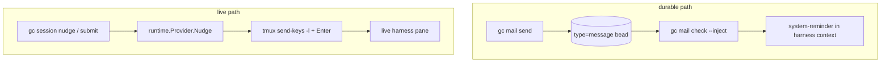
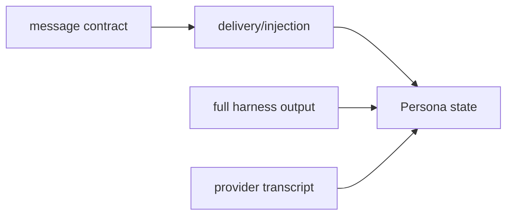
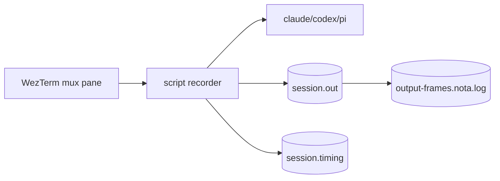
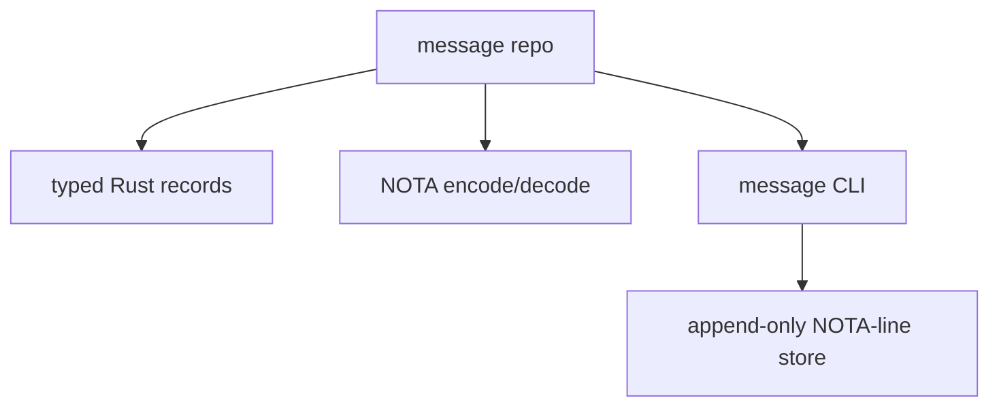
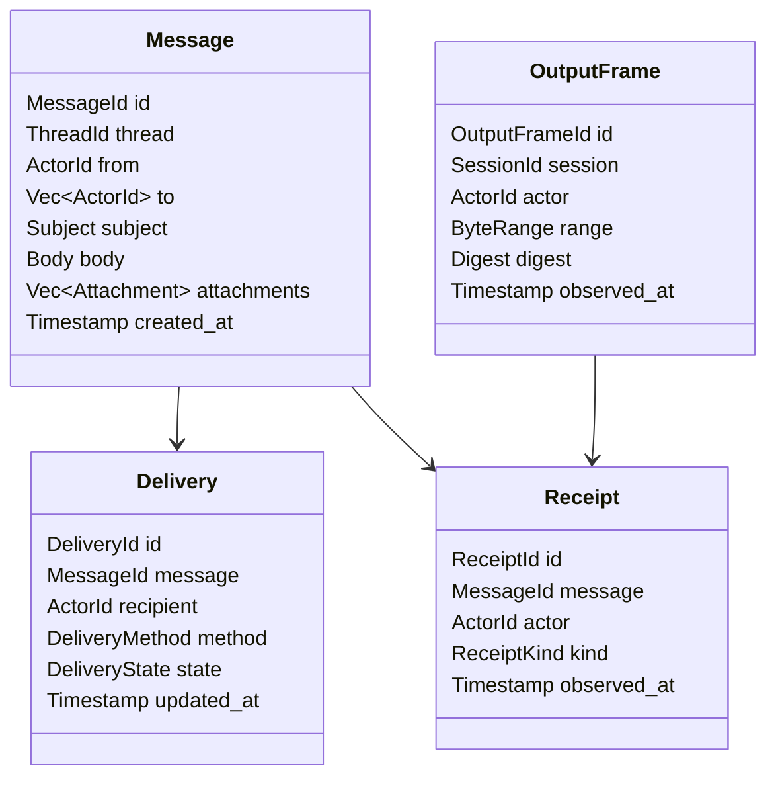
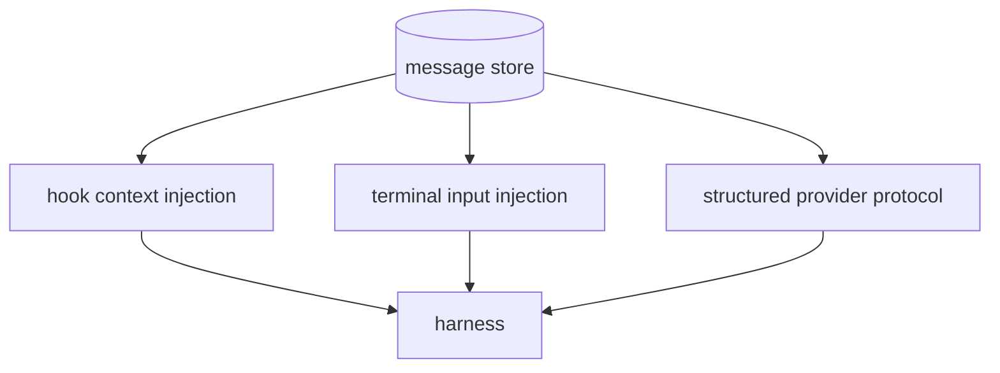
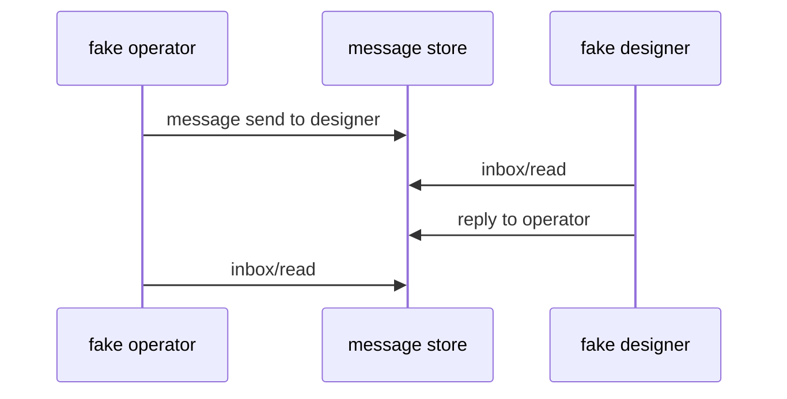
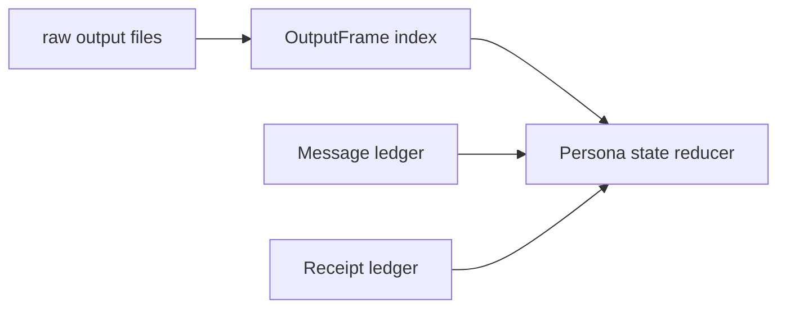
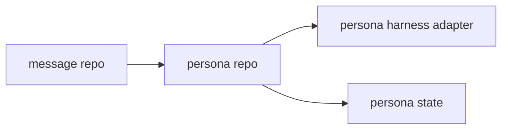

# Persona Message Plane Design

Date: 2026-05-06
Agent: operator

## Answer First

I have not run authenticated Claude, Codex, or Pi harnesses inside the WezTerm
adapter yet. The live test I ran was a headless WezTerm mux smoke with a shell
command:

```text
PERSONA-WEZTERM-SMOKE
```

That proved spawn, pane discovery, text capture, and cleanup. It did not prove
provider-login behavior, real agent tool calls, message exchange, or full
transcript capture. Those tests should run only against a disposable message
store because they can touch live authenticated sessions and quota.

## Gas City Reading

Gas City has two different communication paths:



The durable path is beadmail:

- a message is a bead with `Type="message"`;
- `From` is sender, `Assignee` is recipient;
- `Title` is subject, `Description` is body;
- unread is open without the `read` label;
- reading adds `read` but keeps the bead open;
- archive closes the bead.

The hook path injects unread mail into the agent's context. In Gas City,
`gc mail check --inject` formats a `<system-reminder>` block for provider
hooks. That is how stored messages enter the model on normal turns.

The live path is nudge/submit. For tmux, Gas City types literal text into the
pane and sends Enter separately, with retry, debounce, and detached-pane wakeup.
That path is not durable unless another layer records it.

## Problem Split

Persona needs three records of reality, not one:



| Plane | What It Answers | First Store |
|---|---|---|
| Message | What did one actor intend another actor to read? | NOTA-line ledger |
| Delivery | Was a message offered to a harness, when, and how? | NOTA-line ledger |
| Output | What did the harness print, byte-for-byte or text-normalized? | raw/session log files plus frame index |
| Transcript | What provider-native conversation records exist? | provider JSONL discovery/import |
| State | What does Persona believe happened? | Persona reducer later |

WezTerm `get-text` is useful for current screen/scrollback snapshots, but it
should not be the only durable output source. Scrollback can be finite and text
capture is already terminal-normalized. For "everything it printed," the harness
command should run under an output recorder.

## Full Output Capture

The first durable capture wrapper can be simple:

```text
script -q -f \
  -O output/<session-id>.out \
  -T output/<session-id>.timing \
  -- <harness command...>
```

`script` is installed here and supports separate stdin/stdout/full-I/O logs.
For now, output-only is safer. Full I/O capture is possible with `-B`, but it
can record secrets and prompts typed by a human.



The raw output file is the searchable artifact. The NOTA index records ranges:

```text
OutputFrame
  frame_id
  harness_id
  session_id
  byte_start
  byte_end
  text_digest
  observed_at
```

That gives Persona cheap search and later garbage collection without stuffing
large terminal dumps directly into every message record.

## Contract Repository

Create a new Git-backed JJ repository named `message`.

It owns the message contract and the CLI. It does not own harnesses, WezTerm,
Persona's state reducer, or provider-specific transcript parsing.



First binary name:

```text
message
```

No abbreviation is needed. `message` is a common word and reads clearly in
agent instructions.

## First Data Types

Keep the first nouns small. This is a contract repo, so it should avoid
Persona-specific prefixes and avoid `Record` suffixes.

```text
MessageId
ThreadId
ActorId
SessionId
DeliveryId
ReceiptId
OutputFrameId
```



First enum shapes:

```text
DeliveryMethod = HookContext | TerminalInput | ProviderProtocol | Manual
DeliveryState  = Pending | Offered | Observed | Failed
ReceiptKind    = Seen | Read | Acknowledged | Replied | Closed
```

The final "tool call at the end" should become a `Receipt` or a new message,
not a special out-of-band side effect.

## NOTA-Line Prototype

The first store can be one append-only file:

```text
.message/messages.nota.log
```

Each line is one complete NOTA record:

```text
(Message "msg-001" "thread-001" "operator" ["designer"] "Need audit" "Read the WezTerm report." [])
(Delivery "delivery-001" "msg-001" "designer" HookContext Pending "2026-05-06T18:30:00Z")
(Receipt "receipt-001" "msg-001" "designer" Read "2026-05-06T18:31:10Z")
```

The prototype can use a file lock around appends. The production store can move
to redb/rkyv later while the NOTA contract remains the stable interchange.

## CLI Shape

```text
message send --store <path> --from operator --to designer --subject "..." --body "..."
message inbox --store <path> --for designer
message read --store <path> --for designer <message-id>
message ack --store <path> --for designer <message-id>
message reply --store <path> --from designer <message-id> --body "..."
message watch --store <path> --for designer --after <cursor>
```

Agent-facing usage should be extremely simple:

```text
message inbox --for "$PERSONA_ACTOR"
message read <id>
message send --to operator --body "Done; see output frame ..."
```

Environment defaults reduce prompt overhead:

```text
PERSONA_MESSAGE_STORE=/tmp/persona-test/.message
PERSONA_ACTOR=designer
PERSONA_SESSION=session-designer-001
```

## Injection Into Harnesses

There are three injection modes:



| Mode | Use |
|---|---|
| HookContext | Normal durable mail: "you have unread messages" appears at next prompt boundary. |
| TerminalInput | Live wake/redirect: type text into the TUI through WezTerm. |
| ProviderProtocol | Future ACP/native harness input when available. |

For WezTerm tests, TerminalInput is the thing we can drive now:

```text
message send ...
persona-harness-wezterm send --pane-id <id> --typed --text 'message inbox --for designer\n'
```

But the better real-agent prompt is not "run this exact command now" every time.
It is: "You are actor `designer`; use `message inbox` and `message send` as your
communication tool." Then Persona watches output and message receipts.

## Two-Agent Test Plan

### Stage 1: Fake agents

No model calls.



This proves the contract and CLI with deterministic shell scripts.

### Stage 2: WezTerm shell harnesses

Spawn two shell panes under WezTerm and run scripts that call the `message` CLI.
Capture output with `script`, then verify:

- both panes appear in WezTerm list;
- both output logs contain their actions;
- message store contains message, delivery, read receipt, reply;
- output frame index points into captured output.

### Stage 3: Authenticated harness smoke

Opt-in only.

```text
operator pane: codex --model gpt-5.4-mini
designer pane: claude --model haiku --effort low
third pane: pi --model openai/gpt-5.4-mini --thinking low
```

Give each harness a minimal prompt:

```text
You are actor designer.
Use the message CLI for coordination.
Read your inbox and reply with exactly one sentence.
Do not edit files.
```

Acceptance:

- harness starts and renders;
- WezTerm captures visible text;
- `script` captures full output;
- harness uses `message inbox/read/send`;
- counterpart receives the reply;
- no repo files are edited;
- pane can be listed/captured after reconnect.

## What Persona Should Persist



The heavy text lives in output files. The reducer stores:

- ids;
- cursors;
- byte ranges;
- digests;
- parsed tool-call summaries;
- message/delivery/receipt records.

That lets us search everything while keeping the state machine compact.

## Repository Boundary



`message` owns:

- Rust data types;
- NOTA codec;
- append-only store prototype;
- `message` CLI;
- conformance tests.

`persona` owns:

- harness lifecycle;
- WezTerm/PTY adapters;
- output capture;
- state reducer;
- authorization policy;
- conversion from message events into Persona state transitions.

## Design Commitments

- Messages are durable typed records before they are live input.
- Delivery is separate from message creation.
- Full harness output is captured as raw/session artifacts and indexed by typed
  frames.
- WezTerm snapshots are observation aids, not the only transcript.
- Agents communicate through `message`, not through hidden provider-specific
  conventions.
- BEADS remains a compatibility/reference pattern; the first Persona message
  contract is NOTA-native.

## Immediate Next Work

1. Create the `message` repository as a Git-backed JJ repo.
2. Scaffold Nix/Rust from `lojix-cli` or the current Persona flake style.
3. Implement the NOTA-line message ledger and `message` CLI.
4. Add fake-agent tests proving two agents communicate through the store.
5. Wrap WezTerm harness spawns with `script` output capture.
6. Add opt-in live harness tests for Claude/Codex/Pi using a disposable store.

## Open Questions

- Should `message read` mark read immediately, or should read and ack remain
  separate from the beginning?
- Should terminal-input injections create a `Delivery` before or after the text
  is sent to the pane?
- Should full I/O capture ever be enabled by default, given secret exposure?
- Should BEADS compatibility be an adapter in `message`, or a Persona-side
  importer only?
- Does `message` eventually become the shared contract for external messaging
  too, or only internal harness-to-harness messaging?
