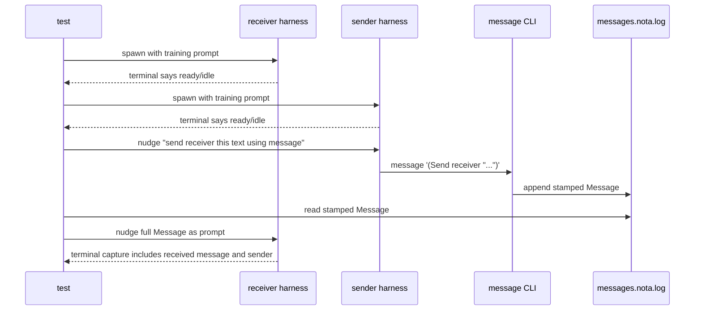

# Persona Message Real Harness Test Plan

Date: 2026-05-06
Author: Codex (operator)

## Goal

Test the naive `persona-message` fabric against real interactive proprietary
harnesses, not shell processes and not non-interactive print/exec modes:

1. Start a receiver harness and let it become idle.
2. Start an initiator harness later.
3. Train both harnesses in the first prompt on the exact `message` NOTA command.
4. Inject a prompt into the initiator asking it to send one message.
5. Inject the delivered message into the receiver as if a human typed a prompt.
6. Capture the terminal display so the test can audit whether the receiver saw
   the sender-stamped `Message`.

Two first real tests:

- Codex initiates, Claude receives.
- Claude initiates, Codex receives.

Codex should use `gpt-5.4-mini` with minimal effort. Claude should use
`haiku4.5` with low effort.

## Architecture

```mermaid
flowchart LR
    test[ignored Rust e2e test]
    store[(temp store<br/>agents.nota<br/>messages.nota.log)]
    wt[WezTerm mux<br/>headless panes]
    codex[Codex interactive TUI]
    claude[Claude interactive TUI]
    message[message CLI]

    test -->|spawn pane| wt
    wt --> codex
    wt --> claude
    test -->|write agents.nota from pane process ids| store
    codex -->|Bash: message '(Send ...)'| message
    claude -->|Bash: message '(Send ...)'| message
    message --> store
    test -->|poll ledger| store
    test -->|nudge delivered Message as prompt| wt
    wt -->|get-text audit| test
```

The prototype still uses the file ledger as the message plane. The terminal
controller is only the harness adapter: it starts persistent interactive
harnesses, injects prompt text, and captures terminal text/transcripts for
audit. This is the Gas City target: a human can attach to the pane, type into
it, and inspect it.

## Gas City Lesson

Gas City's `NudgeSession`/`NudgePane` path uses:

- literal terminal input (`tmux send-keys -l`),
- a roughly 500 ms debounce,
- a separate `Enter`,
- wake/resize behavior for detached panes,
- optional idle waiting before delivery.

The WezTerm equivalent for this prototype is:

- `wezterm cli send-text --pane-id <id> <text>` for literal prompt text,
- sleep 500 ms,
- `wezterm cli send-text --pane-id <id> --no-paste "\n"` for Enter,
- `wezterm cli get-text --pane-id <id>` for display capture.

That gives us the same duct-tape interface without putting the harness inside
tmux.

## Test Shape



## Important Constraints

- These tests are ignored by default and gated by
  `PERSONA_RUN_ACTUAL_HARNESSES=1`.
- They require authenticated `codex` and `claude` CLIs.
- They require `wezterm` in `PATH`; the repo dev shell should provide it.
- They must use the interactive harness UI. Non-interactive `claude --print` or
  `codex exec` probes are useful only for one-off alias discovery and must not
  be the checked-in test target.
- The receiver prompt must not name the sender; it only knows its own actor name
  and the message syntax. The received `Message` record is how it learns the
  sender.
- The first implementation verifies idle delivery. Busy delivery can be added
  once idle delivery is stable.

## What This Proves

- The `message` binary can be used from inside real harnesses.
- Sender identity is stamped by the tool, not trusted from the model's text.
- A message appended by one harness can be converted into a prompt delivered to
  another idle harness.
- We can audit the result through terminal display capture.

## Implementation Notes

The tests landed in `persona-message/tests/actual_harness.rs` as ignored,
authenticated integration tests. They use the interactive harness UI only:

- `claude --model claude-haiku-4-5 --effort low --dangerously-skip-permissions`
- `codex --model gpt-5.4-mini --dangerously-bypass-approvals-and-sandbox`

The tests start bare interactive panes first, then inject the initial training
prompt through WezTerm. This matters: Claude's interactive CLI can drop or
stall on longer command-line prompt arguments around the workspace trust dialog,
while terminal injection behaves like the real Gas City target.

Named Nix entry points now document the stateful commands:

```sh
nix run .#test-basic
nix run .#test-actual-codex-to-claude
nix run .#test-actual-claude-to-codex
nix run .#test-actual-harness -- actual_codex_initiates_claude_receives_idle_message
```

Debugging found these details:

- WezTerm `send-text --no-paste "\r"` is the reliable synthetic Enter for
  Claude's startup trust dialog and prompt submission.
- The WezTerm mux pane does not reliably inherit the test process PATH, so the
  runner writes the full current PATH into each harness script.
- `script(1)` is not used in the passing interactive tests. It interfered with
  the WezTerm mux path and produced blank panes in this setup. Audit currently
  uses `wezterm cli get-text`.
- The receiver does not know the sender in its setup prompt. It learns the
  sender from the delivered `Message` record and emits the exact audit marker.

Passing live runs on 2026-05-07:

- `nix run .#test-actual-codex-to-claude`
- `nix run .#test-actual-claude-to-codex`

The normal cheap suite also passes through `nix run .#test-basic`.
