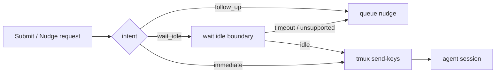
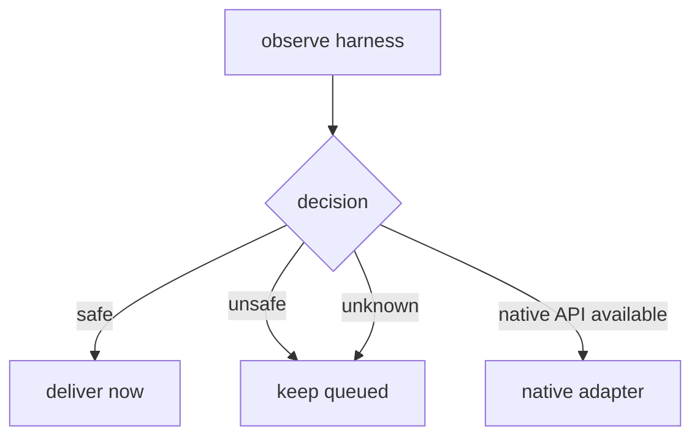
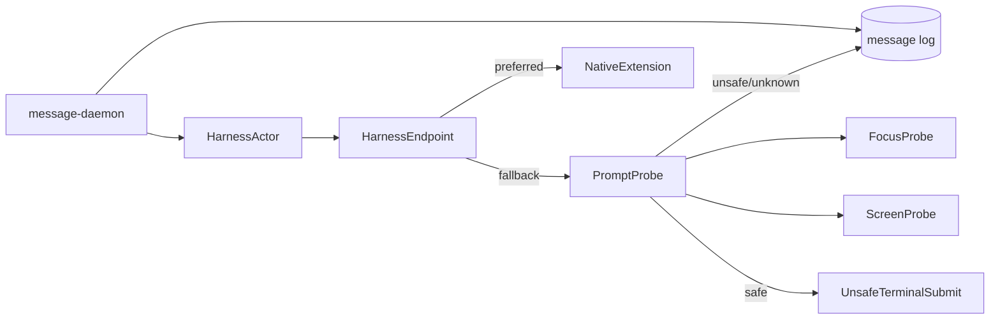
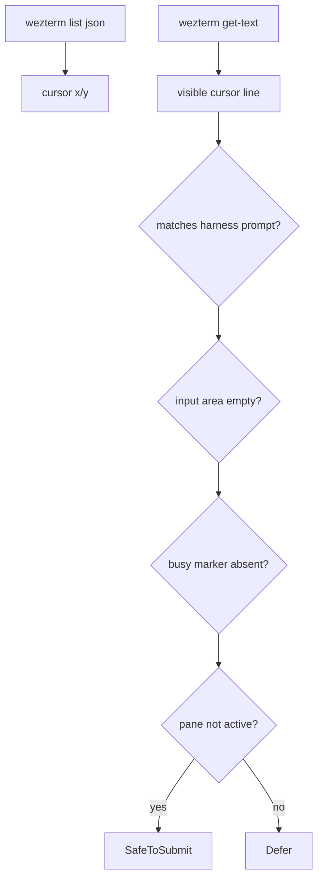
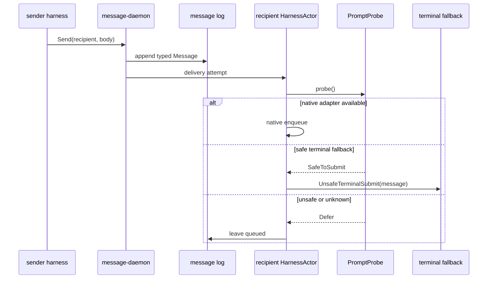
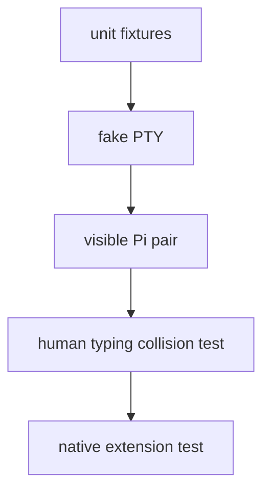

# Prompt-empty delivery gate design

Date: 2026-05-07  
Author: Codex / operator

## Why this exists

The live Pi test exposed the hard problem:

```text
human typed text + injected Message bytes -> one corrupted prompt line
```

Gas City uses terminal input because proprietary harnesses do not expose the
prompt API we want. That is probably the only universal fallback. Persona can
use the same fallback only behind a stricter gate:

- never inject into a human/operator endpoint;
- never inject while the visible harness pane is focused by a human;
- never inject when the prompt/input line is non-empty;
- never inject when the harness is generating or in an unknown state;
- if any check is unknown, leave the message queued.

This is not a clean messaging layer. It is a guarded fallback transport for
harnesses that have no native extension/API.

## Research read

### Gas City

Gas City has a terminal-input path, but not as a blind bus. The relevant shape:



Important local findings:

- `internal/session/submit.go` defines semantic submit intents:
  `default`, `follow_up`, `interrupt_now`.
- `internal/worker/handle.go` defines nudge delivery modes:
  `default`, `immediate`, `wait_idle`.
- `cmd/gc/cmd_nudge.go` queues a nudge if `wait_idle` does not deliver.
- `cmd/gc/cmd_mail_test.go` has an explicit test that mail to a human does not
  call the nudge function.
- `internal/runtime/tmux/tmux.go` notes that input collision is not solved by
  the lower-level `sendKeysLiteralWithRetry` path.

That last point matters: even Gas City's code comments separate startup
delivery reliability from input-collision safety.

### WezTerm

WezTerm gives us enough screen state for a fast probe:

- `wezterm cli get-text` captures pane text and can target a specific pane.
- `wezterm cli list --format json` reports panes, window ids, sizes, titles,
  active state, cursor coordinates, and tty names in our installed version.
- The Lua `Pane` object tracks parsed screen/scrollback and exposes methods
  including cursor position, text capture, foreground process info, and input
  methods.

Local observation from this session:

```json
{
  "pane_id": 0,
  "is_active": true,
  "cursor_x": 2,
  "cursor_y": 49,
  "tty_name": "/dev/pts/9"
}
```

So Persona can inspect the pane before delivery without reading pixels.

### Window manager focus

The fastest human-safety signal is focus:

- X11 can query the active/focused window and PID with tools such as
  `xdotool getactivewindow getwindowpid`.
- Sway/Wayland can expose focused window PID via `swaymsg -t get_tree`.
- Hyprland has `hyprctl activewindow -j`.

On this machine right now:

```text
XDG_SESSION_TYPE=wayland
DISPLAY=:0
xdotool: missing
swaymsg: missing
hyprctl: missing
```

So the first implementation should treat WM focus as an optional plugin. The
WezTerm pane `is_active` signal is available now and should be the default
local guard.

## Safety model

The gate is conservative. It answers only one question:

> Is it safe to submit this queued Persona message through the same terminal
> input stream right now?

The valid answers are:



Unknown is unsafe. "Probably idle" is unsafe. A focused visible pane is unsafe,
because a human can be composing text.

## Proposed components



### `HarnessActor`

Owns runtime data for one harness:

```text
name
pid
endpoint
visibility
last_observation
delivery_policy
queued_message_cursor
```

The endpoint belongs to the actor. The message log is global state; endpoint
state is runtime actor state.

### `PromptProbe`

Small, synchronous, fast. It gathers a snapshot and returns a typed decision:

```text
ProbeDecision =
  SafeToSubmit(reason)
  Defer(reason)
  Unknown(reason)
```

It must not mutate the terminal.

### `ScreenProbe`

For WezTerm panes:

1. `wezterm cli list --format json`.
2. Match by `pane_id` or `tty_name`.
3. Read `cursor_x`, `cursor_y`, `is_active`, dimensions.
4. `wezterm cli get-text --pane-id <id>` for visible screen text.
5. Extract the prompt/input line around `cursor_y`.

For persona-owned PTYs, we should eventually stop depending on WezTerm's screen
parser and maintain our own terminal state model in `persona-wezterm-daemon`.
The daemon already records raw bytes; it does not yet maintain a parsed screen.
That is the durable place to add `ScreenState`.

### `FocusProbe`

Optional plugins:

```text
WezTermFocusProbe:
  use wezterm pane is_active

X11FocusProbe:
  xdotool getactivewindow getwindowpid
  compare active PID/process tree to harness viewer PID

SwayFocusProbe:
  swaymsg -t get_tree | jq focused pid

HyprlandFocusProbe:
  hyprctl activewindow -j | jq pid
```

Policy:

- If target pane/window is focused, defer.
- If focus cannot be determined, continue only if the target is marked
  `headless` or `exclusive-agent-owned`.
- For visible shared harnesses, unknown focus means defer.

### `UnsafeTerminalSubmit`

This name should be ugly on purpose. It writes to the PTY/WezTerm input stream
only after the probes return `SafeToSubmit`.

It is not the message bus. It is one endpoint implementation.

## Prompt-empty detection

The first practical detector is screen-shape based.



Harness-specific prompt recognizers:

| Harness | Idle markers | Busy markers | Empty input heuristic |
|---|---|---|---|
| Pi | status footer + visible prompt box | token usage changing, no prompt box, extension status later | cursor line/input region contains only prompt chrome |
| Claude | prompt line + "waiting for terminal input" style state | `esc to interrupt`, `ctrl+c`, tool-running status | current input row after prompt is empty |
| Codex | `Ready` footer + prompt marker | thinking/tool status, running command block | current input row after `>` is empty |

This table should move into per-harness adapters; the gate interface should not
hard-code every product forever.

## Race window

The race cannot be eliminated while using stdin:

```text
t0 probe says empty
t1 human types
t2 terminal submit writes message
```

We can make the window small but not zero. The mitigation is policy:

1. Never use this path for focused visible panes.
2. Require a short stable interval: two empty observations, e.g. 50 ms apart.
3. Send only to panes marked `agent-owned` or not currently focused.
4. If the user focuses the pane during the interval, cancel.
5. For truly shared panes, prefer inbox polling or native extension, not stdin.

The "very fast check" is therefore:

```text
observe -> sleep 50ms -> observe again -> submit immediately
```

If either observation differs materially, defer.

## Message lifecycle



Queued messages are not failures. They are pending deliveries. The CLI should
make this visible:

```nota
(Accepted message delivered)
(Accepted message queued)
(Accepted message deferred "pane focused")
```

## Implementation plan

### Phase 1: make unsafe explicit

In `persona-message`:

- Rename endpoint kind `pty-socket` use in live tests to
  `unsafe-pty-socket` or add `delivery_policy unsafe-terminal`.
- Make default `pty-socket` delivery return queued/deferred unless explicitly
  allowed.
- Extend `Accepted` output with delivery status.

In `persona-message-harness.md`:

- Teach agents that sending a message does not guarantee immediate terminal
  delivery.
- Teach them to use `message '(Inbox name)'` if prompted by tests or future
  adapters.

### Phase 2: WezTerm prompt probe

In `persona-wezterm`:

- Add `PaneSnapshot` from `wezterm cli list --format json` + `get-text`.
- Add `PromptLine` extraction using cursor coordinates.
- Add `FocusState` from WezTerm `is_active`.
- Add `PromptProbe::decision(snapshot, harness_kind)`.
- Add tests using recorded fixture screens for empty and non-empty prompt rows.

### Phase 3: gated terminal fallback

In `persona-message`:

- Harness actor asks endpoint for `DeliveryDecision`.
- If safe, call terminal submit.
- If unsafe/unknown, keep message queued and return `deferred`.
- Add a retry loop owned by the actor, not by the CLI process.

### Phase 4: WM plugins

Add optional focus probes:

- X11 `xdotool` if present.
- Sway `swaymsg`.
- Hyprland `hyprctl`.

These are advisory guards. WezTerm pane state remains the default because it is
available through the chosen harness substrate.

### Phase 5: native adapters

The real long-term path:

- Pi extension/plugin first.
- Codex/Claude native channels if any are discoverable.
- Inbox-polling skill as a fallback that does not share stdin.

## Test plan



Required tests:

1. Empty prompt fixture -> `SafeToSubmit`.
2. Non-empty prompt fixture -> `Defer(non_empty_prompt)`.
3. Focused visible pane -> `Defer(focused)`.
4. Unknown focus on shared visible pane -> `Defer(unknown_focus)`.
5. Headless exclusive pane + empty prompt -> `SafeToSubmit`.
6. Live collision reproduction: type `arsentiarens` into responder and send a
   message. Expected result after fix: no splice; message remains queued.
7. Live delivery happy path: unfocused empty responder pane receives a queued
   message and replies.

## Recommendation

Implement the gate, but treat it as a fallback with a warning label. The correct
architecture remains native delivery or inbox polling. The gate exists because
some proprietary harnesses leave us no better transport today.

The most important policy rule:

> A visible focused harness is human-owned. Persona must not write to its stdin.

## Sources

- WezTerm `get-text` captures pane text and supports pane targeting:
  <https://wezterm.org/cli/cli/get-text.html>
- WezTerm `Pane` objects track PTY/screen/scrollback and expose cursor/text
  introspection methods:
  <https://wezterm.org/config/lua/pane/index.html>
- WezTerm `cli list --format json` reports panes and metadata:
  <https://wezterm.org/cli/cli/list.html>
- `xdotool` can query active windows and window PIDs on X11:
  <https://manpages.debian.org/bookworm/xdotool/xdotool.1.en.html>
- Sway can expose focused window info through `swaymsg -t get_tree`:
  <https://unix.stackexchange.com/questions/443548/get-pid-of-focused-window-in-wayland>

