# Prompt-empty delivery gate design

Date: 2026-05-07  
Author: Codex / operator

## Why this exists

The live Pi test exposed the hard problem:

```text
human typed text + injected Message bytes -> one corrupted prompt line
```

Gas City uses terminal input because proprietary harnesses do not expose the
prompt API we want. That is probably the only universal fallback. Persona can
use the same fallback only behind a stricter gate:

- never inject into a human/operator endpoint;
- never inject while the visible harness pane is focused by a human;
- never inject when the prompt/input line is non-empty;
- never inject when the harness is generating or in an unknown state;
- if any check is unknown, leave the message queued.

This is not a clean messaging layer. It is a guarded fallback transport for
harnesses that have no native extension/API.

**Sunset rule:** the gate retires per harness as native adapters land. When Pi
has a reachable extension, Pi no longer uses the terminal fallback. Same for
Codex, Claude, or any later harness. This is transitional substrate, like BEADS:
it exists because the destination is not ready yet; it should shrink as native
routes appear.

## Research read

### Gas City

Gas City has a terminal-input path, but not as a blind bus. The relevant shape:

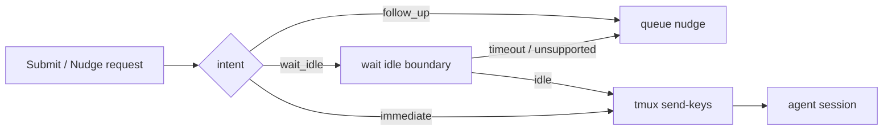

Important local findings:

- `internal/session/submit.go` defines semantic submit intents:
  `default`, `follow_up`, `interrupt_now`.
- `internal/worker/handle.go` defines nudge delivery modes:
  `default`, `immediate`, `wait_idle`.
- `cmd/gc/cmd_nudge.go` queues a nudge if `wait_idle` does not deliver.
- `cmd/gc/cmd_mail_test.go` has an explicit test that mail to a human does not
  call the nudge function.
- `internal/runtime/tmux/tmux.go` notes that input collision is not solved by
  the lower-level `sendKeysLiteralWithRetry` path.

That last point matters: even Gas City's code comments separate startup
delivery reliability from input-collision safety.

### WezTerm

WezTerm gives us enough screen state for a fast probe:

- `wezterm cli get-text` captures pane text and can target a specific pane.
- `wezterm cli list --format json` reports panes, window ids, sizes, titles,
  active state, cursor coordinates, and tty names in our installed version.
- The Lua `Pane` object tracks parsed screen/scrollback and exposes methods
  including cursor position, text capture, foreground process info, and input
  methods.

Local observation from this session:

```json
{
  "pane_id": 0,
  "is_active": true,
  "cursor_x": 2,
  "cursor_y": 49,
  "tty_name": "/dev/pts/9"
}
```

So Persona can inspect the pane before delivery without reading pixels.

### Window manager focus

The fastest human-safety signal is focus:

- X11 can query the active/focused window and PID with tools such as
  `xdotool getactivewindow getwindowpid`.
- Sway/Wayland can expose focused window PID via `swaymsg -t get_tree`.
- Hyprland has `hyprctl activewindow -j`.

On this machine right now:

```text
XDG_SESSION_TYPE=wayland
DISPLAY=:0
xdotool: missing
swaymsg: missing
hyprctl: missing
```

So the first implementation should treat WM focus as an optional plugin. The
WezTerm pane `is_active` signal is available now and should be the default
local guard.

## Safety model

The gate is conservative. It answers only one question:

> Is it safe to submit this queued Persona message through the same terminal
> input stream right now?

The valid answers are:

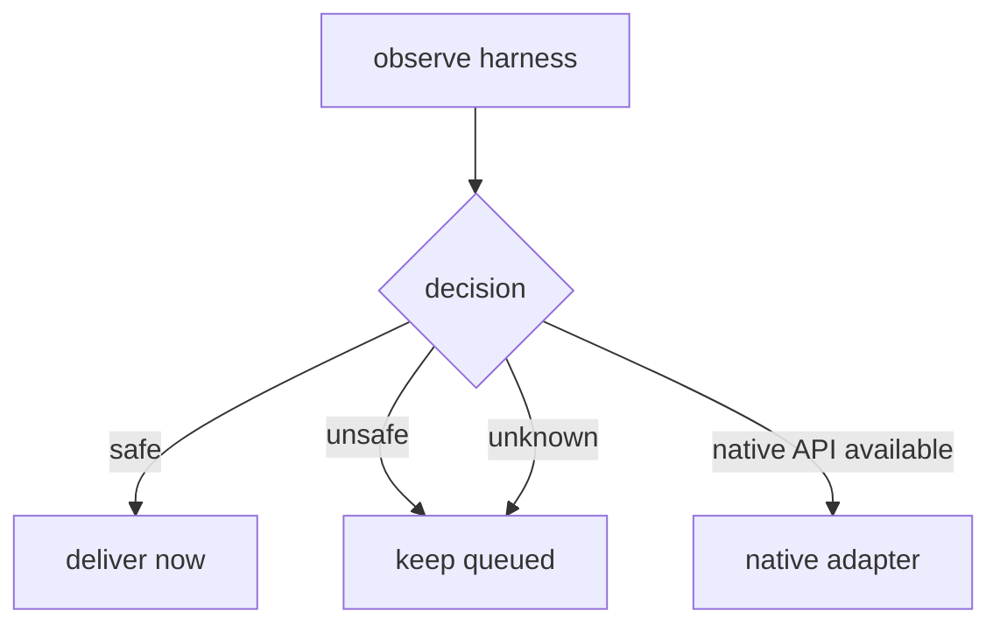

Unknown is unsafe. "Probably idle" is unsafe. A focused visible pane is unsafe,
because a human can be composing text.

The router never wakes itself up to check whether something changed. Every retry
is caused by a producer event: a focus change, screen/input-region change,
idle-state change, message append, endpoint close, or an OS deadline event for
TTL expiry. If the relevant producer cannot push, the message stays pending
until a push primitive exists, a human discharges it, or its TTL expires.

## Proposed components

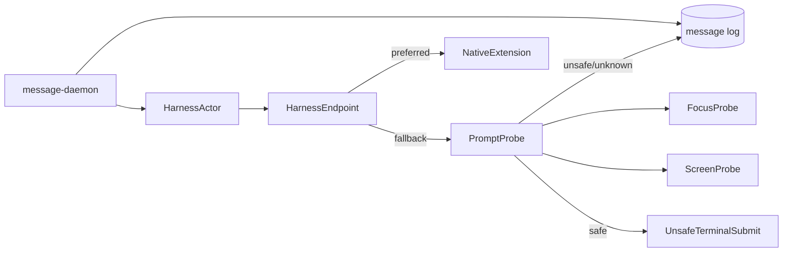

### `HarnessActor`

Owns runtime data for one harness:

```text
name
pid
endpoint
visibility
last_observation
delivery_policy
queued_message_cursor
```

The endpoint belongs to the actor. The message log is global state; endpoint
state is runtime actor state.

Endpoint kind and delivery policy must also be typed:

```rust
enum EndpointKind {
    Human,
    Native,
    PtySocket,
    WezTermPane,
}

enum DeliveryPolicy {
    HumanReadOnly,
    Native,
    GatedTerminal,
    UnsafeTerminal,
}
```

Unknown endpoint strings should not silently drop messages. Adding a new
endpoint kind must force an exhaustive match update.

### `PromptProbe`

Small, synchronous, fast. It gathers a snapshot and returns a typed decision:

```text
ProbeDecision =
  SafeToSubmit(reason)
  Defer(reason)
  Unknown(reason)
```

It must not mutate the terminal.

### `ScreenProbe`

For WezTerm panes:

1. `wezterm cli list --format json`.
2. Match by `pane_id` or `tty_name`.
3. Read `cursor_x`, `cursor_y`, `is_active`, dimensions.
4. `wezterm cli get-text --pane-id <id>` for visible screen text.
5. Extract the prompt/input line around `cursor_y`.

For persona-owned PTYs, we should eventually stop depending on WezTerm's screen
parser and maintain our own terminal state model in `persona-wezterm-daemon`.
The daemon already records raw bytes; it does not yet maintain a parsed screen.
That is the durable place to add `ScreenState`.

### `FocusProbe`

Optional plugins:

```text
WezTermFocusProbe:
  use wezterm pane is_active

X11FocusProbe:
  xdotool getactivewindow getwindowpid
  compare active PID/process tree to harness viewer PID

SwayFocusProbe:
  swaymsg -t get_tree | jq focused pid

HyprlandFocusProbe:
  hyprctl activewindow -j | jq pid
```

Policy:

- If target pane/window is focused, defer.
- If focus cannot be determined, continue only if the target is marked
  `headless` or `exclusive-agent-owned`.
- For visible shared harnesses, unknown focus means defer.

### `UnsafeTerminalSubmit`

This name should be ugly on purpose. It writes to the PTY/WezTerm input stream
only after the probes return `SafeToSubmit`.

It is not the message bus. It is one endpoint implementation.

## Prompt-empty detection

The first practical detector is screen-shape based.

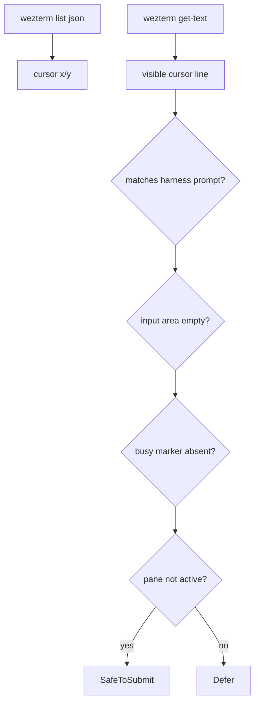

Harness-specific prompt recognizers:

| Harness | Idle markers | Busy markers | Empty input heuristic |
|---|---|---|---|
| Pi | status footer + visible prompt box | token usage changing, no prompt box, extension status later | cursor line/input region contains only prompt chrome |
| Claude | prompt line + "waiting for terminal input" style state | `esc to interrupt`, `ctrl+c`, tool-running status | current input row after prompt is empty |
| Codex | `Ready` footer + prompt marker | thinking/tool status, running command block | current input row after `>` is empty |

This table should move into per-harness adapters; the gate interface should not
hard-code every product forever.

The adapter selector should still be typed. The report's shorthand
`harness_kind` means a closed Rust enum, not a string:

```rust
enum HarnessKind {
    Pi,
    Claude,
    Codex,
}
```

Each variant owns its recognizer through methods or an adapter object. The gate
should not dispatch on `"pi"`/`"claude"`/`"codex"` strings.

## Race window

The race cannot be eliminated while using stdin:

```text
t0 probe says empty
t1 human types
t2 terminal submit writes message
```

We can make the window small but not zero. The mitigation is policy:

1. Never use this path for focused visible panes.
2. Send only to panes marked `agent-owned` or not currently focused.
3. Require producer events for changes in focus, input-region occupancy, and
   busy/idle state.
4. For truly shared panes, prefer native extension delivery; terminal fallback
   remains unavailable until its producer events exist.

Cancellation also needs a precise meaning. Phase 2 should make the final focus
and prompt-empty check the last operation before submit. There should be no work
between the final check and `send-text`/PTY write except the submit call itself.
If focus changes before the final check, cancel means "do not submit." Once the
write begins, there is no clean cancellation; this is why native adapters remain
the destination. A later WezTerm Lua-side delivery could reduce this
cross-process race by checking and writing inside WezTerm's event loop, but that
is a later optimization, not the first implementation.

There is no stable-interval resample. `sleep(50ms); observe_again` is polling.
If the design wants to know that a human started typing, the harness daemon must
emit `InputRegionChanged`; otherwise the message remains queued.

## Message lifecycle

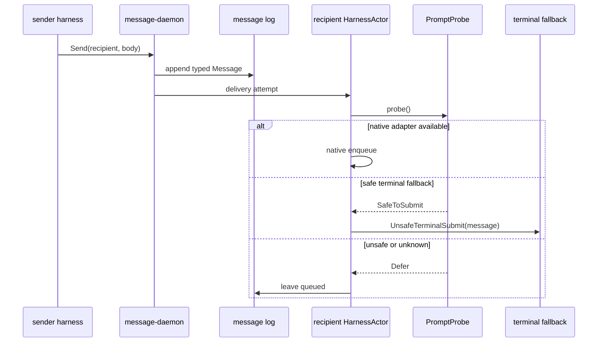

Queued messages are not failures. They are pending deliveries. The CLI should
make this visible:

```nota
(Accepted message delivered)
(Accepted message queued)
(Accepted message deferred "pane focused")
```

## Router, not just daemon

The component currently called `message-daemon` is becoming the router. That is
the better name because the work is no longer just "append a message":

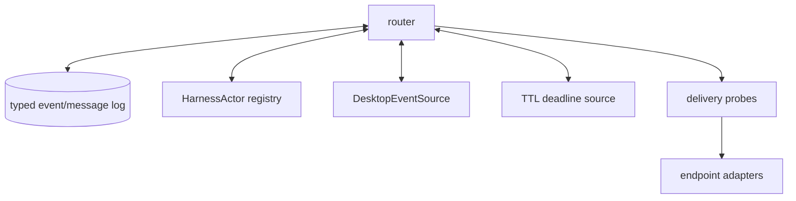

The router should probably become its own repository once it owns:

- pending delivery state;
- harness actor lifecycles;
- desktop/window subscriptions;
- typed route decisions;
- policy for noisy event sources;
- retries and deferred queues.

`persona-message` can remain the contract crate and CLI for typed messages.
`persona-router` can own runtime routing.

`persona-router` is also transitional substrate on the path to the Persona
reducer. It is the runtime sketch while the reducer contract is still forming;
the reducer should eventually absorb the state-machine part of this router.

## Event-driven focus wake

The router must not poll the desktop constantly. The focused-pane case wants an
edge-triggered subscription:

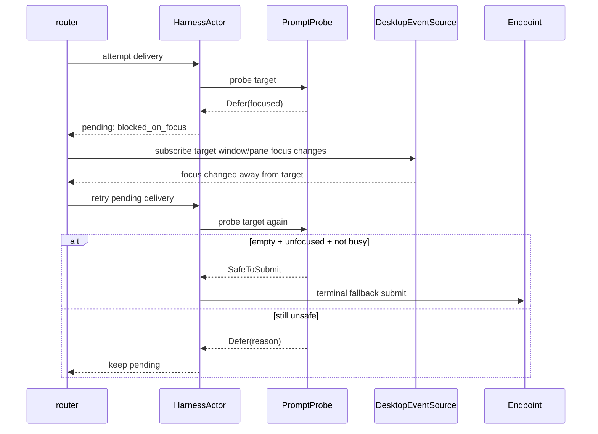

The subscription is conditional. The router subscribes when a pending delivery
is blocked by focus, and it can unsubscribe when:

- the pending queue for that target is empty;
- the target becomes headless or detached;
- the target process exits;
- a native adapter replaces terminal fallback delivery.

This keeps desktop integration quiet. The router does not need every focus
event forever; it needs a wake signal for pending work.

### Desktop event sources

```text
DesktopEventSource =
  WezTermEventSource
  X11EventSource
  SwayEventSource
  HyprlandEventSource
```

Preferred local order:

1. WezTerm pane state if the harness is in a WezTerm-managed pane.
2. WM/compositor event stream if available.
3. No fallback polling. If there is no event source, focus-gated delivery is
   unavailable for that target.

The implementation should normalize all sources into one event:

```nota
(FocusChanged target focused)
```

or a richer internal Rust enum:

```rust
DesktopEvent::FocusChanged {
    target: HarnessTarget,
    focused: bool,
}
```

### Noise control

Desktop focus can be noisy, but the router should not debounce by sleeping. A
focus event invalidates the previous block reason and schedules one gate attempt
immediately in the router actor. If another focus event arrives, it schedules
another attempt. Wake count follows event count; there is no wait-for-stability
loop.

### Block reasons as subscriptions

Every deferred delivery should record a typed block reason:

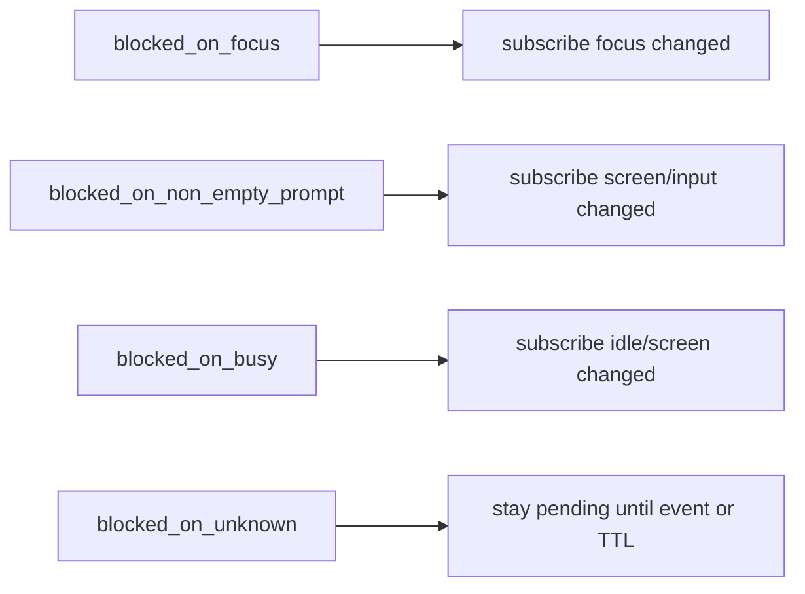

For now, focus is the cleanest event. Prompt-empty and busy-state changes are
usually screen/output changes; those may come from the harness node itself
rather than the window manager.

The retry loop is event-driven. There is no timer backoff for unknown state or
missing event sources. A harness node that already observes PTY output should
push screen/idle/input-region changes to the router; the router then probes and
attempts delivery once. If no event can resolve the block reason, the message
stays pending until a real event arrives, a human discharges it, or TTL expires.

## Push primitives

Each block reason resolves through a producer-owned push primitive:

| Block reason | Push primitive | Producer | Consumer |
|---|---|---|---|
| `blocked_on_focus` | `FocusChanged { target, focused: false }` | compositor or WezTerm focus hook | router |
| `blocked_on_non_empty_prompt` | `InputRegionChanged { target, occupied: false }` | harness daemon parsed screen state | router |
| `blocked_on_busy` | `IdleStateChanged { target, idle: true }` | harness daemon parsed screen state | router |
| `blocked_on_unknown` | none | none | stays pending |
| inbox/tail display | `MessageAppended { message }` | message router | subscriber |

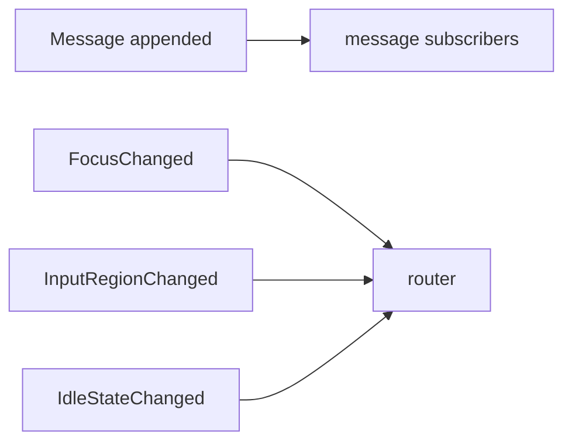

The current `MessageStore::tail()` shape should move from a 200ms file reread
loop to a daemon/router subscription. A tail client connects once and receives
`MessageAppended` records as the producer emits them.

## TTL

TTL is the only timer-shaped mechanism in this design, and it is not used for
state-change detection. The router registers a per-message deadline with the
operating system and receives one deadline event when it expires.

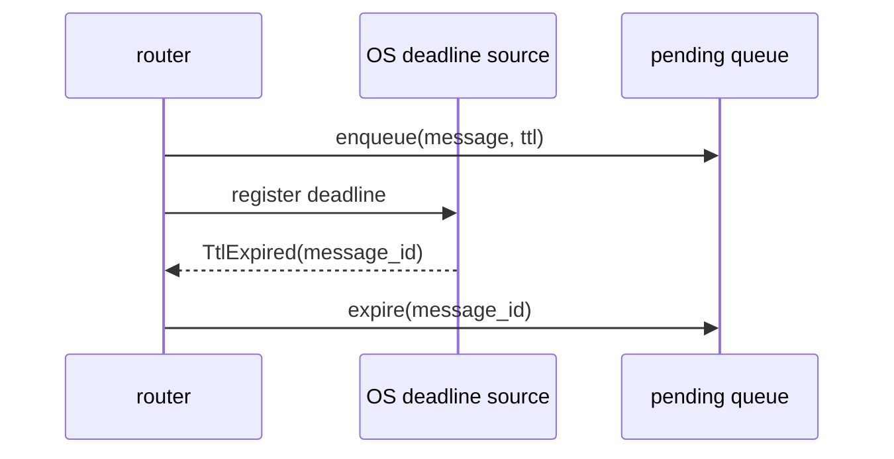

The TTL event bounds memory and stale pending work. It does not ask whether
focus, prompt occupancy, or busy state changed.

## Implementation plan

### Phase 1: make unsafe explicit

In `persona-message`:

- Replace stringly `EndpointKind` dispatch with a closed `EndpointKind` enum.
- Add a closed `DeliveryPolicy` enum.
- Rename endpoint kind `pty-socket` use in live tests to
  `unsafe-pty-socket` or add `delivery_policy unsafe-terminal`.
- Make default `pty-socket` delivery return queued/deferred unless explicitly
  allowed.
- Extend `Accepted` output with delivery status.

In `persona-message-harness.md`:

- Teach agents that sending a message does not guarantee immediate terminal
  delivery.
- Teach agents the three terminal-fallback outcomes: delivered, queued, and
  deferred. Do not retry after a deferred outcome; the router actor owns
  eventual delivery.
- Teach them to use `message '(Inbox name)'` if prompted by tests or future
  adapters.

### Phase 2: WezTerm prompt probe

In `persona-wezterm`:

- Add `PaneSnapshot` from `wezterm cli list --format json` + `get-text`.
- Add `PromptLine` extraction using cursor coordinates.
- Add `FocusState` from WezTerm `is_active`.
- Add `PromptProbe::decision(snapshot, HarnessKind)`, where `HarnessKind` is a
  closed enum with per-harness recognizer methods.
- Add tests using recorded fixture screens for empty and non-empty prompt rows.

### Phase 3: gated terminal fallback

In `persona-message`:

- Harness actor asks endpoint for `DeliveryDecision`.
- If safe, call terminal submit.
- If unsafe/unknown, keep message queued and return `deferred`.
- Add a retry loop owned by the actor, not by the CLI process.
- Trigger retries only from focus/screen/idle events.
- Make the final focus and prompt-empty check the last step before terminal
  submit.

### Phase 4: WM plugins

Add optional focus probes and event sources:

- X11 `xdotool` if present.
- Sway `swaymsg`.
- Hyprland `hyprctl`.

These are advisory guards. WezTerm pane state remains the default because it is
available through the chosen harness substrate.

### Phase 5: split runtime router

Create `persona-router` when routing state outgrows the `message` CLI:

- move `message-daemon` runtime into router;
- keep message schema/CLI contract in `persona-message`;
- add `HarnessActor` and `DesktopEventSource` actors;
- persist pending deliveries in the router log/state;
- add TTL expiry through an OS deadline source;
- expose route decisions for audit.

### Phase 6: native adapters

The real long-term path:

- Pi extension/plugin first.
- Codex/Claude native channels if any are discoverable.
- Inbox subscription as a fallback that does not share stdin.

## Test plan

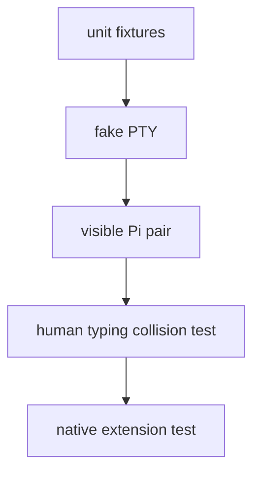

Required tests:

1. Empty prompt fixture -> `SafeToSubmit`.
2. Non-empty prompt fixture -> `Defer(non_empty_prompt)`.
3. Focused visible pane -> `Defer(focused)`.
4. Unknown focus on shared visible pane -> `Defer(unknown_focus)`.
5. Headless exclusive pane + empty prompt -> `SafeToSubmit`.
6. Live collision reproduction: type `arsentiarens` into responder and send a
   message. Expected result after fix: no splice; message remains queued.
7. Live delivery happy path: unfocused empty responder pane receives a queued
   message and replies.

## Recommendation

Implement the gate, but treat it as a fallback with a warning label. The correct
architecture remains native delivery or inbox subscription. The gate exists because
some proprietary harnesses leave us no better transport today.

The most important policy rule:

> A visible focused harness is human-owned. Persona must not write to its stdin.

## Sources

- WezTerm `get-text` captures pane text and supports pane targeting:
  <https://wezterm.org/cli/cli/get-text.html>
- WezTerm `Pane` objects track PTY/screen/scrollback and expose cursor/text
  introspection methods:
  <https://wezterm.org/config/lua/pane/index.html>
- WezTerm `cli list --format json` reports panes and metadata:
  <https://wezterm.org/cli/cli/list.html>
- `xdotool` can query active windows and window PIDs on X11:
  <https://manpages.debian.org/bookworm/xdotool/xdotool.1.en.html>
- Sway can expose focused window info through `swaymsg -t get_tree`:
  <https://unix.stackexchange.com/questions/443548/get-pid-of-focused-window-in-wayland>
