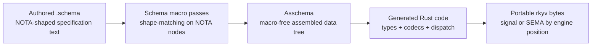
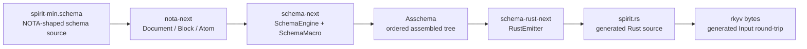
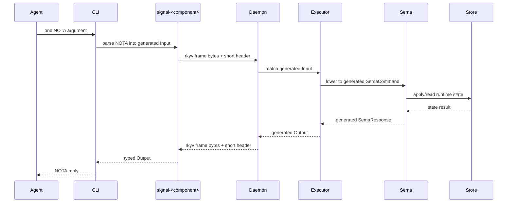

# 204 — Schema components, interfaces, and boundary proof

## Frame

This report answers the psyche prompt asking to see the components, their
interfaces, their schema, how schema creates the interfaces, and how that
allows components to talk to each other.

Spirit records captured from the prompt:

- 830: CLI boundary is NOTA; component-to-component messaging must be binary
  rkyv; tests must prove both boundaries.
- 831: schema-stack presentations and tests must show component interface,
  source schema, and schema-generated interface together.
- 832: signal, sema, and executor lowering are all reaction languages: input
  tree plus runtime state produces output tree.
- 833: inter-component messaging needs unique identifiers for agents and
  messages so asynchronous mail delivery can be correlated.
- 834: NOTA is the text interface and specification representation for the
  portable rkyv shapes used as SEMA or signal depending on engine position.
- 835: schema plays the CapnProto-like role of specifying data shapes more
  specifically than equivalent Rust code, while adding Persona's module and
  macro system.
- 836: schema macros resolve by raw NOTA node shape: delimiter, member count,
  and member types.
- 837: macro expansion recurses until it yields a macro-free assembled schema
  tree of core scalar schema nodes.
- 838: the assembled schema is the complete input for Rust generation,
  including NOTA text IO and portable rkyv binary IO for SEMA and signal
  formats.

## Clarified relationship: NOTA, rkyv, signal, SEMA

NOTA is not merely the CLI surface. The CLI uses NOTA because a shell-friendly
text interface is useful for agents and humans, but the deeper role is that
NOTA is the authored text representation of the portable binary data
specification.

The target stack is:



That makes schema more precise than hand-written Rust as a source of truth.
Rust becomes one generated projection of the assembled schema, not the
specification itself.

## Macro resolution model

The schema engine should treat raw NOTA blocks as structural payloads first.
At each macro position, the active macro namespace decides whether the block
is:

- a core scalar schema node;
- a built-in macro such as a compact struct or enum declaration;
- a context-loaded macro from an imported schema/module.

The discriminator is structural: delimiter kind, number of members, and the
shape or type-qualification of those members. A macro is therefore a variant
in the same conceptual namespace as the core schema nodes. If a macro expands
to another NOTA-shaped payload, that payload is passed through the same
macro-resolution process until no macros remain.

The endpoint is `Asschema`: a macro-free, fully resolved, ordered tree of
data-type nodes. Rust emission consumes only that tree.

## Current implementation state

The implemented stack now proves this much:



The proof is not yet the full runtime daemon path. It is the first concrete
schema-to-binary boundary slice:

- schema source is parsed structurally through `nota-next`;
- schema macros lower into an ordered `Asschema`;
- Rust source is generated by `schema-rust-next`;
- generated types compile as ordinary Rust;
- generated signal input types derive rkyv;
- a generated `Input` value round-trips through rkyv bytes under
  `nix flake check`.

## Component interfaces

### `nota-next`

`nota-next` is the recursion floor. It knows delimiter structure and source
spans, not schema semantics.

```rust
pub struct Document;
pub enum Block;
pub enum Delimiter;
pub struct Atom;
pub enum AtomClassification;
pub struct SourceSpan;
```

The important interface is structural:

```rust
Document::parse(source)
document.root_objects()
block.is_parenthesis()
block.is_square_bracket()
block.is_brace()
block.is_pipe_text()
block.holds_root_objects()
block.root_object_at(index)
block.qualifies_as_pascal_case_symbol()
block.demote_to_string()
```

`nota-next` does not decide that `Entry` is a type or that `[Topic Kind]` is a
struct field list. It only says what the object is shaped like. Schema macros
interpret that shape in a macro position.

### `schema-next`

`schema-next` interprets NOTA blocks as schema language objects and produces
one ordered assembled schema tree.

```rust
pub struct Asschema;
pub struct SchemaIdentity;
pub struct SchemaEngine;

pub trait SchemaMacro {
    fn matches(&self, object: &Block, position: MacroPosition) -> bool;
    fn lower(
        &self,
        object: &Block,
        position: MacroPosition,
        context: &mut MacroContext,
    ) -> Result<MacroOutput, SchemaError>;
}
```

The assembled schema is deliberately read-only from the outside:

```rust
asschema.identity()
asschema.imports()
asschema.surfaces()
asschema.namespace()
asschema.type_named("Entry")
```

That keeps the canonical order as authored. Derived indexes are allowed, but
canonical storage is vectors, not maps.

### `schema-rust-next`

`schema-rust-next` is a Rust source composer, not a macro surface. It consumes
`Asschema` and emits files.

```rust
pub struct RustEmitter;
pub struct GeneratedFile {
    pub path: String,
    pub code: RustCode,
}

let asschema = SchemaEngine::default().lower_source(source, identity)?;
let generated = RustEmitter::default().emit_file(&asschema);
```

Generated types currently include:

- transparent newtypes;
- structs with field names derived from type names;
- enums and root surface enums;
- rkyv derives;
- 64-bit short-header constants derived from surface and variant order.

## Current Spirit schema example

The current MVP schema fixture:

```nota
{}
[
  (Input (Record Entry) (Observe Query))
  (Output (RecordAccepted RecordIdentifier) (RecordsObserved RecordSet))
]
{
  Topic [Text]
  Topics [Topic]
  Description [Text]
  RecordIdentifier [Integer]
  Entry [Topics Kind Description Magnitude]
  Query [Topic Kind]
  RecordSet [Entry]
  Kind (Decision Principle Correction Clarification Constraint)
  Magnitude (Minimum VeryLow Low Medium High VeryHigh Maximum)
}
```

The root file type is implied by `.schema`. The three root objects are:

- import/export space: `{}`;
- root signal surfaces: `[...]`;
- local namespace: `{...}`.

Inside the namespace:

- `Entry [Topics Kind Description Magnitude]` lowers to a struct;
- `Kind (Decision Principle Correction Clarification Constraint)` lowers to
  an enum;
- field names are derived from type names, so `Magnitude` becomes
  `magnitude`, not an authored field label.

## Generated interface

The schema above emits this kind of Rust interface:

```rust
pub struct Entry {
    pub topics: Topics,
    pub kind: Kind,
    pub description: Description,
    pub magnitude: Magnitude,
}

pub enum Input {
    Record(Entry),
    Observe(Query),
}

pub enum Output {
    RecordAccepted(RecordIdentifier),
    RecordsObserved(RecordSet),
}
```

All emitted data types now carry rkyv derives:

```rust
#[derive(rkyv::Archive, rkyv::Serialize, rkyv::Deserialize, Clone, Debug, PartialEq, Eq)]
pub enum Input {
    Record(Entry),
    Observe(Query),
}
```

The generated short-header constants are derived from ordered surface and
variant position:

```rust
pub mod short_header {
    pub const INPUT_RECORD: u64 = 0x0000000000000000;
    pub const INPUT_OBSERVE: u64 = 0x0001000000000000;
    pub const OUTPUT_RECORD_ACCEPTED: u64 = 0x0100000000000000;
    pub const OUTPUT_RECORDS_OBSERVED: u64 = 0x0101000000000000;
}
```

This is still the shallow header MVP. The deeper namespace allocation plan
needs a later slice.

## How components talk

The intended component path is:



The CLI is one NOTA consumer because agents and humans need a shell-friendly
surface. The daemon boundary is binary because components should not parse
text to talk to each other. Both surfaces must be generated from the same
assembled schema: NOTA text readers/writers and portable rkyv binary
readers/writers are projections of one specification.

## Reaction-language shape

The same pattern repeats at each layer:

```text
SignalInput + runtime state -> SignalOutput
SignalInput -> SemaCommand
SemaCommand + runtime state -> SemaResponse
SemaResponse -> SignalOutput
```

The schema target should make that explicit as multiple generated reaction
languages:

- signal language: public request/reply roots;
- core signal language: owner-only request/reply roots;
- sema language: commands and responses over daemon state;
- lowering language: generated mapping between signal input and sema command;
- shaping language: generated mapping between sema response and signal output.

This is the important design point: an executor should not be an ad-hoc pile
of `match` statements over handwritten types. It should match generated trees
whose possible arms come from schema.

## What is proven now

The latest `schema-rust-next` implementation proves both the CLI-style NOTA
boundary and the binary rkyv boundary on the generated Spirit fixture.

Generated `Input` now implements `FromStr` over NOTA:

```rust
let input = "(Record ([schema] Constraint [agent's clarified intent] Maximum))"
    .parse::<generated::Input>()?;

assert_eq!(
    input.to_string(),
    "(Record ([schema] Constraint [agent's clarified intent] Maximum))"
);
```

The same parsed generated signal type crosses the binary boundary:

```rust
let bytes = rkyv::to_bytes::<rkyv::rancor::Error>(&input)?;
let decoded = rkyv::from_bytes::<generated::Input, rkyv::rancor::Error>(&bytes)?;
assert_eq!(decoded, input);
```

The Nix constraints now include:

- `generated-nota-boundary`: the generated fixture carries `FromStr` and
  `to_nota`, and tests parse a CLI-style NOTA string into generated `Input`.
- `generated-rkyv-boundary`: the generated fixture carries rkyv derives and
  tests exercise `rkyv::to_bytes` / `rkyv::from_bytes`.

The current proof is still deliberately narrow. It proves generated NOTA text
IO and generated rkyv binary IO, but not yet the full socket frame.

## Missing tests

The next constrained tests should be added in this order:

1. Frame boundary: wrap generated `Input` in the signal frame, write
   length-prefixed rkyv bytes, read them back, and dispatch by generated
   short header.
2. Runtime reaction: feed generated `Input::Record` into a generated executor
   harness and assert it lowers to a generated sema command.
3. SEMA state reaction: apply the generated sema command to a fake store and
   assert a generated sema response.
4. Reply shaping: map generated sema response to generated signal `Output`.
5. Async correlation: prove two in-flight generated requests with distinct
   exchange identifiers can receive replies out of order and still correlate.

Only after those pass should we say the schema stack proves component
communication end-to-end.

## Implementation conclusion

The architecture now has a real first spine:

```text
.schema -> nota-next -> schema-next -> Asschema -> schema-rust-next -> NOTA + rkyv-capable Rust types
```

The biggest remaining gap is not whether schema can create interfaces. It can.
The gap is that the generated interfaces have not yet been wired through the
whole component runtime: signal frame, executor lowering, SEMA state
operation, reply shaping, and async exchange correlation.

That should be the next operator slice.
