# 205 — spirit-next schema pilot implementation

## Purpose

This report records the operator pass requested in the prompt to audit the
current work, scour the designer prototypes, create the public `spirit-next`
repo, and implement the strongest interface design ideas in runnable code.

## Prototype Audit

Accepted from `design-nota-from-schema`:

| Idea | Kept as |
|---|---|
| Generated source should be visible source | `build.rs` writes Rust to `OUT_DIR`, and `src/lib.rs` includes that generated module. |
| Recursion floor should be explicit | `schema-next`/`schema-rust-next` remain the lowering/emission boundary; `spirit-next` consumes the assembled interface rather than hiding logic in a legacy macro. |
| Deterministic code generation is the proof surface | `spirit-next` does not hand-write the signal payload types. It imports generated `Input`, `Output`, `Entry`, `Kind`, `Magnitude`, and wrappers. |

Accepted from the designer Spirit POC worktree:

| Idea | Kept as |
|---|---|
| Prove a real CLI/daemon process boundary | `tests/process_boundary.rs` starts `spirit-next-daemon` and calls `spirit-next` twice. |
| Reply shape should be terse | `Record` returns `(RecordAccepted 1)` rather than echoing the entry. |
| Runtime boundaries should stay visible | Store, engine, transport, daemon, and CLI are separate modules. |

Rejected or deferred:

| Prototype element | Reason |
|---|---|
| Old `signal_channel!` / legacy signal macro path | Contra current intent. A Nix check rejects `signal_channel!` anywhere in the source. |
| `EffectTable` / `FanOutTargets` authored-schema path | Retracted in later designer/operator audit. It makes the schema look executable before the assembled schema layer is stable. |
| Hidden Rust macro emission as the main path | Current discipline is schema -> assembled schema -> generated Rust source -> optional later macro ergonomics. |
| redb persistence | This pass proves the generated interface and binary boundary first. Durable storage is a next slice. |

## Implemented Repo

Local path:

`/git/github.com/LiGoldragon/spirit-next`

Public repository:

`https://github.com/LiGoldragon/spirit-next`

Workspace symlink:

`/home/li/primary/repos/spirit-next`

The repo is a runnable schema-derived Spirit pilot. It has one crate with two
binaries:

| Binary | Role |
|---|---|
| `spirit-next` | Thin NOTA CLI client. Exactly one argument: inline NOTA or path to a NOTA file. |
| `spirit-next-daemon` | Unix-socket daemon. Exactly one NOTA argument for the socket path. |

## Interface

The authored schema lives at `schema/spirit.schema`:

```nota
{}
[
  (Input (Record Entry) (Observe Query))
  (Output (RecordAccepted RecordIdentifier) (RecordsObserved RecordSet) (Error ErrorMessage))
]
{
  Topic [Text]
  Description [Text]
  ErrorMessage [Text]
  RecordIdentifier [Integer]
  Entry [Topic Kind Description Magnitude]
  Query [Topic Kind]
  RecordSet [Entry]
  Kind (Decision Principle Correction Clarification Constraint)
  Magnitude (Minimum VeryLow Low Medium High VeryHigh Maximum)
}
```

Generated Rust creates the public interface types from that schema:

```rust
pub use generated::{
    Description, Entry, ErrorMessage, Input, Kind, Magnitude, Output, Query,
    RecordIdentifier, RecordSet, Topic,
};
```

The CLI accepts NOTA at the edge:

```sh
spirit-next "(Record ([schema] Constraint [schema creates the interface] Maximum))"
```

The process boundary carries binary frames:

```text
4 byte big-endian frame length
8 byte little-endian short header
rkyv archived generated payload
```

The daemon returns NOTA at the edge:

```nota
(RecordAccepted 1)
```

## Runtime Flow

```mermaid
flowchart LR
    Schema["schema/spirit.schema"] --> Lower["schema-next::SchemaEngine"]
    Lower --> Emit["schema-rust-next::RustEmitter"]
    Emit --> Generated["generated Rust interface"]
    Generated --> CLI["spirit-next CLI parses NOTA"]
    CLI --> Frame["short header + rkyv frame"]
    Frame --> Daemon["spirit-next-daemon"]
    Daemon --> Engine["Engine"]
    Engine --> Store["in-memory Store"]
    Store --> Reply["generated Output"]
    Reply --> FrameOut["short header + rkyv frame"]
    FrameOut --> Text["CLI prints NOTA"]
```



## Tests

Local checks run:

```sh
cargo fmt -- --check
cargo test
cargo clippy --all-targets -- -D warnings
nix flake check
```

The flake adds three intent-specific witnesses beyond build/test/fmt/clippy/doc:

| Check | Constraint |
|---|---|
| `no-old-signal-macro` | Rejects use of `signal_channel!`. |
| `generated-at-build-time` | Proves `build.rs` calls `schema-next` and `schema-rust-next`, and `lib.rs` includes `OUT_DIR` generated source. |
| `binary-boundary-test` | Proves rkyv encode/decode is present and the process-boundary integration test uses the real CLI binary. |

`tests/process_boundary.rs` starts a real daemon, records one generated `Input`
over the Unix socket, receives `(RecordAccepted 1)`, then queries the same
daemon and receives the stored generated `Entry`.

## Current Limit

This is a correct first public pilot, not production Spirit:

| Missing piece | Next implementation target |
|---|---|
| Vector support in schema language | Multi-topic records and multi-record query output generated from schema instead of hand-shaped one-entry `RecordSet`. |
| redb storage | Durable store module using generated archive types. |
| Schema-derived signal/sema/lowering languages | Replace hand-written `Engine` dispatch with generated reaction objects. |
| Async mail identifiers | Add request/reply identifiers after the synchronous proof is stable. |

## Operator Judgment

The important part is now real: a schema file creates Rust interface types,
those types parse and print NOTA at the CLI edge, and the process boundary
uses binary rkyv frames with a short header. The old signal macro is not in the
path.

The next useful slice is not another presentation-only prototype. It is making
`schema-next` express vectors cleanly, then removing the remaining hand-shaped
runtime conveniences in `spirit-next` one at a time until the store, dispatch,
and response language are schema-derived too.
