# 206 — Schema Spirit running-concept audit

## Scope

This audit compares the current operator artifact with the designer concept
branches and the schema stack it consumes.

Operator artifact:

- `/git/github.com/LiGoldragon/spirit-next`
- `reports/operator/205-spirit-next-schema-pilot-implementation-2026-05-26.md`

Designer artifacts:

- `reports/designer-assistant/368-running-spirit-concept-on-new-architecture-2026-05-26.md`
- `reports/designer/369-comparison-designer-368-vs-operator-205-running-concepts-2026-05-26.md`
- `/home/li/wt/github.com/LiGoldragon/signal-spirit/designer-running-concept-2026-05-26`
- `/home/li/wt/github.com/LiGoldragon/spirit/designer-running-concept-2026-05-26`

Substrate repos:

- `/git/github.com/LiGoldragon/nota-next`
- `/git/github.com/LiGoldragon/schema-next`
- `/git/github.com/LiGoldragon/schema-rust-next`

## Verification Run

All relevant running concepts are clean and pass their flake checks.

| Path | Status | Check |
|---|---|---|
| `/git/github.com/LiGoldragon/spirit-next` | clean | `nix flake check` passed |
| `/home/li/wt/github.com/LiGoldragon/signal-spirit/designer-running-concept-2026-05-26` | clean | `nix flake check --option max-jobs 0` passed |
| `/home/li/wt/github.com/LiGoldragon/spirit/designer-running-concept-2026-05-26` | clean | `nix flake check --option max-jobs 0` passed |

## Current Architecture

```mermaid
flowchart LR
    Nota["nota-next<br/>raw delimiter tree<br/>spans + atom classification"]
    Schema["schema-next<br/>macro-shaped lowering<br/>Document -> Asschema"]
    Rust["schema-rust-next<br/>Asschema -> Rust source"]
    SpiritSchema["spirit-next/schema/spirit.schema"]
    Build["spirit-next/build.rs"]
    Generated["generated module<br/>Input / Output / payloads<br/>NOTA + rkyv derives"]
    Cli["spirit-next CLI<br/>NOTA boundary"]
    Frame["transport<br/>length + short header + rkyv"]
    Daemon["spirit-next-daemon"]
    Engine["Engine::handle<br/>match Input -> Output"]
    Store["in-memory Store"]

    Nota --> Schema
    Schema --> Rust
    SpiritSchema --> Build
    Build --> Schema
    Rust --> Generated
    Generated --> Cli
    Cli --> Frame
    Frame --> Daemon
    Daemon --> Engine
    Engine --> Store
    Store --> Engine
    Engine --> Frame
```



The most important architectural pattern is the boundary split:

- authored schema is the user-facing specification;
- `Asschema` is the macro-free assembled tree;
- generated Rust is visible source included from `OUT_DIR`;
- runtime code is a shim around generated types, not a second schema.

## Typical Code Pattern

### Schema First

`spirit-next/schema/spirit.schema` is the canonical interface authoring
surface:

```nota
{}
[
  (Input (Record Entry) (Observe Query))
  (Output (RecordAccepted RecordIdentifier) (RecordsObserved RecordSet) (Error ErrorMessage))
]
{
  Topic [Text]
  Description [Text]
  ErrorMessage [Text]
  RecordIdentifier [Integer]
  Entry [Topic Kind Description Magnitude]
  Query [Topic Kind]
  RecordSet [Entry]
  Kind (Decision Principle Correction Clarification Constraint)
  Magnitude (Minimum VeryLow Low Medium High VeryHigh Maximum)
}
```

This is the cleanest current interface example:

- braces hold namespace maps;
- square brackets declare positional structs / newtypes;
- parentheses declare enum variants;
- the first surface is request-side `Input`;
- the second surface is response-side `Output`.

### Build-Time Assembly

`spirit-next/build.rs` is the canonical consumer pattern:

```rust
let source = fs::read_to_string("schema/spirit.schema").expect("read schema/spirit.schema");
let asschema = SchemaEngine::default()
    .lower_source(&source, SchemaIdentity::new("spirit_next", "0.1.0"))
    .expect("lower spirit-next schema");
let generated = RustEmitter.emit_file(&asschema);

let output_directory = PathBuf::from(env::var_os("OUT_DIR").expect("OUT_DIR set"));
fs::write(
    output_directory.join("spirit_next_generated.rs"),
    generated.code.as_str(),
)
.expect("write generated Spirit interface");
```

The dependency direction is right: the runtime crate does not import a
designer macro or old signal macro; it calls the schema engine and emitter.

### Runtime Reaction

`spirit-next/src/engine.rs` is the typical high-level engine pattern:

```rust
pub fn handle(&self, input: Input) -> Output {
    match input {
        Input::Record(entry) => {
            let identifier = self.store.lock().expect("store lock").record(entry);
            Output::RecordAccepted(RecordIdentifier(identifier))
        }
        Input::Observe(query) => match self.store.lock().expect("store lock").observe(&query) {
            Some(entry) => Output::RecordsObserved(RecordSet(entry)),
            None => Output::Error(ErrorMessage(String::from("no matching record"))),
        },
    }
}
```

This matches the psyche's recent pattern: engine logic is a typed tree matched
against another typed tree. The runtime should keep evolving in this shape:
`Input` matched to state operation, state operation matched to response,
response matched to `Output`.

### Binary Boundary

`spirit-next/src/transport.rs` is the current wire pattern:

```rust
fn encode_frame<Value>(header: u64, value: &Value) -> Result<Vec<u8>, TransportError>
where
    Value: rkyv::Archive
        + for<'archive> rkyv::Serialize<
            rkyv::api::high::HighSerializer<
                rkyv::util::AlignedVec,
                rkyv::ser::allocator::ArenaHandle<'archive>,
                rkyv::rancor::Error,
            >,
        >,
{
    let archive =
        rkyv::to_bytes::<rkyv::rancor::Error>(value).map_err(|_| TransportError::ArchiveEncode)?;
    let mut frame = Vec::with_capacity(SHORT_HEADER_BYTE_COUNT + archive.len());
    frame.extend_from_slice(&header.to_le_bytes());
    frame.extend_from_slice(&archive);
    Ok(frame)
}
```

The good part: the short header is actually outside the rkyv payload, so
dispatch can triage before full body decode.

The bad part: this is still hand-written per component. It should become
emitted or shared once the header schema is stable.

## Designer Branch Comparison

### What `spirit-next` Gets Right

`spirit-next` is the stronger canonical artifact for four reasons:

1. It follows the new-repo strategy for major breaks. The operator track lives
   on `spirit-next` main rather than a designer feature branch on an existing
   target repo.
2. It includes a first-class short header in the frame: `length + header +
   rkyv`, not just `length + rkyv`.
3. It preserves the production-style CLI shape: `spirit-next "(Record ...)"`
   with socket resolution outside the NOTA operation.
4. It has Nix witnesses for structural intent: no old `signal_channel!`,
   build-time generation, and real binary CLI boundary.

### What Designer Contributes

The designer branches contribute three things `spirit-next` should absorb:

1. **Unit-granularity tests.** `signal-spirit` tests rkyv round-trip, NOTA
   round-trip, and short-header constant values separately. `spirit-next`
   mostly proves the whole process boundary. It needs both levels.
2. **Monotonic multi-request witness.** Designer's `spirit` integration test
   sends three requests and proves identifiers increment. `spirit-next` only
   proves one record plus one observe.
3. **Triad split pressure.** Designer separated `signal-spirit` from
   `spirit`, even though the branch is only a concept. `spirit-next` currently
   combines contract and runtime in one crate, which is acceptable for a pilot
   but wrong as the target component shape.

### Designer Drift Found

Two drift points in the designer concept should not be imported blindly:

1. `signal-spirit/ARCHITECTURE.md` describes the fuller `State` / `Record` /
   `Observe` / `Watch` / `Unwatch` surface, but
   `schema/signal-spirit.schema` is the smaller one-operation MVP. The report
   explains the MVP, but the repo architecture doc overstates the branch.
2. `spirit/schema/spirit.schema` contains a fuller five-block future schema,
   but the branch runtime does not consume that schema. The runtime depends on
   generated types from the sibling `signal-spirit` branch. That schema is
   design material in the runtime repo, not load-bearing code.

Operator should harvest the tests and triad pressure, not the stale schema
placement.

## Implementation Gaps

### P0 — Schema Expressiveness Is Still Below Spirit v0.3

`schema-next` cannot express the current production Spirit shape:

- no vector type reference;
- no option type reference;
- no import resolution;
- no imported `Magnitude` from `signal-sema`;
- no multi-topic `Entry`;
- no list output for `RecordsObserved`;
- no provenance date/time records;
- no topic-count output.

This is the main reason `spirit-next` is a proof, not a replacement.

### P0 — Header and Route Code Are Not Schema-Derived Enough

`schema-rust-next` emits short-header constants, but `spirit-next` still
hand-writes:

- `InputRoute`;
- `OutputRoute`;
- `input_short_header`;
- `output_short_header`;
- `input_route`;
- `output_route`.

That means adding a schema variant requires editing runtime code. The next
emitter slice should generate one route enum and route conversion methods per
surface.

### P0 — No Durable State

The current `Store` is a `Vec` guarded by a `Mutex`. It proves reaction shape,
but not Spirit's real purpose:

- no redb;
- no rkyv-at-rest;
- no daemon-stamped date/time;
- no migration path;
- no query by identifier;
- no topic catalog.

The durable-store slice should use generated archive types directly, not a
parallel hand-authored storage model.

### P1 — Triad Boundaries Are Not Yet Real

`spirit-next` combines authored schema, generated signal surface, CLI, daemon,
engine, and transport in one repo. That was right for the public pilot, but the
target is still:

- `spirit` — daemon + bundled CLI;
- `signal-spirit` — ordinary signal schema and generated contract;
- `core-signal-spirit` — privileged/core signal schema and generated contract.

The current pilot should either split or explicitly become the integration
fixture once the separate repos exist.

### P1 — `schema-next` Has a Macro Trait But Not Yet a Macro Engine

The code has `SchemaMacro`, `MacroPosition`, `MacroContext`, and
`MacroOutput`, but the actual engine is fixed:

- exactly three root objects;
- hard-coded imports/surfaces/namespace passes;
- hard-coded `SurfaceMacro` and `TypeDeclarationMacro`;
- no user-defined macro registry;
- no iterative expansion until no macros remain;
- no assembled schema output file;
- no conflict detection beyond shape checks.

The good foundation is present, but it is not yet the macro system described
in the design thread.

### P1 — NOTA Structural Layer Needs More Shape Predicates

`nota-next` correctly owns the recursion floor: delimiter blocks, spans,
atoms, pipe text, and `qualifies_as_*` helpers. The schema engine already uses
those helpers. Missing next conveniences:

- named root-count predicates beyond one/two;
- methods for "child N is square bracket / parenthesis / brace";
- structural match helpers that avoid open-coded `root_object_at` chains;
- re-emission helpers for generated parse errors that include source spans.

These belong in `nota-next`, not in `schema-next`.

### P1 — Tests Need Granular Constraint Coverage

`spirit-next` has strong process-boundary proof and good Nix witnesses, but
it should add designer-style unit tests for:

- generated NOTA round-trip per generated surface;
- generated rkyv round-trip per generated surface;
- short-header constant values and route mapping;
- header/body mismatch rejection;
- truncated frame rejection;
- multiple records yielding monotonic identifiers;
- observe miss returning typed `Error`.

### P2 — Error Types Are Too Generic in the Generator

`schema-rust-next` emits a single `NotaDecodeError` with useful categories, but
it is still runtime-string-heavy:

- parse errors are stringified;
- expected delimiter names are string literals;
- variant names are strings;
- no source-span propagation in generated errors.

This is acceptable for the pilot, but the next generator pass should preserve
the structural position of the bad object.

### P2 — CLI Test Convenience Is Still Unsettled

Designer report 369 suggests optionally supporting:

```nota
(Request [/tmp/spirit.sock] (Record ...))
```

That is useful for local multi-daemon test scripts, but it should not become
the normal component CLI shape. Production `spirit` currently discovers
sockets through the profile/wrapper environment and takes the typed operation
as the single NOTA argument. If the explicit-socket wrapper lands, keep it as a
test-harness request type or an internal runner convenience, not as the normal
agent-facing command.

## Patterns To Preserve

### Pattern 1 — Authored Schema Is Small; Generated Rust Is Full

The authored schema should stay concise and positional. The generated Rust
expands it into all boring machinery: newtypes, structs, enums, rkyv derives,
NOTA decoding, display, and headers.

This is the main beauty of the approach: the human writes the tree; the machine
fills in the ceremony.

### Pattern 2 — Runtime Logic Matches Typed Trees

Engine code should keep the shape visible:

```text
Input -> state operation -> state response -> Output
```

Do not hide this behind string dispatch, dynamic maps, or loosely typed
command names. Every layer should be a closed enum match until the schema
itself emits the closed dispatch table.

### Pattern 3 — NOTA At Edges; rkyv Between Components

The correct split is now demonstrated twice:

```text
human / CLI / file boundary: NOTA
daemon socket boundary: rkyv bytes
state-at-rest boundary: rkyv in redb, not yet implemented in spirit-next
```

Keep this split. Do not add JSON, serde text, or ad hoc flag parsing.

### Pattern 4 — Constraint Tests Name Architecture, Not Just Behavior

The `spirit-next` flake checks are better than normal smoke tests because they
assert the architecture:

- no old macro;
- build-time schema generation;
- real binary boundary.

The next checks should similarly name the next architecture constraints:

- route enum generated from schema;
- no hand-written route table;
- no hand-written generated-type mirrors;
- store persists generated archive types.

### Pattern 5 — Designer Branches Are Evidence, Not Mainline

Designer's worktrees are valuable because they prove alternatives. The
operator job is not to merge them wholesale. The operator job is to harvest:

- tests;
- naming pressure;
- failure cases;
- interface examples;
- clear runtime patterns.

Then those land on operator-owned main.

## Recommended Next Slice

The next implementation slice should target the gap with the highest leverage:
make `schema-rust-next` emit the route/header layer.

Acceptance shape:

1. Extend `schema-rust-next` so every surface emits:
   - `<Surface>Route`;
   - `<Surface>::short_header()`;
   - `<Surface>Route::from_short_header(u64)`;
   - `<Surface>Route::short_header()`.
2. Delete `InputRoute`, `OutputRoute`, `input_short_header`,
   `output_short_header`, `input_route`, and `output_route` from
   `spirit-next/src/transport.rs`.
3. Add a Nix witness that rejects hand-written route enums in
   `spirit-next`.
4. Port designer's unit tests for rkyv round-trip, NOTA round-trip, and
   monotonic multi-record behavior.

This keeps the current running proof intact while moving one more piece from
runtime shim into schema-derived interface code.
