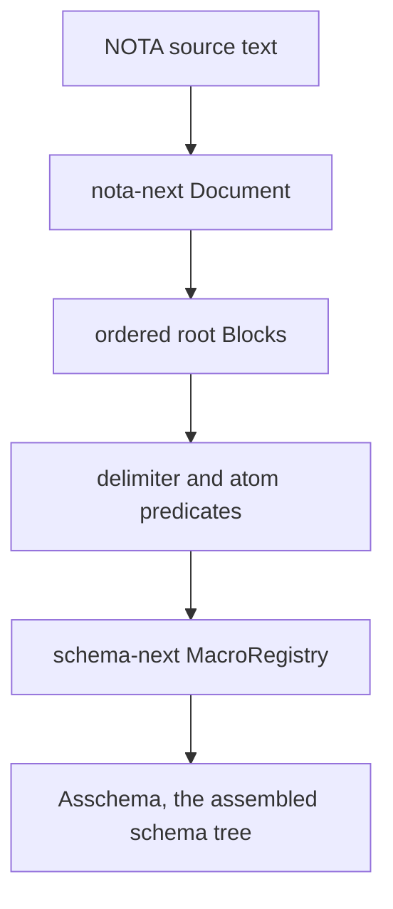

# 210 — Schema framework walkthrough, part 1: NOTA structural floor

## Scope

This is the first bottom-up report in the walkthrough. It covers only the
current `nota-next` floor and the immediate handoff into `schema-next`.

It answers one question: what does the system know before schema semantics
exist?

## Current layer stack



`nota-next` is deliberately the hand-authored bootstrap floor. It is not yet
itself generated from schema. It parses the delimiter language into a neutral
tree and exposes methods on that tree. Higher layers decide what the tree
means.

## What `nota-next` owns

The crate is small and explicit:

- `Document` is an ordered vector of root `Block`s plus the original source
  string.
- `Block` is one of three forms: delimited object, pipe-text object, or atom.
- `SourceSpan` and `SourcePosition` preserve byte/line/column positions.
- Factual methods start with `is_`: `is_parenthesis`,
  `is_square_bracket`, `is_brace`, `is_pipe_text`, `is_atom`.
- Shape/candidate methods start with `qualifies_as_`: they say whether an
  atom could be a schema symbol, not whether it is semantically valid in a
  schema.

Current source anchors:

- `nota-next/src/lib.rs` says this crate is the structural reader and does not
  interpret schema types, fields, imports, or macros.
- `nota-next/src/parser.rs` defines `Document`, `Block`, `Delimiter`,
  `PipeText`, `Atom`, `AtomClassification`, `NotaError`, and the recursive
  parser.
- `nota-next/tests/block_queries.rs` is the proof surface for root-object
  order, recursive shape predicates, atom classification, pipe text, and
  unclosed delimiter diagnostics.

## The exact parser model

`Document::parse(source)` does this:

1. Creates a parser cursor at byte `0`, line `1`, column `1`.
2. Repeatedly skips whitespace and semicolon comments.
3. Parses one root object at a time until EOF.
4. Returns an error if a closing delimiter appears at root.
5. Preserves the original source string so every block can re-emit its exact
   source slice by span.

A root object is parsed by first character:

```text
(  -> parenthesis Block::Delimited
[| -> Block::PipeText
[  -> square-bracket Block::Delimited
{  -> brace Block::Delimited
else -> Block::Atom
```

Delimited objects recurse until their matching close delimiter. Nested objects
are stored as ordered child blocks. A mismatched or premature closing delimiter
returns `UnexpectedClose`. EOF before the matching close returns
`UnclosedDelimiter`.

Pipe text starts with `[|` and ends with `|]`. Its contents are not recursively
parsed. That is the current square-bracket-safe text island; it can contain
`]`, quotation marks, apostrophes, and newlines as literal content.

Atoms read until whitespace, comment start `;`, any opening delimiter, or any
closing delimiter. They are classified only as candidates:

- `IntegerCandidate` when the text parses as `i64`.
- `DecimalCandidate` when it parses as `f64` and contains a dot.
- `SymbolCandidate` when it is ASCII alphanumeric / `_` / `-`, and starts
  with an ASCII letter or `_`.
- `TextCandidate` otherwise.

That classification is intentionally not semantic. A PascalCase atom only
qualifies as a PascalCase symbol; it does not become an enum variant until a
schema macro sees it in a position where an enum variant is expected.

## The shape methods

These methods are the usable interface schema macros rely on:

```text
Document::holds_root_objects() -> usize
Document::root_object_at(index) -> Option<&Block>
Block::holds_root_objects() -> usize
Block::holds_single_root_object() -> bool
Block::holds_two_root_objects() -> bool
Block::root_object_at(index) -> Option<&Block>
Block::is_parenthesis() -> bool
Block::is_square_bracket() -> bool
Block::is_brace() -> bool
Block::is_pipe_text() -> bool
Block::is_atom() -> bool
Block::qualifies_as_symbol() -> bool
Block::qualifies_as_pascal_case_symbol() -> bool
Block::qualifies_as_camel_case_symbol() -> bool
Block::qualifies_as_kebab_case_symbol() -> bool
Block::demote_to_string() -> Option<&str>
Block::reemit(source) -> &str
```

This is the important design: NOTA gives macros objects they can ask questions
about. It does not decide the final type of those objects.

## Example: one object, no semantics yet

Source:

```nota
(Record [Entry Query])
```

Raw `nota-next` sees:

```text
Document
  root[0] = Parenthesis block
    child[0] = Atom "Record"  qualifies_as_pascal_case_symbol
    child[1] = SquareBracket block
      child[0] = Atom "Entry" qualifies_as_pascal_case_symbol
      child[1] = Atom "Query" qualifies_as_pascal_case_symbol
```

At this layer, `Record` is not yet a variant, `[Entry Query]` is not yet a
struct, and `Entry` / `Query` are not yet payload types. They are just blocks
with shape.

`schema-next` later decides what that means based on `MacroPosition`.

## Handoff into `schema-next`

Correction after psyche review, 2026-05-27: the wording below must be plain.
The schema file is read as a known `Schema` struct. The file does not define
what a schema is every time it is read. The reader already knows the root
fields.

Second correction after psyche review, 2026-05-27: only the root `Schema`
name is omitted. That does not mean every nested object can drop its own name.
When the authored file defines an enum, struct, or newtype, the object being
defined still needs its own qualified symbol name.

The intended root shape is a known struct with positional fields such as:

```text
Schema {
    imports,
    input,
    output,
    namespace,
}
```

So if the authored schema has a section for input and a section for output,
those are fields of the known `Schema` struct. They should be described as
fields named `input` and `output`, not as invented "surfaces" unless the code
is specifically discussing the current temporary implementation type.

The values inside those fields still define named objects. For example, this
is not enough:

```nota
((Record Entry) (Observe Query))
```

It omits the enum being specified. The reader can know this is the `input`
field, but the enum object itself still needs a name. A more faithful shape is:

```nota
(Input ((Record Entry) (Observe Query)))
```

Plain English: define enum `Input`; its variants include `Record`, which
carries `Entry`, and `Observe`, which carries `Query`.

The same rule applies to ordinary namespace definitions:

```nota
(Kind (Decision Principle Correction Clarification Constraint))
(Entry [Topic Kind Description Magnitude])
(Topic [Text])
```

Plain English:

- `(Kind (...))` defines an enum named `Kind`.
- `(Entry [...])` defines a struct named `Entry`.
- `(Topic [Text])` defines a newtype struct named `Topic`.

The general authored-schema rule is therefore:

```text
(Name (Variant ...))  -> enum definition
(Name [FieldType ...]) -> struct definition
(Name [InnerType]) -> newtype struct definition
```

For enum variants, a bare symbol is a unit variant; a parenthesis object such
as `(Record Entry)` is a data-carrying variant.

Implementation update after this correction: `schema-next` now accepts the
named object form directly. The minimal Spirit schema now uses:

```nota
{}
[
  (Input ((Record Entry) (Observe Query)))
  (Output ((RecordAccepted RecordIdentifier) (RecordsObserved RecordSet)))
]
{
  (Topic [Text])
  (Description [Text])
  (Entry [Topic Kind Description Magnitude])
  (Kind (Decision Principle Correction Clarification Constraint))
}
```

The root-schema description itself now lives at
`repos/schema-next/schemas/root.schema`. It defines the known root `Schema`
struct as:

```nota
(Schema [Imports Input Output Namespace])
```

and then defines the nested objects that make that root meaningful:
`Imports`, `Input`, `Output`, `Namespace`, `TypeDeclaration`,
`StructDeclaration`, `EnumDeclaration`, `VariantDeclaration`, and the scalar
name/reference wrappers.

The remaining current implementation name is `RootSurfaces`: code still uses
that as the second root position. In plain design language, that position is
the part of the root schema containing the input and output enum definitions.
The next implementation pass should rename the code once the root shape is
settled, but the authored schema form is no longer the old nameless variant
list.

`nota-next` only says: root object 1 is a brace object, root object 2 is a
square-bracket object, root object 3 is a brace object.

`schema-next::SchemaEngine` then requires exactly three root objects and sends
them into the macro registry:

```text
root[0] at MacroPosition::RootImports
root[1] at MacroPosition::RootSurfaces
root[2] at MacroPosition::RootNamespace
```

That position is load-bearing. The same delimiter can mean different things in
different positions because `nota-next` does not impose meaning.

## What currently follows the intent well

The good parts:

- The raw NOTA layer is a structural library of methods on real objects.
- Macro logic can ask shape questions recursively rather than doing ad hoc
  string parsing.
- Source spans are present from the floor, so later diagnostics and macro
  errors can point back to exact source locations.
- Pipe text is an honest non-recursive text island for macro bodies or text
  that contains square brackets.
- NOTA does not decide schema semantics. Schema is the next layer, as intended.

## Current mismatches and pressure points

The important gaps:

1. `nota-next` currently treats ordinary `[ ... ]` as a recursive
   square-bracket block. It does not yet have a distinct inline bracket-string
   node for `[text with spaces]`. The production Spirit skill says canonical
   NOTA strings use `[text]` and `[|text|]`; this prototype floor only gives a
   special node to `[|text|]`. That is a real semantic gap for later stack
   convergence.

2. `schema-next` currently describes the middle root section with the vague
   implementation term `RootSurfaces`. That is the wrong explanatory language
   for the schema design. In plain English, the target schema root is a known
   struct with fields like `input` and `output`; the authored file fills those
   fields. It does not redeclare the concept of schema every time.

3. Comments are discarded by parsing. That matches the current design that
   comments do not carry data, but it means schema-level documentation is not
   present in the assembled tree unless schema later adds an explicit
   documentation object.

4. Atom classification is ASCII-only for symbol candidates. That is simple and
   useful for Rust code generation, but it is not yet the eventual
   multilingual identifier/storage story.

5. `nota-next` is not schema-derived yet. It is the bootstrap floor. That is
   acceptable now, but if the end state is “Nota itself has a schema,” that
   remains future work.

## Tests that witness this layer

Current `nota-next` tests prove:

- Multiple root objects stay ordered.
- Blocks re-emit their exact source slice from spans.
- Recursive shape predicates expose parenthesis/square/brace child structure.
- Atom candidates are classified without schema semantics.
- `[|...|]` pipe text is not recursively parsed.
- Unclosed delimiters report the opening source position.

These tests cover the structural floor. They do not yet test a full
schema-derived NOTA reader, because that layer does not exist yet.

## Bottom-line assessment

`nota-next` currently matches the intended bottom layer in one key way: it is a
thin structural object library, not a schema interpreter. That is the right
foundation for schema macros.

The main thing it does not yet match is the full canonical NOTA text model:
ordinary bracket strings are not yet represented as a distinct text object in
this prototype. The next report should climb one layer up into `schema-next`
and show exactly how the macro registry turns these neutral NOTA blocks into
assembled schema.
