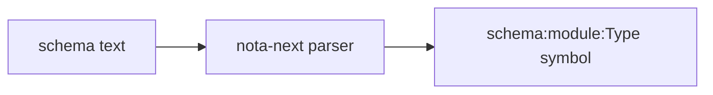
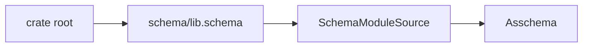
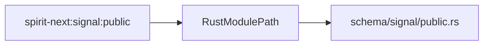
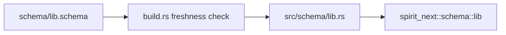
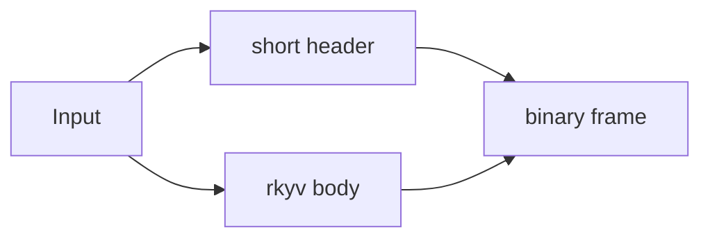
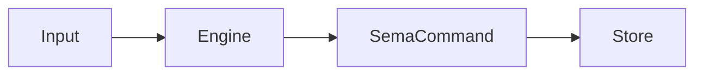
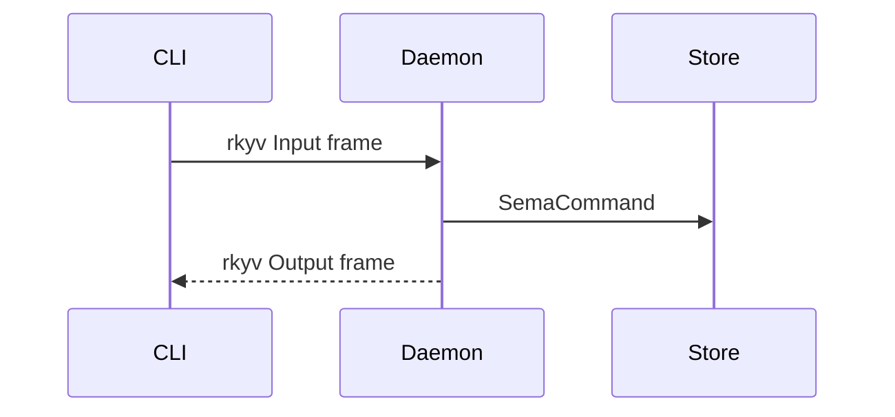

# 213 — Nota/schema next stack: focused graph and Nix-test design

## Purpose

This report gives the implementation-facing design for the current
`nota-next` / `schema-next` / `schema-rust-next` / `spirit-next` stack after
Spirit record 911:

> Design documents for the nota/schema next stack should use short focused
> graphs, pair each graph with the relevant code surface, and ground each
> scenario explanation directly in Nix tests.

The key continuation is that generated Rust for the running Spirit pilot is a
source-visible artifact in `src/schema/<module>.rs` in this version. The
`OUT_DIR`-only target is a stale intermediate.

Implementation landed in `spirit-next` commit `0296be2d6b9c`
(`materialize generated schema source`). The report below describes that shape
as current for `spirit-next`.

## Reading Rule

Each scenario below has three parts:

- a small graph that explains one relationship;
- the Nix check that proves the relationship;
- the code surface the check is protecting.

No graph is trying to show the whole stack. The whole stack is the ordered set
of these small testable scenarios.

## Scenario 1 — NOTA keeps schema names as one symbol



Caption: `nota-next` must not split a schema-qualified name at `:`.

Nix check:

```nix
checks.test = craneLib.cargoTest ...
```

The concrete witness is the Rust test in `nota-next`:

```rust
let block = Document::parse("schema:module:Type")?
    .root_object_at(0)
    .expect("root");
assert!(block.qualifies_as_symbol());
```

Implementation meaning: `:` is allowed in NOTA symbol characters. Schema can
then interpret the symbol as a qualified name. NOTA does not decide whether the
symbol is a valid type path; it only preserves the structure.

## Scenario 2 — schema package owns `schema/lib.schema`



Caption: `schema-next` owns the crate-local schema entrypoint.

Nix check:

```nix
schema-module-entrypoint = pkgs.runCommand "schema-next-schema-module-entrypoint" { } ''
  grep -R "pub struct SchemaPackage" ${src}/src/module.rs >/dev/null
  grep -R "lib.schema" ${src}/src/module.rs >/dev/null
  grep -R "package_loader_reads_schema_lib_entrypoint" ${src}/tests/lowering.rs >/dev/null
  test -f ${src}/tests/fixtures/spirit-crate/schema/lib.schema
  touch $out
'';
```

Code surface:

```rust
let package = SchemaPackage::new(&crate_root, "spirit-next", "0.1.0");
let source = package.load_lib().expect("read schema/lib.schema");
let asschema = source.lower(&SchemaEngine::default()).expect("lower");
```

Implementation meaning: a participating crate has a `schema/` directory, and
`lib.schema` is the schema root exactly like `src/lib.rs` is the Rust root.
The current slice loads the root and can derive module paths; transitive
imports from inside `lib.schema` are still the next loader step.

## Scenario 3 — schema-rust emits a module path



Caption: the Rust emitter maps schema identity to a generated module file.

Nix check:

```nix
generated-schema-module-path = pkgs.runCommand "schema-rust-next-generated-schema-module-path" { } ''
  grep -R "schema/lib.rs" ${src}/tests/emission.rs >/dev/null
  grep -R "schema/signal/public.rs" ${src}/tests/emission.rs >/dev/null
  grep -R "struct RustModulePath" ${src}/src/lib.rs >/dev/null
  touch $out
'';
```

Rust test witness:

```rust
let asschema = SchemaEngine::default()
    .lower_source(source, SchemaIdentity::new("spirit-next:signal:public", "0.1.0"))?;
let generated = RustEmitter::default().emit_file(&asschema);
assert_eq!(generated.path, "schema/signal/public.rs");
```

Implementation meaning: `schema-rust-next` is not a Rust macro crate. It emits
source files. The first schema name segment is the crate boundary; the
remaining segments are the generated module path.

## Scenario 4 — Spirit consumes checked-in generated Rust



Caption: Spirit's generated interface is reviewable source, not hidden
`OUT_DIR` code.

Nix check:

```nix
generated-schema-source-checked-in = pkgs.runCommand "spirit-next-generated-schema-source-checked-in" { } ''
  test -f ${src}/src/schema/lib.rs
  grep -R "pub enum Input" ${src}/src/schema/lib.rs >/dev/null
  grep -R "include!(concat!(env!(\"OUT_DIR\")" ${src}/src && exit 1 || true
  grep -R "generated source is stale" ${src}/build.rs >/dev/null
  touch $out
'';
```

Rust surface:

```rust
pub mod schema {
    pub mod lib;
}

pub use schema::lib::{Input, Output, SemaCommand, SemaResponse};
```

Build witness:

```rust
let generated = RustEmitter::default().emit_file(&asschema);
let checked_in = self.crate_root.join("src").join(&generated.path);
if fs::read_to_string(&checked_in)? != generated.code.as_str() {
    panic!("generated source is stale; regenerate src/schema/lib.rs");
}
```

Implementation meaning: schema remains the authored source of truth, but the
generated Rust is visible to reviewers and agents. The build script proves the
checked-in generated source matches `schema/lib.schema`; it does not silently
replace it in `OUT_DIR`.

## Scenario 5 — generated Signal owns binary framing



Caption: signal framing is generated on the schema nouns.

Nix check:

```nix
generated-signal-plane-used = pkgs.runCommand "spirit-next-generated-signal-plane-used" { } ''
  grep -R "Input::decode_signal_frame" ${src}/src/transport.rs >/dev/null
  grep -R "Output::decode_signal_frame" ${src}/src/transport.rs >/dev/null
  grep -R "input.encode_signal_frame" ${src}/src/transport.rs >/dev/null
  grep -R "output.encode_signal_frame" ${src}/src/transport.rs >/dev/null
  ! grep -R "pub enum InputRoute" ${src}/src/transport.rs
  ! grep -R "short_header::" ${src}/src/transport.rs
  touch $out
'';
```

Rust surface:

```rust
impl<Stream> SignalTransport<Stream>
where
    Stream: Read + Write,
{
    pub fn write_input(&mut self, input: &Input) -> Result<(), TransportError> {
        self.write_frame(input.encode_signal_frame()?)
    }

    pub fn read_input(&mut self) -> Result<(InputRoute, Input), TransportError> {
        Ok(Input::decode_signal_frame(&self.read_frame()?)?)
    }
}
```

Implementation meaning: `transport.rs` owns only Unix-stream length-prefix I/O.
Route enums, 64-bit short header constants, and rkyv encode/decode belong to
generated `Input` and `Output`.

## Scenario 6 — runtime triad uses schema nouns



Caption: hand-written behavior attaches to schema-generated nouns.

Nix check:

```nix
runtime-triad-visible = pkgs.runCommand "spirit-next-runtime-triad-visible" { } ''
  grep -R "lower_to_sema" ${src}/src/engine.rs >/dev/null
  grep -R "SemaResponse" ${src}/src/engine.rs >/dev/null
  grep -R "pub fn apply(&mut self, command: SemaCommand)" ${src}/src/store.rs >/dev/null
  grep -R "executor_lowers_signal_input_to_generated_sema_command" ${src}/tests/runtime_triad.rs >/dev/null
  touch $out
'';
```

Rust surface:

```rust
impl Input {
    pub fn lower_to_sema(self) -> SemaCommand {
        match self {
            Self::Record(entry) => SemaCommand::Record(entry),
            Self::Observe(query) => SemaCommand::Observe(query),
        }
    }
}
```

Implementation meaning: schema writes the nouns. Runtime Rust writes methods
on those nouns. The executor is not a free-function layer; it matches the
generated signal input into generated SEMA operation, then returns generated
signal output.

## Scenario 7 — one process boundary proves the whole slice



Caption: the CLI speaks NOTA; the component boundary speaks generated binary
Signal.

Nix check:

```nix
binary-boundary-test = pkgs.runCommand "spirit-next-binary-boundary-test" { } ''
  grep -R "encode_signal_frame" ${src}/src/transport.rs >/dev/null
  grep -R "decode_signal_frame" ${src}/src/transport.rs >/dev/null
  grep -R "Command::new(env!(\"CARGO_BIN_EXE_spirit-next\"))" ${src}/tests/process_boundary.rs >/dev/null
  touch $out
'';
```

Process test surface:

```rust
let record = Command::new(env!("CARGO_BIN_EXE_spirit-next"))
    .env("SPIRIT_NEXT_SOCKET", &socket_path)
    .arg("(Record ([schema] Constraint [schema creates the interface] Maximum))")
    .output()
    .expect("run record cli");
```

Implementation meaning: the end-to-end test is not just an in-memory unit
test. It starts a daemon process, sends a CLI NOTA request, crosses the Unix
socket as generated binary Signal, and gets NOTA back from the CLI.

## Immediate Follow-Up Target

The implementation target above is complete in `spirit-next` commit
`0296be2d6b9c`. The remaining immediate gap is intentionally narrow:

1. Add a dedicated regeneration command or script so agents do not hand-run an
   ad hoc cargo example to refresh `src/schema/lib.rs`.
2. Keep `build.rs` as the freshness witness that rejects stale generated
   source.
3. Extend the same checked-in generated-source pattern to the next schema
   module once `schema/lib.schema` gains real import declarations.

This keeps generated code visible now while preserving schema as the edited
source of truth.
