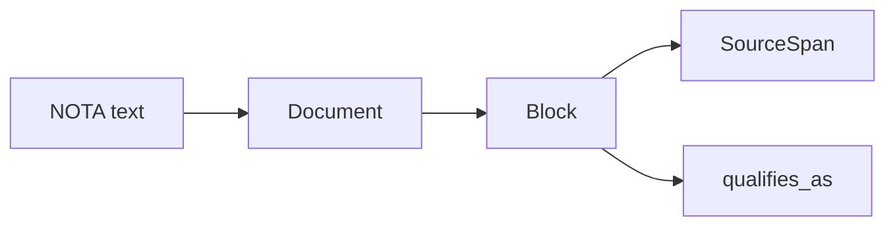
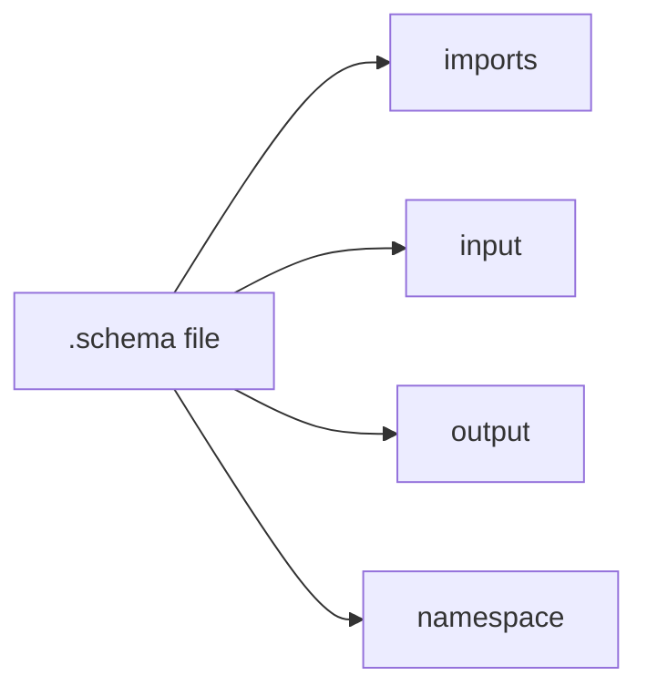
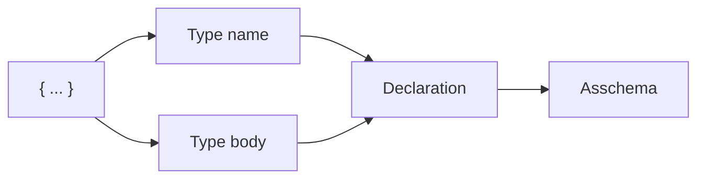
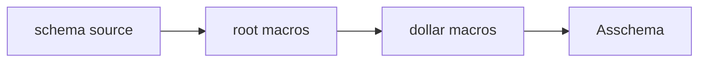
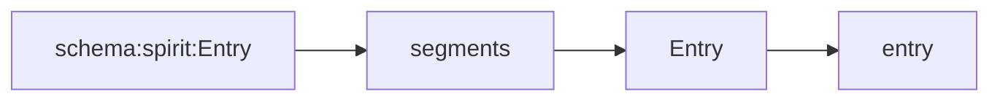
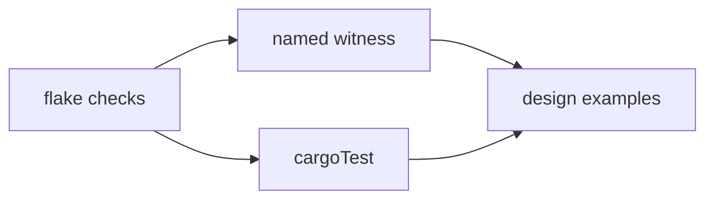

# 215 - NOTA + schema-next representation from Nix witnesses

Operator report. Scope: represent the current `nota-next` +
`schema-next` stack using short focused visuals and code excerpts from
Nix-backed tests.

## What changed first

The existing examples were useful but too implicit: they rode through
the generic `cargoTest` check without a named flake witness. I made the
examples explicit:

- `/git/github.com/LiGoldragon/nota-next/tests/design_examples.rs`
  added two design examples for source spans and candidate-symbol
  classification.
- `/git/github.com/LiGoldragon/nota-next/flake.nix` added
  `checks.x86_64-linux.design-examples`.
- `/git/github.com/LiGoldragon/schema-next/tests/design_examples.rs`
  added five design examples for root shape, brace namespace, dollar
  macro captures, colon names, and macro layers.
- `/git/github.com/LiGoldragon/schema-next/flake.nix` added
  `checks.x86_64-linux.design-examples`.

Both repos pass `nix flake check --print-build-logs`.

## Layer 1 - NOTA reads structure, not schema meaning



The current boundary is precise: NOTA knows delimiter structure,
source locations, object counts, and candidate lexical shape. It does
not decide schema legality.

Focused test excerpt:

```rust
let source = r#"(Record
  [Entry])"#;
let document = Document::parse(source).expect("nota parses");
let outer = document.root_object_at(0).expect("outer parenthesis");
let inner = outer.root_object_at(1).expect("inner square-bracket");

assert_eq!(outer.source_span().start.line, 1);
assert_eq!(inner.source_span().start.column, 3);
assert_eq!(inner.reemit(document.source()), "[Entry]");
```

This proves the delimiter pass keeps exact spans through nesting. The
important part is that span data is attached to real objects before
schema lowering starts; schema macros can point at the block they are
rewriting.

Second focused test excerpt:

```rust
let document = Document::parse("Decision").expect("nota parses");
let block = document.root_object_at(0).expect("first root");

assert!(block.is_atom());
assert!(block.qualifies_as_pascal_case_symbol());
assert_eq!(block.demote_to_string(), Some("Decision"));
```

`is_atom()` is a fact. `qualifies_as_pascal_case_symbol()` is a
candidate. Schema decides whether this candidate is valid at this
position.

Nix witness:

```nix
design-examples = pkgs.runCommand "nota-next-design-examples" { } ''
  grep -R "design_example_source_spans_propagate_through_nested_blocks" ${src}/tests/design_examples.rs >/dev/null
  grep -R "design_example_reader_exposes_candidates_not_schema_semantics" ${src}/tests/design_examples.rs >/dev/null
  touch $out
'';
```

`nix flake check` ran the named witness and executed
`tests/design_examples.rs`: 2 tests passed.

## Layer 2 - schema root is the known four-field struct



A `.schema` file does not re-declare that it is a schema. The reader is
already in schema mode, so the root object is the known four-field
struct:

1. imports
2. input
3. output
4. namespace

Focused negative test:

```rust
let too_few = "{} (Input ()) (Output ())";
let error = SchemaEngine::default()
    .lower_source(too_few, SchemaIdentity::new("example", "0.1.0"))
    .expect_err("three root objects should fail");

assert_eq!(
    error,
    SchemaError::ExpectedRootObjectCount { expected: 4, found: 3 },
);
```

This keeps the root schema positional. We do not write field labels
inside the file; the parser knows position 1 means imports, position 2
means input, position 3 means output, position 4 means namespace.

## Layer 3 - brace namespace is key/value, not named-object form



The accepted namespace shape is pair-style:

```schema
{} (Input ()) (Output ()) { Topic [Text] Kind (Decision Constraint) }
```

`Topic [Text]` lowers as a newtype. `Kind (Decision Constraint)`
lowers as an enum. The brace stays a key/value map at the NOTA layer;
the schema layer can conceptually treat the key set as an ordered
declaration namespace.

Focused positive test:

```rust
let source = "{} (Input ()) (Output ()) { Topic [Text] Kind (Decision Constraint) }";
let asschema = SchemaEngine::default()
    .lower_source(source, SchemaIdentity::new("example", "0.1.0"))
    .expect("pair-style namespace lowers");

let names: Vec<&str> = asschema.namespace().iter()
    .map(|declaration| declaration.name().as_str())
    .collect();
assert_eq!(names, vec!["Topic", "Kind"]);
```

The companion rejection tests live in
`/git/github.com/LiGoldragon/schema-next/tests/lowering.rs`: a brace
containing `(Entry [Topic Kind])` fails because named-object style is
not pair-style.

## Layer 4 - schema macros lower sugar into Asschema



Current macro split:

- Root positions are hand-coded Rust macros:
  `RootImports`, `RootInput`, `RootOutput`, `RootNamespace`.
- Inner shapes are declarative macros loaded from
  `schemas/builtin-macros.schema`:
  `SchemaStructDefinition`, `SchemaEnumDefinition`,
  `SchemaStructFields`, `SchemaEnumVariants`.

Focused test excerpt:

```rust
let library = DeclarativeMacroLibrary::builtin().expect("builtin macros parse");
let struct_definition = library
    .definitions()
    .iter()
    .find(|definition| definition.name().as_str() == "SchemaStructDefinition")
    .expect("struct macro definition");

assert_eq!(struct_definition.capture_names(), vec!["$Name", "$*Fields"]);
```

This is the first real macro binding rule: `$Name` captures one node,
`$*Fields` captures the rest. The binding names are observed again
when the macro fires through `SchemaEngine::lower_source_with_context`.

## Layer 5 - names decompose by single colon



Focused test excerpt:

```rust
let qualified = Name::new("schema:spirit:Entry");

assert_eq!(
    qualified.namespace_segments(),
    vec!["schema", "spirit", "Entry"]
);
assert_eq!(qualified.local_part(), "Entry");
assert_eq!(qualified.field_name(), "entry");
```

This implements the current namespace decision: single colon is the
schema namespace separator. It mirrors Rust module/crate structure
without copying Rust's `::` syntax into schema text.

## Layer 6 - Nix witnesses are now explicit



For both `nota-next` and `schema-next`, the new named check proves the
design-example file still contains the intended witnesses, while
`cargoTest` executes the examples.

Schema Nix witness:

```nix
design-examples = pkgs.runCommand "schema-next-design-examples" { } ''
  grep -R "design_example_schema_document_has_exactly_four_root_objects" ${src}/tests/design_examples.rs >/dev/null
  grep -R "design_example_macro_captures_use_dollar_and_dollar_star_sigils" ${src}/tests/design_examples.rs >/dev/null
  touch $out
'';
```

Schema test output from the Nix check:

```text
Running tests/design_examples.rs
running 5 tests
test design_example_colon_qualified_name_decomposes_into_segments ... ok
test design_example_default_engine_has_two_macro_layers ... ok
test design_example_namespace_brace_is_pair_style_key_value_map ... ok
test design_example_macro_captures_use_dollar_and_dollar_star_sigils ... ok
test design_example_schema_document_has_exactly_four_root_objects ... ok
```

The broader lowering suite also ran: 13 tests passed, including
`root_schema_describes_the_schema_root_type`,
`square_brackets_lower_to_structs_and_parentheses_lower_to_enums`,
`field_names_are_derived_from_type_names`, and
`package_loader_reads_schema_lib_entrypoint`.

## Current shape in one sentence

`nota-next` turns text into positioned structural blocks; `schema-next`
runs position-aware macros over those blocks; the output is ordered,
macro-free `Asschema` that later emitters can turn into Rust types.

## Residual gap

The current tests prove the parser/lowering path and the shape of the
macro boundary. They do not yet prove the full binary/rkyv component
round trip. That proof currently lives one layer up in `spirit-next`
and should be folded into this same design-example style when the
schema-to-Rust emission story stabilizes across all three repos.
