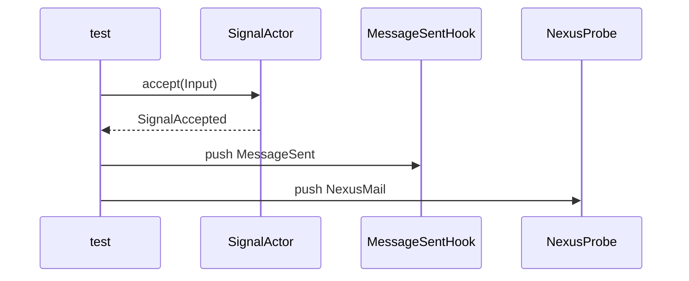
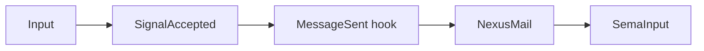
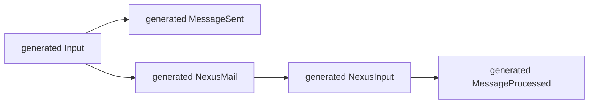

# 220 — Pattern A Signal→Nexus hook walkthrough from real tests

## Frame

Psyche asked to show how Pattern A works with visuals and code from real
tests, and to improve the tests first. Intent was captured as Spirit record
992.

The implementation target is `spirit-next` commit `922900fd` plus this
session's test tightening. The relevant test file is:

- `/git/github.com/LiGoldragon/spirit-next/tests/runtime_triad.rs`

The relevant production file is:

- `/git/github.com/LiGoldragon/spirit-next/src/engine.rs`

## What the test now proves

The first Pattern A test proved that a sent event existed. The improved test
proves ordering. It uses a shared trace so the architecture fails if a future
edit bypasses the hook and sends to Nexus first.

Short version:



The witness is the ordered trace:

```rust
vec![
    TraceEvent::SentHook(MessageIdentifier(1)),
    TraceEvent::NexusAccepted(MessageIdentifier(1)),
]
```

That trace is stronger than asserting both events happened. It specifically
guards the Pattern A shape: accepted signal object, sent hook, then Nexus.

## Real test code

The test introduces two probe objects:

```rust
#[derive(Default)]
struct NexusProbe {
    accepted_identifiers: RefCell<Vec<MessageIdentifier>>,
    trace: RefCell<Vec<TraceEvent>>,
}

#[derive(Clone, Debug, PartialEq, Eq)]
enum TraceEvent {
    SentHook(MessageIdentifier),
    NexusAccepted(MessageIdentifier),
}
```

The Nexus probe records when it receives pushed mail:

```rust
impl InputNexus for NexusProbe {
    type Reply = NexusOutput;
    type Error = Infallible;

    fn record(&self, mail: NexusMail<Entry>) -> Result<Self::Reply, Self::Error> {
        self.trace
            .borrow_mut()
            .push(TraceEvent::NexusAccepted(mail.identifier()));
        self.accepted_identifiers
            .borrow_mut()
            .push(mail.identifier());
        Ok(mail.into_nexus_input().into_nexus_output())
    }
}
```

The hook records when the sent lifecycle event fires:

```rust
impl MessageSentHook for SentHookTrace<'_> {
    type Error = Infallible;

    fn message_sent(&mut self, event: MessageSent) -> Result<(), Self::Error> {
        self.trace
            .borrow_mut()
            .push(TraceEvent::SentHook(event.identifier));
        self.events.push(event);
        Ok(())
    }
}
```

The core assertion:

```rust
#[test]
fn signal_actor_pushes_accepted_message_through_sent_hook_to_nexus() {
    let signal_actor = SignalActor::default();
    let accepted = signal_actor.accept(Input::Record(entry("signal pushes to nexus")));
    let nexus = NexusProbe::default();
    let mut hook = SentHookProbe::default().record_into_trace(&nexus);

    let processed = accepted
        .push_to_nexus(&nexus, &mut hook)
        .expect("signal to nexus push");

    assert_eq!(
        nexus.trace(),
        vec![
            TraceEvent::SentHook(MessageIdentifier(1)),
            TraceEvent::NexusAccepted(MessageIdentifier(1)),
        ]
    );
    assert!(matches!(
        processed.into_reply(),
        NexusOutput::Sema(SemaInput::Record(_))
    ));
}
```

## Production path it exercises

The production object chain is now explicit:



`Engine::handle` composes the same path in production:

```rust
pub fn handle(&self, input: Input) -> Output {
    let signal = self.signal_actor.accept(input);
    let identifier = signal.identifier();
    let nexus_step = signal
        .push_to_nexus(self, &mut self.mail_ledger.hook())
        .expect("spirit-next nexus is infallible");
    let sema_input = nexus_step.into_reply().into_sema_input();
    let sema_output = self.store.lock().expect("store lock").apply(sema_input);
    let output = NexusInput::Sema(sema_output)
        .into_nexus_output()
        .into_signal_output();
    let processed = MessageProcessed::new(identifier, output);
    processed
        .push_to(&mut self.mail_ledger.hook())
        .expect("spirit-next mail ledger is infallible");
    processed.into_reply()
}
```

`SignalAccepted::push_to_nexus` is the Pattern A method:

```rust
pub fn push_to_nexus<Nexus, Hook, Error>(
    self,
    nexus: &Nexus,
    hook: &mut Hook,
) -> Result<MessageProcessed<Nexus::Reply>, Error>
where
    Nexus: InputNexus<Error = Error>,
    Hook: MessageSentHook<Error = Error>,
{
    let identifier = self.identifier();
    self.sent.push_to(hook)?;
    self.input.dispatch_mail_with_nexus(identifier, nexus)
}
```

This is important because the push is not a free helper. The behavior lives on
`SignalAccepted`, the accepted object produced by `SignalActor`.

## Where generated schema objects appear

Pattern A still uses generated schema nouns:



The hand-written code supplies behavior on those objects:

- `SignalActor::accept(Input) -> SignalAccepted`
- `SignalAccepted::push_to_nexus(...)`
- `MessageSent::push_to(...)` from generated support
- `Input::dispatch_mail_with_nexus(...)` from generated support
- `MailLedgerHook` implements `MessageSentHook`
- `Engine` implements `InputNexus`

## Nix witness

The full Nix stack check passed after the test tightening:

```text
./scripts/check-local-schema-stack --print-build-logs
```

The check ran:

- generated schema freshness
- generated signal plane use
- binary process boundary
- runtime triad tests
- no old signal macro
- no production free functions
- no production unit structs
- fmt, clippy, docs

The relevant release-test line from the Nix run:

```text
test signal_actor_pushes_accepted_message_through_sent_hook_to_nexus ... ok
```

## Remaining improvement

This is still an in-process actor-shaped pilot. The next stronger witness is
to turn `SignalActor` and Nexus into real mailbox actors and keep this exact
trace shape as the architectural witness. That belongs with the existing
`primary-lrf8` bead, "Promote mail handling to explicit queue + fanout
observers per record 963+970".
