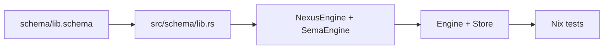
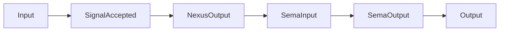
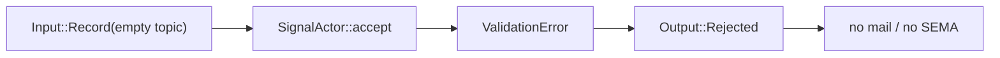

# 221 — Schema-at-heart prototype restart

## Frame

Psyche's new constraint landed as Spirit record 999, with designer's follow-up
record 1000 visible in the live log: restart the prototype from the latest main
stack and make end-to-end tests exercise the thing being built. That means the
tests must run through schema-emitted Rust data types and schema-emitted traits,
not through test-local enums, primitive store commands, or string observer logs.

I rebased the working implementation direction on current operator main:

- `schema-rust-next` main was extended first, because the SEMA trait belongs in
  the emitter, not as a hand-written runtime workaround.
- `spirit-next` main then consumed that emitter change and moved more boundary
  types into `schema/lib.schema`.

## What changed

Short version:



`schema-rust-next` now emits plane traits when the schema declares the matching
language pair:

```rust
pub trait NexusEngine {
    fn execute(&self, input: NexusInput) -> NexusOutput;
}

pub trait SemaEngine {
    fn apply(&mut self, input: SemaInput) -> SemaOutput;
}
```

`spirit-next/schema/lib.schema` now owns Signal rejection vocabulary:

```nota
Output ((RecordAccepted SemaReceipt) (RecordsObserved ObservedRecords) (Error ErrorReport) (Rejected SignalRejection))
SignalRejection [ValidationError DatabaseMarker]
ValidationError (EmptyTopic EmptyDescription EmptyQueryTopic)
```

That removed the need for hand-written rejection enums at the Signal boundary.
Invalid input now returns generated `Output::Rejected(SignalRejection)`.

## Runtime Chain

The pilot runtime now has this object chain:



The key test is `schema_emitted_traits_drive_the_full_plane_chain` in
`spirit-next/tests/runtime_triad.rs`. It constructs generated `Input`, pushes
through generated `InputNexus`, applies generated `SemaEngine`, then translates
back through generated `NexusEngine`:

```rust
let nexus_step: MessageProcessed<NexusOutput> = accepted
    .push_to_nexus(&nexus_engine, &mut hook)
    .expect("input nexus trait dispatches");
let nexus_output: NexusOutput = nexus_step.into_reply();
let sema_input: SemaInput = nexus_output.into_sema_input();
let sema_output: SemaOutput = SemaEngine::apply(&mut sema_engine, sema_input);
let signal_output: Output =
    NexusEngine::execute(&nexus_engine, NexusInput::Sema(sema_output)).into_signal_output();
```

The rejection path is also schema-centered:



`signal_actor_rejects_invalid_input_with_schema_emitted_rejection_before_mail_or_sema`
asserts the generated output and proves no mail or state mutation happened.
The process-boundary test repeats the same rejection over the real CLI/daemon
rkyv socket and expects:

```text
(Rejected (EmptyTopic (1 39)))
```

## Nix Witness

`spirit-next` now has Nix greps that force the important parts to stay real:

- generated `NexusEngine`, `SemaEngine`, `ValidationError`, and
  `SignalRejection` must exist in `src/schema/lib.rs`;
- `Store` must implement generated `SemaEngine`;
- `Engine` must implement generated `NexusEngine`;
- runtime tests must include the full-chain trait witness and the generated
  rejection witness;
- the process-boundary test must still go through the real CLI/daemon socket.

Both repos passed their Nix checks:

```text
schema-rust-next: nix flake check --print-build-logs
spirit-next:      nix flake check --print-build-logs
```

## Remaining Gaps

The next real gaps are now sharper:

- `SignalAccepted` is still a hand-written runtime witness, not emitted from a
  schema-authored Signal admission surface.
- `MailLedger` is still in-memory and single-process; the next mail cycle
  should promote queue/fanout state without losing generated event witnesses.
- SEMA is still an in-memory `Store`; durable redb should implement the same
  generated `SemaEngine` trait.
- `MessageSent`, `NexusMail`, and `MessageProcessed` are emitted by support
  code, not authored in a shared core schema yet.
