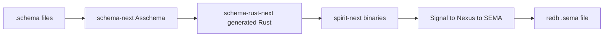
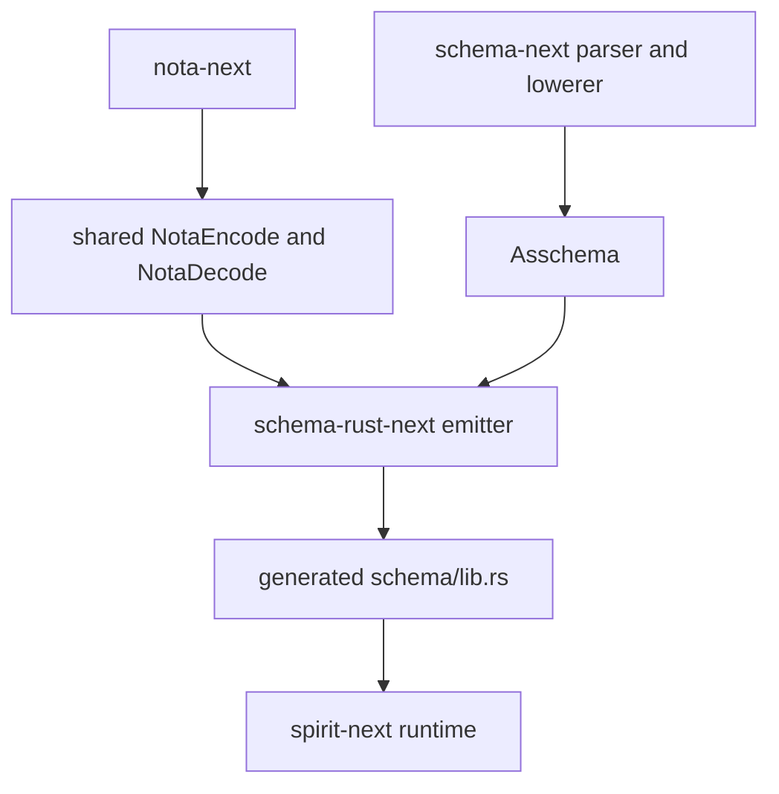
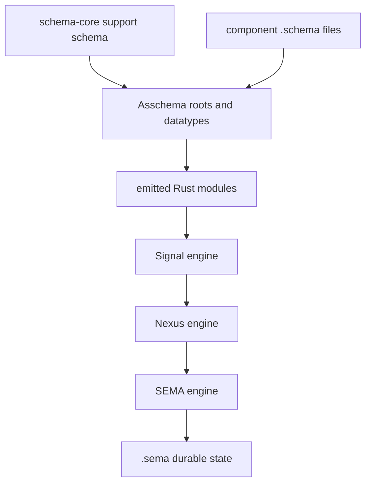
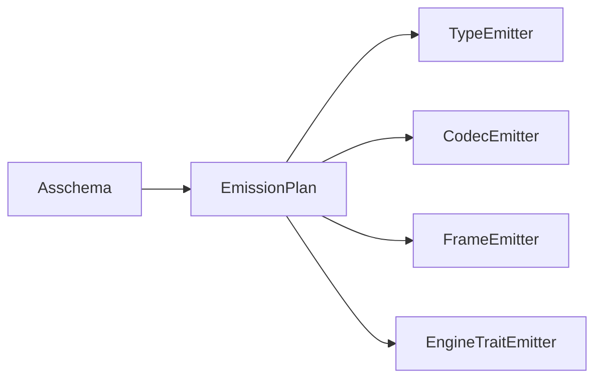
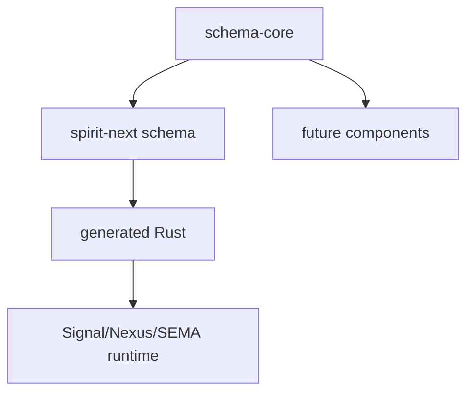

# Operator Audit 239 — Schema Stack Alignment

Date: 2026-05-29

Role: operator

Scope: `nota-next`, `schema-next`, `schema-rust-next`, `spirit-next`, plus the production Spirit correction that `spirit "(Remove 1088)"` is live.

Audited code points:

- `nota-next` at `c5894905aa5d` — `nota: add shared value codec`
- `schema-next` at `bd85ca0f20d6` — `schema: refresh triad design example names`
- `schema-rust-next` at `fc4ab0eec6eb` — `schema-rust: advance schema-next design example cleanup`
- `spirit-next` at `01e130ddde22` — `spirit: regenerate triad runtime from current schema stack`

## Verdict

The current stack is not just paper. It has a real path:



The tests now prove a meaningful slice: file-backed `.schema` inputs lower to typed assembled schema, emit Rust, compile through Nix, launch real `spirit` / `spirit-daemon` binaries, exchange rkyv over a Unix socket, and assert through schema-emitted output types.

But it is not yet the full design. The biggest issue is that the implementation still has a fixed `input` / `output` model at the assembled schema root, while the current design wants declared roots plus free datatypes. The second biggest issue is that `spirit-next` is behind production Spirit: production has live `Remove` and live topic-set search; the schema-derived Spirit contract does not.

## Current Shape



This is the strongest part of the operator work: `nota-next` is no longer parse-only, and `schema-rust-next` no longer emits a separate per-schema handwritten codec. The generated code uses the shared codec traits.

## Target Shape



The target is stricter than the current code: route, mail, plane envelopes, roots, and support nouns should be schema-authored data, not emitter-side support magic.

## Finding 1 — Asschema Still Has Fixed Input And Output

Evidence: `/git/github.com/LiGoldragon/schema-next/src/asschema.rs:58`

Current model:

```rust
pub struct Asschema {
    identity: SchemaIdentity,
    imports: Vec<ImportDeclaration>,
    resolved_imports: Vec<ResolvedImport>,
    input: EnumDeclaration,
    output: EnumDeclaration,
    namespace: Vec<TypeDeclaration>,
}
```

This is still the older reactive-pair shape. It works for the current `spirit-next` pilot, but it does not match the newer root model: roots are declared at a particular point in the schema; everything else is a free datatype used by roots.

Better target:

```rust
pub struct Asschema {
    identity: SchemaIdentity,
    imports: Vec<ImportDeclaration>,
    resolved_imports: Vec<ResolvedImport>,
    roots: Vec<RootDeclaration>,
    namespace: Vec<TypeDeclaration>,
}

pub struct RootDeclaration {
    name: Name,
    plane: Plane,
    direction: Direction,
    declaration: EnumDeclaration,
}
```

The exact field names can move, but the design move is important: `Signal`, `Nexus`, and `SEMA` roots should be first-class roots, not special support emitted from a fixed input/output pair.

## Finding 2 — Spirit-Next Does Not Match Production Spirit

Production correction from system-operator: record removal is live as:

```sh
spirit "(Remove 1088)"
```

Production multi-topic search is also live:

```sh
spirit "(Observe (Records ((Partial [spirit search]) None SummaryOnly)))"
spirit "(Observe (Records ((Full [spirit search]) None SummaryOnly)))"
```

Evidence in `spirit-next`: `/git/github.com/LiGoldragon/spirit-next/schema/lib.schema:2`

Current schema-derived input root:

```schema
((Record Entry) (Observe Query))
```

Current query and result:

```schema
Query {| Query topic Topic kind Kind |}
RecordSet {| RecordSet entry Entry |}
```

This means `spirit-next` has no schema-derived `Remove`, no topic-set query, no `Partial` / `Full` match mode, and no multi-record result set. That is now a real drift from production Spirit, not a future feature.

Better target:

```schema
((Record Entry) (Observe Query) (Remove RecordIdentifier))

{
  TopicSet {| TopicSet topics (Vec Topic) |}
  TopicMatch (| TopicMatch (Partial TopicSet) (Full TopicSet) |)
  KindFilter (| KindFilter (Any Unit) (Only Kind) |)
  Query {| Query topicMatch TopicMatch kindFilter (Optional Kind) |}
  RecordSet {| RecordSet entries (Vec Entry) |}
}
```

That target should be proven through the same Nix process-boundary tier, not only through unit tests.

## Finding 3 — Support Nouns Are Still Partly Emitter Magic

Evidence: `/git/github.com/LiGoldragon/schema-rust-next/src/lib.rs:76`

Current emitter step:

```rust
writer.emit_short_headers(&asschema.input_and_output());
writer.emit_signal_frame_support(&asschema.input_and_output());
writer.emit_mail_event_support(&asschema.input_and_output());
writer.emit_plane_namespaces(asschema.namespace(), &asschema.input_and_output());
writer.emit_nexus_support(&asschema.input_and_output());
writer.emit_schema_plane_trait_support(asschema.namespace());
writer.emit_upgrade_support();
```

This is much better than a legacy macro, but it still creates a second class of data objects: component data comes from schema, while support data comes from emitter conventions.

The clearest symptom is `spirit-next/schema/lib.schema`: `SentMail` and `ProcessedMail` reference `OriginRoute`, but `OriginRoute` is not declared in the schema namespace. The generated support layer supplies it.

Better target: move the common support nouns into a schema-authored core import.

```schema
{
  OriginRoute {| OriginRoute integer Integer |}
  MessageIdentifier {| MessageIdentifier integer Integer |}
  ShortHeader {| ShortHeader integer Integer |}
  DatabaseMarker {| DatabaseMarker commitSequence CommitSequence stateDigest StateDigest |}
}
```

Then `schema-rust-next` emits those like ordinary datatypes. The emitter may still add trait impls, but it should not silently invent domain nouns.

## Finding 4 — NexusEngine Is Not The Runtime Engine

Evidence: `/git/github.com/LiGoldragon/spirit-next/src/nexus.rs:72`

The actual runtime engine is `Nexus::process`: it owns the mail, calls SEMA, emits processed events, and returns Signal output.

Evidence: `/git/github.com/LiGoldragon/spirit-next/src/engine.rs:293`

But the generated `NexusEngine` implementation is a pure translator:

```rust
impl nexus_plane::Nexus<nexus_plane::Input> {
    pub fn into_nexus_output(self) -> nexus_plane::Nexus<nexus_plane::Output> {
        let origin_route = self.origin_route();
        match self.into_root() {
            NexusInput::Signal(Input::Record(entry)) => NexusOutput::Sema(SemaInput::Record(entry)),
            NexusInput::Signal(Input::Observe(query)) => NexusOutput::Sema(SemaInput::Observe(query)),
            NexusInput::Sema(output) => NexusOutput::Signal(output.into_signal_output()),
        }
        .with_origin_route(origin_route)
    }
}
```

The logic is good; the naming is not. The trait called `NexusEngine` is not the object that holds mail and owns the runtime decision. It is closer to `NexusTranslator`.

Better split:

```rust
pub trait NexusTranslator {
    type Output;

    fn translate(self) -> Self::Output;
}

pub trait NexusRuntime {
    type SignalOutput;

    fn process_mail(&mut self, mail: AcceptedMail) -> Self::SignalOutput;
}
```

The schema-emitted data should define the languages; the hand-written engine object should define the runtime lifecycle.

## Finding 5 — Dispatch Is Still Hand-Wired Per Variant

Evidence: `/git/github.com/LiGoldragon/spirit-next/src/engine.rs:169`

Current Signal-to-Nexus dispatch:

```rust
match self.input.into_root() {
    Input::Record(entry) => nexus.process(NexusMail::new(identifier, origin_route, entry)),
    Input::Observe(query) => nexus.process(NexusMail::new(identifier, origin_route, query)),
}
```

This is acceptable for two operations, but the target design wants the schema root enum to drive the execution chain. As soon as `Remove`, topic-set `Observe`, subscriptions, or owner-policy operations arrive, this match becomes the place the design leaks.

Better target:

```rust
impl PushToNexus<Nexus> for signal::Signal<Input> {
    type Output = signal::Signal<Output>;

    fn push_to_nexus(self, nexus: &mut Nexus) -> Self::Output {
        self.root().push_to_nexus_with_route(self.origin_route(), nexus)
    }
}
```

The exact trait can differ. The key is that schema-emitted root types provide the dispatch surface, and the handwritten runtime implements the behavior on those nouns.

## Finding 6 — SEMA Writes Are Real, But Observe Is Too Small

Evidence: `/git/github.com/LiGoldragon/spirit-next/src/store.rs:20`

This part is strong: SEMA is real database work. It writes rkyv-archived `Entry` values to a redb `.sema` file and persists ledger counters.

Evidence: `/git/github.com/LiGoldragon/spirit-next/src/store.rs:134`

Current observe returns one entry:

```rust
fn observe(&self, query: &Query) -> Result<Option<Entry>, StoreError> {
    let transaction = self.database.begin_read()?;
    let records = transaction.open_table(RECORDS)?;
    for row in records.iter()? {
        let (_, archive) = row?;
        let entry = rkyv::from_bytes::<Entry, rkyv::rancor::Error>(archive.value())
            .map_err(|_| StoreError::ArchiveDecode)?;
        if entry.matches(query) {
            return Ok(Some(entry));
        }
    }
    Ok(None)
}
```

That does not match production multi-topic search. The schema-derived result should return a vector of entries, probably with a limit/page object once the shape grows.

Better target:

```rust
pub struct RecordSet {
    pub entries: Vec<Entry>,
}

impl Store {
    fn observe(&self, query: &Query) -> Result<RecordSet, StoreError> {
        /* scan, decode, filter, collect */
    }
}
```

## Finding 7 — Path Is A Scalar, But It Is Only A String Alias

Evidence: `/git/github.com/LiGoldragon/schema-rust-next/src/lib.rs:50`

Current emission:

```rust
pub type Path = std::string::String;
```

This is useful as a scalar floor placeholder, but it is not a real path value yet. If `Path` is kept as a schema scalar, it should eventually become either a typed string newtype or a codec-backed path type with explicit NOTA representation.

Target options:

```rust
pub struct Path(pub String);
```

or:

```rust
pub struct Path {
    value: String,
}
```

The second option is more consistent with the no-tuple-newtype preference only if the schema wants named fields. The first is a transparent scalar wrapper and may be better for wire compactness.

## Finding 8 — Store Introspection Swallows Errors

Evidence: `/git/github.com/LiGoldragon/spirit-next/src/store.rs:148`

Current:

```rust
pub fn len(&self) -> usize {
    self.committed_record_count().unwrap_or(0)
}
```

Evidence: `/git/github.com/LiGoldragon/spirit-next/src/store.rs:164`

`database_marker` also converts errors into zero counters/hashes.

This is fine for a rough pilot, but it is not aligned with the runtime correctness intent. A corrupt or inaccessible store should not look like an empty store.

Better target:

```rust
pub fn record_count(&self) -> Result<RecordCount, StoreError> {
    self.committed_record_count().map(RecordCount)
}

pub fn database_marker(&self) -> Result<DatabaseMarker, StoreError> {
    Ok(DatabaseMarker {
        commit_sequence: CommitSequence(self.commit_sequence()?),
        state_digest: StateDigest(self.state_digest()?),
    })
}
```

## Finding 9 — The Emitter Is Correct But Too Centralized

Evidence: `/git/github.com/LiGoldragon/schema-rust-next/src/lib.rs:56`

Current emission order is one long orchestration through `RustWriter`. It is method-based and not a free-function soup, so it passes the Rust discipline. The scaling risk is different: one object owns too many passes.

Better target:



This is not urgent before the roots model, but it will matter once schema-core imports, roots, upgrade traits, and plane modules all need independent proof.

## Finding 10 — Tests Are Stronger, But Not Uniformly Constraint-Shaped

Strong proof already exists:

- `schema-rust-next` reads real `.schema` and `.nota` fixtures.
- Generated Rust is compiled.
- rkyv round-trips are tested.
- `spirit-next` has Nix integration tests that launch actual Nix-built binaries and use a real Unix socket.
- `spirit-next` writes to a real `.sema` file.

Remaining weaker surfaces:

- Some `schema-next` tests still use inline schema strings for convenience.
- Some `schema-rust-next` tests compare generated source snapshots. That is useful as a compiler guard, but it is not the same as behavior proof.
- `spirit-next` process tests prove current `Record` and `Observe`, but not production `Remove`, `Partial`, or `Full`.

The next test tier should be named around the contract it proves:

```text
schema file -> asschema roots -> generated Rust -> compiled binary -> CLI NOTA -> rkyv socket -> Signal -> Nexus -> SEMA -> .sema -> Signal reply
```

## What Is Already Good

The shared codec work is a real improvement. `nota-next` now owns the structural parser plus `NotaEncode` / `NotaDecode`, and schema-generated types use that codec instead of a private reader.

The pipe declaration enforcement is also good. Authored schema declarations no longer depend on obsolete plain `[]` / `()` declaration syntax, and the code has guards against old macro remnants.

The `Nexus` typestate mail model is one of the strongest pieces in `spirit-next`: `Mail<BeingProcessed>` and `Mail<Processed>` make the lifecycle visible in Rust. The implementation is not just comments.

SEMA writing to `.sema` is real. The store is redb-backed, rkyv-backed, and persists counters.

The Nix integration tier is the right proof shape. It closes the earlier pretend-test gap where Cargo-only tests could pass while the Nix build path was broken.

## High-View Change I Would Make

Extract a schema-authored `schema-core` floor before adding more Spirit features.



`schema-core` should own:

- `OriginRoute`
- `MessageIdentifier`
- `ShortHeader`
- `DatabaseMarker`
- `Plane`
- root envelope declarations
- mail lifecycle event declarations
- shared error/report carrier types if they are universal

Then `spirit-next` imports those and declares only Spirit-specific nouns: `Entry`, `Topic`, `Kind`, `Magnitude`, `Query`, `TopicMatch`, `RecordSet`, `Remove`, and replies.

This removes the hidden second schema currently embedded in `schema-rust-next` emitter support methods.

## Next Implementation Order

1. Replace `Asschema { input, output }` with `Asschema { roots }`, keeping a compatibility adapter only long enough to migrate tests.
2. Create schema-authored support/core declarations for route, message, mail, short header, and database marker.
3. Update `spirit-next/schema/lib.schema` to match production Spirit: `Record`, `Observe`, `Remove`; `Partial` / `Full` topic-set search; multi-entry `RecordSet`.
4. Regenerate `spirit-next/src/schema/lib.rs` from the new roots model.
5. Move Signal-to-Nexus dispatch behind schema-root traits so adding `Remove` is a schema-plus-method implementation, not another handwritten central match.
6. Strengthen SEMA output to return typed errors instead of converting store errors into empty/default state.
7. Add Nix process-boundary tests for `Remove`, `Partial`, `Full`, and multi-entry observe.

## Bottom Line

The operator implementation is now a credible pilot, not a mock. It proves the stack can be schema-centered.

The remaining gap is not syntax cleanup anymore. It is architectural ownership: roots, support nouns, and production Spirit operations need to be schema data first, emitted Rust second, runtime behavior third. Until that happens, the stack still has two sources of truth: authored schema for domain nouns, and emitter/runtime conventions for the message system around them.
