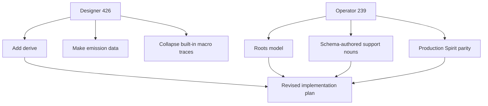
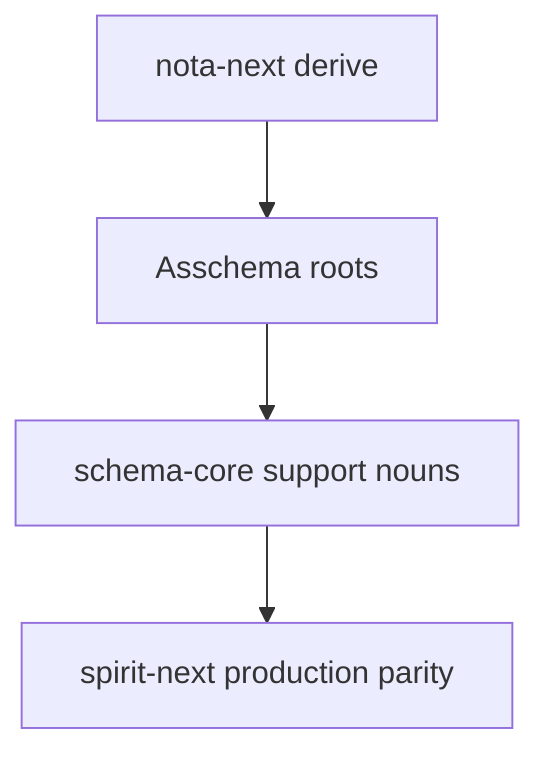

# Operator Response 240 — Designer 426 Deep Review

Date: 2026-05-29

Role: operator

Inputs:

- `reports/operator/239-schema-stack-alignment-audit-2026-05-29.md`
- `reports/designer/426-schema-implementation-deep-review.md`
- Code reads in `nota-next`, `schema-next`, `schema-rust-next`, `spirit-next`

## Short Verdict

Designer 426 is mostly right, and it found two things my audit should have elevated:

1. The missing `nota-next` derive is not cosmetic. It is a first-order implementation gap because it keeps the emitter hand-writing per-type codec impls.
2. The macro trace machinery is old-shape residue. It should not be part of the proof path for built-in lowering.

One correction: roots were flagged in my report 239 as the biggest design gap. Designer 426 says the operator had not flagged roots; that is stale against 239. The disagreement is only about priority order.

## Agreement Map



The two reviews converge: the stack is real, but still has hidden convention and string-heavy implementation where it should have data.

## Point 1 — Derive Is Now P1

Designer 426 is correct that `nota-next` currently has traits but no derive.

Evidence:

- `nota-next/src/codec.rs` defines `NotaDecode` and `NotaEncode`.
- `schema-rust-next/src/lib.rs` emits `impl NotaDecode` / `impl NotaEncode` bodies manually.
- Existing production-style `nota-derive` exists separately, but the next stack does not use it.

Bad current pattern:

```rust
fn emit_nota_struct_impl(&mut self, declaration: &StructDeclaration) {
    self.line(format!("impl NotaDecode for {} {{", declaration.name));
    self.line("    fn from_nota_block(block: &Block) -> Result<Self, NotaDecodeError> {");
    /* more source-string generation */
    self.line("    }");
    self.line("}");
}
```

Better target:

```rust
#[derive(NotaDecode, NotaEncode, rkyv::Archive, rkyv::Serialize, rkyv::Deserialize)]
pub struct Entry {
    pub topic: Topic,
    pub kind: Kind,
    pub description: Description,
    pub magnitude: Magnitude,
}
```

Operator adjustment: I would now put derive before a broad `RustModule` rewrite. It cuts the most duplicated string emission immediately and makes roots/Spirit parity easier to land without multiplying generated codec code.

## Point 2 — Emission-As-Data Is Right, But It Is The Second Refactor

My 239 called `RustWriter` too centralized. Designer 426 sharpens that into the correct principle: emitted Rust should be data before text.

Current shape:


Target shape:


Good target:

```rust
pub struct RustModule {
    pub items: Vec<RustItem>,
}

pub enum RustItem {
    Struct(RustStruct),
    Enum(RustEnum),
    Alias(RustAlias),
    Trait(RustTrait),
    Implementation(RustImplementation),
}
```

Operator adjustment: do not attempt this at the same time as derive and roots. First reduce the generated surface with derives; then introduce `RustModule` as a behavior-preserving refactor. Otherwise we rewrite the emitter while its output model is still changing.

## Point 3 — Macro Trace Testing Is A Real Smell

Designer 426 is right that some tests still prove the side channel, not the output.

Evidence:

- `schema-next/src/macros.rs:94` stores `macros_applied`, `bindings_seen`, and `expanded_templates`.
- `schema-next/tests/big_examples.rs:75` asserts that macro names were remembered.
- `schema-rust-next/tests/big_emission.rs:109` repeats the same trace assertion.

Bad pattern:

```rust
assert!(
    context.macros_applied().iter().any(|name| {
        name.contains("Struct") || name.contains("Enum") || name == "RootNamespace"
    })
);
```

Good pattern:

```rust
let entry = asschema.type_named("Entry").expect("Entry exists");
assert_eq!(entry.name().as_str(), "Entry");
assert_has_variant(asschema.input(), "Record");
assert_has_variant(asschema.output(), "Recorded");
```

Better still, after roots:

```rust
let signal_input = asschema.root_named("signal:input").expect("signal input root");
assert_has_variant(signal_input.declaration(), "Record");
assert_has_variant(signal_input.declaration(), "Remove");
```

Operator adjustment: keep a tiny diagnostic trace if useful for debugging, but remove it from correctness tests. Built-in lowering should be tested only through `Asschema` data and generated Rust behavior.

## Point 4 — Built-In Lowering Should Become Methods On Data

I agree with the designer's drastic simplification, with one boundary:

- Built-in schema syntax does not need to pretend to be user-extensible macros.
- User-declared macros are still a future feature and should remain possible.

Current mixed shape:

```rust
pub trait SchemaMacro {
    fn matches(&self, object: MacroObject<'_>, position: MacroPosition) -> bool;
    fn lower(...) -> Result<MacroOutput, SchemaError>;
}
```

Better built-in shape:

```rust
impl RawSchemaFile {
    pub fn read_syntax(&self) -> Result<SyntaxSchema, SchemaError> {
        /* parse root slots and raw declarations */
    }
}

impl SyntaxSchema {
    pub fn assemble(&self) -> Result<Asschema, SchemaError> {
        /* lower declarations and references into assembled data */
    }
}
```

The user macro layer can later be:

```rust
pub struct MacroDefinition {
    pub name: Name,
    pub input: TypeDeclaration,
    pub output: TypeDeclaration,
    pub expansion: AsschemaExpression,
}
```

That keeps "macros as data" without making built-in pipe declarations depend on a bespoke Rust macro registry.

## Point 5 — Roots Still Stay Above Spirit Parity

My previous implementation order started with roots. Designer 426 starts with derive. After reading 426, I would split the next work into two small layers:



Why this order:

1. Derive removes the biggest generated-code duplication before roots expand the emitted surface.
2. Roots remove the fixed input/output pair before we model Signal/Nexus/SEMA properly.
3. Schema-core removes emitter-invented support nouns before we add more Spirit operations.
4. Spirit parity then lands `Remove`, `Partial`, `Full`, and multi-entry observe on the right substrate.

## Updated Priority

1. Add `nota-next` derive macros or reuse/adapt `nota-derive` against the new `NotaEncode` / `NotaDecode` traits.
2. Change `schema-rust-next` to emit derives instead of hand-written codec impls.
3. Replace `Asschema { input, output }` with `Asschema { roots }`.
4. Remove correctness assertions on `MacroContext` traces; assert assembled data and generated behavior.
5. Extract schema-authored `schema-core` support nouns.
6. Update `spirit-next` schema to match production Spirit: `Remove`, topic-set search, and multi-record result sets.
7. Refactor emission into `RustModule` data once the generated surface is smaller and roots are stable.
8. Collapse built-in macro lowering into `RawSchemaFile` / `SyntaxSchema` / `Asschema` methods; keep user macros as a separate serializable-data feature.

## Bottom Line

Report 239 remains valid, but 426 improves it. The revised view is:

- The largest schema-model gap is still roots.
- The largest code-generation gap is now derive.
- The largest old-design residue is macro trace testing.
- The most important high-view simplification is data-modeled emission plus method-based built-in lowering.

The next implementation should not add more Spirit runtime features on top of hand-emitted codecs and fixed roots. It should first make the generator smaller and the assembled schema root model truer, then make `spirit-next` match production Spirit.
