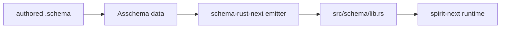
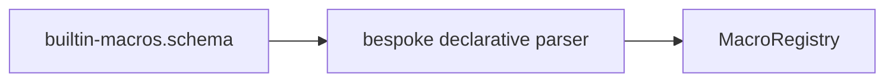
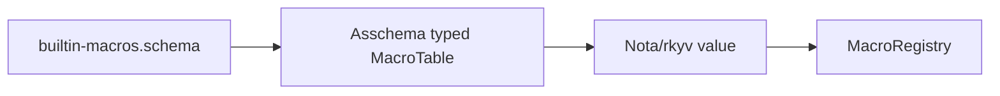
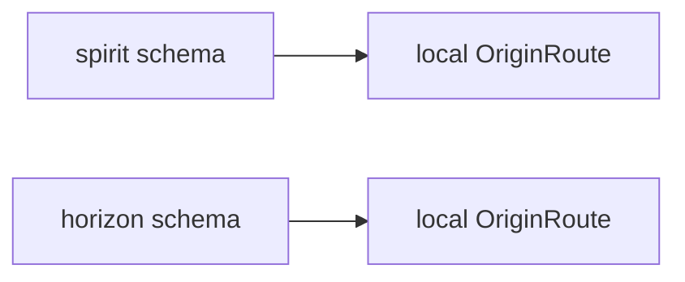
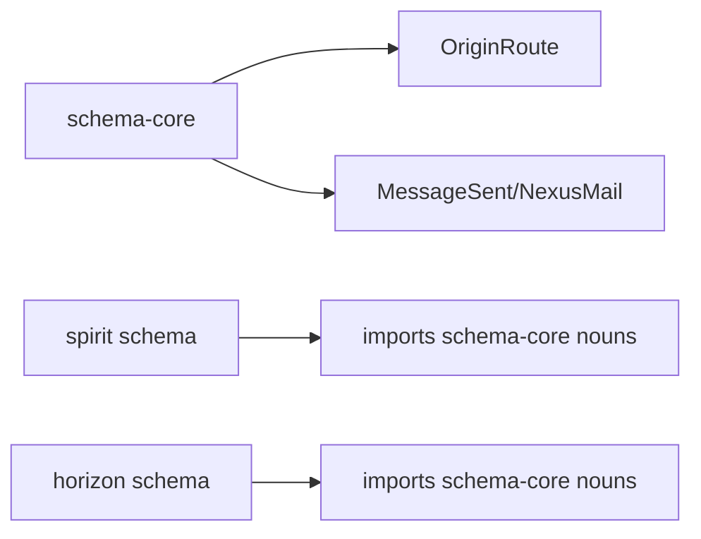
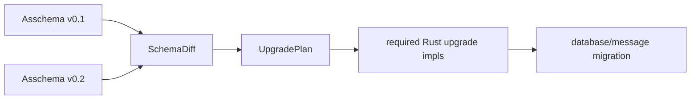

# Schema Stack Gaps Explained

This explains the four remaining gaps from `reports/operator/241-schema-stack-implementation-pass-2026-05-29.md` after incorporating records 1199 and 1202.

The incorporation commits are:

- `nota-next` `6a487b6a` — `nota: document at-delimiter schema declaration target`
- `schema-next` `2ccfdca6` — `schema: document at-delimiter declaration target`
- `schema-rust-next` `963961c1` — `schema-rust: document authored syntax independence`
- `spirit-next` `f4751e15` — `spirit: document schema syntax transition`

## Current Anchor

What works now:



The important part: `spirit-next` is now actually using schema-emitted types in its Signal/Nexus/SEMA chain. The gaps below are about making that stack less transitional and less string-shaped.

## Gap 1: The Emitter Still Renders Strings

### What Exists

`schema-rust-next::RustEmitter` consumes `Asschema` and writes Rust source by appending lines of text:

```rust
self.line("#[derive(nota_next::NotaDecode, nota_next::NotaEncode, ...)]");
self.line(format!("pub struct {} {{", declaration.name.local_part()));
self.line(format!("    pub {}: {},", field.name, self.rust_type(&field.reference)));
self.line("}");
```

This is better than before because it no longer hand-writes per-type NOTA codec implementations. The codec is now a derive. But the emitter itself is still not data-shaped.

### Why It Matters

String rendering hides compiler structure inside formatting decisions. It makes it hard to test the actual mapping:

- Does this `Asschema::Struct` become a Rust struct?
- Does this `Asschema::Enum` become a Rust enum?
- Does this type need ordering derives because it is a map key?
- Which modules, imports, aliases, derives, traits, and impls are present?

Right now, many tests can only answer by searching source text or compiling the generated file. That is useful, but it is late. A data model lets tests assert the Rust composition before final formatting.

### Target


The target is an intermediate Rust code model:

```rust
pub struct RustModule {
    pub path: RustModulePath,
    pub imports: Vec<RustImport>,
    pub items: Vec<RustItem>,
}

pub enum RustItem {
    Struct(RustStruct),
    Enum(RustEnum),
    TypeAlias(RustTypeAlias),
    Trait(RustTrait),
    Impl(RustImpl),
}
```

Then emission becomes:

```rust
impl Asschema {
    pub fn into_rust_module(&self) -> RustModule {
        // tree-to-tree: schema data -> Rust data
    }
}

impl RustModule {
    pub fn render(&self) -> RustCode {
        // one final formatting step
    }
}
```

### Test That Closes It

A strong test would load a real `.schema`, lower it to `Asschema`, project it to `RustModule`, and assert data:

```rust
let module = asschema.into_rust_module();
assert!(module.has_enum("Input"));
assert!(module.enum_named("Input").has_variant("Record", "Entry"));
assert!(module.struct_named("Entry").derives("nota_next::NotaDecode"));
assert!(module.has_trait("SemaEngine"));
```

The renderer still gets snapshot/compile tests, but those become renderer tests, not the only proof of the whole mapping.

## Gap 2: The Macro Table Is Not Fully Loaded From Typed Asschema Data

### What Exists

`schema-next/schemas/core.schema` now models macro patterns and templates as data:

```schema
MacroPattern {| MacroPattern object MacroPatternObject |}
MacroPatternObject (| MacroPatternObject
  (Capture MacroCaptureName)
  (RestCapture MacroCaptureName)
  (Atom MacroAtom)
  (Delimited MacroPatternDelimited)
|)
```

That is a real improvement. The macro substrate is no longer only “pattern string” and “template string” in the schema model.

But the built-in registry still reads `schemas/builtin-macros.schema` through bespoke Rust parser structs in `src/declarative.rs`. It does not yet load a pre-assembled `MacroTable` value generated from the schema.

### Why It Matters

The design rule is “everything is data.” A macro must be serializable/deserializable as data, not hidden as parser control flow.

Current direction:



Target direction:



That target lets the macro table be cached, inspected, diffed, tested, serialized, and eventually imported like any other schema-defined object.

### Target

The macro table should be a real schema-emitted noun:

```rust
#[derive(NotaDecode, NotaEncode, Archive, Serialize, Deserialize)]
pub struct MacroTable {
    pub definitions: Vec<SchemaMacroDefinition>,
}

pub struct SchemaMacroDefinition {
    pub macro_name: MacroName,
    pub macro_position: MacroPosition,
    pub macro_pattern: MacroPattern,
    pub macro_template: MacroTemplate,
}
```

Then registry loading becomes a method on data:

```rust
impl MacroTable {
    pub fn into_registry(self) -> MacroRegistry {
        // no bespoke string parser
    }
}
```

### Test That Closes It

The closing test should prove the macro table survives value round-trip before execution:

```rust
let table = MacroTable::from_nota_file("schemas/builtin-macros.schema")?;
let nota = table.to_nota();
let decoded = MacroTable::from_nota(&nota)?;
let registry = decoded.into_registry();

let asschema = SchemaEngine::with_registry(registry).lower_source(source, identity)?;
assert!(asschema.type_named("Entry").is_some());
```

The key point: the macro table must be the object being tested, not a side effect of parser code.

## Gap 3: Shared Mail And Support Nouns Are Emitted Locally

### What Exists

`schema-rust-next` emits support nouns into every generated schema module:

```rust
pub struct MessageIdentifier(pub Integer);
pub struct OriginRoute(pub Integer);
pub struct MessageSent { ... }
pub struct NexusMail<Payload> { ... }
pub struct MessageProcessed<Reply> { ... }
pub struct DatabaseMarker { ... }
```

This lets `spirit-next` work today. The generated runtime chain can carry origin routes, message IDs, mail events, and SEMA database markers.

### Why It Matters

Those nouns are not Spirit-specific. They are protocol-core nouns. If every component emits its own local `OriginRoute` and `MessageIdentifier`, then two components can have structurally identical but type-distinct support values.

That fights the intent that schema contracts become shared channels. Shared support nouns should have one owner.

Current:



Target:



### Target

Create a shared schema core package:

```schema
{}
()
()
{
  MessageIdentifier@{ integer@Integer }
  OriginRoute@{ integer@Integer }
  ShortHeader@{ integer@Integer }
  DatabaseMarker@{ commitSequence@CommitSequence stateDigest@StateDigest }
  MessageSent@{ messageIdentifier@MessageIdentifier originRoute@OriginRoute shortHeader@ShortHeader }
}
```

Then component schemas import it:

```schema
{ OriginRoute schema-core:mail:OriginRoute
  MessageSent schema-core:mail:MessageSent
  DatabaseMarker schema-core:sema:DatabaseMarker }
...
```

Rust emission should output aliases, not local redefinitions:

```rust
pub use schema_core::schema::mail::OriginRoute;
pub use schema_core::schema::mail::MessageSent;
```

### Test That Closes It

The proof needs two generated crates in one test:

```rust
let spirit_route: spirit::OriginRoute = OriginRoute(7);
let horizon_route: horizon::OriginRoute = spirit_route;
```

That compiles only if both imports resolve to the same type identity.

## Gap 4: Upgrade/Diff Is Still Future Work

### What Exists

The emitter has early upgrade trait surfaces, and the schema system has enough data to compare declarations. But there is no real schema-diff engine yet.

No implemented path currently does:



### Why It Matters

Upgrade is one of the main reasons to build schema at all. The system should identify safe changes automatically and force hand-written bridge logic where the transformation is ambiguous.

Examples:

- Adding a new optional field can be auto-filled.
- Adding a new unit variant can often be wire-compatible.
- Removing a field may be data loss and requires explicit policy.
- Wrapping a type inside a new enum variant requires an upgrade method.
- Reordering positional fields is dangerous and needs a typed operation, not a guess.

### Target

The diff itself should be data:

```rust
pub enum SchemaChange {
    AddType(AddType),
    RemoveType(RemoveType),
    ModifyType(ModifyType),
}

pub enum ModifyType {
    AddField(AddField),
    RemoveField(RemoveField),
    RenameField(RenameField),
    WrapInEnum(WrapInEnum),
    ReorderFields(ReorderFields),
}
```

Then emission uses the diff to decide which traits are required:

```rust
pub trait UpgradeFrom<Previous> {
    type Error;
    fn upgrade_from(previous: Previous) -> Result<Self, Self::Error>;
}
```

If no change affects a type, no upgrade method is emitted for that type. If a change affects a type ambiguously, the new version must implement the bridge.

### Test That Closes It

The right proof is a two-version fixture:

```text
tests/fixtures/spirit-0.1/schema/lib.schema
tests/fixtures/spirit-0.2/schema/lib.schema
tests/fixtures/spirit-0.1/database.sema
```

Then test:

```rust
let old = SchemaPackage::load("spirit-0.1").lower()?;
let new = SchemaPackage::load("spirit-0.2").lower()?;
let diff = SchemaDiff::between(&old, &new);
let plan = UpgradePlan::from_diff(diff);

assert!(plan.requires_upgrade_for("Entry"));
assert!(plan.is_noop_for("Topic"));

let migrated = SpiritMigrator::new(plan).migrate_database(old_database)?;
assert!(migrated.opens_with_new_schema());
```

That proves schema changes drive actual database migration, not just report language.

## How The New `@` Syntax Fits

Records 1199 and 1202 change the authored declaration surface, not the assembled target.

```mermaid
flowchart LR
    atsyntax[Name@{...} / Name@(...)] --> asschema[Asschema]
    pipesyntax[transitional pipe syntax] --> asschema
    asschema --> rust[RustModule/Rust code]
```

So the implementation order should be:

1. Keep the current working pipe implementation as a transitional parser.
2. Add `Name@{...}` and `Name@(...)` parsing/lowering to the same `Asschema`.
3. Convert fixtures and docs away from pipe syntax.
4. Remove pipe declarations once the `@` path has equal test coverage.

The emitter should not change for this. If it changes, that is a smell: the emitter should only know `Asschema`, never authored sugar.

## Priority Order

1. Implement the `@` declaration surface in `nota-next` / `schema-next`, then migrate fixtures.
2. Make macro tables typed data loaded from asschema, because that is the direct continuation of `core.schema`.
3. Introduce `RustModule` as an emitter data model, reducing string rendering to the last step.
4. Extract shared support nouns into a schema-core package and import them cross-crate.
5. Build the schema-diff / upgrade plan engine on top of stable `Asschema` data.
