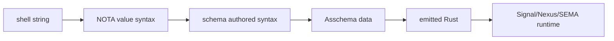
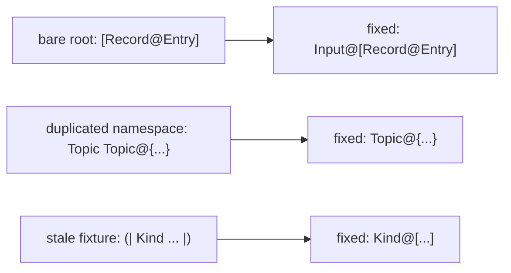
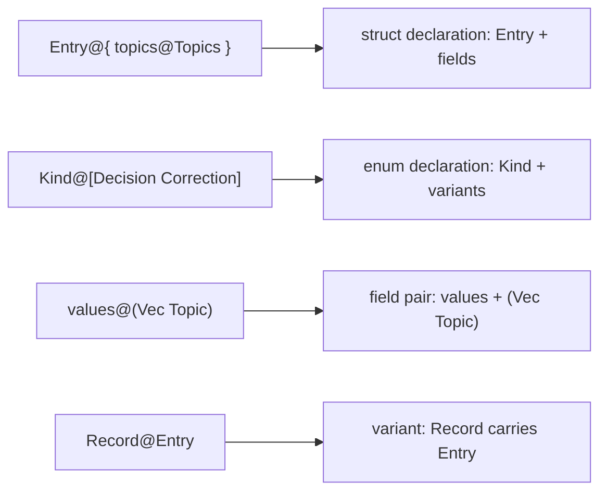
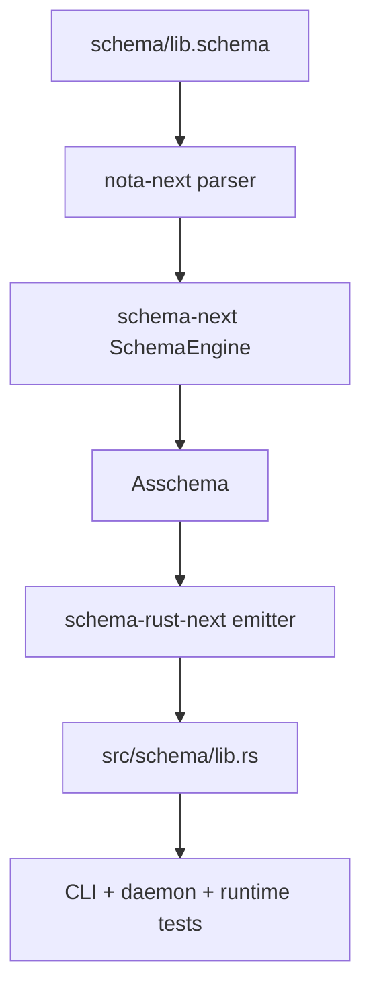
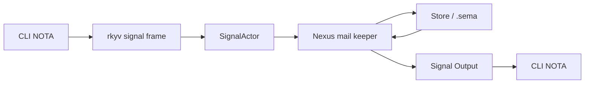
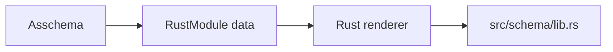
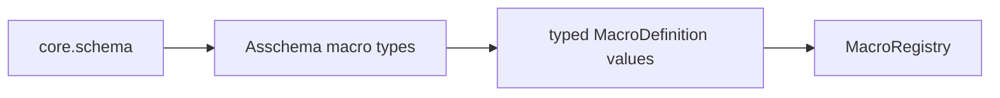

# Schema System Syntax, Tests, and Architecture

Operator report, 2026-05-29.

## Current Verdict

The system now has a working `@` authored-schema surface, including the
designer-audited root and namespace corrections:

- `nota-next` parses `Name@{...}` and `Name@[...]` into recursive declaration
  blocks, and parses `Name@(...)` / `name@(...)` as a binding to a
  parenthesized type-reference or macro-call payload. Parenthesis no longer
  opens an enum declaration.
- `schema-next` reads `field@Type`, `field@(Composite Type)`, and
  `Variant@Payload` when lowering schema declarations. Root enums must now be
  named as `Input@[...]` and `Output@[...]`; bare root brackets are rejected.
- Namespace braces contain self-named declarations such as `Topic@{...}`, not
  duplicated `Topic Topic@{...}` key/value pairs.
- `schema-rust-next` fixtures, including `plane-triad.schema`, now use the same
  surface, so the emitter tests no longer exercise a stale syntax lane.
- `spirit-next/schema/lib.schema` is now authored with named root enums and
  self-named namespace declarations.
- `spirit-next` still emits the same generated Rust types and the runtime
  tests pass through Signal, Nexus, and SEMA.

The pipe declaration family remains only as an internal representation and a
legacy/raw fixture concern. It is not the authored-schema target.

Landed commits:

- `nota-next` `3ba7810d` — parse at-binding schema declarations.
- `schema-next` `720662f6` — accept at-binding declarations.
- `spirit-next` `f1acdcab` — author schema with at-binding declarations.
- `nota-next` `f95102e0` — parse square at-binding enum declarations.
- `schema-next` `3a9807cb` — use square at-binding enum syntax.
- `schema-next` `8873cd8e` — support square root enum bodies.
- `spirit-next` `1a3a2ff7` — use square enum schema declarations.
- `nota-next` `5477b736` — reserve at-parenthesis for bindings.
- `schema-next` `fbcae813` — enforce named at-declaration roots.
- `schema-rust-next` `499f6e39` — use named at-declaration fixtures.
- `spirit-next` `eff56e28` — use named root schema declarations.

## Syntax Stack



## Designer-Audit Fixes Applied



The bad pattern was the same in each place: the migration had reached nested
declarations but not the root and namespace structure. The corrected rule is
uniform: declarations are `Name@Delimiter`, including root enums and namespace
members. The only remaining pipe examples are raw/legacy delimiter fixtures
that test NOTA preservation, not active authored schema examples.

### Shell / CLI

The host shell wraps the whole NOTA value in double quotes. NOTA itself does
not use double-quoted strings.

```sh
spirit "(Observe (Records ((Full [schema nota]) None Any SummaryOnly)))"
spirit-next "(Record ([schema runtime] Decision [schema drives runtime] Maximum))"
```

### Raw NOTA

Raw NOTA is structural:

```nota
[schema nota]                 ; vector; also string text when expected type is String
[|bracket-safe text ] here|]  ; pipe-square text
(Record Entry)                ; parenthesized record/object
{ Topic [schema] Kind Decision } ; key/value map
None
(Some Decision)
```

Important boundary: `[]` is a vector at the raw layer. A schema-typed string
reader may read a bracket form as string text, but that is an expected-type
decision above raw NOTA.

### Schema Authored Syntax

The current authored declaration syntax is name-first `@` binding:

```schema
Topic@{ string@String }
Topics@{ values@(Vec Topic) }
TopicMatch@[Partial@Topics Full@Topics]
Entry@{ topics@Topics kind@Kind description@Description magnitude@Magnitude }
Kind@[Decision Principle Correction Clarification Constraint]
```

The root schema object is already known by the reader, but the root enum
objects are still named declarations. Spirit's current root is:

```schema
{}
Input@[Record@Entry Observe@Query Remove@RecordIdentifier]
Output@[RecordAccepted@SemaReceipt RecordsObserved@ObservedRecords RecordRemoved@RemoveReceipt Error@ErrorReport Rejected@SignalRejection]
{ ...namespace... }
```

Meaning:

- root slot 0: imports map
- root slot 1: named Signal input enum declaration
- root slot 2: named Signal output enum declaration
- root slot 3: namespace sequence of self-named declarations

The outer schema root is positional. The inner enum declarations are named:
that is the `Name + @ + Delimiter` rule applied at the root positions.

### At-Binding Lowering



In the current implementation, `nota-next` exposes `Name@{...}` and
`Name@[...]` to higher layers as the declaration block shapes used by
`schema-next`. `Name@(...)` is not an enum declaration; it is a binding to a
parenthesized type-reference or macro-call payload. Authored schema uses
brackets for enum bodies so parentheses stay available for composite type
references and user macro calls.

### Asschema

Asschema is the macro-free endpoint. It is typed Rust data today, not a stable
serialized `.asschema` file yet.

Core shape:

```rust
pub struct Asschema {
    identity: SchemaIdentity,
    imports: Vec<ImportDeclaration>,
    resolved_imports: Vec<ResolvedImport>,
    roots: Vec<RootDeclaration>,
    namespace: Vec<TypeDeclaration>,
}

pub enum TypeDeclaration {
    Struct(StructDeclaration),
    Enum(EnumDeclaration),
    Newtype(StructDeclaration),
}

pub enum TypeReference {
    String,
    Integer,
    Boolean,
    Path,
    Plain(Name),
    Vector(Box<TypeReference>),
    Map(Box<TypeReference>, Box<TypeReference>),
    Optional(Box<TypeReference>),
}
```

### Generated Rust

`spirit-next/src/schema/lib.rs` is generated from `schema/lib.schema`. The
schema types carry both NOTA codec derives and rkyv derives:

```rust
#[derive(nota_next::NotaDecode, nota_next::NotaEncode,
         rkyv::Archive, rkyv::Serialize, rkyv::Deserialize,
         Clone, Debug, PartialEq, Eq)]
pub enum SemaInput {
    Record(Entry),
    Observe(Query),
    Remove(RecordIdentifier),
}

#[derive(nota_next::NotaDecode, nota_next::NotaEncode,
         rkyv::Archive, rkyv::Serialize, rkyv::Deserialize,
         Clone, Debug, PartialEq, Eq)]
pub struct Entry {
    pub topics: Topics,
    pub kind: Kind,
    pub description: Description,
    pub magnitude: Magnitude,
}
```

Generated plane traits define the execution shape:

```rust
pub trait NexusEngine {
    fn execute(&self, input: nexus::Nexus<nexus::Input>) -> nexus::Nexus<nexus::Output>;
}

pub trait SemaEngine {
    fn apply(&mut self, input: sema::Sema<sema::Input>) -> sema::Sema<sema::Output>;
}
```

## Build Pipeline



`spirit-next/build.rs` is a freshness witness. It regenerates the schema Rust
in memory and fails the build if the checked-in generated source is stale.

## Runtime Architecture



The runtime centers are real objects:

- `SignalActor` validates generated `Input` and mints `MessageIdentifier` plus
  `OriginRoute`.
- `Nexus` owns the mail ledger and the durable store handle. It holds mail in
  `Mail<BeingProcessed>` while SEMA runs.
- `Store` implements generated `SemaEngine` and writes the `.sema` redb file.
- `Engine` composes those objects; it does not directly mutate SEMA state.

## Meaty Tests

### 1. NOTA Parses At-Binding Structure

File: `nota-next/tests/design_examples.rs`

```rust
let source = "Entry@{ topics@Topics records@(Vec Entry) } Kind@[Decision Correction]";
let document = Document::parse(source).expect("nota parses");
let struct_declaration = document.root_object_at(0).expect("struct declaration");
let enum_declaration = document.root_object_at(1).expect("enum declaration");

assert!(struct_declaration.is_pipe_brace());
assert_eq!(
    struct_declaration.root_object_at(0).and_then(Block::demote_to_string),
    Some("Entry")
);
assert_eq!(
    struct_declaration.root_object_at(1).and_then(Block::demote_to_string),
    Some("topics@Topics")
);
assert!(enum_declaration.is_pipe_parenthesis());
```

What this proves: `@` is not a comment in a report anymore. The parser sees it,
preserves the declaration name, and leaves composite references structural.

### 2. Schema Reads Real `.schema` Files

File: `schema-next/tests/fixtures/syntax-layer/schema.schema`

```schema
{
  Text@{ string@String }
  Identifier@{ integer@Integer }
  Topic@{ text@Text }
  Topics@{ values@(Vec Topic) }
  TopicIndex@{ entries@(Map (Topic Identifier)) }
  Kind@[Decision Principle Correction Clarification Constraint]
  Entry@{ topics@Topics kind@Kind description@Text related@TopicIndex maybeTopic@(Optional Topic) }
  SpiritInput@[Record@Entry Observe@RecordQuery Ping]
}
```

File: `schema-next/tests/syntax_layer.rs`

```rust
let schema = syntax_schema("tests/fixtures/syntax-layer/schema.schema");
let entry = struct_named(&schema, "Entry");

assert_eq!("topics", entry.fields()[0].name().as_str());
assert_eq!(&name_reference("Topics"), entry.fields()[0].reference());
assert_eq!("maybeTopic", entry.fields()[4].name().as_str());
assert_eq!(
    &SyntaxReference::Optional(Box::new(name_reference("Topic"))),
    entry.fields()[4].reference()
);
```

What this proves: the fixture is a real `.schema` file, it parses as NOTA
first, and the syntax layer reads `@` declarations into typed schema objects.

### 3. Spirit Schema Uses the New Surface

File: `spirit-next/schema/lib.schema`

```schema
{}
Input@[Record@Entry Observe@Query Remove@RecordIdentifier]
Output@[RecordAccepted@SemaReceipt RecordsObserved@ObservedRecords RecordRemoved@RemoveReceipt Error@ErrorReport Rejected@SignalRejection]
{
  NexusInput@[Signal@Input Sema@SemaOutput]
  NexusOutput@[Sema@SemaInput Signal@Output]
  SemaInput@[Record@Entry Observe@Query Remove@RecordIdentifier]
  SemaOutput@[Recorded@SemaReceipt Observed@ObservedRecords Removed@RemoveReceipt Missed@ErrorReport]
  TopicMatch@[Partial@Topics Full@Topics]
  Query@{ topicMatch@TopicMatch kind@(Optional Kind) }
  RecordSet@{ entries@(Vec Entry) }
}
```

What this proves: the pilot component is not only testing toy syntax. The
running Spirit-like schema is authored in the settled surface.

### 4. Nexus Lowers Signal Mail Into SEMA

File: `spirit-next/tests/runtime_triad.rs`

```rust
let command = NexusMail::new(
    MessageIdentifier(1),
    route(1),
    entry("nexus mail lowers to SEMA"),
)
.into_nexus_input()
.into_nexus_output()
.into_sema_input();

let plane = schema_meta::Plane::<Input, NexusInput, SemaInput>::Sema(command.clone());
assert_eq!(plane.origin_route(), route(1));
match command.root() {
    SemaInput::Record(recorded) => {
        assert_eq!(recorded.description.0, "nexus mail lowers to SEMA");
    }
    SemaInput::Observe(_) => panic!("record input should lower to record command"),
    SemaInput::Remove(_) => panic!("record input should lower to record command"),
}
```

What this proves: the Nexus language is real. It receives Signal mail and
produces a generated SEMA input object, carrying the same origin route.

### 5. Nexus Holds Mail Before SEMA Writes

File: `spirit-next/tests/runtime_triad.rs`

```rust
let accepted: SignalAccepted = signal_actor
    .accept(Input::Record(entry("held in flight")))
    .expect("signal accepts");

let in_flight = accepted.into_being_processed();
assert_eq!(in_flight.identifier(), MessageIdentifier(1));
assert_eq!(in_flight.origin_route(), route(1));

match in_flight.sema_input().root() {
    SemaInput::Record(recorded) => assert_eq!(recorded.description.0, "held in flight"),
    SemaInput::Observe(_) => panic!("a recorded entry lowers to a SEMA record command"),
    SemaInput::Remove(_) => panic!("a recorded entry lowers to a SEMA record command"),
}

assert!(store.is_empty());
```

What this proves: "Nexus holds mail" is represented as typed object state, not
a log line. SEMA has not committed while the mail is still being processed.

### 6. SEMA Means Database Work

File: `spirit-next/tests/runtime_triad.rs`

```rust
let operation = sema_message(SemaInput::Record(entry("SEMA writes durable facts")), 1);
let response = SemaEngine::apply(&mut store, operation);

match response.root() {
    SemaOutput::Recorded(receipt) => {
        assert_eq!(receipt.record_identifier, RecordIdentifier(1));
        assert_eq!(receipt.database_marker.commit_sequence, CommitSequence(1));
        assert_ne!(receipt.database_marker.state_digest, StateDigest(0));
    }
    other => panic!("expected schema-emitted Recorded receipt, got {other:?}"),
}
assert_eq!(store.len(), 1);
assert!(store.path().exists());
```

What this proves: the SEMA plane writes a real `.sema` file and replies with
generated schema objects carrying database markers.

### 7. Full Runtime Round Trip

File: `spirit-next/tests/runtime_triad.rs`

```rust
let recorded = engine.handle(Input::Record(entry("full runtime triad works")));
let record_marker = match recorded.root() {
    Output::RecordAccepted(receipt) => {
        assert_eq!(receipt.record_identifier, RecordIdentifier(1));
        receipt.database_marker.clone()
    }
    other => panic!("expected RecordAccepted, got {other:?}"),
};

let observed = engine.handle(Input::Observe(query()));
match observed.root() {
    Output::RecordsObserved(records) => {
        assert_eq!(records.record_set.0[0].description.0, "full runtime triad works");
        assert_eq!(records.database_marker.commit_sequence, record_marker.commit_sequence);
    }
    other => panic!("expected RecordsObserved, got {other:?}"),
}
```

What this proves: Signal input goes through Nexus, SEMA, and back out as a
Signal output, using generated types throughout.

### 8. Nix-Built CLI and Daemon

File: `spirit-next/tests/nix_integration.rs`

The ignored Nix tier builds actual binaries and launches the real daemon:

```rust
let output = cli
    .invoke("(Record ([nix schema] Decision [nix-built daemon records] Maximum))")
    .expect("cli invocation");

let output = Output::from_str(output.stdout.trim()).expect("schema output");
assert!(matches!(output, Output::RecordAccepted(_)));
```

What this proves: the schema stack reaches actual Nix-built artifacts,
process boundaries, Unix sockets, rkyv frames, and CLI NOTA output.

## Verification

Commands run in this pass:

```sh
cd /git/github.com/LiGoldragon/nota-next && cargo test
cd /git/github.com/LiGoldragon/schema-next && cargo test
cd /git/github.com/LiGoldragon/schema-rust-next && cargo test
cd /git/github.com/LiGoldragon/spirit-next && cargo test
cd /git/github.com/LiGoldragon/spirit-next && ./scripts/run-nix-integration-tests
```

Status at report time:

- `nota-next cargo test`: green.
- `schema-next cargo test`: green.
- `schema-rust-next cargo test`: green.
- `spirit-next cargo test`: green.
- `spirit-next ./scripts/run-nix-integration-tests`: green, 9 Nix-built
  process-boundary tests passed against local `nota-next`, `schema-next`, and
  `schema-rust-next` input overrides.

## Remaining Gaps, Explained

### RustModule Data Model

Today `schema-rust-next` still renders Rust by pushing source strings. The
generated result is useful and tested, but the emitter itself is not yet data.
The intended shape is:



Why it matters: once Rust output is represented as data, tests can assert
"this enum exists with these variants and derives" before rendering. That
brings the emitter under the same everything-is-data discipline as schema.

### Macro Table From Typed Asschema Data

`schema-next/schemas/core.schema` describes macro objects, but the built-in
macro registry is still loaded through bespoke declarative reader code. The
target is:



Why it matters: a macro must be serializable/deserializable data. If the macro
only exists as hidden Rust parser behavior, it violates the design.

### Shared Schema-Core Support Nouns

Support nouns such as `OriginRoute`, `MessageIdentifier`, mail envelopes, and
plane envelopes are currently emitted locally into `spirit-next` generated
code. The better shape is a shared `schema-core` schema/crate imported by
component schemas.

Why it matters: every component needs the same mail and route language. Shared
schema-core prevents each component from carrying a local copy that can drift.

### Upgrade / Diff

The generated Rust already exposes the trait names:

```rust
pub trait UpgradeFrom<Previous>: Sized {
    type Error;

    fn upgrade_from(previous: Previous) -> Result<Self, Self::Error>;
}
```

But schema diffing does not yet derive required upgrade operations from two
schema versions. The target is to compare old/new asschema data, identify
added/removed/changed types and fields, and require Rust behavior only for the
changes that cannot be mechanically accepted.

Why it matters: runtime migration depends on knowing which old messages or
database records can be upgraded, accepted, rejected, or no-op migrated.

## What To Look At First

If you want to inspect the system in code order:

1. `spirit-next/schema/lib.schema` — current authored `@` schema.
2. `spirit-next/src/schema/lib.rs` — generated Rust types and traits.
3. `spirit-next/src/engine.rs` — Signal and Nexus behavior on generated nouns.
4. `spirit-next/src/store.rs` — SEMA database work.
5. `spirit-next/tests/runtime_triad.rs` — the best in-process proof.
6. `spirit-next/tests/nix_integration.rs` — the best process-boundary proof.
