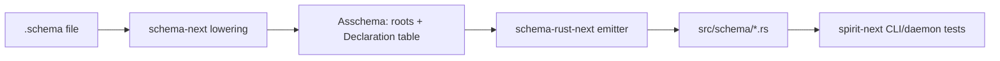

# Asschema Visibility And Struct Map Implementation

## Scope

This pass implemented the newest asschema direction in the operator-owned stack:

- Asschema namespace declarations now carry visibility as data.
- The declaration shape is aligned with `(Public Name Value)` / `(Private Name Value)`.
- Struct declarations now expose a `StructFieldMap`, preserving the brace-map meaning: field name -> type reference.
- Inline PascalCase declarations lower as private module-local types before the containing public type.
- Rust emission preserves public/private at the generated Rust boundary.
- `spirit-next` is pinned to the new schema stack and passes the full Nix check.

## Data Flow



The important change is in the middle: `Asschema.namespace()` no longer means a raw `Vec<TypeDeclaration>`. It is now a `Vec<Declaration>`, where each declaration has visibility, name, and value.

## Assembled Shape

The canonical NOTA shape being aimed at is:

```nota
(Public Entry
  (Struct { topics Topics kind Kind description Description magnitude Magnitude }))

(Private Receipt
  (Struct { recordIdentifier Integer message String }))
```

The Rust implementation is still a bootstrap data model, not serialized asschema text:

```rust
pub struct Declaration {
    visibility: Visibility,
    name: Name,
    value: TypeDeclaration,
}

pub enum Visibility {
    Public,
    Private,
}

pub struct StructFieldMap {
    entries: Vec<FieldDeclaration>,
}
```

`StructFieldMap` keeps `Vec<FieldDeclaration>` internally because Rust field order and rkyv layout are load-bearing, but its semantic contract is a key/value map.

## Inline Local Types

A schema fixture now proves the local/private rule:

```schema
Input@[]
Output@[]
{
  Entry@{ Receipt@{ recordIdentifier@Integer message@String } later@Receipt }
}
```

That lowers into the declaration order:

```text
Private Receipt
Public Entry
```

The generated Rust boundary is:

```rust
pub(crate) struct Receipt {
    pub(crate) record_identifier: Integer,
    pub(crate) message: String,
}

pub struct Entry {
    pub(crate) receipt: Receipt,
    pub(crate) later: Receipt,
}
```

The field visibility is deliberately narrowed when a public type references a private inline type. Otherwise the public API would leak a `pub(crate)` noun through a `pub` field.

## Repository Changes

`schema-next`:

- `src/asschema.rs` adds `Declaration`, `Visibility`, and `StructFieldMap`.
- `Asschema.namespace()` returns `&[Declaration]`.
- Inline declarations are remembered as `Declaration::private(...)`.
- Top-level namespace declarations become `Declaration::public(...)`.
- `schemas/root.schema` describes `Declaration@[Public@NamedTypeDeclaration Private@NamedTypeDeclaration]`.
- Tests assert that inline `Receipt` is private and top-level `Entry` is public.

`schema-rust-next`:

- The emitter consumes `Declaration` instead of raw `TypeDeclaration`.
- Public declarations emit `pub`.
- Private declarations emit `pub(crate)`.
- The emitter tracks private type names and narrows public struct fields that reference private types.
- `tests/fixtures/inline-private-type.schema` proves the boundary from a real `.schema` file.

`spirit-next`:

- `Cargo.lock` and `flake.lock` are pinned to the new `schema-next`, `schema-rust-next`, and `nota-next` inputs.
- `flake.nix` guard strings now check the current `@` schema syntax instead of obsolete pipe declarations.

## Remaining Gaps Explained

**Emitter still renders strings instead of a RustModule data model.**

The emitter now uses better input data, but output is still constructed by calling `line(...)` repeatedly. The next stronger form is `Asschema -> RustModule data -> render`. That would let tests assert on Rust output as structured declarations, modules, impls, traits, and fields before text formatting.

**Macro table is not fully loaded from typed asschema data yet.**

Macro calls and declarations are closer to data, but built-in macro behavior still comes from Rust-side registry construction and the declarative reader. The target is: macro definitions lower into asschema first, then the macro registry loads those typed macro objects. That is the "macro is serializable data" frontier.

**Shared mail/support nouns are still emitted locally.**

`MessageIdentifier`, `OriginRoute`, `MessageSent`, `NexusMail`, `MessageProcessed`, and plane envelopes are emitted in each generated module. The target is a shared schema-core library that declares those nouns once, emits them once, and imports them through the cross-crate schema import path.

**Upgrade/diff remains future work.**

`UpgradeFrom<Previous>` and `AcceptPrevious<Previous>` exist, but the stack does not yet compare current asschema against a previous asschema to decide which upgrade methods are required. The durable target is schema diff data driving compile-time or build-time upgrade obligations.

## Verification

- `schema-next`: `cargo fmt && cargo test`
- `schema-rust-next`: `cargo fmt && cargo test`
- `spirit-next`: `cargo test`
- `spirit-next`: `nix flake check`

All passed after updating the flake inputs to include the current `nota-next` parser. Before that update, Nix reproduced a useful failure: the stale Nix-pinned `nota-next` did not parse `Name@[...]` as one object, so `schema/lib.schema` appeared to have six root objects instead of four.
