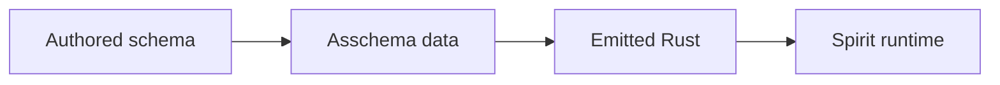

# Derived Member Shorthand And Newtype Asschema

## Intent Applied

The forwarded designer correction landed as operator work:

- `@Type` inside a struct body means "use already-defined `Type` and derive the field name from it".
- `@Type` inside an enum body means "data-carrying variant named `Type` carrying payload `Type`".
- Explicit bindings still exist for real name differences: `limit@(Optional Integer)`, `SomeString@String`.
- A newtype is not a one-field struct map in asschema. It carries one contained `TypeReference`.

Focused picture:



## Real Input Shape

The new real fixture is `schema-next/tests/fixtures/big-schemas/derived-members.schema`:

```nota
Entry@{ @Topics @Kind @Description @Magnitude }
Query@{ @Topics limit@(Optional Integer) }
SomeEnum@[ @SomethingHoldingSomething SomethingElse SomeString@String ]
Topic@String
Topics@{ (Vec Topic) }
```

The live Spirit schema now uses the same shape in `spirit-next/schema/lib.schema`:

```nota
Entry@{ @Topics @Kind @Description @Magnitude }
Query@{ @TopicMatch kind@(Optional Kind) }
RecordSet@{ (Vec Entry) }
```

## Asschema Result

The lowering target is data, not a parser side channel:

```nota
(Public Topic (Newtype String))
(Public Topics (Newtype (Vector Topic)))
(Public Entry (Struct { topics Topics kind Kind description Description magnitude Magnitude }))
(Public Query (Struct { topics Topics limit (Optional Integer) }))
(Public SomeEnum (Enum [SomethingHoldingSomething@SomethingHoldingSomething SomethingElse SomeString@String]))
```

`schema-next` now models that directly:

```rust
pub enum TypeDeclaration {
    Struct(StructDeclaration),
    Enum(EnumDeclaration),
    Newtype(NewtypeDeclaration),
}

pub struct NewtypeDeclaration {
    pub name: Name,
    pub reference: TypeReference,
}
```

So the emitter no longer asks a newtype for `fields.first()`. It asks for
`declaration.reference`.

## Emitted Rust Shape

The emitted Rust distinction is now structural:

```rust
pub struct Topic(pub String);
pub struct Topics(pub Vec<Topic>);

pub struct Entry {
    pub topics: Topics,
    pub kind: Kind,
    pub description: Description,
    pub magnitude: Magnitude,
}

pub enum SomeEnum {
    SomethingHoldingSomething(SomethingHoldingSomething),
    SomethingElse,
    SomeString(String),
}
```

## Implementation Commits

- `schema-next` `d8c380c8` — `@Type` shorthand, simple `Name@Type` newtype declarations, `NewtypeDeclaration`, real `.schema` fixtures, docs.
- `schema-rust-next` `85a791cf` — emitter consumes `NewtypeDeclaration` directly.
- `schema-rust-next` `2a586fcc` — repo intent/architecture documents the new asschema input shape.
- `spirit-next` `0f028a90` — live schema uses derived-member shorthand and repins schema code.
- `spirit-next` `e4ac9e35` — repo intent/architecture documents the derived-member surface.
- `spirit-next` `6b6b5b53` — final pin to the documented schema-rust emitter.

## Verification

- `schema-next`: `cargo fmt && cargo test`
- `schema-rust-next`: `cargo fmt && cargo test`
- `spirit-next`: `cargo test`
- `spirit-next`: `nix flake check`

The Nix tier caught one stale guard expecting the old explicit schema text
(`Import@{ sourcePath@SourcePath localPath@LocalPath }`). I updated the guard
to the new shorthand (`Import@{ @SourcePath @LocalPath }`) and reran
`nix flake check`; all checks passed.
